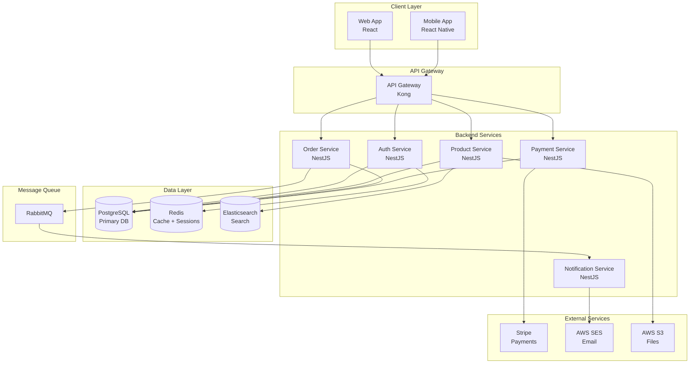
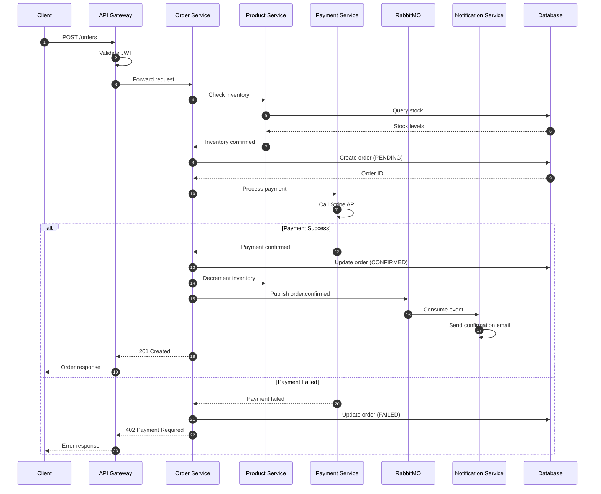

# Architectural Analysis Examples

Concrete examples of analysis outputs and patterns.

---

## Example: Technology Manifest

### Node.js Web Application

```markdown
# Technology Manifest: E-Commerce API

**Analysis Date**: 2024-01-15
**Analyzed By**: AI Agent
**Codebase Version**: commit abc123

## Languages

| Language | Version | Evidence | Documented |
|----------|---------|----------|------------|
| TypeScript | 5.3.x | tsconfig.json:3 `"target": "ES2022"` | Yes - README accurate |
| SQL | PostgreSQL dialect | migrations/*.sql | No - Missing from docs |

## Frameworks

| Framework | Version | Purpose | Evidence | Documented |
|-----------|---------|---------|----------|------------|
| NestJS | 10.2.x | Web framework | package.json:15 | Yes - README accurate |
| TypeORM | 0.3.x | ORM | package.json:18 | Yes - but version outdated in docs |
| Jest | 29.x | Testing | package.json:45 | No - Missing |

## Key Libraries

| Library | Version | Purpose | Category |
|---------|---------|---------|----------|
| passport | 0.7.x | Authentication | Auth |
| class-validator | 0.14.x | Input validation | Validation |
| winston | 3.11.x | Logging | Observability |
| swagger-ui-express | 5.x | API docs | Documentation |

## Infrastructure Dependencies

| Service | Type | Connection | Evidence |
|---------|------|------------|----------|
| PostgreSQL | Database | `DATABASE_URL` env | src/config/database.ts:12 |
| Redis | Cache | `REDIS_URL` env | src/config/cache.ts:8 |
| AWS S3 | Object storage | `AWS_*` env vars | src/services/storage.ts:5 |
| Stripe | Payment API | `STRIPE_KEY` env | src/services/payment.ts:3 |

## Build & DevOps

| Tool | Purpose | Evidence |
|------|---------|----------|
| Docker | Containerization | Dockerfile, docker-compose.yml |
| GitHub Actions | CI/CD | .github/workflows/*.yml |
| ESLint | Linting | .eslintrc.js |
| Prettier | Formatting | .prettierrc |
```

---

## Example: Interface Specification

### REST API Interface

```markdown
# Interface: Product API

## Base URL
`/api/v1/products`

## Endpoints

### GET /api/v1/products

**Description**: List products with pagination

**Evidence**: src/products/products.controller.ts:25

**Authentication**: Optional (public access, enhanced for authenticated)

**Query Parameters**:
| Param | Type | Required | Default | Description |
|-------|------|----------|---------|-------------|
| page | number | No | 1 | Page number |
| limit | number | No | 20 | Items per page (max 100) |
| category | string | No | - | Filter by category slug |
| search | string | No | - | Full-text search |

**Response 200**:
```json
{
  "data": [
    {
      "id": "uuid",
      "name": "string",
      "price": "number",
      "category": "string",
      "inStock": "boolean"
    }
  ],
  "meta": {
    "page": 1,
    "limit": 20,
    "total": 150,
    "totalPages": 8
  }
}
```

**Documentation Status**: Swagger exists but missing `search` parameter

---

### POST /api/v1/products

**Description**: Create new product

**Evidence**: src/products/products.controller.ts:45

**Authentication**: Required (Admin role)

**Request Body**:
```json
{
  "name": "string (required, 3-100 chars)",
  "description": "string (optional, max 5000 chars)",
  "price": "number (required, > 0)",
  "categoryId": "uuid (required)",
  "sku": "string (required, unique)",
  "inventory": "number (optional, default 0)"
}
```

**Response 201**:
```json
{
  "id": "uuid",
  "name": "string",
  "createdAt": "ISO8601"
}
```

**Errors**:
| Status | Code | When |
|--------|------|------|
| 400 | VALIDATION_ERROR | Invalid input |
| 401 | UNAUTHORIZED | No auth token |
| 403 | FORBIDDEN | Not admin role |
| 409 | SKU_EXISTS | Duplicate SKU |

**Documentation Status**: Documented in Swagger, accurate
```

---

## Example: Architecture Diagram

### E-Commerce System

```markdown
# Architecture Diagram

## High-Level Overview



## Documentation Comparison

**Documented**: Yes, in docs/architecture.md
**Accuracy**: Partial
- Missing: Elasticsearch integration (added in v2.1)
- Outdated: Shows single PostgreSQL, but now has read replicas
- Correct: Service boundaries and message queue pattern
```

---

## Example: Sequence Diagram

### Order Creation Flow

```markdown
# Sequence: Create Order

## Flow Description
User submits order → validation → inventory check → payment → confirmation

## Diagram



## Evidence

| Step | Implementation | File |
|------|---------------|------|
| 1-3 | JWT middleware | src/middleware/auth.ts:15 |
| 4-6 | Inventory check | src/products/products.service.ts:89 |
| 7-8 | Order creation | src/orders/orders.service.ts:45 |
| 9-10 | Payment processing | src/payments/payments.service.ts:23 |
| 11-14 | Event publishing | src/orders/orders.service.ts:78 |

## Documentation Status
- **Documented**: Partially in docs/flows/order-creation.md
- **Missing**: Error handling path not documented
- **Outdated**: Docs show synchronous email, now async via queue
```

---

## Example: Documentation Audit

### Audit Report

```markdown
# Documentation Audit Report

**Project**: E-Commerce API
**Analysis Date**: 2024-01-15
**Overall Score**: 65% (Needs Improvement)

## Coverage Summary

| Area | Has Docs | Accurate | Score |
|------|----------|----------|-------|
| Architecture | Yes | Partial | 60% |
| API Reference | Yes | Mostly | 80% |
| Setup Guide | Yes | Yes | 90% |
| Technologies | Partial | Outdated | 40% |
| Workflows | No | N/A | 0% |

## Discrepancies

### DISC-001: Missing Elasticsearch Documentation

**Type**: Missing
**Impact**: High
**Location**: docs/architecture.md
**Details**: Elasticsearch was added in v2.1 for product search but architecture docs still show direct PostgreSQL queries for search.
**Evidence**: src/products/search.service.ts imports @elastic/elasticsearch
**Recommendation**: Update architecture diagram and add Elasticsearch section

---

### DISC-002: Outdated Dependency Versions

**Type**: Outdated
**Impact**: Medium
**Location**: README.md (Requirements section)
**Documentation says**: Node.js 16.x, TypeORM 0.2.x
**Reality**: Node.js 20.x (engines in package.json), TypeORM 0.3.x
**Recommendation**: Update version requirements in README

---

### DISC-003: Undocumented API Endpoint

**Type**: Missing
**Impact**: Medium
**Location**: Swagger/OpenAPI spec
**Details**: `GET /api/v1/products/search` endpoint exists but not in Swagger
**Evidence**: src/products/products.controller.ts:112
**Recommendation**: Add endpoint to Swagger decorators

---

### DISC-004: Incorrect Environment Variables

**Type**: Incorrect
**Impact**: High
**Location**: docs/setup.md
**Documentation says**: `DB_HOST`, `DB_PORT`, `DB_NAME`
**Reality**: Uses `DATABASE_URL` connection string
**Evidence**: src/config/database.ts:5 reads `process.env.DATABASE_URL`
**Recommendation**: Update setup guide with correct env var

## Recommendations Summary

1. **Immediate**: Fix DISC-004 (setup guide blocks new developers)
2. **High Priority**: Address DISC-001 (architecture accuracy)
3. **Medium Priority**: Update DISC-002, DISC-003
4. **Consider**: Add workflow documentation for key processes
```

---

## Example: Discrepancy Annotation

During analysis, annotate findings inline:

```markdown
## API: User Registration

**Endpoint**: POST /api/v1/users/register

**Evidence**: src/users/users.controller.ts:34

**Request Body**:
| Field | Type | Required | Validation |
|-------|------|----------|------------|
| email | string | Yes | Valid email format |
| password | string | Yes | Min 8 chars |
| name | string | Yes | 2-100 chars |
| phone | string | No | E.164 format | <!-- DOC_MISSING: Not in Swagger -->

**Response**:
- 201: User created
- 400: Validation error
- 409: Email exists <!-- DOC_OUTDATED: Swagger shows 422 -->

**Notes**:
- Rate limited: 5 requests/minute <!-- DOC_MISSING: Not documented anywhere -->
- Sends verification email via queue <!-- DOC_ACCURATE: Matches docs/auth.md -->
```
