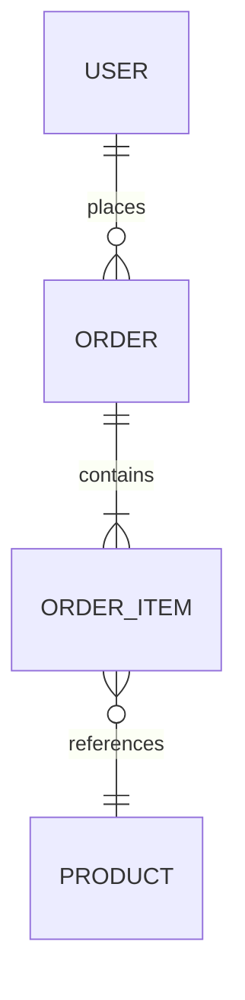
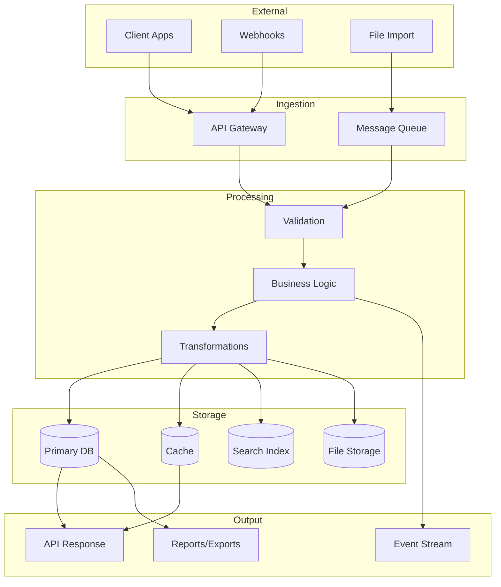
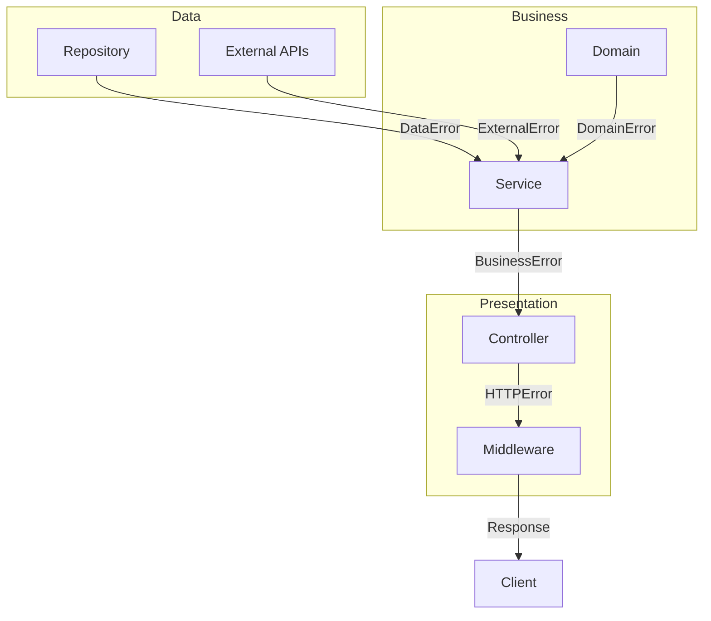

# Architectural Analysis Templates

Reusable templates for analysis outputs.

---

## Technology Manifest Template

```markdown
# Technology Manifest: {Project Name}

**Analysis Date**: {YYYY-MM-DD}
**Analyzed By**: {Agent/Person}
**Codebase Version**: {commit hash or version}

## Summary

| Category | Count | Documentation Coverage |
|----------|-------|----------------------|
| Languages | {n} |  |
| Libraries | {n} |  |

## Languages

| Language | Version | Evidence | Documented | Accuracy |
|----------|---------|----------|------------|----------|
| {lang} | {ver} | {file:line} | Yes/No | Accurate/Outdated/Missing |

## Frameworks

| Framework | Version | Purpose | Evidence | Documented | Accuracy |
|-----------|---------|---------|----------|------------|----------|
| {name} | {ver} | {purpose} | {file:line} | Yes/No | Accurate/Outdated/Missing |

## Libraries

### {Category} (e.g., Authentication, Database, Utilities)

| Library | Version | Purpose | Evidence |
|---------|---------|---------|----------|
| {name} | {ver} | {purpose} | {file:line} |

## Infrastructure Dependencies

| Service | Type | Purpose | Connection Method | Evidence |
|---------|------|---------|-------------------|----------|
| {name} | Database/Cache/Queue/API | {purpose} | {env var or config} | {file:line} |

## Build & DevOps Tools

| Tool | Purpose | Evidence |
|------|---------|----------|
| {tool} | {purpose} | {file} |

## Documentation Gaps

- [ ] {Missing documentation item 1}
- [ ] {Missing documentation item 2}
```

---

## Interface Specification Template

```markdown
# Interface Specification: {Interface Name}

**Type**: REST API / GraphQL / gRPC / Event / Internal
**Base Path**: {/api/v1/resource}
**Evidence**: {file:line}

## Authentication

| Method | Required | Scopes/Roles |
|--------|----------|--------------|
| {JWT/API Key/OAuth} | Yes/No/Optional | {scopes} |

## Endpoints

### {METHOD} {/path}

**Description**: {What this endpoint does}

**Evidence**: {file:line}

**Parameters**:

*Path Parameters*:
| Name | Type | Description |
|------|------|-------------|
| {param} | {type} | {description} |

*Query Parameters*:
| Name | Type | Required | Default | Description |
|------|------|----------|---------|-------------|
| {param} | {type} | Yes/No | {default} | {description} |

*Request Body*:
```json
{
  "field": "{type} - {description}"
}
```

**Responses**:

*Success ({status})*:
```json
{
  "data": {}
}
```

*Errors*:
| Status | Code | Description |
|--------|------|-------------|
| {status} | {ERROR_CODE} | {when this occurs} |

**Documentation Status**: {Accurate/Outdated/Missing}
**Discrepancy**: {details if applicable}

---

## Rate Limiting

| Endpoint | Limit | Window |
|----------|-------|--------|
| {endpoint} | {n} requests | {time period} |

## Pagination

**Pattern**: {offset/cursor}
**Parameters**: {page, limit / cursor, count}
**Max Page Size**: {n}
```

---

## Architecture Diagram Template

```markdown
# Architecture Diagram: {System Name}

## Overview

{Brief description of the system architecture}

## Diagram

```mermaid
graph TB
    subgraph "{Layer/Group Name}"
        {ID}[{Component Name}<br/>{Technology}]
    end

    subgraph "{Another Layer}"
        {ID2}[{Component}]
    end

    subgraph "Data Stores"
        {DB}[({Database Name}<br/>{Type})]
    end

    subgraph "External Services"
        {EXT}[{Service Name}]
    end

    {ID} --> {ID2}
    {ID2} --> {DB}
    {ID2} --> {EXT}
```

## Component Inventory

| Component | Technology | Responsibility | Evidence |
|-----------|------------|----------------|----------|
| {name} | {tech} | {what it does} | {file or dir} |

## Data Flows

| Flow | From | To | Protocol | Purpose |
|------|------|----|----------|---------|
| {name} | {component} | {component} | HTTP/gRPC/AMQP | {purpose} |

## Documentation Comparison

| Aspect | Documented | Accurate | Notes |
|--------|------------|----------|-------|
| Components | Yes/No | Yes/No | {details} |
| Data flows | Yes/No | Yes/No | {details} |
| External deps | Yes/No | Yes/No | {details} |
```

---

## Sequence Diagram Template

```markdown
# Sequence Diagram: {Flow Name}

## Description

{What this flow accomplishes and when it's triggered}

## Participants

| Participant | Type | Description |
|-------------|------|-------------|
| {name} | User/Service/Database/External | {description} |

## Diagram

```mermaid
sequenceDiagram
    autonumber
    participant {A} as {Display Name}
    participant {B} as {Display Name}
    participant {C} as {Display Name}

    {A}->>+{B}: {Action description}
    {B}->>+{C}: {Action description}
    {C}-->>-{B}: {Response description}
    {B}-->>-{A}: {Response description}

    alt {Condition}
        {A}->>>{B}: {Alternative action}
    else {Other condition}
        {A}->>>{C}: {Other action}
    end

    opt {Optional step}
        {B}->>{C}: {Optional action}
    end
```

## Step Details

| Step | Action | Implementation | Evidence |
|------|--------|----------------|----------|
| 1 | {description} | {how it's done} | {file:line} |
| 2 | {description} | {how it's done} | {file:line} |

## Error Handling

| Step | Error | Handling |
|------|-------|----------|
| {n} | {error type} | {what happens} |

## Documentation Status

- **Documented in**: {doc file or "Not documented"}
- **Accuracy**: {Accurate/Outdated/Missing}
- **Gaps**: {what's missing}
```

---

## Documentation Audit Template

```markdown
# Documentation Audit: {Project Name}

**Audit Date**: {YYYY-MM-DD}
**Auditor**: {Agent/Person}
**Scope**: {Full/Partial - specify areas}

## Executive Summary

**Overall Score**: {percentage}%
**Status**: {Good/Needs Improvement/Critical}

{2-3 sentence summary of findings}

## Coverage Matrix

| Documentation Area | Exists | Accurate | Complete | Score |
|-------------------|--------|----------|----------|-------|
| README/Overview | {Yes/No} | {Yes/Partial/No} | {Yes/Partial/No} |  |
| API Reference | {Yes/No} | {Yes/Partial/No} | {Yes/Partial/No} |  |
| Configuration | {Yes/No} | {Yes/Partial/No} | {Yes/Partial/No} |  |
| Deployment | {Yes/No} | {Yes/Partial/No} | {Yes/Partial/No} | {%} |

## Discrepancies

### {DISC-NNN}: {Title}

**Type**: Missing | Outdated | Incorrect
**Impact**: Low | Medium | High | Critical
**Location**: {doc file and section}

**Documentation says**:
> {quote or description of what docs claim}

**Reality**:
> {what the code actually does}

**Evidence**: {file:line}

**Recommendation**: {specific action to fix}

---

{Repeat for each discrepancy}

## Missing Documentation

| Area | Priority | Impact | Recommendation |
|------|----------|--------|----------------|
| {missing area} | High/Medium/Low | {who is affected} | {what to write} |

## Recommendations

### Immediate Actions (This Sprint)

1. {Action item with specific file/section}
2. {Action item}

### Short-term (Next 2-4 Weeks)

1. {Action item}
2. {Action item}

### Long-term (Backlog)

1. {Action item}
2. {Action item}

## Appendix: Documentation Inventory

| File | Last Updated | Owner | Status |
|------|--------------|-------|--------|
| {path} | {date} | {team/person} | Current/Stale/Outdated |
```

---

## Discrepancy Entry Template

```markdown
### {DISC-NNN}: {Short Title}

**Type**: Missing | Outdated | Incorrect | Inconsistent
**Impact**: Low | Medium | High | Critical
**Discovered**: {YYYY-MM-DD}

**Location**:
- Documentation: {file:section or "N/A"}
- Code: {file:line}

**Description**:
{Clear explanation of the discrepancy}

**Documentation Claims**:
```
{Quote from docs or "Not documented"}
```

**Code Reality**:
```
{Relevant code snippet or description}
```

**Business Impact**:
{Who is affected and how - developers, users, operations}

**Recommendation**:
{Specific action to resolve}

**Status**: Open | In Progress | Resolved
```

---

## Dependency Health Report Template

```markdown
# Dependency Health Report: {Project Name}

**Analysis Date**: {YYYY-MM-DD}
**Analyzed By**: {Agent/Person}
**Package Managers**: {npm, pip, go mod, etc.}

## Executive Summary

| Metric | Count | Status |
|--------|-------|--------|
| Total Dependencies | {n} | - |
| Direct Dependencies | {n} | - |
| Vulnerabilities (Critical/High) | {n} | 🔴/🟡/🟢 |
| Major Version Gaps | {n} | 🔴/🟡/🟢 |
| Unmaintained Packages | {n} | 🔴/🟡/🟢 |
| License Concerns | {n} | 🔴/🟡/🟢 |

**Overall Health**: {Critical/Poor/Fair/Good/Excellent}

## Package Inventory

### {Package Manager} Dependencies

| Package | Version | Type | Purpose | Direct/Transitive |
|---------|---------|------|---------|-------------------|
| {name} | {version} | runtime/dev/peer | {purpose} | Direct |
| {name} | {version} | runtime | {purpose} | Transitive (via {parent}) |

## Version Currency

| Package | Current | Latest | Gap | Breaking Changes | Priority |
|---------|---------|--------|-----|------------------|----------|
| {name} | {ver} | {ver} | Major/Minor/Patch | {summary} | High/Medium/Low |

### Outdated Package Summary

- **Major updates available**: {count} packages
- **Minor updates available**: {count} packages
- **Patch updates available**: {count} packages

## Vulnerability Report

| Package | Version | CVE ID | Severity | Fixed In | CVSS | Exploitable |
|---------|---------|--------|----------|----------|------|-------------|
| {name} | {ver} | {CVE-YYYY-NNNNN} | Critical/High/Medium/Low | {ver} | {score} | {context} |

### Vulnerability Summary

- **Critical**: {count} - Immediate action required
- **High**: {count} - Action within 48 hours
- **Medium**: {count} - Plan for next sprint
- **Low**: {count} - Monitor

## Maintenance Status

| Package | Last Publish | Publish Frequency | Open Issues | PR Activity | Status |
|---------|--------------|-------------------|-------------|-------------|--------|
| {name} | {YYYY-MM} | {weekly/monthly/yearly} | {n} | {active/slow/none} | {status} |

**Status Legend**:
- 🟢 **Active**: Regular updates, responsive maintainers
- 🟡 **Maintained**: Occasional updates, security patches applied
- 🟠 **Slow**: Infrequent updates, issues pile up
- 🔴 **Unmaintained**: No updates in 12+ months
- ⚫ **Deprecated**: Officially deprecated, seek alternatives
- ⬛ **Abandoned**: No maintainer, consider forking or replacing

### Packages Requiring Attention

| Package | Status | Risk | Alternative |
|---------|--------|------|-------------|
| {name} | Deprecated | High | {alternative package} |
| {name} | Unmaintained | Medium | {alternative or fork} |

## License Inventory

| Package | License | Type | Commercial Use | Modification | Distribution | Patent Grant |
|---------|---------|------|----------------|--------------|--------------|--------------|
| {name} | MIT | Permissive | ✅ | ✅ | ✅ | ❌ |
| {name} | Apache-2.0 | Permissive | ✅ | ✅ | ✅ | ✅ |
| {name} | GPL-3.0 | Copyleft | ✅ | ✅ | ⚠️ | ✅ |

### License Summary

| License Type | Count | Concern Level |
|--------------|-------|---------------|
| Permissive (MIT, BSD, Apache) | {n} | None |
| Weak Copyleft (LGPL, MPL) | {n} | Low |
| Strong Copyleft (GPL, AGPL) | {n} | Review Required |
| Unknown/Custom | {n} | Legal Review |

### License Concerns

| Package | License | Concern | Recommendation |
|---------|---------|---------|----------------|
| {name} | {license} | {specific concern} | {action} |

## Risk Matrix

| Risk Level | Count | Packages | Action Required |
|------------|-------|----------|-----------------|
| 🔴 Critical | {n} | {list} | Immediate update/replacement |
| 🟠 High | {n} | {list} | Update within current sprint |
| 🟡 Medium | {n} | {list} | Plan for next cycle |
| 🟢 Low | {n} | {list} | Monitor |

## Recommended Actions

### Immediate (This Week)

1. **{Package}**: {Action} - {Reason}
2. **{Package}**: {Action} - {Reason}

### Short-term (This Sprint)

1. **{Package}**: {Action} - {Reason}
2. **{Package}**: {Action} - {Reason}

### Long-term (Backlog)

1. **{Package}**: {Action} - {Reason}
2. **{Package}**: {Action} - {Reason}

## Dependency Tree Concerns

### Duplicate Packages

| Package | Versions in Tree | Cause |
|---------|------------------|-------|
| {name} | {v1}, {v2} | {conflicting requirements} |

### Deep Transitive Dependencies

| Package | Depth | Brought In By |
|---------|-------|---------------|
| {name} | {n} | {chain: A → B → C → package} |

## Appendix: Full Dependency List

<details>
<summary>Click to expand full dependency list ({n} packages)</summary>

| Package | Version | License | Last Updated |
|---------|---------|---------|--------------|
| {name} | {ver} | {license} | {date} |

</details>
```

---

## Data Flow Map Template

```markdown
# Data Flow Map: {Project Name}

**Analysis Date**: {YYYY-MM-DD}
**Analyzed By**: {Agent/Person}
**Scope**: {Full system / Specific domain}

## Executive Summary

| Metric | Count |
|--------|-------|
| Input Sources | {n} |
| Data Entities | {n} |
| Storage Systems | {n} |
| Output Channels | {n} |
| Transformation Steps | {n} |

**Data Flow Complexity**: {Simple/Moderate/Complex}

## Data Input Sources

### API Endpoints

| Endpoint | Method | Data Format | Validation | Evidence |
|----------|--------|-------------|------------|----------|
| {/api/resource} | POST | JSON | {schema/manual} | {file:line} |

### File Imports

| Source | Format | Trigger | Validation | Evidence |
|--------|--------|---------|------------|----------|
| {upload path} | CSV/JSON/XML | {manual/scheduled} | {validation type} | {file:line} |

### Event Consumers

| Event/Topic | Format | Schema | Evidence |
|-------------|--------|--------|----------|
| {event.name} | JSON | {Avro/JSON Schema/None} | {file:line} |

### External Integrations

| Integration | Direction | Format | Auth | Evidence |
|-------------|-----------|--------|------|----------|
| {service name} | Inbound/Outbound/Both | JSON/XML | {OAuth/API Key/None} | {file:line} |

## Data Transformations

### Transformation Pipeline

| Stage | Input Type | Output Type | Location | Purpose |
|-------|------------|-------------|----------|---------|
| Parse | Raw HTTP | DTO | {file:line} | Deserialize request |
| Validate | DTO | ValidatedDTO | {file:line} | Schema + business rules |
| Normalize | ValidatedDTO | NormalizedDTO | {file:line} | Standardize formats |
| Enrich | NormalizedDTO | EnrichedDTO | {file:line} | Add computed/fetched data |
| Map | EnrichedDTO | Entity | {file:line} | Convert to domain model |

### Transformation Details

#### {Transformation Name}

- **Input**: {type and source}
- **Output**: {type and destination}
- **Logic**: {brief description}
- **Location**: {file:line}
- **Failure Handling**: {what happens on error}

## Data Storage

### Storage Systems

| System | Type | Purpose | Data Types Stored |
|--------|------|---------|-------------------|
| {name} | PostgreSQL/MongoDB/Redis/S3 | Primary/Cache/Search/Archive | {entity list} |

### Entity Storage Map

| Entity | Primary Store | Table/Collection | Secondary Stores | Retention |
|--------|---------------|------------------|------------------|-----------|
| {User} | PostgreSQL | users | Redis (cache) | Indefinite |
| {Order} | PostgreSQL | orders | Elasticsearch | 7 years |
| {Session} | Redis | sessions:* | None | 24 hours |

### Data Relationships



## Data Lifecycle

### {Entity Name} Lifecycle

| Phase | Trigger | Location | Notes |
|-------|---------|----------|-------|
| Create | {event/action} | {file:line} | {validation, defaults} |
| Read | {query patterns} | {file:line} | {indexes used} |
| Update | {event/action} | {file:line} | {versioning, audit} |
| Archive | {condition/schedule} | {file:line} | {destination} |
| Delete | {condition/request} | {file:line} | {soft/hard, cascade} |
| Anonymize | {GDPR request} | {file:line} | {fields affected} |

### Retention Policies

| Data Type | Retention Period | Archive Location | Deletion Method |
|-----------|------------------|------------------|-----------------|
| {type} | {period} | {location or N/A} | {soft/hard/anonymize} |

## Data Flow Diagram



## Entity Cross-Reference Matrix

| Entity | Input Sources | Transformations | Storage | Output Channels | Retention |
|--------|---------------|-----------------|---------|-----------------|-----------|
| {User} | API, OAuth | Validate, Hash | PostgreSQL, Redis | API, Events | Indefinite |
| {Order} | API, Webhook | Validate, Calculate | PostgreSQL, ES | API, Email | 7 years |

## Data Quality Observations

### Concerns

| Area | Issue | Impact | Evidence |
|------|-------|--------|----------|
| {area} | {description} | High/Medium/Low | {file:line} |

### Recommendations

1. {Recommendation 1}
2. {Recommendation 2}
```

---

## Error Handling Analysis Report Template

```markdown
# Error Handling Analysis: {Project Name}

**Analysis Date**: {YYYY-MM-DD}
**Analyzed By**: {Agent/Person}
**Scope**: {Full system / Specific service}

## Executive Summary

| Metric | Count | Status |
|--------|-------|--------|
| Error Sources Identified | {n} | - |
| Error Handlers | {n} | - |
| Unhandled Scenarios | {n} | 🔴/🟡/🟢 |
| Recovery Mechanisms | {n} | - |
| Observability Coverage | {%} | 🔴/🟡/🟢 |

**Overall Error Handling Maturity**: {Basic/Developing/Mature/Advanced}

## Error Sources

### By Category

| Category | Count | Examples |
|----------|-------|----------|
| Validation | {n} | Invalid input, missing fields |
| Business Logic | {n} | Rule violations, state conflicts |
| Infrastructure | {n} | Database, network, external services |
| Runtime | {n} | Null references, type errors |

### Detailed Inventory

| Source | Type | Error Class | Handler | Evidence |
|--------|------|-------------|---------|----------|
| {component} | {category} | {error class} | {handler location} | {file:line} |

## Error Propagation

### Layer Architecture



### Propagation Patterns

| Layer | Input Error | Output Error | Transformation | Evidence |
|-------|-------------|--------------|----------------|----------|
| Repository | DBError | DataAccessError | Wrap with context | {file:line} |
| Service | DataAccessError | BusinessError | Translate to domain | {file:line} |
| Controller | BusinessError | HTTPError | Map to status code | {file:line} |

## Error Response Formats

### API Error Response

```json
{
  "error": {
    "code": "{ERROR_CODE}",
    "message": "{user-friendly message}",
    "details": [],
    "requestId": "{trace-id}",
    "timestamp": "{ISO-8601}"
  }
}
```

### Error Code Registry

| Code | HTTP Status | Category | Description | Client Action |
|------|-------------|----------|-------------|---------------|
| VALIDATION_ERROR | 400 | Client | Invalid input | Fix request |
| UNAUTHORIZED | 401 | Auth | Missing/invalid token | Re-authenticate |
| FORBIDDEN | 403 | Auth | Insufficient permissions | Request access |
| NOT_FOUND | 404 | Client | Resource doesn't exist | Check ID |
| CONFLICT | 409 | Business | State conflict | Retry with fresh data |
| RATE_LIMITED | 429 | Client | Too many requests | Back off |
| INTERNAL_ERROR | 500 | Server | Unexpected error | Retry later |
| SERVICE_UNAVAILABLE | 503 | Server | Dependency down | Retry later |

## Observability

### Logging

| Component | Logger | Format | Levels Used | Evidence |
|-----------|--------|--------|-------------|----------|
| {component} | {logger} | JSON/Text | ERROR,WARN,INFO | {file:line} |

### Error Tracking

| Tool | Coverage | Alerting | Evidence |
|------|----------|----------|----------|
| {Sentry/Bugsnag/etc} | {%} | {Yes/No} | {file:line} |

### Metrics

| Metric | Type | Labels | Evidence |
|--------|------|--------|----------|
| error_count | Counter | code, service | {file:line} |
| error_rate | Gauge | service | {file:line} |

### Alerting Rules

| Alert | Condition | Severity | Destination |
|-------|-----------|----------|-------------|
| {name} | {condition} | Critical/Warning | {PagerDuty/Slack/etc} |

## Recovery Mechanisms

### Retry Patterns

| Component | Retried Operations | Max Retries | Backoff | Evidence |
|-----------|-------------------|-------------|---------|----------|
| {component} | {operations} | {n} | {linear/exponential} | {file:line} |

### Circuit Breakers

| Service | Failure Threshold | Open Duration | Fallback | Evidence |
|---------|-------------------|---------------|----------|----------|
| {service} | {n} failures | {duration} | {fallback behavior} | {file:line} |

### Fallback Strategies

| Component | Trigger | Fallback Behavior | Evidence |
|-----------|---------|-------------------|----------|
| {component} | {condition} | {behavior} | {file:line} |

### Dead Letter Handling

| Queue/Topic | DLQ Name | Retention | Replay Strategy | Evidence |
|-------------|----------|-----------|-----------------|----------|
| {queue} | {dlq} | {duration} | {manual/auto} | {file:line} |

## Gap Analysis

### Unhandled Scenarios

| Scenario | Current Behavior | Risk Level | Recommendation |
|----------|------------------|------------|----------------|
| {scenario} | {behavior} | Critical/High/Medium/Low | {recommendation} |

### Missing Coverage

| Area | Gap | Impact | Priority |
|------|-----|--------|----------|
| {area} | {description} | {impact} | High/Medium/Low |

## Recommendations

### Immediate (Critical)

1. **{Issue}**: {Recommendation} - {file:line}

### Short-term (High Priority)

1. **{Issue}**: {Recommendation}

### Long-term (Improvements)

1. **{Issue}**: {Recommendation}

## Error Handling Patterns Observed

### Good Practices Found

- {Practice 1} - {file:line}
- {Practice 2} - {file:line}

### Anti-Patterns Found

| Anti-Pattern | Location | Issue | Fix |
|--------------|----------|-------|-----|
| {pattern} | {file:line} | {problem} | {solution} |
```

---

## Analysis Session Log Template

```markdown
# Analysis Session: {Project Name}

**Date**: {YYYY-MM-DD}
**Duration**: {time}
**Scope**: {what was analyzed}

## Session Goals

- [ ] {Goal 1}
- [ ] {Goal 2}

## Findings Log

### {HH:MM} - {Finding Title}

**Category**: Technology | Interface | Architecture | Documentation
**Location**: {file:line}
**Finding**: {description}
**Doc Status**: Documented/Accurate | Documented/Outdated | Missing

---

{Repeat for each finding}

## Questions Raised

- [ ] {Question that needs follow-up}
- [ ] {Question that needs clarification}

## Next Steps

- [ ] {Action item}
- [ ] {Action item}

## Session Summary

{Brief summary of what was learned and key findings}
```
