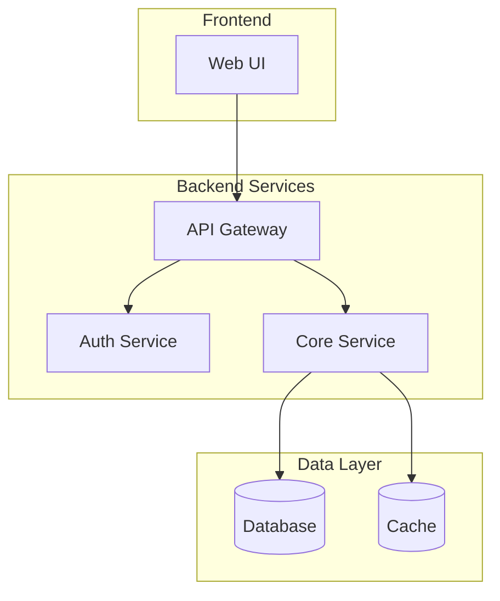
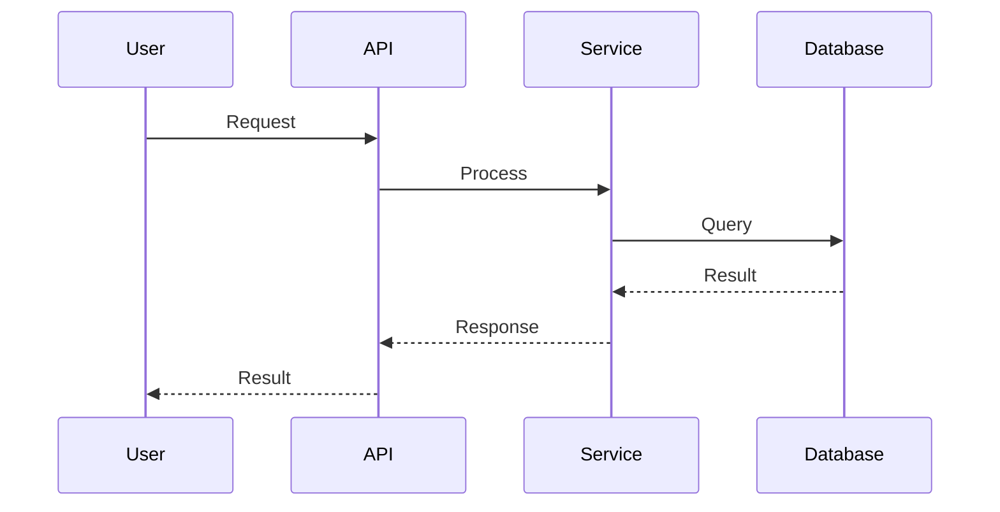
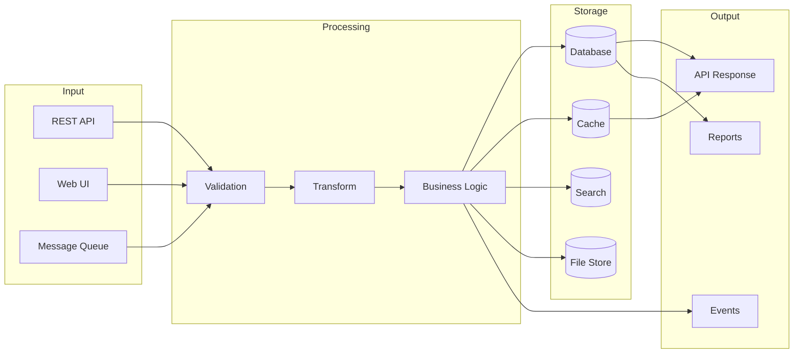

# Architectural Analysis Workflows

Step-by-step procedures for analyzing unknown codebases.

---

## Main Analysis Workflow

### Phase 0: Setup

**Goal**: Establish output location and create documentation structure

#### 0.1 Ask for Documentation Directory

Before starting analysis, ask the user:

```
Where should I create the architecture documentation?

Please provide a path to your documentation directory (e.g., ./docs, ./documentation).
I will create an `architecture-docs` folder inside it with all analysis results.
```

**Default locations to suggest**:
- `./docs` - Common convention
- `./documentation` - Explicit naming
- Project root - If no docs directory exists

#### 0.2 Create Output Structure

Once the documentation directory is confirmed, create:

```
{docs-directory}/
└── architecture-docs/
    ├── index.md                              # Main entry point
    └── analysis/
        ├── 01-technology-manifest.md         # Phase 2 output
        ├── 02-interface-specification.md     # Phase 3 output
        ├── 03-architecture-diagrams.md       # Phase 4 output
        ├── 04-documentation-audit.md         # Phase 5 output
        ├── 05-dependency-health.md           # Phase 6 output
        ├── 06-data-flow-map.md               # Phase 7 output
        └── 07-error-handling.md              # Phase 8 output
```

#### 0.3 Initialize Index

Create `index.md` with placeholder links (see templates.md for full template):

```markdown
# Architecture Documentation

**Project**: {Project Name}
**Analysis Date**: {Date}
**Status**: In Progress

## Analysis Results

| Document | Status | Description |
|----------|--------|-------------|
| [Technology Manifest](analysis/01-technology-manifest.md) | Pending | Languages, frameworks, dependencies |
| [Interface Specification](analysis/02-interface-specification.md) | Pending | APIs, contracts, boundaries |
| [Architecture Diagrams](analysis/03-architecture-diagrams.md) | Pending | Visual system overview |
| [Documentation Audit](analysis/04-documentation-audit.md) | Pending | Existing docs assessment |
| [Dependency Health](analysis/05-dependency-health.md) | Pending | Security and maintenance status |
| [Data Flow Map](analysis/06-data-flow-map.md) | Pending | Data lifecycle and movement |
| [Error Handling](analysis/07-error-handling.md) | Pending | Error patterns and recovery |
```

**Output**: Documentation structure ready for analysis

---

### Phase 1: Initial Reconnaissance

**Goal**: Get high-level understanding and identify documentation

#### 1.1 Locate Existing Documentation

- [ ] Find README files (root and nested)
- [ ] Locate `/docs`, `/documentation`, `/wiki` directories
- [ ] Identify architecture decision records (ADRs)
- [ ] Find API documentation (OpenAPI, Swagger, etc.)
- [ ] Check for inline documentation comments

**Track findings**:
```markdown
## Documentation Inventory
| Location | Type | Coverage | Last Updated |
|----------|------|----------|--------------|
| README.md | Overview | High-level only | {date} |
| docs/architecture.md | Architecture | Partial | {date} |
```

#### 1.2 Identify Project Structure

- [ ] Map top-level directory structure
- [ ] Identify entry points (main files, index files)
- [ ] Locate configuration files
- [ ] Find build/deployment scripts
- [ ] Note monorepo vs single-project structure

#### 1.3 Quick Technology Scan

- [ ] Check package manifests (`package.json`, `requirements.txt`, `go.mod`, etc.)
- [ ] Review build configuration files
- [ ] Note obvious framework indicators (file patterns, conventions)

**Output**: Initial project map with documentation references

---

### Phase 2: Technology Deep Dive

**Goal**: Complete technology inventory with verification

#### 2.1 Languages and Runtimes

For each language found:
1. Identify version requirements
2. Check language-specific config files
3. Note any transpilation/compilation steps

**Document with evidence**:
```markdown
## Languages
| Language | Version | Evidence | Doc Mentioned |
|----------|---------|----------|---------------|
| TypeScript | 5.x | tsconfig.json:1 | Yes - README |
| Python | 3.11+ | pyproject.toml:5 | No - Missing |
```

#### 2.2 Frameworks and Libraries

For each dependency:
1. Categorize (web framework, ORM, utility, etc.)
2. Note version constraints
3. Identify why it's used (if not obvious)

**Cross-reference with docs**:
- Does documentation mention this dependency?
- Is the documented usage accurate?

#### 2.3 Infrastructure Dependencies

Identify:
- [ ] Databases (relational, document, graph, etc.)
- [ ] Caches (Redis, Memcached, etc.)
- [ ] Message queues (RabbitMQ, Kafka, SQS, etc.)
- [ ] Cloud services (AWS, GCP, Azure specifics)
- [ ] External APIs consumed

**Output**: Complete technology manifest

---

### Phase 3: Interface Discovery

**Goal**: Map all system boundaries and contracts

#### 3.1 External API Analysis

For each external endpoint:

1. **Identify endpoints**
   - Search for route definitions
   - Check controller/handler files
   - Review API gateway configs

2. **Document contracts**
   - Request format (params, body, headers)
   - Response format (success, error)
   - Authentication requirements
   - Rate limiting

3. **Verify against docs**
   - Does OpenAPI/Swagger exist?
   - Are documented endpoints accurate?
   - Are there undocumented endpoints?

#### 3.2 Internal Service Interfaces

For service-to-service communication:

1. Identify service boundaries
2. Document communication patterns
3. Map dependencies between services

#### 3.3 Event/Message Interfaces

For async communication:

1. Identify publishers and consumers
2. Document message schemas
3. Map event flows

#### 3.4 Data Interfaces

Document:
- Database schemas
- File import/export formats
- Data transformation points

**Output**: Complete interface specification

---

### Phase 4: Architecture Synthesis

**Goal**: Create visual representations of the system

#### 4.1 Component Diagram

Create Mermaid diagram showing:
- Major components/services
- Dependencies between components
- External system integrations
- Data stores

```markdown
## Architecture Diagram


```

#### 4.2 Sequence Diagrams

Create sequence diagrams for:
- Key user flows
- Integration patterns
- Complex orchestrations

**Template**:
```markdown
## {Flow Name} Sequence


```

#### 4.3 Data Flow Diagram

If applicable, show:
- How data enters the system
- Transformations applied
- Where data is stored
- How data exits the system

**Output**: Visual architecture documentation

---

### Phase 5: Documentation Audit

**Goal**: Assess existing documentation accuracy

#### 5.1 Coverage Assessment

| Area | Documented | Accurate | Notes |
|------|------------|----------|-------|
| Technologies | Yes/No | Yes/No | {details} |
| Architecture | Yes/No | Yes/No | {details} |
| APIs | Yes/No | Yes/No | {details} |
| Setup/Install | Yes/No | Yes/No | {details} |

#### 5.2 Discrepancy Report

For each discrepancy found:

```markdown
### Discrepancy: {Title}

**Location**: {doc file and section}
**Type**: Missing | Outdated | Incorrect
**Documentation says**: {what docs claim}
**Reality**: {what code shows}
**Evidence**: {file:line reference}
**Impact**: Low | Medium | High
**Recommendation**: {suggested fix}
```

#### 5.3 Missing Documentation

List what should be documented but isn't:
- [ ] {Missing item 1}
- [ ] {Missing item 2}

**Output**: Documentation quality report

---

## Quick Analysis Workflow

For time-constrained analysis, focus on:

1. **5 min**: Project structure + README review
2. **10 min**: Package manifest analysis (dependencies)
3. **15 min**: Entry point trace (main → key paths)
4. **10 min**: Interface scan (routes, handlers)
5. **10 min**: Create basic architecture diagram

**Output**: High-level overview with key findings

---

## Continuous Verification Pattern

Throughout analysis, maintain this cycle:

```
┌─────────────────────────────────────────┐
│                                         │
│   DISCOVER → DOCUMENT → VERIFY → FLAG   │
│       ↑                           │     │
│       └───────────────────────────┘     │
│                                         │
└─────────────────────────────────────────┘
```

1. **Discover**: Find something in the code
2. **Document**: Record the finding with evidence
3. **Verify**: Check if existing docs mention it
4. **Flag**: Mark accuracy status (Accurate/Outdated/Missing)

---

## Phase 6: Dependency Health Check

**Goal**: Assess health, security, and maintenance status of dependencies

### 6.1 Package Inventory

For each package manifest found:
1. List all direct dependencies
2. Identify transitive dependencies (dependency tree)
3. Categorize by purpose (runtime, dev, peer)

**Template**:
```markdown
## Package Inventory
| Package | Version | Type | Purpose | Direct/Transitive |
|---------|---------|------|---------|-------------------|
| express | ^4.18.0 | runtime | Web framework | Direct |
| lodash | ^4.17.0 | runtime | Utilities | Transitive (via X) |
```

### 6.2 Version Currency

For each dependency:
1. Check current installed version
2. Compare against latest available
3. Identify major version gaps
4. Note breaking changes in changelogs

**Template**:
```markdown
## Version Currency
| Package | Current | Latest | Gap | Breaking Changes |
|---------|---------|--------|-----|------------------|
| react | 17.0.2 | 18.2.0 | Major | Concurrent rendering, new hooks |
| axios | 0.27.0 | 1.6.0 | Major | ESM-only, response structure |
```

### 6.3 Vulnerability Scan

Check for known vulnerabilities:
1. CVE database references
2. Security advisories
3. Severity ratings (Critical/High/Medium/Low)

**Template**:
```markdown
## Vulnerability Report
| Package | Version | CVE ID | Severity | Fixed In | Exploitable |
|---------|---------|--------|----------|----------|-------------|
| lodash | 4.17.15 | CVE-2021-23337 | High | 4.17.21 | Yes - prototype pollution |
```

### 6.4 Maintenance Status

Assess package health:
1. Last publish date
2. Open issues count
3. Maintainer activity
4. Deprecation notices
5. Fork/alternative availability

**Template**:
```markdown
## Maintenance Status
| Package | Last Publish | Open Issues | Maintainers | Status |
|---------|--------------|-------------|-------------|--------|
| express | 2024-01 | 150 | Active team | Active |
| request | 2020-02 | 200+ | None | Deprecated |

Status Legend: Active | Maintained | Slow | Unmaintained | Deprecated | Abandoned
```

### 6.5 License Compliance

Check license compatibility:
1. Identify all licenses in dependency tree
2. Flag restrictive licenses (GPL, AGPL)
3. Note commercial restrictions
4. Check license conflicts

**Template**:
```markdown
## License Inventory
| Package | License | Type | Restrictions | Compatible |
|---------|---------|------|--------------|------------|
| express | MIT | Permissive | None | Yes |
| some-pkg | GPL-3.0 | Copyleft | Derivative work | Review needed |
```

### 6.6 Dependency Risk Summary

Aggregate findings into actionable summary:

```markdown
## Dependency Health Summary

### Critical Issues
- **Vulnerabilities**: {count} packages with known CVEs
- **Outdated**: {count} packages with major version gaps
- **Unmaintained**: {count} packages with no recent activity
- **License Concerns**: {count} packages requiring review

### Risk Matrix
| Risk Level | Count | Action |
|------------|-------|--------|
| Critical | {n} | Immediate update required |
| High | {n} | Update within sprint |
| Medium | {n} | Plan for next cycle |
| Low | {n} | Monitor |

### Recommended Actions
1. {Priority action 1}
2. {Priority action 2}
3. {Priority action 3}
```

**Output**: Dependency Health Report

---

## Phase 7: Data Flow Mapping

**Goal**: Trace how data moves through the system from input to storage and output

### 7.1 Input Source Identification

Identify all data entry points:

1. **API Endpoints** - REST, GraphQL, gRPC inputs
2. **File Imports** - CSV, JSON, XML uploads
3. **Event Consumers** - Message queue subscriptions
4. **User Interfaces** - Forms, file uploads
5. **Scheduled Jobs** - Cron jobs, batch imports
6. **External Integrations** - Webhooks, third-party APIs

**Template**:
```markdown
## Data Input Sources
| Source | Type | Data Format | Validation | Evidence |
|--------|------|-------------|------------|----------|
| POST /api/users | API | JSON | Schema validated | routes/users.ts:45 |
| uploads/import | File | CSV | Header validation | services/import.ts:12 |
| order.created | Event | JSON | Avro schema | consumers/orders.ts:8 |
```

### 7.2 Data Transformation Tracing

For each data path, identify:

1. **Parsing/Deserialization** - How raw input becomes structured data
2. **Validation** - Schema validation, business rules
3. **Normalization** - Data cleaning, format standardization
4. **Enrichment** - Data augmentation from other sources
5. **Aggregation** - Combining, summarizing data
6. **Mapping** - Converting between models/formats

**Template**:
```markdown
## Data Transformations
| Stage | Input | Output | Logic Location | Purpose |
|-------|-------|--------|----------------|---------|
| Parse | HTTP body | UserDTO | middleware/parse.ts:20 | JSON to object |
| Validate | UserDTO | ValidatedUser | validators/user.ts:15 | Schema + business rules |
| Enrich | ValidatedUser | EnrichedUser | services/user.ts:45 | Add computed fields |
| Map | EnrichedUser | UserEntity | mappers/user.ts:30 | DTO to entity |
```

### 7.3 Storage Mapping

Document where data lands:

1. **Primary Databases** - Relational, document stores
2. **Caches** - Redis, Memcached, in-memory
3. **Search Indexes** - Elasticsearch, Algolia
4. **File Storage** - S3, local filesystem
5. **External Systems** - Third-party APIs, data warehouses

**Template**:
```markdown
## Data Storage
| Data Type | Primary Store | Secondary | Retention | Evidence |
|-----------|---------------|-----------|-----------|----------|
| Users | PostgreSQL:users | Redis cache | Indefinite | models/user.ts:1 |
| Orders | PostgreSQL:orders | Elasticsearch | 7 years | models/order.ts:1 |
| Uploads | S3:uploads | None | 30 days | services/upload.ts:50 |
| Sessions | Redis:sessions | None | 24 hours | config/session.ts:10 |
```

### 7.4 Data Lifecycle

Document the full lifecycle:

1. **Creation** - How data is initially stored
2. **Reading** - Query patterns and access paths
3. **Updating** - Modification patterns, versioning
4. **Archival** - Long-term storage, cold storage
5. **Deletion** - Soft delete, hard delete, cascades
6. **Anonymization** - PII handling, GDPR compliance

**Template**:
```markdown
## Data Lifecycle: {Entity Name}

### Creation
- Trigger: {what creates this data}
- Location: {file:line}
- Validations: {checks performed}

### Access Patterns
| Pattern | Query | Frequency | Index | Evidence |
|---------|-------|-----------|-------|----------|
| By ID | SELECT * WHERE id = ? | High | PK | repo/user.ts:25 |
| By email | SELECT * WHERE email = ? | Medium | idx_email | repo/user.ts:30 |

### Deletion/Retention
- Soft delete: {Yes/No} - {field name if yes}
- Hard delete trigger: {what causes permanent deletion}
- Retention period: {time period}
- Anonymization: {fields anonymized, when}
- Evidence: {file:line}
```

### 7.5 Data Flow Diagram

Create visual representation:

```markdown
## Data Flow Diagram


```

### 7.6 Cross-Reference Matrix

Map data entities to their touchpoints:

**Template**:
```markdown
## Data Entity Matrix
| Entity | Input Sources | Transformations | Storage | Outputs |
|--------|---------------|-----------------|---------|---------|
| User | API, Admin UI | Validate, Hash password | PostgreSQL, Redis | API, Events |
| Order | API, Webhook | Validate, Calculate totals | PostgreSQL, ES | API, Email, Events |
| Product | Admin API, Import | Validate, Index | PostgreSQL, ES, S3 | API, Feed |
```

**Output**: Data Flow Map

---

## Phase 8: Error Handling Analysis

**Goal**: Map how errors are handled, propagated, and recovered from

### 8.1 Error Entry Points

Identify where errors can originate:

1. **Input Validation Errors** - Bad data from clients
2. **Business Logic Errors** - Rule violations
3. **Infrastructure Errors** - Database, network, external services
4. **Runtime Errors** - Unexpected exceptions
5. **Timeout Errors** - Slow dependencies

**Template**:
```markdown
## Error Sources
| Source | Type | Example | Handler | Evidence |
|--------|------|---------|---------|----------|
| API Input | Validation | Missing required field | ValidationMiddleware | middleware/validate.ts:20 |
| Database | Infrastructure | Connection timeout | DatabaseErrorHandler | db/errors.ts:15 |
| Payment API | External | Card declined | PaymentService | services/payment.ts:80 |
```

### 8.2 Error Propagation Patterns

Document how errors flow through the system:

1. **Exception Bubbling** - Uncaught exceptions propagating up
2. **Error Wrapping** - Contextual error enhancement
3. **Error Translation** - Internal to external error mapping
4. **Error Aggregation** - Collecting multiple errors

**Template**:
```markdown
## Error Propagation
| Layer | Pattern | Catches | Transforms To | Passes To |
|-------|---------|---------|---------------|-----------|
| Repository | Wrap | DBError | DataAccessError | Service |
| Service | Wrap | DataAccessError | BusinessError | Controller |
| Controller | Translate | BusinessError | HTTPError | Client |
```

### 8.3 Error Response Formats

Document client-facing error responses:

**Template**:
```markdown
## Error Response Formats

### API Errors
```json
{
  "error": {
    "code": "VALIDATION_ERROR",
    "message": "User-friendly message",
    "details": [
      { "field": "email", "issue": "Invalid format" }
    ],
    "requestId": "uuid"
  }
}
```

### Error Code Registry
| Code | HTTP Status | Description | When Used |
|------|-------------|-------------|-----------|
| VALIDATION_ERROR | 400 | Input validation failed | Bad request data |
| NOT_FOUND | 404 | Resource not found | Invalid ID |
| INTERNAL_ERROR | 500 | Server error | Unexpected failures |
```

### 8.4 Logging and Monitoring

Document observability:

1. **Log Levels** - When each level is used
2. **Log Format** - Structured vs unstructured
3. **Error Tracking** - Sentry, Bugsnag, etc.
4. **Alerting** - What triggers alerts
5. **Metrics** - Error rate tracking

**Template**:
```markdown
## Error Observability
| Aspect | Implementation | Evidence |
|--------|----------------|----------|
| Logging | Winston, structured JSON | config/logger.ts:1 |
| Error tracking | Sentry | config/sentry.ts:1 |
| Alerting | PagerDuty on 5xx spike | infra/alerts.yaml:20 |
| Metrics | Prometheus error_count | metrics/errors.ts:5 |

## Log Levels
| Level | Usage | Example |
|-------|-------|---------|
| ERROR | Unexpected failures | Database connection lost |
| WARN | Recoverable issues | Retry attempt, degraded mode |
| INFO | Significant events | Request completed |
| DEBUG | Troubleshooting | Query parameters |
```

### 8.5 Recovery Mechanisms

Document resilience patterns:

1. **Retry Logic** - What's retried, how many times
2. **Circuit Breakers** - Which services have them
3. **Fallbacks** - Degraded functionality
4. **Dead Letter Queues** - Failed message handling
5. **Compensating Transactions** - Rollback mechanisms

**Template**:
```markdown
## Recovery Mechanisms
| Mechanism | Where Used | Configuration | Evidence |
|-----------|------------|---------------|----------|
| Retry | External API calls | 3 retries, exponential backoff | services/http.ts:25 |
| Circuit Breaker | Payment service | 5 failures, 30s open | services/payment.ts:10 |
| Fallback | Recommendations | Return popular items | services/recs.ts:40 |
| DLQ | Order processing | orders-dlq, 7 day retention | queues/orders.ts:15 |
```

### 8.6 Unhandled Error Scenarios

Identify gaps in error handling:

**Template**:
```markdown
## Error Handling Gaps
| Scenario | Current Behavior | Risk | Recommendation |
|----------|------------------|------|----------------|
| DB timeout during checkout | 500 error, no retry | High | Add retry with idempotency |
| S3 upload failure | Silent failure | Medium | Add error event, retry |
| Null pointer in mapper | Stack trace leaked | Medium | Add null checks, generic error |
```

**Output**: Error Handling Analysis Report → `analysis/07-error-handling.md`

---

## Output Compilation

### Final Directory Structure

After analysis is complete:

```
{docs-directory}/
└── architecture-docs/
    ├── index.md                              # Main entry, links to all reports
    └── analysis/
        ├── 01-technology-manifest.md         # Complete
        ├── 02-interface-specification.md     # Complete
        ├── 03-architecture-diagrams.md       # Complete
        ├── 04-documentation-audit.md         # Complete
        ├── 05-dependency-health.md           # Complete
        ├── 06-data-flow-map.md               # Complete
        └── 07-error-handling.md              # Complete
```

### Deliverable Checklist

| # | Deliverable | Output File | Phase |
|---|-------------|-------------|-------|
| 1 | Technology Manifest | `analysis/01-technology-manifest.md` | Phase 2 |
| 2 | Interface Specification | `analysis/02-interface-specification.md` | Phase 3 |
| 3 | Architecture Diagrams | `analysis/03-architecture-diagrams.md` | Phase 4 |
| 4 | Documentation Audit | `analysis/04-documentation-audit.md` | Phase 5 |
| 5 | Dependency Health Report | `analysis/05-dependency-health.md` | Phase 6 |
| 6 | Data Flow Map | `analysis/06-data-flow-map.md` | Phase 7 |
| 7 | Error Handling Analysis | `analysis/07-error-handling.md` | Phase 8 |

### Finalize Index

Update `index.md` status for each completed section:

```markdown
| Document | Status | Description |
|----------|--------|-------------|
| [Technology Manifest](analysis/01-technology-manifest.md) | ✅ Complete | Languages, frameworks, dependencies |
```

### Completion Checklist

- [ ] All analysis files created in `analysis/` directory
- [ ] Each file follows its template from templates.md
- [ ] Index.md updated with correct status for each document
- [ ] Executive summary added to index.md
- [ ] All internal links verified working
