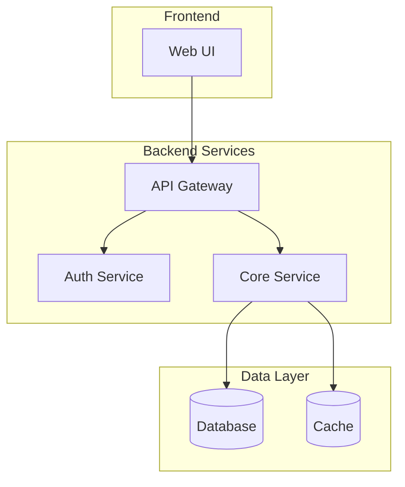
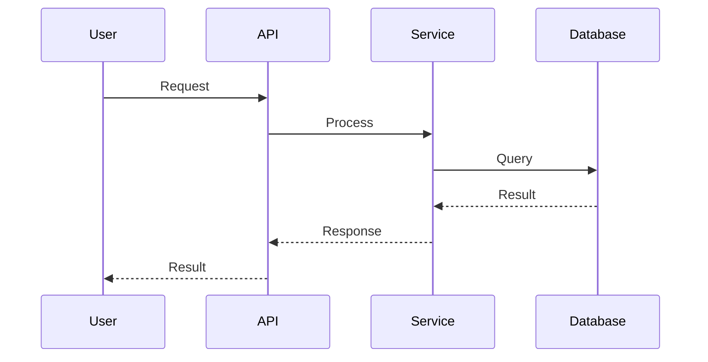

# Architectural Analysis Workflows

Step-by-step procedures for analyzing unknown codebases.

---

## Main Analysis Workflow

### Phase 1: Initial Reconnaissance

**Goal**: Get high-level understanding and identify documentation

#### 1.1 Locate Existing Documentation

- [ ] Find README files (root and nested)
- [ ] Locate `/docs`, `/documentation`, `/wiki` directories
- [ ] Identify architecture decision records (ADRs)
- [ ] Find API documentation (OpenAPI, Swagger, etc.)
- [ ] Check for inline documentation comments

**Track findings**:
```markdown
## Documentation Inventory
| Location | Type | Coverage | Last Updated |
|----------|------|----------|--------------|
| README.md | Overview | High-level only | {date} |
| docs/architecture.md | Architecture | Partial | {date} |
```

#### 1.2 Identify Project Structure

- [ ] Map top-level directory structure
- [ ] Identify entry points (main files, index files)
- [ ] Locate configuration files
- [ ] Find build/deployment scripts
- [ ] Note monorepo vs single-project structure

#### 1.3 Quick Technology Scan

- [ ] Check package manifests (`package.json`, `requirements.txt`, `go.mod`, etc.)
- [ ] Review build configuration files
- [ ] Note obvious framework indicators (file patterns, conventions)

**Output**: Initial project map with documentation references

---

### Phase 2: Technology Deep Dive

**Goal**: Complete technology inventory with verification

#### 2.1 Languages and Runtimes

For each language found:
1. Identify version requirements
2. Check language-specific config files
3. Note any transpilation/compilation steps

**Document with evidence**:
```markdown
## Languages
| Language | Version | Evidence | Doc Mentioned |
|----------|---------|----------|---------------|
| TypeScript | 5.x | tsconfig.json:1 | Yes - README |
| Python | 3.11+ | pyproject.toml:5 | No - Missing |
```

#### 2.2 Frameworks and Libraries

For each dependency:
1. Categorize (web framework, ORM, utility, etc.)
2. Note version constraints
3. Identify why it's used (if not obvious)

**Cross-reference with docs**:
- Does documentation mention this dependency?
- Is the documented usage accurate?

#### 2.3 Infrastructure Dependencies

Identify:
- [ ] Databases (relational, document, graph, etc.)
- [ ] Caches (Redis, Memcached, etc.)
- [ ] Message queues (RabbitMQ, Kafka, SQS, etc.)
- [ ] Cloud services (AWS, GCP, Azure specifics)
- [ ] External APIs consumed

**Output**: Complete technology manifest

---

### Phase 3: Interface Discovery

**Goal**: Map all system boundaries and contracts

#### 3.1 External API Analysis

For each external endpoint:

1. **Identify endpoints**
   - Search for route definitions
   - Check controller/handler files
   - Review API gateway configs

2. **Document contracts**
   - Request format (params, body, headers)
   - Response format (success, error)
   - Authentication requirements
   - Rate limiting

3. **Verify against docs**
   - Does OpenAPI/Swagger exist?
   - Are documented endpoints accurate?
   - Are there undocumented endpoints?

#### 3.2 Internal Service Interfaces

For service-to-service communication:

1. Identify service boundaries
2. Document communication patterns
3. Map dependencies between services

#### 3.3 Event/Message Interfaces

For async communication:

1. Identify publishers and consumers
2. Document message schemas
3. Map event flows

#### 3.4 Data Interfaces

Document:
- Database schemas
- File import/export formats
- Data transformation points

**Output**: Complete interface specification

---

### Phase 4: Architecture Synthesis

**Goal**: Create visual representations of the system

#### 4.1 Component Diagram

Create Mermaid diagram showing:
- Major components/services
- Dependencies between components
- External system integrations
- Data stores

```markdown
## Architecture Diagram


```

#### 4.2 Sequence Diagrams

Create sequence diagrams for:
- Key user flows
- Integration patterns
- Complex orchestrations

**Template**:
```markdown
## {Flow Name} Sequence


```

#### 4.3 Data Flow Diagram

If applicable, show:
- How data enters the system
- Transformations applied
- Where data is stored
- How data exits the system

**Output**: Visual architecture documentation

---

### Phase 5: Documentation Audit

**Goal**: Assess existing documentation accuracy

#### 5.1 Coverage Assessment

| Area | Documented | Accurate | Notes |
|------|------------|----------|-------|
| Technologies | Yes/No | Yes/No | {details} |
| Architecture | Yes/No | Yes/No | {details} |
| APIs | Yes/No | Yes/No | {details} |
| Setup/Install | Yes/No | Yes/No | {details} |

#### 5.2 Discrepancy Report

For each discrepancy found:

```markdown
### Discrepancy: {Title}

**Location**: {doc file and section}
**Type**: Missing | Outdated | Incorrect
**Documentation says**: {what docs claim}
**Reality**: {what code shows}
**Evidence**: {file:line reference}
**Impact**: Low | Medium | High
**Recommendation**: {suggested fix}
```

#### 5.3 Missing Documentation

List what should be documented but isn't:
- [ ] {Missing item 1}
- [ ] {Missing item 2}

**Output**: Documentation quality report

---

## Quick Analysis Workflow

For time-constrained analysis, focus on:

1. **5 min**: Project structure + README review
2. **10 min**: Package manifest analysis (dependencies)
3. **15 min**: Entry point trace (main → key paths)
4. **10 min**: Interface scan (routes, handlers)
5. **10 min**: Create basic architecture diagram

**Output**: High-level overview with key findings

---

## Continuous Verification Pattern

Throughout analysis, maintain this cycle:

```
┌─────────────────────────────────────────┐
│                                         │
│   DISCOVER → DOCUMENT → VERIFY → FLAG   │
│       ↑                           │     │
│       └───────────────────────────┘     │
│                                         │
└─────────────────────────────────────────┘
```

1. **Discover**: Find something in the code
2. **Document**: Record the finding with evidence
3. **Verify**: Check if existing docs mention it
4. **Flag**: Mark accuracy status (Accurate/Outdated/Missing)

---

## Output Compilation

Final deliverables:

1. **Technology Manifest** (templates.md)
2. **Interface Specification** (templates.md)
3. **Architecture Diagram** (Mermaid)
4. **Sequence Diagrams** (Mermaid)
5. **Documentation Audit Report**
6. **Recommendations** (optional)
