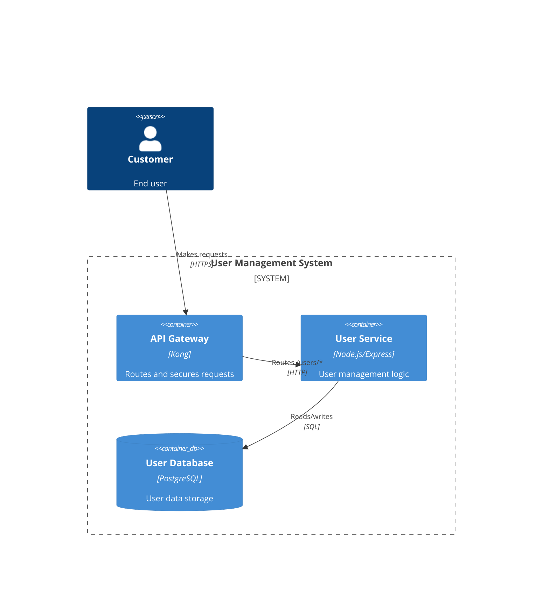
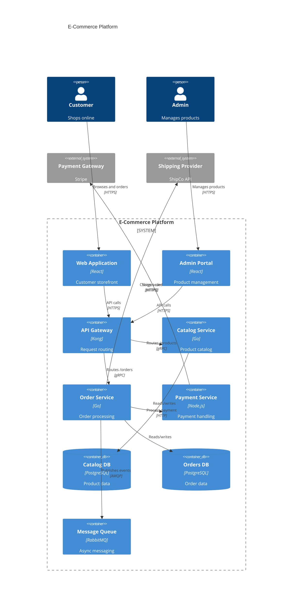
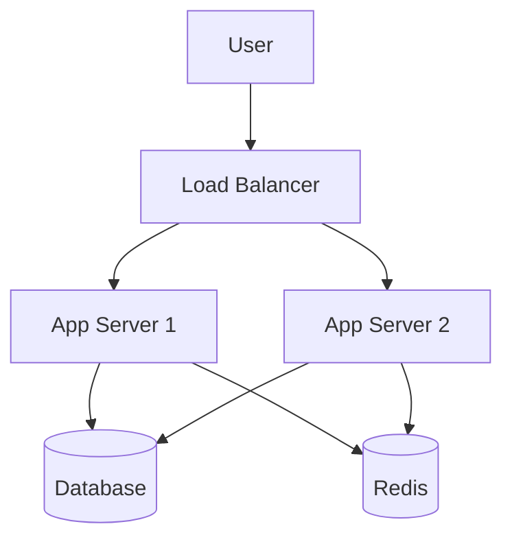

# Architecture Synthesis Examples

End-to-end examples demonstrating the synthesis workflow.

---

## Example 1: Excalidraw + Markdown Specs

### Input: Excalidraw Diagram

```json
{
  "type": "excalidraw",
  "version": 2,
  "elements": [
    {
      "id": "user",
      "type": "ellipse",
      "x": 50,
      "y": 200,
      "width": 80,
      "height": 80,
      "boundElements": [{"id": "user-text", "type": "text"}]
    },
    {
      "id": "user-text",
      "type": "text",
      "text": "Customer",
      "containerId": "user"
    },
    {
      "id": "api",
      "type": "rectangle",
      "x": 200,
      "y": 100,
      "width": 120,
      "height": 60,
      "groupIds": ["backend"],
      "boundElements": [{"id": "api-text", "type": "text"}]
    },
    {
      "id": "api-text",
      "type": "text",
      "text": "API Gateway\n[Kong]",
      "containerId": "api"
    },
    {
      "id": "users-svc",
      "type": "rectangle",
      "x": 200,
      "y": 200,
      "width": 120,
      "height": 60,
      "groupIds": ["backend"],
      "boundElements": [{"id": "users-text", "type": "text"}]
    },
    {
      "id": "users-text",
      "type": "text",
      "text": "User Service\n[Node.js]",
      "containerId": "users-svc"
    },
    {
      "id": "db",
      "type": "rectangle",
      "x": 200,
      "y": 300,
      "width": 120,
      "height": 60,
      "groupIds": ["backend"],
      "boundElements": [{"id": "db-text", "type": "text"}]
    },
    {
      "id": "db-text",
      "type": "text",
      "text": "DB: PostgreSQL",
      "containerId": "db"
    },
    {
      "id": "arrow1",
      "type": "arrow",
      "startBinding": {"elementId": "user"},
      "endBinding": {"elementId": "api"},
      "boundElements": [{"id": "arr1-text", "type": "text"}]
    },
    {
      "id": "arr1-text",
      "type": "text",
      "text": "HTTPS"
    },
    {
      "id": "arrow2",
      "type": "arrow",
      "startBinding": {"elementId": "api"},
      "endBinding": {"elementId": "users-svc"}
    },
    {
      "id": "arrow3",
      "type": "arrow",
      "startBinding": {"elementId": "users-svc"},
      "endBinding": {"elementId": "db"}
    }
  ]
}
```

### Input: Component Specifications

```markdown
## API Gateway

**Purpose**: Routes incoming requests to appropriate backend services.

**Responsibilities**:
- Request routing based on URL paths
- Authentication and authorization
- Rate limiting
- Request/response transformation

**Technology**: Kong (open source)

**Interfaces**:
- Provides: HTTPS endpoint on port 443
- Requires: Backend services via HTTP

---

## User Service

**Purpose**: Manages user accounts, authentication, and profiles.

**Responsibilities**:
- User registration and login
- Profile management
- Password reset
- Session management

**Technology**: Node.js with Express framework

**Interfaces**:
- Provides: REST API at /users/*
- Requires: PostgreSQL database

**Data**: User profiles, credentials (hashed), sessions
```

### Phase 2: Visual Parsing Results

```markdown
## Visual Parsing Results

### Components Found: 4

| ID | Name | Type | Technology | Boundary |
|----|------|------|------------|----------|
| user | Customer | Person | - | (external) |
| api | API Gateway | Container | Kong | backend |
| users-svc | User Service | Container | Node.js | backend |
| db | PostgreSQL | Database | PostgreSQL | backend |

### Relationships Found: 3

| Source | Target | Description |
|--------|--------|-------------|
| user | api | HTTPS |
| api | users-svc | (unlabeled) |
| users-svc | db | (unlabeled) |

### Boundaries Found: 1

| Name | Contains |
|------|----------|
| backend | api, users-svc, db |

### Parse Confidence: High
- All shapes have labels
- Clear grouping structure
- Technologies specified
```

### Phase 3: Spec Parsing Results

```markdown
## Spec Parsing Results

### Component Details Extracted: 2

**API Gateway**:
- Purpose: Routes incoming requests to appropriate backend services
- Responsibilities: 4 items
- Technology: Kong
- Interfaces: HTTPS/443 (in), HTTP (out)

**User Service**:
- Purpose: Manages user accounts, authentication, and profiles
- Responsibilities: 4 items
- Technology: Node.js with Express
- Interfaces: REST /users/* (in), PostgreSQL (out)
- Data: User profiles, credentials, sessions
```

### Phase 3: Mapping Results

```markdown
## Spec-to-Visual Mapping

| Spec Component | Visual Component | Match |
|----------------|------------------|-------|
| API Gateway | api (API Gateway) | ✓ Exact |
| User Service | users-svc (User Service) | ✓ Exact |
| - | user (Customer) | No spec (expected - external) |
| - | db (PostgreSQL) | No spec (infrastructure) |
```

### Phase 5: Clarification Questions

```markdown
## Clarification Needed

1. **API Gateway → User Service**: What protocol is used? (HTTP/gRPC)
2. **User Service → PostgreSQL**: Is this a direct connection or via connection pool?
3. Is there any caching layer between services?

> User answers:
> 1. HTTP
> 2. Direct connection with connection pooling in the app
> 3. No, not currently
```

### Phase 6: Synthesized Model

```yaml
architecture_model:
  name: "User Management System"
  version: "1.0"
  synthesized_from:
    - visual: "architecture.excalidraw"
    - specs: "component-specs.md"

  persons:
    - id: user
      name: "Customer"
      description: "End user of the system"

  containers:
    - id: api
      name: "API Gateway"
      technology: "Kong"
      description: "Routes incoming requests to appropriate backend services"
      responsibilities:
        - Request routing based on URL paths
        - Authentication and authorization
        - Rate limiting
        - Request/response transformation

    - id: users-svc
      name: "User Service"
      technology: "Node.js/Express"
      description: "Manages user accounts, authentication, and profiles"
      responsibilities:
        - User registration and login
        - Profile management
        - Password reset
        - Session management
      data:
        - User profiles
        - Credentials (hashed)
        - Sessions

    - id: db
      name: "User Database"
      technology: "PostgreSQL"
      description: "Persistent storage for user data"

  relationships:
    - source: user
      target: api
      description: "Makes requests"
      protocol: "HTTPS"
      sync: true

    - source: api
      target: users-svc
      description: "Routes /users/* requests"
      protocol: "HTTP"
      sync: true

    - source: users-svc
      target: db
      description: "Reads/writes user data"
      protocol: "SQL"
      sync: true
```

### Phase 7: Generated Outputs

#### Structurizr Workspace

```structurizr
workspace "User Management System" "Synthesized from Excalidraw + specs" {
    model {
        customer = person "Customer" "End user of the system"

        userSystem = softwareSystem "User Management System" {
            apiGateway = container "API Gateway" "Routes incoming requests" "Kong" {
                tags "Gateway"
            }
            userService = container "User Service" "Manages user accounts" "Node.js/Express" {
                tags "Service"
            }
            userDb = container "User Database" "Persistent storage" "PostgreSQL" {
                tags "Database"
            }
        }

        customer -> apiGateway "Makes requests" "HTTPS"
        apiGateway -> userService "Routes /users/*" "HTTP"
        userService -> userDb "Reads/writes" "SQL"
    }

    views {
        systemContext userSystem "Context" {
            include *
            autoLayout
        }

        container userSystem "Containers" {
            include *
            autoLayout
        }

        styles {
            element "Gateway" {
                shape RoundedBox
                background #438DD5
            }
            element "Service" {
                background #85BBF0
            }
            element "Database" {
                shape Cylinder
                background #438DD5
            }
        }
    }
}
```

#### Architecture Baseline Document

```markdown
# Architecture Baseline

> Synthesized: 2026-02-02
> Sources: architecture.excalidraw, component-specs.md

## Overview

The User Management System provides user account management capabilities including registration, authentication, and profile management. It consists of an API Gateway for routing and security, a User Service for business logic, and a PostgreSQL database for persistence.

## Components

### API Gateway
- **Type**: Container
- **Technology**: Kong (open source)
- **Purpose**: Routes incoming requests to appropriate backend services
- **Responsibilities**:
  - Request routing based on URL paths
  - Authentication and authorization
  - Rate limiting
  - Request/response transformation
- **Interfaces**:
  - Inbound: HTTPS on port 443
  - Outbound: HTTP to backend services

### User Service
- **Type**: Container
- **Technology**: Node.js with Express framework
- **Purpose**: Manages user accounts, authentication, and profiles
- **Responsibilities**:
  - User registration and login
  - Profile management
  - Password reset
  - Session management
- **Interfaces**:
  - Inbound: REST API at /users/*
  - Outbound: SQL to PostgreSQL
- **Data Owned**:
  - User profiles
  - Credentials (hashed)
  - Sessions

### User Database
- **Type**: Database
- **Technology**: PostgreSQL
- **Purpose**: Persistent storage for user data

## Relationships

| From | To | Description | Protocol |
|------|-----|-------------|----------|
| Customer | API Gateway | Makes requests | HTTPS |
| API Gateway | User Service | Routes /users/* | HTTP |
| User Service | User Database | Reads/writes | SQL |

## Diagram


```

---

## Example 2: Mermaid C4 Diagram

### Input: Mermaid C4 Container Diagram



### Phase 2: Mermaid Parsing Results

```markdown
## Mermaid Parsing Results

### Components Found: 12

| ID | Name | Type | Technology |
|----|------|------|------------|
| customer | Customer | Person | - |
| admin | Admin | Person | - |
| web | Web Application | Container | React |
| admin_ui | Admin Portal | Container | React |
| api | API Gateway | Container | Kong |
| catalog | Catalog Service | Container | Go |
| orders | Order Service | Container | Go |
| payments | Payment Service | Container | Node.js |
| catalog_db | Catalog DB | Database | PostgreSQL |
| orders_db | Orders DB | Database | PostgreSQL |
| queue | Message Queue | Container | RabbitMQ |
| payment_gw | Payment Gateway | External | Stripe |
| shipping | Shipping Provider | External | ShipCo API |

### Relationships Found: 12
(All relationships extracted with labels and protocols)

### Boundaries Found: 1
- platform: "E-Commerce Platform" containing 9 containers
```

### Phase 6: Synthesized Output (Abbreviated)

```markdown
## Synthesis Summary

### Model Statistics
- Persons: 2
- Containers: 9
- External Systems: 2
- Databases: 2
- Relationships: 12

### Architecture Patterns Identified
- **API Gateway**: Centralized routing via Kong
- **Microservices**: Separate services for Catalog, Orders, Payments
- **Event-Driven**: RabbitMQ for async messaging
- **Database per Service**: Separate DBs for Catalog and Orders

### Communication Patterns
- Sync: gRPC between API Gateway and services
- Async: AMQP for order events
- External: HTTPS to payment and shipping

### Generated Structurizr Workspace
[Full workspace.dsl generated]
```

---

## Example 3: Synthesis with Code Validation

### Input: Draw.io Diagram + Code Repository

**Diagram elements** (parsed from Draw.io):
- Auth Service (Node.js)
- User Service (Python)
- API Gateway (Kong)
- Redis Cache
- PostgreSQL

**Code files provided**:
- `auth-service/package.json`
- `user-service/requirements.txt`
- `docker-compose.yml`

### Phase 4: Code Analysis

```markdown
## Code Analysis Results

### auth-service/package.json
```json
{
  "name": "auth-service",
  "dependencies": {
    "express": "^4.18.0",
    "jsonwebtoken": "^9.0.0",
    "bcrypt": "^5.1.0",
    "redis": "^4.6.0",
    "pg": "^8.11.0"
  }
}
```

**Extracted**: Express.js, JWT auth, bcrypt hashing, Redis client, PostgreSQL client

### user-service/requirements.txt
```
fastapi==0.100.0
sqlalchemy==2.0.0
psycopg2-binary==2.9.6
redis==4.5.0
```

**Extracted**: FastAPI (not Flask as in diagram), SQLAlchemy ORM, PostgreSQL, Redis

### docker-compose.yml
```yaml
services:
  auth:
    build: ./auth-service
    ports: ["3001:3000"]
  users:
    build: ./user-service
    ports: ["3002:8000"]
  redis:
    image: redis:7-alpine
    ports: ["6379:6379"]
  postgres:
    image: postgres:15
    environment:
      POSTGRES_DB: app
```

**Extracted**: Service ports, Redis 7, PostgreSQL 15
```

### Validation Results

```markdown
## Code Validation

| Component | Diagram | Code | Status |
|-----------|---------|------|--------|
| Auth Service | Node.js | Express.js (Node.js) | ✓ Match |
| User Service | Python | FastAPI (Python) | ⚠️ Framework differs |
| Redis | Redis | Redis 7 | ✓ Match |
| PostgreSQL | PostgreSQL | PostgreSQL 15 | ✓ Match |

### Discoveries from Code
- Auth Service uses JWT (not mentioned in diagram)
- Auth Service connects to Redis (not shown in diagram)
- Both services connect to PostgreSQL (confirmed)

### Recommended Diagram Updates
1. Add Auth → Redis relationship
2. Update User Service technology to "FastAPI" instead of generic "Python"
3. Consider showing JWT flow
```

### Updated Model

The synthesized model incorporates code findings:

```yaml
containers:
  - id: auth
    name: "Auth Service"
    technology: "Node.js/Express"
    # Enriched from code:
    dependencies:
      - jsonwebtoken (JWT auth)
      - bcrypt (password hashing)
      - redis (session cache)
      - pg (PostgreSQL client)

  - id: users
    name: "User Service"
    technology: "Python/FastAPI"  # Updated from code
    dependencies:
      - sqlalchemy
      - redis

relationships:
  # Added from code analysis:
  - source: auth
    target: redis
    description: "Session cache"
    protocol: "Redis"
```

---

## Example 4: Minimal Input - Mermaid Only

### Input

User provides only a simple Mermaid flowchart:



### Clarification Questions

```markdown
## Clarification Needed

I've parsed your diagram. To create a complete architecture model, I need some details:

1. **Load Balancer** - What technology? (nginx, HAProxy, AWS ALB, etc.)
2. **App Servers** - What language/framework? (Node.js, Python/Django, etc.)
3. **Database** - What DBMS? (PostgreSQL, MySQL, MongoDB, etc.)
4. **Redis** - Is this for caching, sessions, or both?
5. **System name** - What should I call this system?

> User answers:
> 1. nginx
> 2. Python with Django
> 3. PostgreSQL
> 4. Both caching and sessions
> 5. "Content Management System"
```

### Synthesized Output

Even with minimal input + clarification, produces complete model:

```structurizr
workspace "Content Management System" "Synthesized from Mermaid diagram" {
    model {
        user = person "User"

        cms = softwareSystem "Content Management System" {
            lb = container "Load Balancer" "Distributes traffic" "nginx"
            app1 = container "App Server 1" "Application logic" "Python/Django"
            app2 = container "App Server 2" "Application logic" "Python/Django"
            db = container "Database" "Persistent storage" "PostgreSQL"
            cache = container "Cache" "Caching and sessions" "Redis"
        }

        user -> lb "Accesses" "HTTPS"
        lb -> app1 "Routes traffic" "HTTP"
        lb -> app2 "Routes traffic" "HTTP"
        app1 -> db "Reads/writes" "SQL"
        app2 -> db "Reads/writes" "SQL"
        app1 -> cache "Caches data" "Redis"
        app2 -> cache "Caches data" "Redis"
    }

    views {
        container cms "Containers" {
            include *
            autoLayout
        }
    }
}
```

---

## Quick Reference: Input → Output

| Input Provided | Output Quality | Clarification Needed |
|----------------|----------------|---------------------|
| Diagram + Full Specs + Code | High | Minimal |
| Diagram + Specs | High | Low |
| Diagram + Code | Medium-High | Medium |
| Diagram only | Medium | High |
| Specs only | Low | Very High (no structure) |

### Minimum Viable Input

To produce useful output, provide at least:
1. **One parseable diagram** (Excalidraw, Mermaid, Draw.io, or ArchiMate)
2. **Willingness to answer 3-5 clarification questions**

The more context you provide upfront, the fewer questions needed and the higher quality the output.
