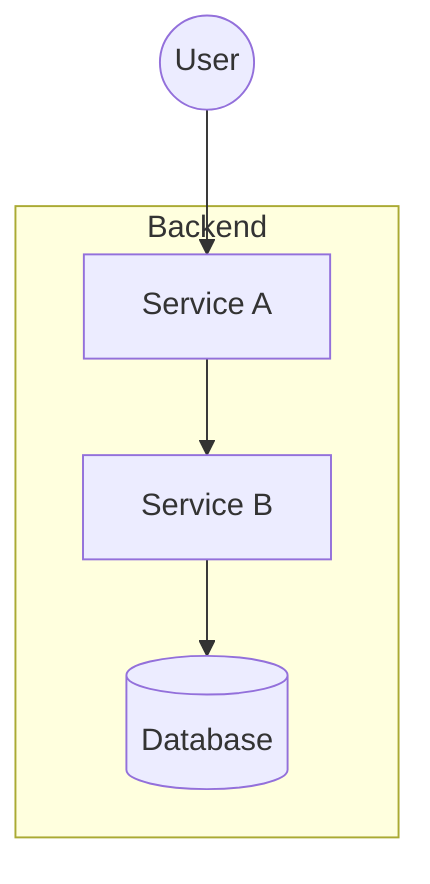
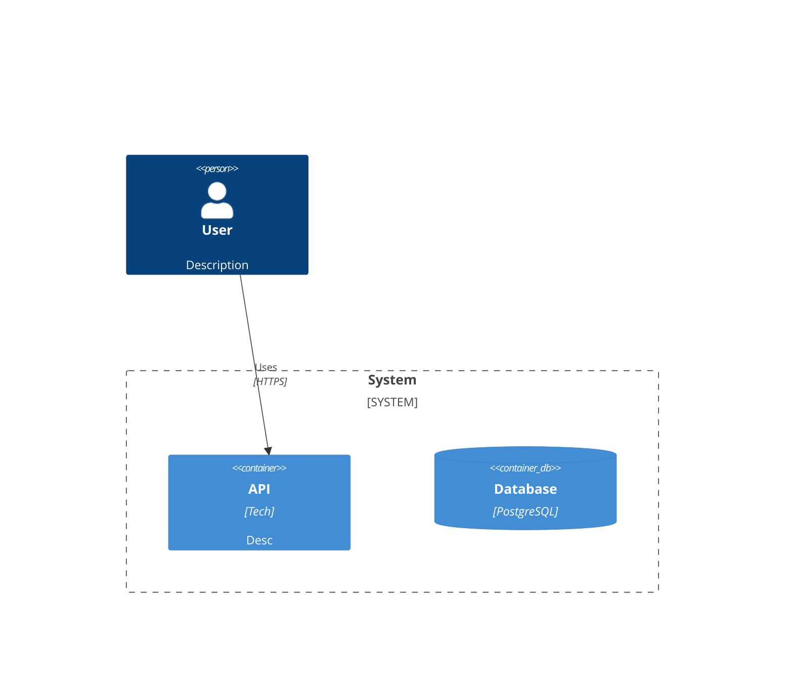

# Architecture Synthesis Parsers

Detailed parsing logic for each supported diagram format.

---

## Overview

Each parser extracts:
1. **Components** - Systems, containers, services, databases
2. **Relationships** - Connections between components
3. **Boundaries** - Groupings, containers, layers
4. **Metadata** - Technologies, descriptions, labels

---

## Excalidraw Parser

### Format Detection

Excalidraw files are JSON with this structure:

```json
{
  "type": "excalidraw",
  "version": 2,
  "source": "...",
  "elements": [...],
  "appState": {...}
}
```

**Detection**: Check for `"type": "excalidraw"` or `elements` array with Excalidraw element schema.

### Element Types

| Excalidraw Type | Architecture Mapping |
|-----------------|---------------------|
| `rectangle` | Component (default) |
| `ellipse` | Actor/External (context-dependent) |
| `diamond` | Decision/Gateway |
| `arrow` | Relationship |
| `line` | Relationship (if connects shapes) |
| `text` | Label (standalone) or annotation |
| `freedraw` | Ignore (hand-drawn marks) |
| `image` | Ignore (embedded images) |

### Parsing Algorithm

```
1. Load JSON and extract elements array
2. Build element lookup by ID
3. First pass - identify shapes:
   For each element where type in [rectangle, ellipse, diamond]:
     - Extract id, x, y, width, height
     - Extract text from boundElements or nested text
     - Infer component type from:
       - Text prefixes ("DB:", "Queue:", "Person:")
       - Shape type (ellipse often = actor)
       - Size (large = system, small = component)
     - Check if element is inside a group
     - Add to components list

4. Second pass - identify relationships:
   For each element where type in [arrow, line]:
     - Find startBinding.elementId → source
     - Find endBinding.elementId → target
     - Extract text label from boundElements
     - Determine direction (arrow head position)
     - Add to relationships list

5. Third pass - identify boundaries:
   For each group in elements:
     - Find all elements with same groupIds
     - Find text element as group label
     - Create boundary with contained elements
```

### Excalidraw Element Structure

```json
{
  "id": "abc123",
  "type": "rectangle",
  "x": 100,
  "y": 200,
  "width": 150,
  "height": 80,
  "groupIds": ["group1"],
  "boundElements": [
    {"id": "text1", "type": "text"}
  ]
}
```

```json
{
  "id": "arrow1",
  "type": "arrow",
  "startBinding": {"elementId": "abc123"},
  "endBinding": {"elementId": "def456"},
  "boundElements": [
    {"id": "label1", "type": "text"}
  ]
}
```

### Text Extraction

Text can be:
1. **Bound to shape**: In `boundElements` array
2. **Inside shape bounds**: Text element with coordinates inside shape
3. **Standalone**: Free text near shape (heuristic matching)

```
For shape S:
  1. Check S.boundElements for type="text"
  2. If not found, search text elements where:
     text.x >= S.x AND text.x <= S.x + S.width AND
     text.y >= S.y AND text.y <= S.y + S.height
  3. If not found, search nearby text (within 20px)
```

### Component Type Inference

```
Given shape S with text T:

If T starts with "Person:" or "User:" → Person
If T starts with "DB:" or "Database:" → Database
If T starts with "Queue:" or "MQ:" → Queue
If T starts with "External:" or has dashed strokeStyle → External System
If S.type == "ellipse" → Actor (likely)
If S.width > 300 → System/Boundary
If S.width < 100 → Component
Else → Container (default)
```

### Grouping Detection

```
Groups in Excalidraw use groupIds array:

elements = [
  {id: "a", groupIds: ["g1"]},
  {id: "b", groupIds: ["g1"]},
  {id: "c", groupIds: ["g1", "g2"]},  // nested group
  {id: "d", groupIds: []}              // ungrouped
]

Algorithm:
1. Collect all unique groupIds
2. For each groupId, find all elements with that groupId
3. Find largest element or text-only element as boundary label
4. Remaining elements are boundary contents
```

---

## Mermaid Parser

### Format Detection

Mermaid diagrams start with a diagram type declaration:

```
flowchart TB
graph LR
C4Context
C4Container
sequenceDiagram
```

**Detection**: First non-empty, non-comment line matches diagram type.

### Supported Diagram Types

| Type | Parsing Approach |
|------|------------------|
| `flowchart` / `graph` | Node and edge extraction |
| `C4Context` | C4 model elements |
| `C4Container` | C4 model elements |
| `C4Component` | C4 model elements |
| `sequenceDiagram` | Participants as components |

### Flowchart Parsing



**Parsing rules:**

```
Node patterns:
  ID[Label]           → Rectangle (component)
  ID([Label])         → Stadium (service)
  ID[[Label]]         → Subroutine
  ID[(Label)]         → Cylinder (database)
  ID((Label))         → Circle (actor)
  ID{Label}           → Diamond (decision)
  ID>Label]           → Flag
  ID{{Label}}         → Hexagon

Edge patterns:
  A --> B             → Solid arrow (sync)
  A -.-> B            → Dotted arrow (async)
  A --- B             → Line (association)
  A -->|label| B      → Labeled relationship
  A -- label --> B    → Alternative label syntax

Subgraph:
  subgraph Name       → Boundary start
    ...
  end                 → Boundary end
```

### Flowchart Algorithm

```
1. Tokenize input by lines
2. Track current subgraph stack

For each line:
  If matches "subgraph <Name>":
    Push new boundary
  If matches "end":
    Pop boundary
  If matches node definition:
    Extract id, label, shape
    Map shape to component type
    Add to current boundary (or root)
  If matches edge definition:
    Extract source, target, label, style
    Add to relationships
```

### C4 Diagram Parsing



**C4 element patterns:**

```
Person(id, "label", "description")
System(id, "label", "description")
System_Ext(id, "label", "description")
System_Boundary(id, "label") { ... }
Container(id, "label", "technology", "description")
ContainerDb(id, "label", "technology", "description")
Component(id, "label", "technology", "description")

Rel(source, target, "description", "technology")
Rel_U/D/L/R(source, target, "description")  # directional
BiRel(source, target, "description")         # bidirectional
```

### C4 Algorithm

```
1. Identify C4 diagram type (Context/Container/Component)
2. Parse element declarations:
   - Extract function name (Person, System, Container, etc.)
   - Extract parameters (id, label, technology, description)
   - Map to component type
3. Handle boundaries:
   - System_Boundary, Container_Boundary start new scope
   - Closing } ends scope
4. Parse relationships:
   - Extract Rel/BiRel declarations
   - Map source/target IDs to components
```

---

## Draw.io Parser

### Format Detection

Draw.io files are XML with mxGraphModel:

```xml
<mxfile>
  <diagram>
    <mxGraphModel>
      <root>
        <mxCell id="0"/>
        <mxCell id="1" parent="0"/>
        ...
      </root>
    </mxGraphModel>
  </diagram>
</mxfile>
```

**Detection**: XML with `<mxfile>` or `<mxGraphModel>` root elements.

### mxCell Structure

```xml
<mxCell id="abc" value="Label" style="..." vertex="1" parent="1">
  <mxGeometry x="100" y="200" width="120" height="60"/>
</mxCell>
```

**Attributes:**
- `id` - Unique identifier
- `value` - Display label (may contain HTML)
- `style` - Semicolon-separated style properties
- `vertex="1"` - Shape (not edge)
- `edge="1"` - Connector
- `parent` - Parent cell (for containment)
- `source`, `target` - For edges, connected cell IDs

### Style Parsing

```
style="rounded=1;whiteSpace=wrap;html=1;fillColor=#dae8fc;strokeColor=#6c8ebf"

Parse into key-value pairs:
{
  rounded: "1",
  whiteSpace: "wrap",
  html: "1",
  fillColor: "#dae8fc",
  strokeColor: "#6c8ebf"
}
```

**Style to type mapping:**

| Style Property | Interpretation |
|----------------|----------------|
| `shape=cylinder` | Database |
| `shape=actor` | Person |
| `shape=hexagon` | Service |
| `shape=parallelogram` | Queue |
| `swimlane=1` | Boundary/Container |
| `dashed=1` | External system |
| `edgeStyle=*` | Relationship |

### Draw.io Algorithm

```
1. Parse XML into DOM
2. Find all mxCell elements in root

First pass - shapes:
  For each mxCell with vertex="1":
    - Extract id, value (label)
    - Parse style for shape hints
    - Extract geometry (x, y, width, height)
    - Check parent for containment
    - Infer component type from shape/style
    - Add to components

Second pass - edges:
  For each mxCell with edge="1":
    - Extract source, target IDs
    - Extract value as label
    - Parse style for line type (dashed = async)
    - Add to relationships

Third pass - containment:
  For each component:
    - If parent != "1" (root), find parent component
    - Create boundary if parent is swimlane/container
```

### HTML Value Handling

Draw.io values often contain HTML:

```xml
<mxCell value="&lt;b&gt;Service&lt;/b&gt;&lt;br&gt;Node.js"/>
```

**Parsing:**
1. Unescape HTML entities (`&lt;` → `<`)
2. Strip HTML tags for plain text
3. Split by `<br>` for multi-line (label + technology)

---

## ArchiMate Parser

### Format Detection

ArchiMate models use Open Exchange Format (XML):

```xml
<model xmlns="http://www.opengroup.org/xsd/archimate/3.0/">
  <name>Model Name</name>
  <elements>...</elements>
  <relationships>...</relationships>
  <views>...</views>
</model>
```

**Detection**: XML with ArchiMate namespace.

### ArchiMate Elements

```xml
<element identifier="id-123" xsi:type="ApplicationComponent">
  <name>User Service</name>
  <documentation>Manages user accounts</documentation>
</element>
```

**Element type mapping:**

| ArchiMate Type | Synthesis Type |
|----------------|----------------|
| `BusinessActor` | Person |
| `BusinessProcess` | Process |
| `BusinessService` | Service |
| `ApplicationComponent` | Container/Component |
| `ApplicationService` | Interface |
| `ApplicationInterface` | API |
| `DataObject` | Data Entity |
| `Node` | Infrastructure |
| `SystemSoftware` | Platform |
| `Artifact` | Deployment |

### ArchiMate Relationships

```xml
<relationship identifier="rel-1"
              xsi:type="ServingRelationship"
              source="id-123"
              target="id-456">
  <name>Provides user data</name>
</relationship>
```

**Relationship type mapping:**

| ArchiMate Type | Synthesis Interpretation |
|----------------|-------------------------|
| `ServingRelationship` | Provides service to |
| `FlowRelationship` | Data/control flow |
| `TriggeringRelationship` | Triggers/calls |
| `AccessRelationship` | Reads/writes |
| `RealizationRelationship` | Implements |
| `AssignmentRelationship` | Deployed on |
| `CompositionRelationship` | Contains |
| `AggregationRelationship` | Groups |
| `AssociationRelationship` | Related to |

### ArchiMate Algorithm

```
1. Parse XML into DOM
2. Extract namespace (ArchiMate 3.0 vs 2.x)

Parse elements:
  For each <element>:
    - Extract identifier, xsi:type
    - Extract name, documentation
    - Map xsi:type to synthesis type
    - Determine layer (Business/Application/Technology)
    - Add to components

Parse relationships:
  For each <relationship>:
    - Extract identifier, xsi:type
    - Extract source, target identifiers
    - Extract name (if present)
    - Map relationship type
    - Add to relationships

Parse views (for layout hints):
  For each <view>:
    - Extract viewpoint type
    - Map node positions for diagram reconstruction
```

### Layer Detection

```
Business Layer elements:
  BusinessActor, BusinessRole, BusinessProcess,
  BusinessFunction, BusinessService, BusinessObject

Application Layer elements:
  ApplicationComponent, ApplicationService,
  ApplicationInterface, ApplicationFunction, DataObject

Technology Layer elements:
  Node, Device, SystemSoftware, TechnologyService,
  Artifact, CommunicationNetwork
```

---

## Markdown Specification Parser

### Format Detection

Markdown specs use headers and structured content:

```markdown
## Component Name

**Purpose**: Description

**Technology**: Node.js
```

### Parsing Patterns

**Header-based structure:**
```
## [Component Name]
### [Section]
```

**Key-value patterns:**
```
**Key**: Value
- **Key**: Value
| Key | Value |
```

**List patterns:**
```
**Responsibilities**:
- Item 1
- Item 2

### Interfaces
- Provides: ...
- Requires: ...
```

### Markdown Algorithm

```
1. Split content by ## headers (level 2)
2. Each ## section = potential component

For each section:
  - Header text = component name
  - Scan for key-value patterns:
    - Purpose/Description → component.description
    - Technology/Stack → component.technology
    - Responsibilities → component.responsibilities[]
    - Interfaces → component.interfaces
    - Data → component.data
  - Handle ### subsections for nested info
```

### Table Parsing

```markdown
| Component | Technology | Purpose |
|-----------|------------|---------|
| API       | Kong       | Routing |
| Users     | Node.js    | Users   |
```

```
1. Detect table by |---|---| pattern
2. Parse header row for column names
3. Parse data rows into objects
4. Map column names to component fields
```

---

## Common Utilities

### Name Normalization

```
Input: "User Service [Node.js]"
Output: {
  name: "User Service",
  technology: "Node.js"
}

Patterns:
  "Name [Tech]" → split on brackets
  "Name\nTech" → split on newline
  "Name (Tech)" → split on parentheses
  "Name - Tech" → split on dash
```

### ID Generation

```
If no ID in source:
  1. Slugify name: "User Service" → "user-service"
  2. Add type prefix: "cnt-user-service" (container)
  3. Add numeric suffix if duplicate: "cnt-user-service-2"
```

### Relationship Direction

```
For arrows/edges without explicit direction:
  - Check for arrowhead in style
  - Default to source → target
  - Bidirectional if both ends have arrows
```

### Confidence Scoring

```
Confidence = base + bonuses

base = 0.5

+0.2 if has explicit label
+0.1 if has technology specified
+0.1 if has description
+0.1 if appears in multiple sources
-0.2 if inferred from shape only
-0.1 if name is generic ("Service", "Database")
```

---

## Error Handling

### Parse Failures

| Error | Recovery |
|-------|----------|
| Invalid JSON/XML | Report error, abort |
| Missing elements | Report warning, continue |
| Unknown element type | Map to generic "component" |
| Circular references | Detect and break cycle |
| Encoding issues | Try UTF-8, then Latin-1 |

### Validation

After parsing, validate:
- All relationship sources/targets exist
- No duplicate IDs
- Names are non-empty
- Required fields present

Report validation issues as warnings, not errors.
