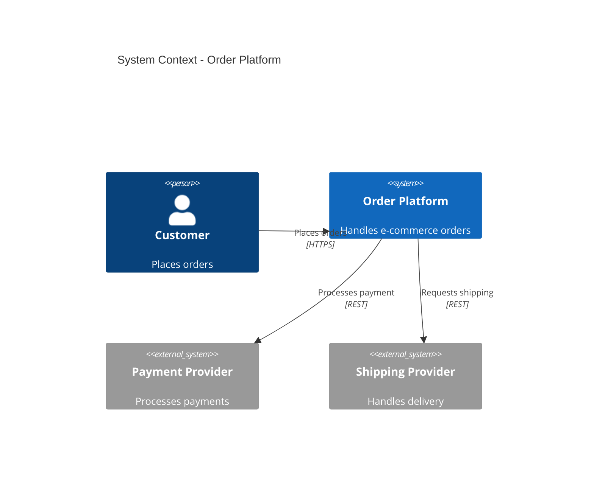
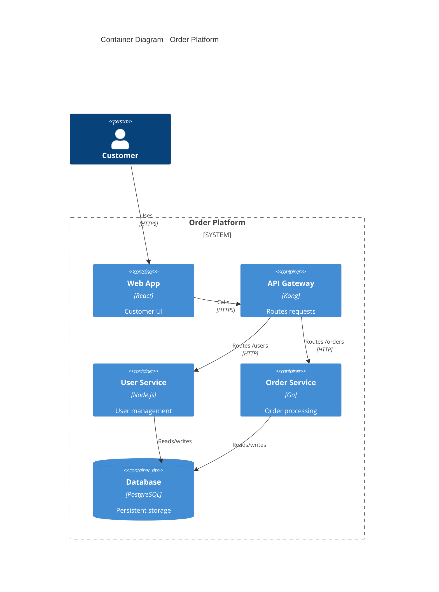
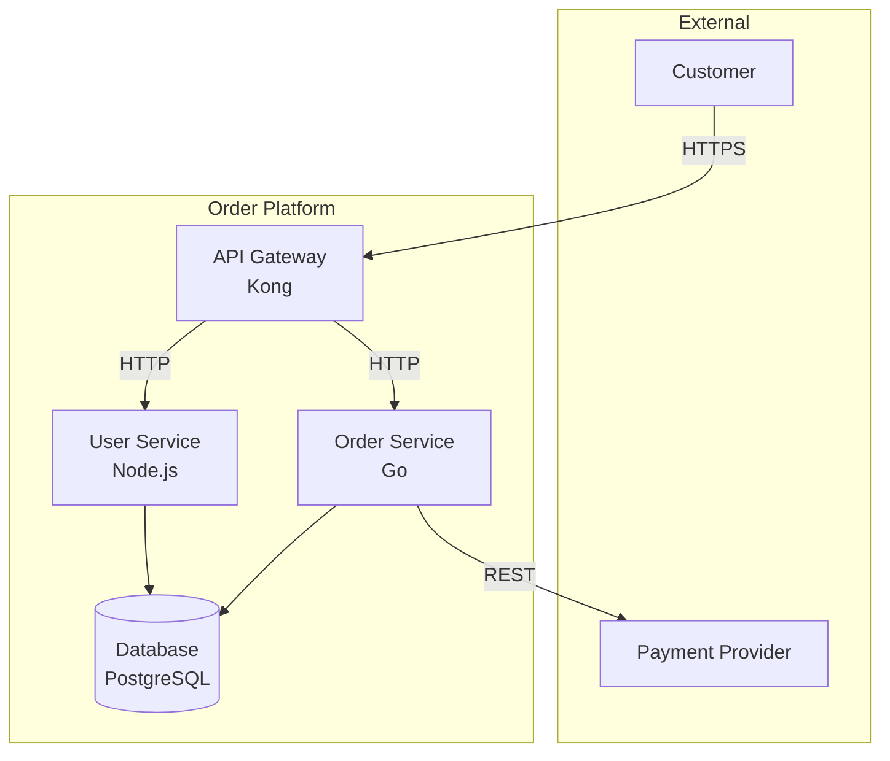

# Architecture Synthesis Templates

Input templates and format conventions for architecture synthesis.

---

## Requirements Checklist Template

Present this when the skill is invoked to guide resource collection.

```markdown
# Architecture Synthesis - Resource Checklist

## Required: Visual Architecture

Provide at least one architecture diagram in a parseable format:

| Format | How to Provide |
|--------|----------------|
| **Excalidraw** | Share `.excalidraw` file or paste JSON content |
| **Mermaid** | Share `.mmd` file or paste diagram code |
| **Draw.io** | Share `.drawio` file (XML format) |
| **ArchiMate** | Share `.archimate` file from Archi tool |

> **Note**: Screenshots/images cannot be parsed accurately. Please provide source files.

## Recommended: Component Specifications

For best results, describe each component using this template:

### [Component Name]

**Purpose**: What this component does (1-2 sentences)

**Responsibilities**:
- Responsibility 1
- Responsibility 2

**Technology**: Language, framework, database

**Interfaces**:
- Provides: APIs/services exposed
- Requires: Dependencies on other components

**Data**: What data this component owns/manages

---

## Optional: Code Samples

Help validate technology choices:
- Repository link
- Package manifest (package.json, go.mod, etc.)
- Docker/Kubernetes configuration
- Key source files

## Optional: Business Context

- Business goals this architecture supports
- Key stakeholders
- Constraints (compliance, budget, timeline)
```

---

## Component Specification Template

Use this template to document each component:

```markdown
## [Component Name]

### Overview
Brief description of what this component does and why it exists.

### Responsibilities
- [ ] Primary responsibility 1
- [ ] Primary responsibility 2
- [ ] Primary responsibility 3

### Technology Stack
| Layer | Technology |
|-------|------------|
| Language | e.g., TypeScript, Go, Python |
| Framework | e.g., Express, Gin, FastAPI |
| Database | e.g., PostgreSQL, MongoDB |
| Cache | e.g., Redis, Memcached |
| Queue | e.g., RabbitMQ, Kafka |

### Interfaces

#### Provided (Exposes)
| Interface | Type | Description |
|-----------|------|-------------|
| `/api/users` | REST | User CRUD operations |
| `UserCreated` | Event | Published when user created |

#### Required (Depends On)
| Dependency | Type | Purpose |
|------------|------|---------|
| Auth Service | REST | Token validation |
| User Database | SQL | Persistent storage |

### Data Ownership
| Entity | Description | Sensitivity |
|--------|-------------|-------------|
| User | User profiles and preferences | PII |
| Session | Active user sessions | Sensitive |

### Scaling Characteristics
- **Stateless**: Yes/No
- **Horizontal scaling**: Supported/Limited/Not supported
- **Expected load**: X requests/second

### Notes
Any additional context, constraints, or considerations.
```

---

## Inventory Table Template

Alternative to individual component specs - a single table for all components:

```markdown
# Component Inventory

| Component | Type | Technology | Purpose | Interfaces | Owner |
|-----------|------|------------|---------|------------|-------|
| API Gateway | Container | Kong | Routing, auth | HTTP/443 | Platform |
| User Service | Service | Node.js/Express | User management | REST /users | Backend |
| Order Service | Service | Go/Gin | Order processing | REST /orders, gRPC | Backend |
| User DB | Database | PostgreSQL | User data | SQL/5432 | DBA |
| Cache | Infrastructure | Redis | Session cache | Redis/6379 | Platform |
| Message Queue | Infrastructure | RabbitMQ | Async messaging | AMQP/5672 | Platform |

## Relationship Inventory

| Source | Target | Description | Protocol | Sync/Async |
|--------|--------|-------------|----------|------------|
| User | API Gateway | Customer requests | HTTPS | Sync |
| API Gateway | User Service | Route /users/* | HTTP | Sync |
| API Gateway | Order Service | Route /orders/* | HTTP | Sync |
| Order Service | Message Queue | Publish order events | AMQP | Async |
| User Service | User DB | Read/write users | SQL | Sync |
| User Service | Cache | Session lookup | Redis | Sync |
```

---

## Excalidraw Conventions

Guidelines for creating Excalidraw diagrams that parse well.

### Shape Conventions

| Element | Shape | Example |
|---------|-------|---------|
| Person/Actor | Rectangle with "Person:" prefix or stick figure | `Person: Customer` |
| System | Rectangle | `Order System` |
| Container | Rectangle | `API Gateway` |
| Component | Smaller rectangle | `UserController` |
| Database | Rectangle with "DB:" prefix or cylinder | `DB: PostgreSQL` |
| External System | Rectangle with dashed border | `Payment Provider` |
| Queue | Rectangle with "Queue:" prefix | `Queue: RabbitMQ` |

### Grouping for Boundaries

Use Excalidraw's grouping or frame feature:
- Select related components
- Group them (Ctrl/Cmd + G)
- Add a text label for the boundary name

```
┌─────────────────────────────┐
│ Backend Services            │  ← Boundary label
│  ┌─────────┐  ┌─────────┐  │
│  │ User    │  │ Order   │  │  ← Components
│  │ Service │  │ Service │  │
│  └─────────┘  └─────────┘  │
└─────────────────────────────┘
```

### Relationship Labels

- Add text labels on arrows/connectors
- Use format: `verb` or `verb [protocol]`
- Examples: "Calls", "Reads/Writes", "Publishes [AMQP]"

### Technology Annotations

Add technology in brackets or as subtitle:
```
┌─────────────────┐
│   User Service  │
│   [Node.js]     │  ← Technology annotation
└─────────────────┘
```

---

## Mermaid Conventions

### C4 Diagrams (Preferred)





### Flowchart Style



### Naming Conventions

| Element | Format | Example |
|---------|--------|---------|
| ID | camelCase | `userService`, `orderDb` |
| Label | Title Case | `User Service` |
| Technology | In label or description | `User Service<br/>Node.js` |

---

## Draw.io Conventions

### Using Shapes

| Element | Draw.io Shape | Library |
|---------|---------------|---------|
| Person | Actor (UML) | UML |
| System | Rectangle | General |
| Container | Rounded rectangle | General |
| Database | Cylinder | General |
| External | Rectangle + dashed line style | General |
| Queue | Parallelogram or custom | General |

### Containers and Swimlanes

Use Draw.io's container or swimlane features for boundaries:
1. Insert > Advanced > Container
2. Drag components inside
3. Label the container

### Metadata

Add custom properties for richer parsing:
1. Right-click shape > Edit Data
2. Add properties:
   - `type`: system, container, component, database
   - `technology`: Node.js, PostgreSQL, etc.
   - `layer`: frontend, backend, data, infrastructure

### Export Format

Export as `.drawio` (XML) - **not** as image:
- File > Save As > `.drawio`
- Or File > Export As > XML

---

## ArchiMate Conventions

### Layer Mapping

| ArchiMate Layer | Architecture Element |
|-----------------|---------------------|
| Business | Business processes, actors, services |
| Application | Applications, components, interfaces |
| Technology | Infrastructure, platforms, networks |

### Element Types

| ArchiMate Element | Synthesis Mapping |
|-------------------|-------------------|
| Application Component | Container/Component |
| Application Service | Interface |
| Node | Infrastructure |
| System Software | Platform |
| Artifact | Deployment unit |

### Relationships

| ArchiMate Relationship | Synthesis Interpretation |
|------------------------|-------------------------|
| Serving | Provides service to |
| Realization | Implements |
| Assignment | Deployed on |
| Flow | Data/control flow |
| Access | Reads/writes data |
| Association | Generic relationship |

### Export Format

From Archi tool:
- File > Export > Model To Open Exchange File
- Or share native `.archimate` file

---

## Business Context Template

Optional template for capturing business context:

```markdown
# Business Context

## Business Goals

| Goal | Description | Priority |
|------|-------------|----------|
| G1 | Enable self-service ordering | High |
| G2 | Reduce order processing time by 50% | High |
| G3 | Support 10x current transaction volume | Medium |

## Key Stakeholders

| Stakeholder | Role | Concerns |
|-------------|------|----------|
| VP Product | Sponsor | Time to market, feature velocity |
| CTO | Technical authority | Scalability, maintainability |
| Operations | Runtime owner | Reliability, observability |
| Security | Compliance | Data protection, audit |

## Constraints

| Type | Constraint | Impact |
|------|------------|--------|
| Compliance | PCI-DSS required | Payment handling restrictions |
| Timeline | Launch by Q3 | Limits scope |
| Budget | $X allocated | Team size constraints |
| Technical | Must integrate with legacy ERP | API compatibility needed |

## Quality Attributes

| Attribute | Requirement |
|-----------|-------------|
| Availability | 99.9% uptime |
| Performance | < 200ms P95 response |
| Scalability | 1000 concurrent users |
| Security | SOC 2 compliant |
```

---

## Output Templates

### Synthesis Summary Template

```markdown
# Architecture Synthesis Summary

**Source**: {diagram file}, {spec file}
**Generated**: {date}
**Confidence**: High/Medium/Low

## Overview

{1-2 paragraph system description}

## Statistics

| Metric | Count |
|--------|-------|
| Systems | X |
| Containers | X |
| Components | X |
| Relationships | X |
| External Systems | X |

## Key Findings

1. {Finding 1}
2. {Finding 2}
3. {Finding 3}

## Assumptions Made

1. {Assumption 1 - could not validate}
2. {Assumption 2 - inferred from context}

## Gaps Identified

1. {Gap 1 - missing information}
2. {Gap 2 - unclear relationship}

## Generated Artifacts

- [ ] `workspace.dsl` - Structurizr workspace
- [ ] `baseline/overview.md` - Architecture overview
- [ ] `baseline/components.md` - Component catalog
- [ ] `baseline/relationships.md` - Relationship catalog

## Recommended Next Steps

1. Review and validate assumptions
2. Fill identified gaps
3. {Context-specific recommendation}
```
