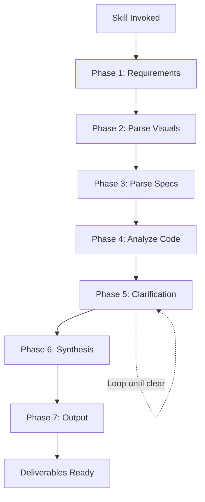

# Architecture Synthesis Workflows

Step-by-step procedures for synthesizing architecture models from diagrams and specifications.

---

## Workflow Overview



---

## Phase 1: Requirements Gathering

**Goal**: Understand what resources the user has and collect them systematically.

### Step 1.1: Present Requirements Checklist

When skill is invoked, present this checklist:

```markdown
## Architecture Synthesis - What I Need

To synthesize your architecture, please provide the following:

### Required (at least one)
- [ ] **Visual Architecture Diagram**
  - Excalidraw file (`.excalidraw` JSON)
  - Mermaid diagram (`.mmd` or in markdown)
  - Draw.io file (`.drawio` XML)
  - ArchiMate model (`.archimate` XML)
  - Or describe what you have

### Recommended
- [ ] **Component Specifications**
  - Markdown descriptions of each component
  - Responsibilities and interfaces
  - Technology choices
  - See template: [Component Spec Template](#component-specification-template)

### Optional (Enrichment)
- [ ] **Code Samples**
  - Repository link or key files
  - Package manifests (package.json, go.mod, etc.)
  - Configuration files (docker-compose, k8s manifests)

- [ ] **Business Context**
  - Business goals this architecture supports
  - Key stakeholders
  - Constraints (budget, timeline, compliance)

---

**What format is your architecture diagram in?**
```

### Step 1.2: Collect Resources

Based on user response, request specific files:

| User Has | Request |
|----------|---------|
| Excalidraw | "Please share the `.excalidraw` file or paste the JSON content" |
| Mermaid | "Please share the Mermaid diagram code" |
| Draw.io | "Please share the `.drawio` file or export as XML" |
| ArchiMate | "Please share the `.archimate` file" |
| Image only | "Do you have the source file? Images can't be parsed accurately. If not, we can work from descriptions." |
| Multiple | "Let's start with [primary diagram]. We can incorporate others after." |

### Step 1.3: Acknowledge and Proceed

Once resources received:

```markdown
## Resources Received

✓ Visual diagram: [format] - [filename/description]
✓ Component specs: [yes/no/partial]
✓ Code samples: [yes/no]
✓ Business context: [yes/no]

I'll now parse these resources and may ask clarifying questions.
Proceeding to visual parsing...
```

---

## Phase 2: Parse Visual Architecture

**Goal**: Extract structural information from visual diagrams.

### Step 2.1: Identify Diagram Type

Determine the diagram format and appropriate parser:

| Format | Detection | Parser |
|--------|-----------|--------|
| Excalidraw | JSON with `type`, `elements` array | Excalidraw parser |
| Mermaid | Text starting with `flowchart`, `graph`, `C4Context` | Mermaid parser |
| Draw.io | XML with `mxfile`, `mxGraphModel` | Draw.io parser |
| ArchiMate | XML with ArchiMate namespace | ArchiMate parser |

### Step 2.2: Extract Components

For each diagram element, extract:

```
Component:
  - id: unique identifier
  - name: label/text
  - type: inferred type (system, container, component, person, external)
  - description: from label or nearby text
  - technology: if specified
  - boundary: parent container/group
```

**Type inference rules:**

| Visual Cue | Inferred Type |
|------------|---------------|
| Person/stick figure | Person/Actor |
| Cloud shape | External System |
| Database/cylinder | Database/Data Store |
| Rectangle with dashed border | Boundary/Container |
| Rectangle (solid) | Component/System |
| Hexagon | Service |
| Document shape | Document/File |

### Step 2.3: Extract Relationships

For each connector/arrow, extract:

```
Relationship:
  - source: component id
  - target: component id
  - label: text on connector
  - direction: uni/bidirectional
  - style: sync/async (if indicated by line style)
```

### Step 2.4: Extract Boundaries

For containers, groups, or swimlanes:

```
Boundary:
  - id: unique identifier
  - name: label
  - type: system boundary, container, domain, layer
  - contains: [component ids]
```

### Step 2.5: Document Parse Results

```markdown
## Visual Parsing Results

### Components Found: {count}

| ID | Name | Type | Technology | Boundary |
|----|------|------|------------|----------|
| c1 | API Gateway | Container | Kong | Platform |
| c2 | User Service | Component | Node.js | Backend |
| ... | ... | ... | ... | ... |

### Relationships Found: {count}

| Source | Target | Description |
|--------|--------|-------------|
| User | API Gateway | Makes requests |
| API Gateway | User Service | Routes /users/* |
| ... | ... | ... |

### Boundaries Found: {count}

| Name | Type | Contains |
|------|------|----------|
| Platform | System | API Gateway, Load Balancer |
| Backend | Container | User Service, Order Service |
| ... | ... | ... |

### Parse Confidence
- Component extraction: High/Medium/Low
- Relationship extraction: High/Medium/Low
- Unclear elements: [list any ambiguous items]
```

---

## Phase 3: Parse Specifications

**Goal**: Extract detailed information from textual specifications.

### Step 3.1: Identify Specification Format

| Format | Pattern | Parser |
|--------|---------|--------|
| Markdown headers | `## Component Name` followed by bullets | Markdown parser |
| Tables | `| Name | Description |...` | Table parser |
| Free text | Paragraphs mentioning components | NLP extraction |

### Step 3.2: Extract Component Details

For each component mentioned in specs:

```
Component Spec:
  - name: component name
  - purpose: what it does (1-2 sentences)
  - responsibilities: [list of responsibilities]
  - interfaces:
    - provided: APIs/services it exposes
    - required: APIs/services it depends on
  - technology: language, framework, database
  - data: what data it owns/manages
  - scaling: scalability characteristics
  - notes: any other relevant info
```

### Step 3.3: Map Specs to Visual Components

Cross-reference parsed specs with visual components:

```markdown
## Spec-to-Visual Mapping

| Spec Component | Visual Component | Match Confidence |
|----------------|------------------|------------------|
| "User Service" | c2 (User Service) | Exact |
| "Authentication" | c3 (Auth Module) | Likely (name differs) |
| "Cache Layer" | ? | Not found in diagram |
| ? | c7 (Logger) | Not in specs |

### Gaps Identified
- **In specs, not in diagram**: Cache Layer
- **In diagram, not in specs**: Logger (c7)
```

### Step 3.4: Enrich Components

Merge visual and spec data:

```
For each component:
  visual_data + spec_data → enriched_component

Priority (when conflict):
  1. Explicit spec values
  2. Visual labels
  3. Inferred defaults
```

---

## Phase 4: Analyze Code (Optional)

**Goal**: Validate and enrich from code when available.

### Step 4.1: Identify Code Resources

| Resource | Information Extracted |
|----------|----------------------|
| `package.json` | Node.js dependencies, scripts |
| `go.mod` | Go dependencies |
| `requirements.txt` | Python dependencies |
| `pom.xml` | Java/Maven dependencies |
| `docker-compose.yml` | Services, ports, networks |
| `kubernetes/*.yaml` | Deployments, services, configs |
| Source files | Entry points, patterns |

### Step 4.2: Extract Technology Details

```markdown
## Code Analysis Results

### Technologies Detected

| Component | From Code | From Spec | Validated |
|-----------|-----------|-----------|-----------|
| User Service | Express.js, PostgreSQL | Node.js | ✓ Match |
| Auth Module | ? | Go | Not validated |

### Dependencies Detected

| Component | Key Dependencies |
|-----------|------------------|
| User Service | express, pg, jsonwebtoken |
| API Gateway | kong (from docker-compose) |

### Infrastructure Patterns

| Pattern | Evidence |
|---------|----------|
| Containerized | Dockerfile present |
| Database | PostgreSQL in docker-compose |
| Message Queue | RabbitMQ service defined |
```

### Step 4.3: Update Component Details

Merge code findings into component model:

```
For each component with code evidence:
  - Validate technology stack
  - Add dependencies
  - Identify patterns (caching, queuing, etc.)
  - Flag mismatches between spec and code
```

---

## Phase 5: Iterative Clarification

**Goal**: Resolve ambiguities and fill gaps through targeted questions.

### Step 5.1: Identify Gaps and Ambiguities

Compile list of unknowns:

```markdown
## Clarification Needed

I have some questions to ensure accuracy:

### Component Questions
1. **"API Gateway"** connects to **"Auth Service"** - What protocol? (REST/gRPC/GraphQL)
2. **"Database"** - What DBMS? (PostgreSQL/MySQL/MongoDB)
3. **"User Service"** has no code sample - What language/framework?

### Boundary Questions
4. Is **"Cache"** part of the API layer or a separate service?
5. Should **"External Payment Provider"** be inside or outside the system boundary?

### Relationship Questions
6. Is the connection between **"Order Service"** and **"Inventory"** synchronous or async?
7. What data flows from **"Analytics"** to **"Dashboard"**?

Please answer what you can. "Unknown" or "TBD" is fine for now.
```

### Step 5.2: Process Answers

For each answer:
- Update component/relationship model
- Mark as confirmed vs. assumed
- Track remaining unknowns

### Step 5.3: Loop Until Sufficient

```
While critical_gaps > 0 AND iteration < 3:
  - Ask highest-priority questions
  - Process answers
  - Re-evaluate gaps

If gaps remain after 3 iterations:
  - Document as assumptions
  - Flag in output
```

### Question Priority

| Priority | Type | Example |
|----------|------|---------|
| P0 | Component existence | "Is X one component or two?" |
| P1 | Key relationships | "Does A call B directly?" |
| P2 | Technology choices | "What database does X use?" |
| P3 | Non-functional | "What's the expected load?" |

---

## Phase 6: Model Synthesis

**Goal**: Build unified, validated architecture model.

### Step 6.1: Compile Component Catalog

```markdown
## Component Catalog

| ID | Name | Type | Technology | Responsibilities | Interfaces | Owner |
|----|------|------|------------|------------------|------------|-------|
| SYS-001 | Order Platform | System | - | E-commerce ordering | REST API | Platform Team |
| CNT-001 | API Gateway | Container | Kong | Routing, auth | HTTP/443 | Platform Team |
| CMP-001 | User Service | Component | Node.js/Express | User management | REST /users | Backend Team |
| ... | ... | ... | ... | ... | ... | ... |
```

### Step 6.2: Compile Relationship Catalog

```markdown
## Relationship Catalog

| ID | Source | Target | Description | Protocol | Sync/Async |
|----|--------|--------|-------------|----------|------------|
| REL-001 | User | API Gateway | Sends requests | HTTPS | Sync |
| REL-002 | API Gateway | User Service | Routes /users/* | HTTP | Sync |
| REL-003 | Order Service | Inventory | Check stock | gRPC | Sync |
| REL-004 | Order Service | Notification | Order events | AMQP | Async |
| ... | ... | ... | ... | ... | ... |
```

### Step 6.3: Validate Model

Run validation checks:

```markdown
## Model Validation

### Structural Checks
- [x] All relationships reference valid components
- [x] No orphan components (everything connected or justified)
- [x] Boundaries contain their members
- [ ] ⚠️ Component "Logger" has no relationships

### Completeness Checks
- [x] All components have names
- [x] All components have types
- [ ] ⚠️ 3 components missing technology
- [x] All relationships have descriptions

### Consistency Checks
- [x] No circular containment
- [x] External systems marked correctly
- [ ] ⚠️ "Cache" technology inconsistent (Redis in spec, Memcached in code)

### Warnings
1. Logger (CMP-005) appears isolated - is this intentional?
2. Cache technology mismatch - please confirm Redis or Memcached
```

### Step 6.4: Generate Architecture Model

Create internal model structure:

```yaml
architecture_model:
  name: "Order Platform"
  version: "1.0"
  synthesized_from:
    - visual: "architecture.excalidraw"
    - specs: "component-specs.md"
    - code: "docker-compose.yml"

  systems:
    - id: SYS-001
      name: "Order Platform"
      description: "E-commerce ordering system"
      containers: [CNT-001, CNT-002, ...]

  containers:
    - id: CNT-001
      name: "API Gateway"
      technology: "Kong"
      # ...

  components:
    - id: CMP-001
      name: "User Service"
      # ...

  relationships:
    - id: REL-001
      source: USER
      target: CNT-001
      # ...

  assumptions:
    - "Cache uses Redis (not validated from code)"
    - "Logger is standalone utility"

  validation:
    status: "passed_with_warnings"
    warnings: [...]
```

---

## Phase 7: Output Generation

**Goal**: Produce deliverables in requested formats.

### Step 7.1: Determine Output Formats

Ask user or infer from context:

```markdown
## Output Options

I can generate the following outputs:

1. **Structurizr Workspace** (`.dsl`) - C4 model for visualization
2. **Architecture Baseline** (markdown) - For `core-architecture/baseline/`
3. **TOGAF Phase A Input** - Vision document starter
4. **Mermaid Diagrams** - Regenerated from model

Which outputs would you like? (Default: all)
```

### Step 7.2: Generate Structurizr DSL

```structurizr
workspace "Order Platform" "Synthesized architecture model" {
    model {
        user = person "User" "Customer using the platform"

        orderPlatform = softwareSystem "Order Platform" "E-commerce ordering" {
            apiGateway = container "API Gateway" "Routes and authenticates" "Kong"
            userService = container "User Service" "User management" "Node.js/Express"
            orderService = container "Order Service" "Order processing" "Go"
            database = container "Database" "Persistent storage" "PostgreSQL"
        }

        # Relationships
        user -> apiGateway "Makes requests" "HTTPS"
        apiGateway -> userService "Routes /users/*" "HTTP"
        apiGateway -> orderService "Routes /orders/*" "HTTP"
        userService -> database "Reads/writes users"
        orderService -> database "Reads/writes orders"
    }

    views {
        systemContext orderPlatform "Context" {
            include *
            autoLayout
        }
        container orderPlatform "Containers" {
            include *
            autoLayout
        }
    }
}
```

### Step 7.3: Generate Architecture Baseline

```markdown
# Architecture Baseline

> Synthesized from: architecture.excalidraw, component-specs.md
> Generated: {date}

## System Overview

{System description from synthesis}

## Components

### API Gateway
- **Type**: Container
- **Technology**: Kong
- **Responsibilities**: Request routing, authentication, rate limiting
- **Interfaces**: HTTP/443 (inbound), HTTP to backend services

### User Service
- **Type**: Component
- **Technology**: Node.js, Express, PostgreSQL
- **Responsibilities**: User registration, authentication, profile management
- **Interfaces**: REST /users/*

{... continue for all components}

## Relationships

{Relationship catalog in readable format}

## Assumptions

{List assumptions made during synthesis}
```

### Step 7.4: Generate TOGAF Phase A Input (Optional)

If user wants to continue to full TOGAF:

```markdown
# Architecture Vision Input

> Pre-populated from synthesis. Review and complete for Phase A.

## Initiative
- **Name**: Order Platform Architecture
- **Baseline**: Synthesized from existing documentation

## Stakeholders
{Prompt user to fill or infer from specs}

## Scope
- **In Scope**: {Components from synthesis}
- **Out of Scope**: {TBD}

## Vision
{TBD - user input needed}

---

Continue with: `togaf/vision` skill to complete Phase A
```

### Step 7.5: Summary and Handoff

```markdown
## Synthesis Complete

### Generated Outputs
- ✓ Structurizr workspace: `order-platform.dsl`
- ✓ Architecture baseline: `baseline/overview.md`
- ✓ Component catalog: `baseline/components.md`
- ✓ Relationship catalog: `baseline/relationships.md`

### Model Statistics
- Systems: 1
- Containers: 4
- Components: 12
- Relationships: 18
- External Systems: 2

### Confidence Assessment
- Visual parsing: High
- Spec coverage: Medium (3 components lack detail)
- Code validation: Partial (2 services validated)

### Assumptions Made
1. Cache uses Redis (from spec, not validated)
2. Logger is standalone utility (isolated in diagram)
3. Payment Provider API uses REST (common pattern)

### Recommended Next Steps
- [ ] Review Structurizr workspace in Structurizr Lite
- [ ] Complete missing component details
- [ ] Run `togaf/vision` if proceeding to full TOGAF cycle
- [ ] Generate deployment views if infrastructure in scope
```

---

## Error Handling

### Parse Failures

| Error | Response |
|-------|----------|
| Invalid JSON (Excalidraw) | "The file doesn't appear to be valid Excalidraw format. Please check the file." |
| Unsupported format | "I don't recognize this format. Supported: Excalidraw, Mermaid, Draw.io, ArchiMate." |
| Empty diagram | "The diagram appears empty. Please provide a diagram with components." |

### Insufficient Information

| Situation | Response |
|-----------|----------|
| No relationships | "I found components but no connections. Can you describe how they interact?" |
| No component names | "Several shapes have no labels. Can you add names or describe them?" |
| Conflicting info | "Spec says X but diagram shows Y. Which is correct?" |

### Model Validation Failures

| Issue | Severity | Action |
|-------|----------|--------|
| Orphan components | Warning | Flag and ask for clarification |
| Circular dependencies | Warning | Flag and document |
| Missing technologies | Info | Proceed, note as incomplete |
| Duplicate names | Error | Require resolution |
