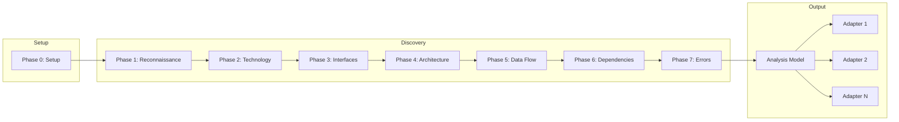

# Codebase Analysis Workflows

Procedures for comprehensive codebase analysis. Populates the analysis model for output adapters.

---

## Analysis Workflow Overview



---

## Phase 0: Setup

**Goal**: Select output adapters and establish preferences.

### 0.1 Select Output Adapters

```
What outputs do you need from this analysis?

☐ Architecture documentation (architecture-docs)
☐ Coding context for AI (coding-context)
☐ Product specification (product-spec)
☐ C4 model / Structurizr (structurizr)
☐ ArchiMate model (archimate)

Select one or more. Default: Architecture documentation
```

### 0.2 Diagram Format Preference

```
What diagram format do you prefer?

1. **Mermaid** (Recommended) - GitHub, GitLab, most markdown viewers
2. **ASCII** - Universal, no rendering needed
3. **PlantUML** - Feature-rich, requires renderer
4. **Excalidraw** - Hand-drawn style, VS Code extension, collaborative
```

Store preference in `meta.preferences.diagram_format`.

> **Note**: Excalidraw outputs `.excalidraw` JSON files that can be edited in VS Code with the Excalidraw extension or exported to PNG/SVG for embedding.

### 0.3 Initialize Analysis Model

Create empty analysis model structure:

```yaml
analysis_model:
  meta:
    project_name: ""
    analysis_date: "{today}"
    preferences:
      diagram_format: "mermaid"
      output_adapters: []
```

**Output**: Preferences captured, model initialized

---

## Phase 1: Reconnaissance

**Goal**: High-level understanding and documentation inventory.
**Model Section**: `reconnaissance`, `meta`

### 1.1 Project Identification

Capture project metadata:
- Project name (from package.json, README, directory name)
- Repository URL (from git remote)
- Current commit hash
- Description

**Populate**: `meta.project_name`, `meta.repository`, `meta.commit`, `meta.description`

### 1.2 Documentation Inventory

Find all existing documentation:

```
# Search patterns
README*.md, readme*.md
docs/, documentation/, wiki/
*.md in root
adr/, decisions/
api.yaml, openapi.yaml, swagger.*
```

**Exclude AI agent configuration**:
```
.aiagent/, .aider/, .cursor/, .continue/
AGENTS.md, CLAUDE.md, .cursorrules, .aider*
```

For each documentation file, capture:
- `location`: File path
- `type`: readme, api-doc, adr, architecture, guide
- `coverage`: high, medium, low
- `last_updated`: Git last modified date

**Populate**: `reconnaissance.documentation[]`

### 1.3 Project Structure

Identify:
- Entry points (main files, index files)
- Source directories (src/, lib/, app/)
- Test locations (tests/, __tests__/, spec/)
- Configuration files

**Populate**: `architecture.structure`

---

## Phase 2: Technology Stack

**Goal**: Complete technology inventory.
**Model Section**: `technologies`

### 2.1 Languages

For each language found:

1. Identify from file extensions and config files
2. Extract version from:
   - `tsconfig.json`, `package.json` (engines)
   - `pyproject.toml`, `setup.py`
   - `go.mod`, `Cargo.toml`, etc.
3. Mark primary language (most code)

**Populate**: `technologies.languages[]`

### 2.2 Frameworks

Scan package manifests for frameworks:

| Category | Examples |
|----------|----------|
| Web | Express, FastAPI, Gin, Rails |
| Frontend | React, Vue, Angular, Svelte |
| Testing | Jest, pytest, Go testing |
| ORM | Prisma, SQLAlchemy, GORM |

For each framework:
- `name`, `version`
- `purpose`: web, frontend, testing, database, etc.
- `evidence`: Files where detected

**Populate**: `technologies.frameworks[]`

### 2.3 Libraries

Categorize dependencies:

| Category | Examples |
|----------|----------|
| Utility | lodash, ramda |
| HTTP | axios, requests |
| Auth | passport, PyJWT |
| Validation | zod, pydantic |
| Logging | winston, structlog |

**Populate**: `technologies.libraries[]`

### 2.4 Infrastructure

Identify from:
- Docker files, docker-compose.yml
- Infrastructure as code (Terraform, CloudFormation)
- Configuration files (database URLs, cache configs)
- Environment variable references

| Type | Examples |
|------|----------|
| Database | PostgreSQL, MongoDB, MySQL |
| Cache | Redis, Memcached |
| Queue | RabbitMQ, Kafka, SQS |
| Storage | S3, GCS, local filesystem |

**Populate**: `technologies.infrastructure[]`

### 2.5 Build Tools

Document:
- Package manager (npm, yarn, pip, go mod)
- Build scripts (build, test, deploy commands)
- CI/CD configuration

**Populate**: `technologies.build_tools[]`

---

## Phase 3: Interface Discovery

**Goal**: Map all system boundaries.
**Model Section**: `interfaces`

### 3.1 API Endpoints

Search for route definitions:

```javascript
// Express patterns
app.get('/path', handler)
router.post('/path', handler)

// Decorators
@Get('/path')
@app.route('/path')
```

For each endpoint:
- `path`, `method`
- `handler`: File:line reference
- `auth`: none, jwt, session, api_key
- `request_schema`, `response_schema` (if discoverable)

**Populate**: `interfaces.apis[]`

### 3.2 Events/Messages

Find async communication:

```javascript
// Publishers
eventBus.emit('event.name', payload)
queue.publish('queue-name', message)

// Consumers
@Subscribe('event.name')
queue.consume('queue-name', handler)
```

For each event:
- `name`, `type` (published/consumed/both)
- `schema` (if available)
- `publishers[]`, `consumers[]`

**Populate**: `interfaces.events[]`

### 3.3 External Integrations

Find third-party service calls:

```javascript
// HTTP clients
axios.get('https://api.stripe.com/...')
requests.post('https://api.sendgrid.com/...')

// SDKs
new Stripe(apiKey)
twilio.messages.create(...)
```

For each integration:
- `name`: Service name
- `direction`: inbound, outbound, bidirectional
- `type`: rest, graphql, sdk
- `auth`: How authenticated

**Populate**: `interfaces.integrations[]`

### 3.4 CLI Interfaces

Find command-line entry points:
- Main CLI files
- Subcommands
- Arguments and options

**Populate**: `interfaces.cli[]`

---

## Phase 4: Architecture Synthesis

**Goal**: Understand component structure and patterns.
**Model Section**: `architecture`

### 4.1 Component Identification

Identify logical components:

| Type | Indicators |
|------|------------|
| Service | Service classes, handlers |
| Module | Directory with index, __init__.py |
| Handler | Route handlers, controllers |
| Repository | Data access classes |
| Utility | Helper functions, utils |

For each component:
- `name`, `type`
- `location`: Directory or file
- `responsibilities[]`: What it does
- `dependencies[]`: Other components it uses
- `interfaces[]`: APIs/events it exposes

**Populate**: `architecture.components[]`

### 4.2 Layer Analysis

Identify architectural layers:

| Layer | Typical Names |
|-------|---------------|
| Presentation | routes, controllers, handlers |
| Application | services, use-cases |
| Domain | models, entities, domain |
| Data | repositories, db, data |
| Infrastructure | infra, external, integrations |

For each layer:
- `name`
- `components[]`: Components in this layer
- `boundaries`: How layer isolation is enforced

**Populate**: `architecture.layers[]`

### 4.3 Pattern Recognition

Identify common patterns:

| Pattern | Indicators |
|---------|------------|
| MVC | Controllers, Models, Views |
| Repository | Repository classes with CRUD |
| Factory | create*, factory functions |
| Dependency Injection | Container, inject decorators |
| Event Sourcing | Event stores, apply methods |

For each pattern:
- `name`
- `where_used[]`: Locations
- `evidence[]`: File references

**Populate**: `architecture.patterns[]`

---

## Phase 5: Data Flow

**Goal**: Trace data through the system.
**Model Section**: `data`

### 5.1 Entity Discovery

Find data models:

```
# ORM models
class User(Model):
@Entity()
type User struct {}

# Schemas
UserSchema = z.object({...})
```

For each entity:
- `name`
- `location`: Model file
- `fields[]`: Name, type, constraints
- `relationships[]`: Foreign keys, associations
- `storage`: Table/collection name

**Populate**: `data.entities[]`

### 5.2 Data Flow Tracing

For key data paths, trace:

1. **Entry**: Where data enters (API, event, file)
2. **Validation**: How validated
3. **Transformation**: How modified
4. **Storage**: Where persisted
5. **Output**: Where returned/emitted

**Populate**: `data.flows[]`

### 5.3 Data Lifecycle

For important entities, document:

- `create`: How/where created
- `read`: Query patterns
- `update`: Modification paths
- `delete`: Deletion approach (soft/hard)
- `retention`: Time kept

**Populate**: `data.lifecycle[]`

---

## Phase 6: Dependency Health

**Goal**: Assess package health and security.
**Model Section**: `dependencies`

### 6.1 Package Inventory

List all dependencies from manifests:
- package.json (npm/yarn)
- requirements.txt, pyproject.toml (pip)
- go.mod (Go)
- Cargo.toml (Rust)

### 6.2 Version Analysis

For each package:
- `current_version`: Installed version
- `latest_version`: Latest available
- `update_type`: major, minor, patch, up-to-date

### 6.3 Vulnerability Check

Check for known vulnerabilities:
- CVE references
- Security advisories
- Severity ratings

**Populate**: `dependencies.packages[].vulnerabilities[]`

### 6.4 Maintenance Status

Assess health:
- `last_publish`: When last updated
- `deprecated`: Official deprecation
- License type and restrictions

### 6.5 Health Summary

Aggregate:
- Total packages
- Outdated count
- Vulnerable count
- Deprecated count
- Unmaintained count (2+ years stale)

**Populate**: `dependencies.health_summary`

---

## Phase 7: Error Handling

**Goal**: Understand error patterns and gaps.
**Model Section**: `error_handling`

### 7.1 Error Handling Patterns

Find error handling code:

```javascript
// Try-catch
try { ... } catch (e) { ... }

// Error middleware
app.use((err, req, res, next) => ...)

// Error boundaries
class ErrorBoundary extends Component
```

For each pattern:
- `type`: try-catch, middleware, boundary, etc.
- `location`: File reference
- `coverage`: What it handles

**Populate**: `error_handling.patterns[]`

### 7.2 Error Propagation

Trace how errors flow:
- Where they originate
- How they're caught/wrapped
- What reaches clients

**Populate**: `error_handling.propagation[]`

### 7.3 Gaps Identification

Find unhandled scenarios:
- Async operations without catch
- Missing error responses
- Silent failures

For each gap:
- `location`
- `risk`: high, medium, low
- `description`
- `recommendation`

**Populate**: `error_handling.gaps[]`

### 7.4 Logging Assessment

Document logging setup:
- `framework`: Winston, Bunyan, etc.
- `levels[]`: Which levels used
- `destinations[]`: Console, file, service

**Populate**: `error_handling.logging`

---

## Finalization

### Quality Assessment

After all phases, assess:

- `documentation_coverage`: Based on reconnaissance
- `test_coverage`: Presence/quality of tests
- `type_safety`: Static typing usage
- `code_organization`: Structure quality

**Populate**: `quality`

### Recommendations

Compile prioritized recommendations:

1. **Immediate** (critical/high): Security, stability issues
2. **Improvements** (medium/low): Architecture, maintainability

**Populate**: `recommendations`

### Model Validation

Before passing to adapters:

- [ ] `meta.project_name` populated
- [ ] `meta.analysis_date` set
- [ ] At least one phase completed
- [ ] Evidence references are valid file paths

---

## Verification Pattern

Throughout analysis, follow:

```
DISCOVER → CAPTURE → EVIDENCE → VERIFY
```

1. **Discover**: Find information in code
2. **Capture**: Add to analysis model
3. **Evidence**: Include file:line reference
4. **Verify**: Cross-check with documentation

This ensures traceability and accuracy.

---

## Partial Analysis

For targeted analysis, run specific phases:

| Request | Phases |
|---------|--------|
| "Check tech stack" | Phase 2 only |
| "Map APIs" | Phase 3 only |
| "Dependency health" | Phase 6 only |

Adapters handle partial models gracefully.
