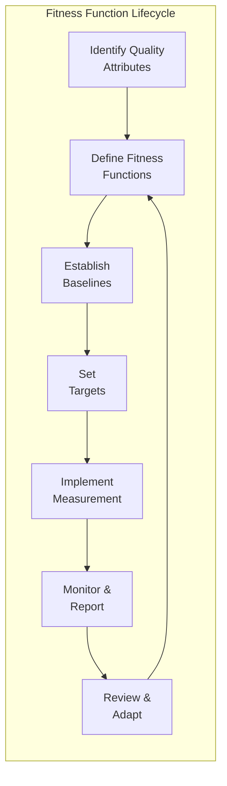

# Fitness Functions Workflows

Step-by-step procedures for defining, implementing, and using fitness functions.

---

## Workflow Overview



| Step | Activity | Key Output |
|------|----------|------------|
| 1 | Identify Quality Attributes | Prioritized attribute list |
| 2 | Define Fitness Functions | Fitness function specifications |
| 3 | Establish Baselines | Current state measurements |
| 4 | Set Targets | Target values with rationale |
| 5 | Implement Measurement | Automated measurement pipeline |
| 6 | Monitor & Report | Dashboards, alerts, reports |
| 7 | Review & Adapt | Updated functions and targets |

---

## Step 1: Identify Quality Attributes

### Purpose
Determine which architectural characteristics matter most for the system.

### Activities

#### 1.1 Stakeholder Analysis

**Actions:**
1. Identify key stakeholders (business, technical, operations)
2. Gather quality requirements from each
3. Document explicitly stated requirements
4. Infer implicit requirements from context
5. Consolidate and deduplicate

**Questions to Ask:**
| Stakeholder | Key Questions |
|-------------|---------------|
| Business | What happens if system is slow? Down? Breached? |
| Development | What makes code hard to change? What causes bugs? |
| Operations | What causes incidents? What's hard to monitor? |
| Security | What's the threat model? Compliance requirements? |

#### 1.2 Context Analysis

**Actions:**
1. Review system criticality (revenue impact, user impact)
2. Identify growth expectations
3. Assess regulatory environment
4. Understand competitive pressures
5. Document system lifecycle stage

**Context Factors:**
| Factor | Impact on Attributes |
|--------|---------------------|
| High traffic growth | Prioritize scalability |
| Sensitive data | Prioritize security |
| Frequent changes | Prioritize maintainability |
| Real-time requirements | Prioritize performance |
| Regulated industry | Prioritize compliance, auditability |

#### 1.3 Attribute Prioritization

**Actions:**
1. List candidate quality attributes
2. Score each by business impact (1-5)
3. Score each by technical risk (1-5)
4. Calculate priority = impact × risk
5. Select top 5-7 attributes

**Prioritization Matrix:**
```
                    Business Impact
                    Low         High
Technical   High    [ Monitor ] [ Critical ]
Risk        Low     [ Ignore  ] [ Important ]
```

### Output
- Prioritized list of 5-7 quality attributes
- Rationale for each priority
- Stakeholder sign-off

---

## Step 2: Define Fitness Functions

### Purpose
Create specific, measurable fitness functions for each priority attribute.

### Activities

#### 2.1 Function Specification

**For each quality attribute:**

1. Name the fitness function clearly
2. Define what it measures
3. Specify the measurement method
4. Determine trigger (when to measure)
5. Set initial target (will refine after baseline)

**Specification Format:**
```yaml
name: Response Time P95
attribute: Performance
description: 95th percentile response time for API requests
measurement:
  method: APM instrumentation
  tool: Datadog / New Relic / Custom
  data_source: Request traces
trigger:
  type: continuous
  frequency: Every request
target:
  value: < 200ms
  rationale: User experience research threshold
owner: Platform Team
```

#### 2.2 Function Classification

**Actions:**
1. Classify by scope (atomic/holistic/composite)
2. Classify by trigger (continuous/triggered/temporal)
3. Classify by automation level
4. Identify dependencies between functions
5. Group related functions

**Classification Table:**
| Function | Scope | Trigger | Automation | Dependencies |
|----------|-------|---------|------------|--------------|
| Response Time P95 | Atomic | Continuous | Automated | None |
| Security Score | Composite | Temporal | Semi-automated | Vuln scan, patch status |
| Architecture Health | Holistic | Temporal | Manual | Multiple metrics |

#### 2.3 Composite Function Design

**For composite functions:**

1. Identify component functions
2. Assign weights based on importance
3. Define aggregation method
4. Handle missing components gracefully
5. Document calculation formula

**Example:**
```
Security Score = (
    0.4 × Vulnerability Score +
    0.3 × Patch Currency Score +
    0.2 × Auth Health Score +
    0.1 × Dependency Age Score
)
```

### Output
- Fitness function specifications (one per function)
- Classification matrix
- Composite function formulas

---

## Step 3: Establish Baselines

### Purpose
Measure current state before setting targets.

### Activities

#### 3.1 Baseline Collection

**Actions:**
1. Implement measurement for each function
2. Collect data over representative period
3. Calculate statistical baselines (mean, p50, p95)
4. Document measurement conditions
5. Identify anomalies and exclude if justified

**Collection Period Guidelines:**
| Function Type | Minimum Period | Notes |
|---------------|----------------|-------|
| Performance | 1 week | Include peak and off-peak |
| Reliability | 1 month | Capture incident patterns |
| Deployment | 1 month | Capture release cycles |
| Security | Point-in-time | Snapshot is valid |

#### 3.2 Baseline Analysis

**Actions:**
1. Review baseline values
2. Compare to industry benchmarks
3. Identify obvious improvement areas
4. Note constraints and limitations
5. Document baseline context

**Analysis Questions:**
- Is baseline representative of normal operation?
- Are there seasonal or cyclical patterns?
- What external factors might affect measurements?
- How does baseline compare to peers/benchmarks?

#### 3.3 Baseline Documentation

**Document for each function:**
```yaml
function: Response Time P95
baseline:
  value: 450ms
  measured: 2024-01-15 to 2024-01-22
  conditions: Normal load, no incidents
  sample_size: 2.3M requests
  confidence: High
comparison:
  industry_benchmark: 200ms
  gap: 125% above benchmark
notes: |
  Current implementation has N+1 query issues
  Database connection pooling not optimized
```

### Output
- Baseline values for all fitness functions
- Measurement conditions documentation
- Gap analysis vs benchmarks

---

## Step 4: Set Targets

### Purpose
Define achievable, meaningful target values.

### Activities

#### 4.1 Target Setting

**Actions:**
1. Review baseline and gap analysis
2. Consider business requirements
3. Assess improvement feasibility
4. Set short-term targets (3-6 months)
5. Set long-term targets (1-2 years)

**Target Setting Principles:**
| Principle | Description |
|-----------|-------------|
| Achievable | Can be reached with reasonable effort |
| Meaningful | Materially improves user/business outcome |
| Measurable | Can be objectively verified |
| Time-bound | Has a target date |
| Incremental | Steps toward long-term goal |

#### 4.2 Target Justification

**For each target, document:**

1. Current baseline value
2. Proposed target value
3. Business benefit of achieving target
4. Technical approach to achieve
5. Risks to achieving target
6. Cost/effort estimate

**Example:**
```yaml
function: Response Time P95
current_baseline: 450ms
target: 200ms
target_date: 2024-06-30
justification: |
  Research shows user engagement drops 7% for
  each 100ms latency above 200ms.
approach:
  - Fix N+1 queries (Q1)
  - Optimize connection pooling (Q1)
  - Add caching layer (Q2)
risks:
  - Cache invalidation complexity
  - Database schema changes needed
effort: Medium (2 engineers, 1 quarter)
```

#### 4.3 Target Thresholds

**Define multiple thresholds:**

| Threshold | Purpose | Example |
|-----------|---------|---------|
| Target | Desired state | < 200ms |
| Warning | Degradation alert | > 300ms |
| Critical | Immediate action | > 500ms |

### Output
- Target values with justification
- Achievement timeline
- Threshold definitions (target/warning/critical)

---

## Step 5: Implement Measurement

### Purpose
Create automated, reliable measurement infrastructure.

### Activities

#### 5.1 Measurement Design

**Actions:**
1. Select appropriate tools per function
2. Design data collection pipeline
3. Define data storage/retention
4. Plan for measurement accuracy
5. Document measurement architecture

**Tool Selection by Category:**
| Category | Tools |
|----------|-------|
| Performance | APM (Datadog, New Relic, Dynatrace) |
| Reliability | Synthetic monitoring, error tracking |
| Security | SAST/DAST scanners, dependency checkers |
| Maintainability | SonarQube, CodeClimate, custom analysis |
| Deployment | CI/CD metrics, deployment tracking |

#### 5.2 CI/CD Integration

**Actions:**
1. Add fitness checks to CI pipeline
2. Configure gate conditions
3. Set up failure notifications
4. Create bypass procedures (with approval)
5. Document pipeline integration

**Pipeline Integration Pattern:**
```yaml
# CI Pipeline
stages:
  - build
  - test
  - fitness_check  # ← Fitness function gate
  - deploy

fitness_check:
  script:
    - run-complexity-check --max 15
    - run-coverage-check --min 80
    - run-security-scan --fail-on critical
    - run-dependency-audit --max-age 90
  allow_failure: false
```

#### 5.3 Dashboard Creation

**Actions:**
1. Create unified fitness dashboard
2. Display current vs target for each function
3. Show trend over time
4. Configure alerting rules
5. Set up regular reporting

**Dashboard Components:**
| Component | Purpose |
|-----------|---------|
| Current Value | Real-time or latest measurement |
| Target | Target value with threshold bands |
| Trend | Historical trend (30/90/365 days) |
| Status | Green/Yellow/Red indicator |
| Last Updated | Measurement freshness |

### Output
- Measurement infrastructure
- CI/CD integration
- Fitness dashboards
- Alert configuration

---

## Step 6: Monitor & Report

### Purpose
Continuously track fitness and communicate status.

### Activities

#### 6.1 Continuous Monitoring

**Actions:**
1. Monitor dashboard regularly
2. Respond to alerts promptly
3. Investigate degradation trends
4. Track improvement progress
5. Document significant events

**Monitoring Cadence:**
| Type | Frequency | Action |
|------|-----------|--------|
| Automated alerts | Real-time | Respond per severity |
| Dashboard review | Daily | Note trends |
| Trend analysis | Weekly | Identify patterns |
| Stakeholder report | Monthly | Communicate status |

#### 6.2 Fitness Reporting

**Actions:**
1. Generate regular fitness reports
2. Highlight changes from last period
3. Explain any threshold breaches
4. Show progress toward targets
5. Recommend actions

**Report Structure:**
```markdown
# Fitness Report - [Month Year]

## Executive Summary
Overall fitness score: 78/100 (↑ 3 from last month)

## Function Status
| Function | Current | Target | Status | Trend |
|----------|---------|--------|--------|-------|
| Response P95 | 280ms | 200ms | ⚠️ | ↓ improving |
| Availability | 99.95% | 99.9% | ✅ | → stable |
| ...

## Notable Events
- [Date]: Database optimization deployed (↓ 50ms latency)
- [Date]: Security vulnerability patched (CVE-2024-xxx)

## Recommendations
1. Continue performance optimization
2. Address increasing error rate trend
```

#### 6.3 Degradation Response

**When fitness degrades:**

1. Identify affected function(s)
2. Determine if change-related or organic
3. Assess business impact
4. Create remediation plan
5. Track to resolution

**Response Flow:**
```
Alert → Triage → Investigate → Remediate → Verify → Document
```

### Output
- Regular fitness reports
- Alert response records
- Remediation tracking

---

## Step 7: Review & Adapt

### Purpose
Evolve fitness functions as the system and context change.

### Activities

#### 7.1 Periodic Review

**Actions:**
1. Schedule quarterly fitness review
2. Assess function relevance
3. Review target appropriateness
4. Identify missing coverage
5. Retire obsolete functions

**Review Questions:**
| Question | Action if Yes |
|----------|---------------|
| Has business context changed? | Revisit priorities |
| Are targets consistently met? | Consider raising targets |
| Are targets never approached? | Reassess feasibility |
| Are there unmeasured risks? | Add new functions |
| Is a function rarely useful? | Consider retiring |

#### 7.2 Target Adjustment

**Actions:**
1. Review consistently met targets
2. Identify stretch opportunities
3. Review consistently missed targets
4. Adjust based on learnings
5. Document changes with rationale

**Adjustment Guidelines:**
| Situation | Adjustment |
|-----------|------------|
| Target met for 3+ months | Raise target 10-20% |
| Target missed consistently | Investigate root cause |
| External benchmark improved | Align to new benchmark |
| Business priority changed | Reprioritize functions |

#### 7.3 Function Evolution

**Actions:**
1. Add functions for new concerns
2. Split overly complex functions
3. Combine redundant functions
4. Improve measurement accuracy
5. Update automation

### Output
- Updated fitness function specifications
- Adjusted targets
- Review documentation

---

## Supporting Workflows

### Fitness-Guided Change Workflow

**Purpose:** Use fitness functions to evaluate proposed changes.

```
1. Propose Change
   - Document proposed modification
   - Identify potentially affected fitness functions

2. Predict Impact
   - Estimate fitness impact (improve/neutral/degrade)
   - For degradation, assess acceptability

3. Implement with Monitoring
   - Deploy change (canary/staged if risky)
   - Monitor affected fitness functions closely

4. Evaluate Results
   - Compare actual vs predicted impact
   - Roll back if unacceptable degradation

5. Document Learning
   - Record actual fitness impact
   - Update prediction models
```

### Migration Fitness Workflow

**Purpose:** Guide migrations using fitness functions.

```
1. Baseline Source System
   - Measure all relevant fitness functions
   - Document baseline conditions

2. Define Target Fitness
   - Set fitness targets for migrated state
   - Identify fitness functions that must not degrade
   - Identify functions expected to improve

3. Create Migration Phases
   - Sequence migration for fitness preservation
   - Plan fitness validation at each phase
   - Define rollback criteria

4. Execute with Fitness Gates
   - Validate fitness after each phase
   - Proceed only if fitness maintained
   - Address degradation before continuing

5. Verify Final State
   - Confirm all target fitness achieved
   - Document improvements realized
   - Baseline for ongoing monitoring
```

### Emergency Fitness Degradation Workflow

**Purpose:** Rapid response to critical fitness breaches.

```
1. Alert Received (Critical threshold breached)

2. Immediate Assessment (< 15 minutes)
   - Confirm measurement accuracy
   - Assess business impact
   - Identify recent changes

3. Triage Decision
   - Rollback recent change? → Execute rollback
   - Apply known fix? → Execute fix
   - Needs investigation? → Continue analysis

4. Mitigation (< 1 hour for critical)
   - Implement temporary mitigation
   - Communicate status to stakeholders
   - Monitor for improvement

5. Root Cause Analysis (< 24 hours)
   - Identify underlying cause
   - Plan permanent fix
   - Update fitness monitoring if needed

6. Post-Incident Review
   - Document incident timeline
   - Identify prevention measures
   - Update runbooks
```

---

## Workflow Governance

### Review Cadence

| Activity | Frequency | Participants |
|----------|-----------|--------------|
| Dashboard check | Daily | On-call engineer |
| Trend review | Weekly | Tech lead |
| Fitness report | Monthly | Architecture team |
| Full review | Quarterly | All stakeholders |

### Escalation Path

| Severity | Response Time | Escalation |
|----------|---------------|------------|
| Critical | 15 minutes | On-call → Team lead → Engineering manager |
| Warning | 4 hours | Team lead → Architecture review |
| Trend degradation | 1 week | Architecture team review |

### Success Metrics

| Metric | Target |
|--------|--------|
| Fitness functions defined | 100% of priority attributes |
| Measurement automation | > 80% automated |
| Alert response time | Within SLA |
| Target achievement rate | > 70% on track |
