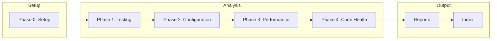

# Nonfunctional Analysis Workflows

Step-by-step procedures for assessing code quality, testing, configuration, and performance.

---

## Workflow Overview



---

## Phase 0: Setup

**Goal**: Establish analysis parameters and output location.

### 0.1 Output Directory

```
Where should I create the nonfunctional analysis reports?
Default: ./docs
```

Creates `nonfunctional-analysis/` inside specified directory.

### 0.2 Assessment Thresholds

```
What standards should I apply?

1. Strict - Flag more issues, higher standards
2. Standard - Balanced assessment (default)
3. Lenient - Critical issues only
```

### 0.3 Scope Selection

```
Which analyses should I run?

☑ Testing Coverage (Phase 1)
☑ Configuration Audit (Phase 2)
☑ Performance Hotspots (Phase 3)
☑ Code Health (Phase 4)
```

Default: All phases

---

## Phase 1: Testing Coverage Analysis

**Goal**: Inventory tests and identify coverage gaps.

### 1.1 Test Discovery

Find all test files:

```
# Common test patterns
**/*.test.{js,ts,jsx,tsx}
**/*.spec.{js,ts,jsx,tsx}
**/__tests__/**/*
**/test/**/*
**/tests/**/*
**/spec/**/*

# Python
**/test_*.py
**/*_test.py
**/tests.py

# Other languages
**/*Test.java
**/*_test.go
**/*_test.rb
```

For each test file, record:
- `path`: File location
- `type`: unit, integration, e2e, other
- `framework`: jest, pytest, go test, etc.
- `test_count`: Number of test cases

### 1.2 Test Classification

Classify tests by type:

| Type | Indicators |
|------|------------|
| **Unit** | Mocks dependencies, fast, isolated |
| **Integration** | Real dependencies, database, APIs |
| **E2E** | Browser automation, full stack |
| **Snapshot** | `.snap` files, toMatchSnapshot |
| **Performance** | Benchmarks, load tests |

### 1.3 Coverage Analysis

#### Code Coverage (if available)

Check for coverage reports:
```
coverage/
.nyc_output/
htmlcov/
```

Extract:
- Line coverage percentage
- Branch coverage percentage
- Function coverage percentage
- Uncovered files list

#### Logical Coverage (always)

For each critical path, check if tests exist:

```yaml
critical_paths:
  - path: "/api/users"
    has_tests: true
    test_files: ["routes/users.test.ts"]

  - path: "/api/payments"
    has_tests: false
    risk: high
    recommendation: "Add payment flow tests"
```

### 1.4 Test Quality Assessment

Look for quality indicators:

| Indicator | Good | Warning |
|-----------|------|---------|
| Assertions per test | 1-5 | 0 or >10 |
| Test isolation | Mocked deps | Shared state |
| Naming | Descriptive | `test1`, `it works` |
| Setup/teardown | Consistent | Missing cleanup |

Identify flaky test indicators:
- `retry`, `flaky` annotations
- Timing-dependent assertions
- Network-dependent without mocks
- Random data without seeds

### 1.5 Test Infrastructure

Document testing setup:

```yaml
test_infrastructure:
  framework: "jest"
  version: "29.0"
  config_file: "jest.config.js"
  ci_integration: true
  ci_file: ".github/workflows/test.yml"
  parallel_execution: true
  coverage_reporting: true
```

---

## Phase 2: Configuration Audit

**Goal**: Assess configuration management and identify risks.

### 2.1 Configuration Discovery

Find all configuration:

```
# Config files
config/
*.config.js
*.config.ts
*.json (package.json, tsconfig.json, etc.)
*.yaml, *.yml
*.toml
*.ini

# Environment files
.env*
*.env

# Framework-specific
next.config.js
webpack.config.js
vite.config.ts
```

### 2.2 Environment Variable Audit

#### Find All References

Search for environment variable usage:

```javascript
process.env.VARIABLE
import.meta.env.VARIABLE
os.environ['VARIABLE']
os.getenv('VARIABLE')
ENV['VARIABLE']
```

Build inventory:

```yaml
environment_variables:
  - name: "DATABASE_URL"
    used_in: ["src/db/connection.ts:5"]
    has_default: false
    in_example: true
    sensitive: true

  - name: "LOG_LEVEL"
    used_in: ["src/logger.ts:12"]
    has_default: true
    default_value: "info"
    in_example: true
    sensitive: false
```

#### Check Example File

Compare `.env.example` with actual usage:
- Missing variables
- Extra unused variables
- Proper documentation

### 2.3 Secrets Analysis

**WARNING**: Never log or output actual secret values.

Identify potential secrets:

```yaml
secret_indicators:
  - pattern: "API_KEY", "SECRET", "PASSWORD", "TOKEN"
  - pattern: "PRIVATE_KEY", "CREDENTIAL"
  - base64 encoded strings
  - Long alphanumeric strings
```

Check handling:

| Check | Pass | Fail |
|-------|------|------|
| Not in version control | `.env` in `.gitignore` | Secrets committed |
| External management | Vault, AWS Secrets | Hardcoded |
| Rotation support | Config reload | Restart required |

### 2.4 Configuration Validation

Check for validation at startup:

```javascript
// Good: Schema validation
const config = configSchema.parse(process.env);

// Bad: No validation
const dbUrl = process.env.DATABASE_URL;
```

Document:
- Schema definitions (zod, joi, etc.)
- Startup validation
- Default handling
- Required vs optional

### 2.5 Environment Parity

Compare configurations across environments:

```yaml
environment_comparison:
  development:
    - DATABASE_URL: "localhost"
    - LOG_LEVEL: "debug"

  production:
    - DATABASE_URL: "[external]"
    - LOG_LEVEL: "warn"

  drift_risks:
    - "FEATURE_FLAG_X exists in prod but not dev"
    - "Different cache TTL values"
```

---

## Phase 3: Performance Hotspots

**Goal**: Identify code patterns that may cause performance issues.

### 3.1 Complexity Analysis

Calculate complexity metrics:

```yaml
complexity_metrics:
  functions:
    - name: "processOrder"
      file: "src/services/order.ts:45"
      cyclomatic: 15
      cognitive: 23
      lines: 87
      params: 6
      nesting: 5
      rating: "high"
```

Thresholds:

| Metric | Good | Warning | Critical |
|--------|------|---------|----------|
| Cyclomatic | < 10 | 10-20 | > 20 |
| Cognitive | < 15 | 15-30 | > 30 |
| Lines | < 30 | 30-60 | > 60 |
| Params | < 4 | 4-6 | > 6 |
| Nesting | < 3 | 3-5 | > 5 |

### 3.2 Async Pattern Analysis

Find async anti-patterns:

#### Sequential Awaits (could be parallel)

```javascript
// Bad
const user = await getUser(id);
const orders = await getOrders(id);
const profile = await getProfile(id);

// Good
const [user, orders, profile] = await Promise.all([
  getUser(id),
  getOrders(id),
  getProfile(id)
]);
```

#### Missing Await

```javascript
// Bad: Promise not awaited
async function save() {
  db.save(data); // Missing await
}
```

#### Async in Loops

```javascript
// Bad: Sequential
for (const id of ids) {
  await process(id);
}

// Better: Parallel with limit
await Promise.all(ids.map(id => process(id)));
```

### 3.3 Database Query Analysis

Find query patterns:

#### N+1 Queries

```javascript
// Bad: N+1
const users = await User.findAll();
for (const user of users) {
  const orders = await user.getOrders(); // N queries
}

// Good: Eager loading
const users = await User.findAll({
  include: [Order]
});
```

#### Missing Pagination

```javascript
// Bad: Unbounded
const all = await Model.findAll();

// Good: Paginated
const page = await Model.findAll({ limit: 100, offset });
```

#### Missing Indexes (from query patterns)

```yaml
potential_missing_indexes:
  - table: "orders"
    column: "user_id"
    evidence: "Frequent WHERE user_id = ?"

  - table: "products"
    columns: ["category_id", "status"]
    evidence: "Common filter combination"
```

### 3.4 Resource Management

Check resource handling:

#### Connection Pools

```yaml
connection_pools:
  database:
    configured: true
    max_connections: 20
    file: "src/db/pool.ts"

  redis:
    configured: false
    risk: "Connection per request"
```

#### Memory Patterns

```yaml
memory_concerns:
  - pattern: "Large array accumulation in loop"
    file: "src/export.ts:34"
    risk: "Memory growth"

  - pattern: "Event listener without cleanup"
    file: "src/socket.ts:78"
    risk: "Memory leak"
```

### 3.5 Caching Assessment

Document caching usage:

```yaml
caching:
  mechanisms:
    - type: "in-memory"
      implementation: "node-cache"
      ttl: "5m"

    - type: "redis"
      purpose: "session, api responses"

  opportunities:
    - endpoint: "/api/products"
      frequency: "high"
      cacheable: true
      currently_cached: false
```

---

## Phase 4: Code Health Analysis

**Goal**: Assess maintainability and identify technical debt.

### 4.1 Duplication Detection

Find duplicate code:

```yaml
duplicates:
  - instances: 3
    lines: 25
    locations:
      - "src/controllers/user.ts:45-70"
      - "src/controllers/order.ts:32-57"
      - "src/controllers/product.ts:28-53"
    recommendation: "Extract to shared utility"

  - instances: 5
    lines: 8
    pattern: "Error handling block"
    recommendation: "Create error handler middleware"
```

Metrics:
- Total duplicate lines
- Duplicate percentage
- Largest duplicate blocks

### 4.2 Dead Code Detection

Find unused code:

#### Unused Exports

```yaml
unused_exports:
  - export: "formatCurrency"
    file: "src/utils/format.ts"
    confidence: "high"

  - export: "legacyAuth"
    file: "src/auth/legacy.ts"
    confidence: "medium"
    note: "May be used dynamically"
```

#### Unreachable Code

```yaml
unreachable_code:
  - file: "src/api/handler.ts:89"
    reason: "After unconditional return"

  - file: "src/utils/helper.ts:45"
    reason: "Condition always false"
```

#### Unused Dependencies

```yaml
unused_dependencies:
  - package: "moment"
    evidence: "No imports found"

  - package: "lodash"
    evidence: "Only lodash.debounce used"
    suggestion: "Replace with lodash.debounce"
```

### 4.3 Technical Debt Markers

Find explicit debt markers:

```yaml
debt_markers:
  todos:
    count: 23
    high_priority:
      - text: "TODO: Security review needed"
        file: "src/auth/token.ts:34"
        age: "6 months"

  fixmes:
    count: 8
    critical:
      - text: "FIXME: Race condition possible"
        file: "src/cache/invalidate.ts:56"

  hacks:
    count: 3
    items:
      - text: "HACK: Workaround for library bug"
        file: "src/pdf/generate.ts:78"

  deprecations:
    count: 5
    items:
      - function: "oldAuthenticate"
        file: "src/auth/index.ts"
        replacement: "authenticate"
```

### 4.4 Consistency Analysis

Check naming and structure consistency:

```yaml
consistency:
  naming:
    files:
      dominant: "kebab-case"
      violations: ["userService.ts", "OrderHandler.ts"]

    functions:
      dominant: "camelCase"
      violations: ["get_user", "Process_Order"]

    classes:
      dominant: "PascalCase"
      consistent: true

  structure:
    consistent_patterns:
      - "Controllers in /controllers"
      - "Services in /services"

    inconsistencies:
      - "Some routes in /api, others in /routes"
      - "Mixed util locations"
```

### 4.5 Maintainability Score

Calculate overall health:

```yaml
maintainability:
  scores:
    test_coverage: 65
    duplication: 85
    complexity: 70
    consistency: 80
    documentation: 45

  overall: 69
  rating: "Fair"

  top_recommendations:
    1: "Increase test coverage for critical paths"
    2: "Reduce duplication in controllers"
    3: "Add JSDoc to public APIs"
```

---

## Finalization

### Generate Reports

For each phase, generate:
1. Findings with evidence
2. Metrics and scores
3. Recommendations prioritized by impact

### Create Index

Compile executive summary:
- Overall health score
- Critical findings count
- Top 5 recommendations
- Links to detailed reports

### Recommendations Priority

| Priority | Criteria |
|----------|----------|
| Critical | Security risk, data loss potential |
| High | Reliability impact, frequent issues |
| Medium | Maintainability, developer experience |
| Low | Nice-to-have, minor improvements |

---

## Partial Analysis

For targeted analysis, run specific phases:

| Request | Phases |
|---------|--------|
| "Check test coverage" | Phase 1 only |
| "Audit config" | Phase 2 only |
| "Find performance issues" | Phase 3 only |
| "Assess code health" | Phase 4 only |
