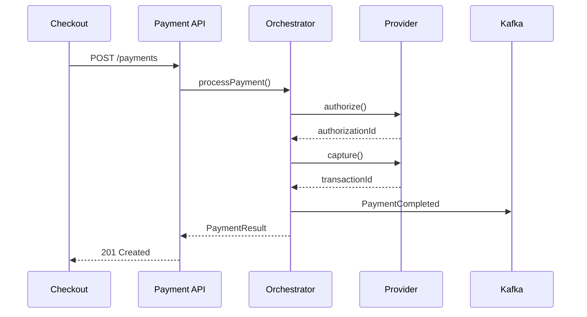

# Presentation Examples

Concrete demonstrations of architecture presentations using Marp.

---

## Example 1: API Gateway Architecture Decision

A complete ADR presentation recommending an API Gateway solution.

### Full Presentation

```markdown
---
marp: true
theme: default
paginate: true
header: "TechCorp - Architecture Decision"
footer: "ADR-042: API Gateway Selection | January 2026"
---

<!-- _class: lead -->
<!-- _paginate: false -->

# ADR-042
## API Gateway Selection

Architecture Decision Record
January 15, 2026

---

# Context

**Current State:**
- 12 microservices with direct client access
- Each service handles its own authentication
- Inconsistent rate limiting and monitoring

**Trigger:**
- Security audit identified inconsistent auth patterns
- Need for centralized API management
- Mobile app launch requires unified API surface

---

# Problem Statement

We need a centralized API gateway to provide:

1. **Unified authentication** - Single point for token validation
2. **Rate limiting** - Protect services from abuse
3. **Request routing** - Direct traffic to appropriate services
4. **Observability** - Centralized logging and metrics
5. **API versioning** - Manage breaking changes

---

# Options Considered

| Option | Type | Description |
|--------|------|-------------|
| **Kong** | Open Source | Lua-based, plugin ecosystem |
| **AWS API Gateway** | Managed | Native AWS integration |
| **Envoy + Custom** | Open Source | Service mesh capable |
| **NGINX Plus** | Commercial | High performance, familiar |

---

# Option A: Kong Gateway

**Description:** Open-source gateway with enterprise features


**Pros:**
- Rich plugin ecosystem (100+)
- Kubernetes-native (Kong Ingress)
- Active community

**Cons:**
- Lua plugins learning curve
- DB mode adds complexity

**Effort:** Medium | **Cost:** Low (OSS) to Medium (Enterprise)

---

# Option B: AWS API Gateway

**Description:** Fully managed AWS service

**Pros:**
- Zero infrastructure to manage
- Native Lambda integration
- Pay-per-request pricing

**Cons:**
- Vendor lock-in
- Limited customization
- Cold start latency concerns

**Effort:** Low | **Cost:** Variable (usage-based)

---

# Comparison Matrix

| Criteria | Weight | Kong | AWS GW | Envoy | NGINX |
|----------|--------|------|--------|-------|-------|
| Kubernetes fit | 5 | 5 | 3 | 5 | 4 |
| Plugin ecosystem | 4 | 5 | 3 | 4 | 3 |
| Operational cost | 4 | 4 | 5 | 3 | 4 |
| Team familiarity | 3 | 3 | 4 | 2 | 5 |
| Customization | 3 | 5 | 2 | 5 | 4 |
| **Weighted Total** | | **87** | **70** | **76** | **78** |

---

<!-- _class: lead -->

# Recommendation

## Kong Gateway (DB-less mode)

Deployed on Kubernetes with declarative configuration

---

# Why Kong?

**Technical Fit:**
- Best Kubernetes integration via Kong Ingress Controller
- DB-less mode aligns with GitOps workflow
- Plugin ecosystem covers all requirements

**Team Considerations:**
- 2 engineers have prior Kong experience
- Strong community documentation
- Enterprise support available if needed

**Cost Analysis:**
- OSS version meets current needs
- Enterprise upgrade path for future scale

---

# Implementation Impact

**What Changes:**
- All external traffic routes through Kong
- Auth moved from services to gateway
- Centralized rate limiting and logging

**Migration Path:**
1. Deploy Kong in parallel (Week 1-2)
2. Migrate auth service first (Week 3)
3. Onboard services incrementally (Week 4-8)
4. Decommission direct routes (Week 9)

---

# Next Steps

| Action | Owner | Due |
|--------|-------|-----|
| Approve ADR-042 | Architecture Board | Jan 20 |
| Set up Kong dev environment | Platform Team | Jan 25 |
| Create migration runbook | DevOps | Jan 31 |
| Begin pilot with Auth service | Backend Team | Feb 7 |

---

<!-- _class: lead -->

# Decision Request

**Do you approve ADR-042?**

Recommendation: Kong Gateway (DB-less mode)
Deployment: Kubernetes via Kong Ingress Controller

<!--
Pause for questions before formal vote
Have backup slides ready for deep technical questions
-->
```

---

## Example 2: Microservices Migration Vision

An architecture vision presentation for a monolith-to-microservices transformation.

### Key Slides

```markdown
---
marp: true
theme: default
paginate: true
header: "OrderFlow - Architecture Transformation"
footer: "Architecture Vision | Q1 2026"
---

<!-- _class: lead -->
<!-- _paginate: false -->

# OrderFlow Platform
## Microservices Architecture Vision

Transforming our order management system
Q1 2026

---

# Business Context

**Strategic Drivers:**
- 3x order volume growth expected in 18 months
- New B2B channel launching Q3
- Competitor pressure on delivery speed

**Current Blockers:**
- 4-week release cycles
- Cannot scale order processing independently
- Single database bottleneck

---

# Current State


**Monolithic Architecture**

- Single deployable unit
- Shared PostgreSQL database
- 180k lines of code
- 45 developers, 1 codebase

**Pain Points:**
- Full regression for any change
- Scaling = scaling everything

<!--
Walk through the diagram
Highlight the database as the bottleneck
-->

---

# Target State


**Microservices Architecture**

- Domain-aligned services
- Independent databases
- Event-driven integration
- Kubernetes deployment

**Key Services:**
- Order Service
- Inventory Service
- Fulfillment Service
- Notification Service

---

# Key Changes

| Current | Future | Benefit |
|---------|--------|---------|
| Monolithic deploy | Service-level deploy | Faster releases |
| Shared database | Database per service | Independent scaling |
| Synchronous calls | Event-driven | Loose coupling |
| Manual scaling | Auto-scaling | Cost efficiency |
| Single team | Domain teams | Ownership clarity |

---

# Migration Approach

**Strategy:** Strangler Fig Pattern

```
            ┌─────────────────────────────────────────┐
            │           API Gateway                    │
            └─────────────────────────────────────────┘
                         │
            ┌────────────┴────────────┐
            │                         │
            ▼                         ▼
     ┌──────────────┐        ┌──────────────┐
     │   New        │        │   Legacy     │
     │ Microservice │◄──────►│  Monolith    │
     └──────────────┘        └──────────────┘
```

Gradually extract services while maintaining functionality.

---

# Roadmap

| Phase | Timeline | Scope | Outcome |
|-------|----------|-------|---------|
| **1. Foundation** | Q1 2026 | Platform setup | K8s, API Gateway live |
| **2. Extract Orders** | Q2 2026 | Order service | First service deployed |
| **3. Extract Inventory** | Q3 2026 | Inventory service | Independent scaling |
| **4. Extract Fulfillment** | Q4 2026 | Fulfillment service | Full decoupling |
| **5. Optimize** | Q1 2027 | Decommission monolith | Migration complete |

---

# Risks & Mitigations

| Risk | Impact | Mitigation |
|------|--------|------------|
| Data consistency issues | High | Event sourcing, saga pattern |
| Increased complexity | Medium | Service mesh, observability |
| Team skill gaps | Medium | Training, hiring, consultants |
| Extended timeline | Medium | Phased approach, parallel tracks |

---

# Success Metrics

| Metric | Current | Target | Timeframe |
|--------|---------|--------|-----------|
| Deployment frequency | Monthly | Weekly | Q3 2026 |
| Lead time | 4 weeks | 3 days | Q4 2026 |
| Order processing latency | 2s | 500ms | Q3 2026 |
| System availability | 99.5% | 99.9% | Q1 2027 |

---

# Investment Ask

**Total Investment:** $1.2M over 18 months

| Category | Amount | Details |
|----------|--------|---------|
| Infrastructure | $400K | Kubernetes, API Gateway, observability |
| Engineering | $600K | 4 additional engineers for 12 months |
| Training | $100K | Team upskilling, certifications |
| Consulting | $100K | Architecture review, implementation support |

**ROI:** 3x through reduced operational costs and new B2B revenue

---

<!-- _class: lead -->

# Questions?

**Next Step:** Architecture Board approval
**Decision Needed By:** February 1, 2026

Contact: architecture@techcorp.com
```

---

## Example 3: Technical Deep Dive

A technical deep dive for an engineering audience.

### Key Slides

```markdown
---
marp: true
theme: default
paginate: true
header: "Payment Service - Deep Dive"
footer: "Engineering Tech Talk | February 2026"
---

<!-- _class: lead -->
<!-- _paginate: false -->

# Payment Service
## Technical Deep Dive

How we process 50M transactions/month
February 2026

---

# System Context


**Payment Service** processes all monetary transactions for the platform.

**Interfaces:**
- Checkout (REST API)
- Mobile App (REST API)
- Finance System (Events)
- 3 Payment Providers

---

# Container Architecture


<!--
- API Gateway handles auth
- Payment API is the entry point
- Processor handles orchestration
- Each provider has an adapter
- Events published to Kafka
-->

---

# Core Components


| Component | Responsibility |
|-----------|---------------|
| **PaymentController** | REST endpoints, validation |
| **PaymentOrchestrator** | Transaction coordination |
| **ProviderRouter** | Select optimal provider |
| **ProviderAdapters** | Provider-specific logic |
| **EventPublisher** | Domain event publishing |

---

# Happy Path: Payment Flow



---

# Provider Routing Logic

```typescript
class ProviderRouter {
  selectProvider(payment: Payment): Provider {
    // 1. Check currency support
    const supported = this.providers.filter(p =>
      p.supportsCurrency(payment.currency)
    );

    // 2. Check amount limits
    const withinLimits = supported.filter(p =>
      p.isWithinLimits(payment.amount)
    );

    // 3. Select by success rate
    return withinLimits.sort((a, b) =>
      b.successRate - a.successRate
    )[0];
  }
}
```

**Why?** Provider A has 2% better success rate for EU cards.

---

# Idempotency Pattern

```typescript
async processPayment(request: PaymentRequest): Promise<Payment> {
  // Check for existing payment with same idempotency key
  const existing = await this.repo.findByIdempotencyKey(
    request.idempotencyKey
  );

  if (existing) {
    return existing; // Return cached result
  }

  // Process new payment
  const payment = await this.executePayment(request);

  // Store with idempotency key
  await this.repo.saveWithIdempotencyKey(
    payment,
    request.idempotencyKey
  );

  return payment;
}
```

**Critical:** Prevents duplicate charges on retries.

---

# Error Handling Strategy

| Error Type | Handling | Example |
|------------|----------|---------|
| **Transient** | Retry with backoff | Network timeout |
| **Provider Error** | Failover to alternate | Provider 503 |
| **Business Error** | Return to client | Insufficient funds |
| **System Error** | Alert + manual review | DB connection lost |

```typescript
// Retry policy
const retryPolicy = Policy
  .handleWhen(isTransient)
  .retry(3)
  .withBackoff(100, 2); // 100ms, 200ms, 400ms
```

---

# Performance Characteristics

| Metric | P50 | P95 | P99 |
|--------|-----|-----|-----|
| Latency | 180ms | 450ms | 800ms |
| Provider call | 150ms | 400ms | 700ms |
| DB operations | 15ms | 30ms | 50ms |

**Bottleneck:** Provider latency dominates (~80% of total time).

**Optimization:** We cache provider tokens (saves 50ms on repeat customers).

---

# Observability

**Metrics (Prometheus):**
```
payment_requests_total{provider, status}
payment_latency_seconds{provider, operation}
provider_success_rate{provider}
```

**Tracing (Jaeger):**
- Distributed trace per request
- Span per provider call
- Baggage: customerId, orderId

**Logs (ELK):**
- Structured JSON
- Correlation ID in all logs

---

# Design Decisions

| Decision | Rationale | Trade-off |
|----------|-----------|-----------|
| Sync capture | Simpler flow | Higher latency |
| Provider adapters | Easy to add providers | More code |
| Event sourcing | Audit trail | Complexity |
| Idempotency keys | Retry safety | Storage cost |

---

# Open Questions

1. Should we support async capture for large orders?
2. How to handle multi-currency in single transaction?
3. Provider failover: automatic or manual?

---

<!-- _class: lead -->

# Questions?

Code: github.com/techcorp/payment-service
Docs: docs.techcorp.com/payment
Team: #payment-service
```

---

## Example 4: Migration Briefing

A stakeholder briefing for an upcoming migration.

### Key Slides

```markdown
---
marp: true
theme: default
paginate: true
header: "Database Migration - Briefing"
footer: "Auth0 → Keycloak Migration | March 2026"
---

<!-- _class: lead -->
<!-- _paginate: false -->

# Authentication Migration
## Auth0 → Keycloak

Migration Briefing for All Teams
March 2026

---

# Executive Summary

| Aspect | Details |
|--------|---------|
| **What** | Moving from Auth0 to Keycloak for authentication |
| **Why** | Cost reduction, feature requirements, vendor independence |
| **When** | March 15 - April 15, 2026 |
| **Who's Affected** | All users, all applications |
| **Impact** | Single re-login required on cutover day |

---

# Why We're Migrating

**Current State (Auth0):**
- $180K/year at current scale
- Limited customization
- Rate limiting concerns for M2M

**Future State (Keycloak):**
- $40K/year (infrastructure only)
- Full customization control
- Unlimited M2M tokens
- Self-hosted, no vendor lock-in

**Savings:** $140K/year

---

# Migration Timeline

```
March 15        March 22        April 1         April 15
    │               │               │               │
    ▼               ▼               ▼               ▼
┌────────┐     ┌────────┐     ┌────────┐     ┌────────┐
│ Keycloak │    │ Parallel │    │ Cutover │    │ Cleanup │
│ Setup    │    │ Running  │    │ Weekend │    │ Complete │
└────────┘     └────────┘     └────────┘     └────────┘
```

**Cutover:** Saturday April 1, 2026, 2:00 AM - 6:00 AM UTC

---

# What Changes

| For Users | Change |
|-----------|--------|
| Login URL | Same (handled by DNS) |
| Credentials | Same (migrated) |
| SSO | Works (same protocols) |
| MFA | Re-enrollment required |

| For Developers | Change |
|----------------|--------|
| OAuth endpoints | New URLs (env variable) |
| JWT structure | Minor claim changes |
| Admin API | New Keycloak Admin API |

---

# User Experience

**Before Cutover:**
- Normal login, no changes

**During Cutover (4 hours):**
- Login unavailable
- Active sessions continue working
- Scheduled for low-traffic window

**After Cutover:**
- Single re-login required
- MFA re-enrollment (2 minutes)
- All features available

---

# Application Changes Required

**High Priority (before cutover):**

```env
# Update environment variables
AUTH_ISSUER_URL=https://auth.company.com/realms/main
AUTH_JWKS_URL=https://auth.company.com/realms/main/protocol/openid-connect/certs
```

**Code Changes (minimal):**

```diff
- const userId = token.claims['https://company.com/user_id'];
+ const userId = token.claims['sub'];
```

**Testing:** Integration environment available March 18.

---

# Risk Mitigation

| Risk | Mitigation |
|------|------------|
| Data loss | Dual-write during parallel period |
| Extended downtime | Rollback plan tested |
| App incompatibility | Integration env for testing |
| User confusion | Communication plan active |

**Rollback Trigger:** If cutover exceeds 6 hours or critical issues found.

---

# Support Model

**During Migration Window:**
- War room: #migration-war-room
- On-call: Migration team + Platform team
- Escalation: CTO available

**Post Migration:**
- Support: #identity-platform
- Issues: JIRA IDENTITY project
- Docs: docs.company.com/auth

---

# What We Need From You

| Team | Action | Deadline |
|------|--------|----------|
| All Apps | Update env variables | March 25 |
| All Apps | Test in integration env | March 29 |
| Mobile | Ship app update | March 28 |
| Ops | Update monitoring | March 30 |

**Sign-off required** from each team by March 30.

---

# Resources

- **Migration Guide:** docs.company.com/auth-migration
- **FAQ:** docs.company.com/auth-migration/faq
- **Test Environment:** https://auth-test.company.com
- **Slack:** #auth-migration

**Questions?** migration-team@company.com

---

<!-- _class: lead -->

# Key Dates

**March 25:** Env variable deadline
**March 29:** Testing complete
**April 1:** Cutover (2-6 AM UTC)
**April 15:** Migration complete

Questions? #auth-migration
```

---

## Example 5: Quick Status Update

A brief status update presentation.

```markdown
---
marp: true
theme: default
paginate: true
header: "Platform Modernization"
footer: "Status Update | Week 8"
---

<!-- _class: lead -->
<!-- _paginate: false -->

# Platform Modernization
## Week 8 Status

February 5, 2026

---

# Status Summary

| Area | Status | Notes |
|------|--------|-------|
| Overall | 🟢 On Track | |
| Schedule | 🟢 On Track | 2 days ahead |
| Budget | 🟡 At Risk | Cloud costs +15% |
| Quality | 🟢 On Track | |

---

# Completed This Week

- ✅ Kubernetes cluster deployed to production
- ✅ CI/CD pipeline migrated (all 12 services)
- ✅ Monitoring stack operational
- ✅ First service (Auth) deployed to new platform

---

# Planned Next Week

- 📋 Migrate Order Service
- 📋 Performance baseline testing
- 📋 DR runbook documentation
- 📋 Team training session (Thursday)

---

# Key Metrics

| Metric | Target | Actual | Trend |
|--------|--------|--------|-------|
| Services migrated | 3 | 1 | ↗️ (on plan) |
| Deployment time | <10 min | 8 min | ✓ |
| Test coverage | 80% | 82% | ↗️ |
| Incidents | 0 | 0 | ✓ |

---

# Issues & Blockers

| Issue | Impact | Owner | Status |
|-------|--------|-------|--------|
| Cloud costs higher than estimated | Budget risk | Platform | Investigating |
| Slow container registry | Build times | DevOps | Fix in progress |

**Escalation:** Cloud cost variance needs finance review.

---

<!-- _class: lead -->

# Questions?

Next update: February 12, 2026
```

---

## Using These Examples

### As Templates

1. Copy the example closest to your needs
2. Replace placeholder content with your specifics
3. Update diagrams and images
4. Customize front matter (header, footer, date)

### For Learning

- Study slide structure and flow
- Note use of speaker notes
- Observe visual balance (text vs diagrams)
- See how complex topics are simplified

### Generating Examples

Ask Claude:
> "Generate a Marp presentation for [topic] using the ADR deck template"

Or:
> "Create slides for presenting our migration from [X] to [Y]"
