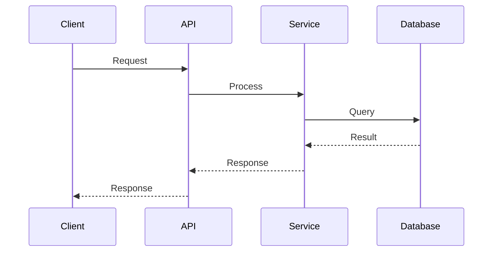

# Presentation Templates

Reusable Marp slide templates for architecture presentations.

---

## Template Index

| Template | Purpose | Slides |
|----------|---------|--------|
| [Vision Deck](#vision-deck) | Architecture vision, strategy | 12 |
| [ADR Deck](#adr-deck) | Architecture decisions | 10 |
| [Deep Dive Deck](#deep-dive-deck) | Technical details | 12 |
| [Migration Deck](#migration-deck) | Migration briefings | 11 |
| [Status Deck](#status-deck) | Progress updates | 8 |
| [Minimal Deck](#minimal-deck) | Quick presentations | 5 |

---

## Vision Deck

For presenting architecture vision, target state, and transformation strategy.

```markdown
---
marp: true
theme: default
paginate: true
header: "{Company} Architecture"
footer: "Architecture Vision | {Date}"
---

<!-- _class: lead -->
<!-- _paginate: false -->

# {System/Initiative Name}
## Architecture Vision

{Your Name}
{Date}

---

# Agenda

1. Business Context
2. Current State
3. Challenges
4. Target State
5. Key Changes
6. Benefits & Risks
7. Roadmap
8. Next Steps

---

# Business Context

**Why are we here?**

- {Business driver 1}
- {Business driver 2}
- {Business driver 3}

**Strategic Alignment:**
- {Strategic goal this supports}

<!--
Explain the business motivation
Connect to company strategy
-->

---

# Current State


**Baseline Architecture**

Key characteristics:
- {Characteristic 1}
- {Characteristic 2}
- {Characteristic 3}

<!--
Walk through the current architecture diagram
Highlight key components
-->

---

# Current Challenges

| Challenge | Impact | Evidence |
|-----------|--------|----------|
| {Challenge 1} | {Impact} | {Metric} |
| {Challenge 2} | {Impact} | {Metric} |
| {Challenge 3} | {Impact} | {Metric} |

**Bottom Line:** {Summary of why change is needed}

<!--
Use concrete metrics where possible
Connect to business impact
-->

---

# Target State


**Future Architecture**

Key improvements:
- {Improvement 1}
- {Improvement 2}
- {Improvement 3}

<!--
Walk through the target architecture diagram
Highlight differences from current state
-->

---

# Key Changes

| Current | Future | Benefit |
|---------|--------|---------|
| {Current 1} | {Future 1} | {Benefit 1} |
| {Current 2} | {Future 2} | {Benefit 2} |
| {Current 3} | {Future 3} | {Benefit 3} |

---

# Benefits

**Business Benefits:**
- {Benefit 1} → {Measurable outcome}
- {Benefit 2} → {Measurable outcome}

**Technical Benefits:**
- {Benefit 1} → {Measurable outcome}
- {Benefit 2} → {Measurable outcome}

---

# Risks & Mitigations

| Risk | Likelihood | Impact | Mitigation |
|------|------------|--------|------------|
| {Risk 1} | {H/M/L} | {H/M/L} | {Mitigation} |
| {Risk 2} | {H/M/L} | {H/M/L} | {Mitigation} |
| {Risk 3} | {H/M/L} | {H/M/L} | {Mitigation} |

---

# Roadmap

```
Q1 2026    Q2 2026    Q3 2026    Q4 2026
   │          │          │          │
   ▼          ▼          ▼          ▼
┌──────┐  ┌──────┐  ┌──────┐  ┌──────┐
│Phase │  │Phase │  │Phase │  │Phase │
│  1   │──│  2   │──│  3   │──│  4   │
└──────┘  └──────┘  └──────┘  └──────┘
Foundation  Core     Migrate   Optimize
```

---

# Next Steps

| Action | Owner | Due |
|--------|-------|-----|
| {Action 1} | {Owner} | {Date} |
| {Action 2} | {Owner} | {Date} |
| {Action 3} | {Owner} | {Date} |

**Decision Requested:**
{What you need from the audience}

---

<!-- _class: lead -->

# Questions?

{Your contact information}
```

---

## ADR Deck

For presenting architecture decisions and getting approval.

```markdown
---
marp: true
theme: default
paginate: true
header: "{Company} - Architecture Decision"
footer: "ADR-{number}: {title} | {Date}"
---

<!-- _class: lead -->
<!-- _paginate: false -->

# ADR-{number}
## {Decision Title}

Architecture Decision Record
{Date}

---

# Context

**Why is this decision needed?**

{Background and context for the decision}

**Trigger:**
- {What prompted this decision}

**Constraints:**
- {Constraint 1}
- {Constraint 2}

---

# Problem Statement

{Clear statement of the problem to solve}

**Requirements:**
1. {Requirement 1}
2. {Requirement 2}
3. {Requirement 3}

---

# Options Considered

| Option | Description |
|--------|-------------|
| **Option A** | {Brief description} |
| **Option B** | {Brief description} |
| **Option C** | {Brief description} |

---

# Option A: {Name}

**Description:** {How it works}

**Pros:**
- {Pro 1}
- {Pro 2}

**Cons:**
- {Con 1}
- {Con 2}

**Effort:** {Low/Medium/High}

---

# Option B: {Name}

**Description:** {How it works}

**Pros:**
- {Pro 1}
- {Pro 2}

**Cons:**
- {Con 1}
- {Con 2}

**Effort:** {Low/Medium/High}

---

# Comparison Matrix

| Criteria | Weight | Option A | Option B | Option C |
|----------|--------|----------|----------|----------|
| {Criteria 1} | {1-5} | {1-5} | {1-5} | {1-5} |
| {Criteria 2} | {1-5} | {1-5} | {1-5} | {1-5} |
| {Criteria 3} | {1-5} | {1-5} | {1-5} | {1-5} |
| **Weighted Score** | | **{sum}** | **{sum}** | **{sum}** |

---

# Recommendation

<!-- _class: lead -->

## Option {X}: {Name}

**Rationale:**
{Why this option was selected}

---

# Consequences

**What Changes:**
- {Change 1}
- {Change 2}

**Trade-offs Accepted:**
- {Trade-off 1}
- {Trade-off 2}

**Next Steps:**
1. {Step 1}
2. {Step 2}

---

<!-- _class: lead -->

# Decision Request

**Do you approve this decision?**

ADR-{number}: {Title}
Recommendation: Option {X}
```

---

## Deep Dive Deck

For technical deep dives with engineering audiences.

```markdown
---
marp: true
theme: default
paginate: true
header: "{System Name} - Technical Deep Dive"
footer: "{Date}"
---

<!-- _class: lead -->
<!-- _paginate: false -->

# {System/Component Name}
## Technical Deep Dive

{Your Name}
{Date}

---

# Agenda

1. System Context
2. Container Architecture
3. Key Components
4. Data Flow
5. Key Interactions
6. Code Patterns
7. Performance
8. Design Decisions

---

# System Context


**Where does this fit?**

- Interacts with {System A}
- Provides data to {System B}
- Depends on {System C}

<!--
C4 Context diagram
Explain system boundaries
-->

---

# Container Architecture


**Containers:**
- {Container 1}
- {Container 2}
- {Container 3}

<!--
C4 Container diagram
Explain each container's responsibility
-->

---

# Key Components


**Core Components:**

| Component | Responsibility |
|-----------|---------------|
| {Component 1} | {What it does} |
| {Component 2} | {What it does} |
| {Component 3} | {What it does} |

---

# Data Flow


<!--
Explain the happy path
Note any async processing
Highlight data transformations
-->

---

# Key Interaction: {Name}



---

# Code Pattern: {Name}

```{language}
// Representative code example
{code snippet}
```

**Why this pattern?**
- {Reason 1}
- {Reason 2}

---

# Performance Characteristics

| Metric | Current | Target | Notes |
|--------|---------|--------|-------|
| Response Time (P95) | {value} | {target} | {note} |
| Throughput | {value} | {target} | {note} |
| Error Rate | {value} | {target} | {note} |

**Bottlenecks:**
- {Known bottleneck 1}
- {Known bottleneck 2}

---

# Design Decisions

| Decision | Rationale | Trade-off |
|----------|-----------|-----------|
| {Decision 1} | {Why} | {What we gave up} |
| {Decision 2} | {Why} | {What we gave up} |
| {Decision 3} | {Why} | {What we gave up} |

---

# Open Questions

1. {Question 1}
2. {Question 2}
3. {Question 3}

---

<!-- _class: lead -->

# Questions?

{Contact information}
{Link to documentation}
```

---

## Migration Deck

For migration briefings and communication.

```markdown
---
marp: true
theme: default
paginate: true
header: "{Company} - Migration Briefing"
footer: "{Migration Name} | {Date}"
---

<!-- _class: lead -->
<!-- _paginate: false -->

# {Migration Name}
## Migration Briefing

{Phase/Stage}
{Date}

---

# Executive Summary

**What:** {One-line description of migration}

**Why:** {Business driver}

**When:** {Timeline summary}

**Impact:** {Who is affected}

---

# Current vs Target

| Aspect | Current | Target |
|--------|---------|--------|
| {Aspect 1} | {Current} | {Target} |
| {Aspect 2} | {Current} | {Target} |
| {Aspect 3} | {Current} | {Target} |

---

# Migration Scope

**In Scope:**
- {Item 1}
- {Item 2}
- {Item 3}

**Out of Scope:**
- {Item 1}
- {Item 2}

**Dependencies:**
- {Dependency 1}
- {Dependency 2}

---

# Migration Approach

**Strategy:** {Big bang / Phased / Strangler}

```
Phase 1          Phase 2          Phase 3
{dates}          {dates}          {dates}
    │                │                │
    ▼                ▼                ▼
┌────────┐      ┌────────┐      ┌────────┐
│{name}  │  ──► │{name}  │  ──► │{name}  │
└────────┘      └────────┘      └────────┘
```

---

# Timeline

| Milestone | Date | Status |
|-----------|------|--------|
| {Milestone 1} | {Date} | {Status} |
| {Milestone 2} | {Date} | {Status} |
| {Milestone 3} | {Date} | {Status} |
| {Milestone 4} | {Date} | {Status} |

---

# Risks & Mitigations

| Risk | Impact | Mitigation |
|------|--------|------------|
| {Risk 1} | {Impact} | {Mitigation} |
| {Risk 2} | {Impact} | {Mitigation} |
| {Risk 3} | {Impact} | {Mitigation} |

---

# Support Model

**During Migration:**
- Primary: {Team/channel}
- Escalation: {Path}
- Hours: {Coverage}

**Post Migration:**
- Support: {Team}
- Documentation: {Location}

---

# Rollback Plan

**Trigger Conditions:**
- {Condition 1}
- {Condition 2}

**Rollback Steps:**
1. {Step 1}
2. {Step 2}
3. {Step 3}

**Decision Authority:** {Who decides}

---

# What We Need From You

| Action | Who | By When |
|--------|-----|---------|
| {Action 1} | {Team} | {Date} |
| {Action 2} | {Team} | {Date} |
| {Action 3} | {Team} | {Date} |

---

<!-- _class: lead -->

# Questions?

**Contacts:**
- Migration Lead: {Name}
- Technical Lead: {Name}

**Resources:**
- {Link to documentation}
- {Link to FAQ}
```

---

## Status Deck

For progress updates and status reports.

```markdown
---
marp: true
theme: default
paginate: true
header: "{Project Name} - Status Update"
footer: "{Date}"
---

<!-- _class: lead -->
<!-- _paginate: false -->

# {Project Name}
## Status Update

{Reporting Period}

---

# Executive Summary

| Aspect | Status |
|--------|--------|
| Overall | 🟢 On Track / 🟡 At Risk / 🔴 Off Track |
| Schedule | 🟢 / 🟡 / 🔴 |
| Budget | 🟢 / 🟡 / 🔴 |
| Quality | 🟢 / 🟡 / 🔴 |
| Scope | 🟢 / 🟡 / 🔴 |

---

# Accomplishments This Period

- ✅ {Accomplishment 1}
- ✅ {Accomplishment 2}
- ✅ {Accomplishment 3}

---

# Planned Next Period

- 📋 {Planned item 1}
- 📋 {Planned item 2}
- 📋 {Planned item 3}

---

# Key Metrics

| Metric | Target | Actual | Trend |
|--------|--------|--------|-------|
| {Metric 1} | {Target} | {Actual} | ↑ / → / ↓ |
| {Metric 2} | {Target} | {Actual} | ↑ / → / ↓ |
| {Metric 3} | {Target} | {Actual} | ↑ / → / ↓ |

---

# Issues & Blockers

| Issue | Impact | Owner | Status |
|-------|--------|-------|--------|
| {Issue 1} | {Impact} | {Owner} | {Status} |
| {Issue 2} | {Impact} | {Owner} | {Status} |

**Escalations Needed:**
- {If any}

---

# Risks

| Risk | Likelihood | Impact | Mitigation |
|------|------------|--------|------------|
| {Risk 1} | H/M/L | H/M/L | {Action} |
| {Risk 2} | H/M/L | H/M/L | {Action} |

---

<!-- _class: lead -->

# Questions?
```

---

## Minimal Deck

For quick presentations or informal discussions.

```markdown
---
marp: true
theme: default
paginate: true
---

<!-- _class: lead -->

# {Title}

{Subtitle or context}
{Date}

---

# Context

{Why we're here}

---

# Current State

{What exists today}

---

# Proposal

{What you're proposing}

---

# Next Steps

| Action | Owner | Due |
|--------|-------|-----|
| {Action 1} | {Owner} | {Date} |
| {Action 2} | {Owner} | {Date} |

---

<!-- _class: lead -->

# Questions?
```

---

## Slide Patterns

### Title Slide

```markdown
<!-- _class: lead -->
<!-- _paginate: false -->

# Main Title
## Subtitle

Author Name
Date
```

### Split Slide (Image + Text)

```markdown
# Slide Title


- Point 1
- Point 2
- Point 3
```

### Full-Width Diagram

```markdown
# Diagram Title


```

### Comparison Slide

```markdown
# Comparison

| Aspect | Option A | Option B |
|--------|----------|----------|
| {Aspect} | {Value} | {Value} |
```

### Call-to-Action Slide

```markdown
<!-- _class: lead -->

# Decision Request

**Do you approve {thing}?**

Next step: {what happens next}
```

### Section Divider

```markdown
---

<!-- _class: lead -->
<!-- _backgroundColor: #234 -->
<!-- _color: white -->

# Section Name

---
```
