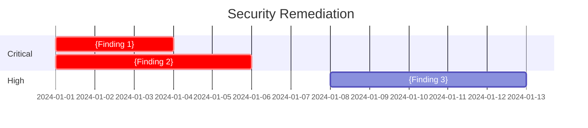
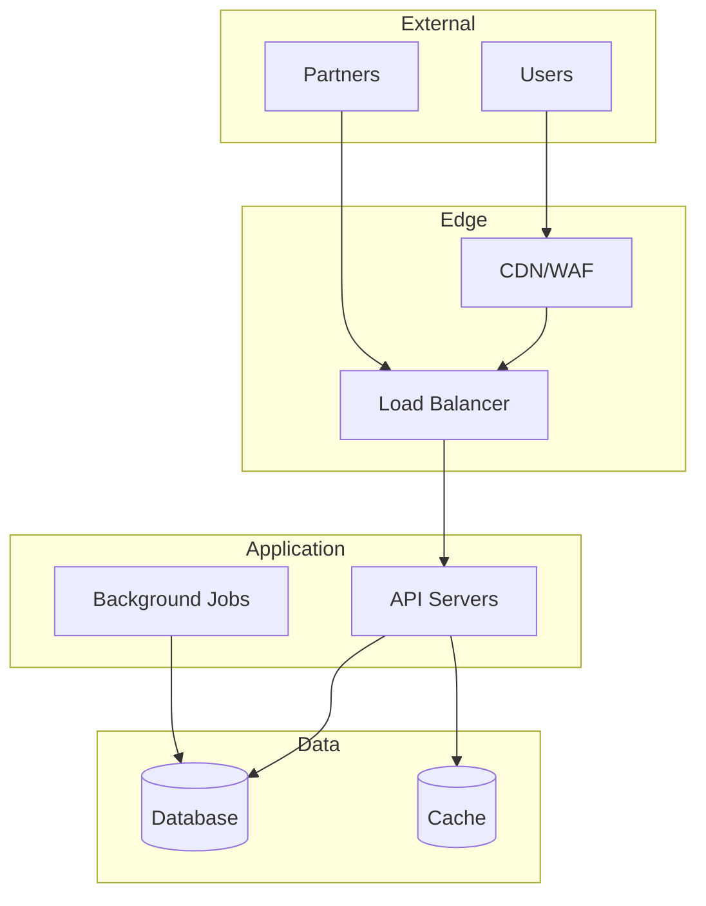
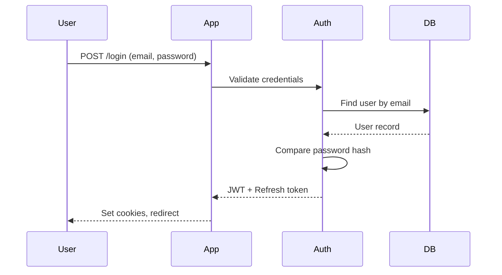
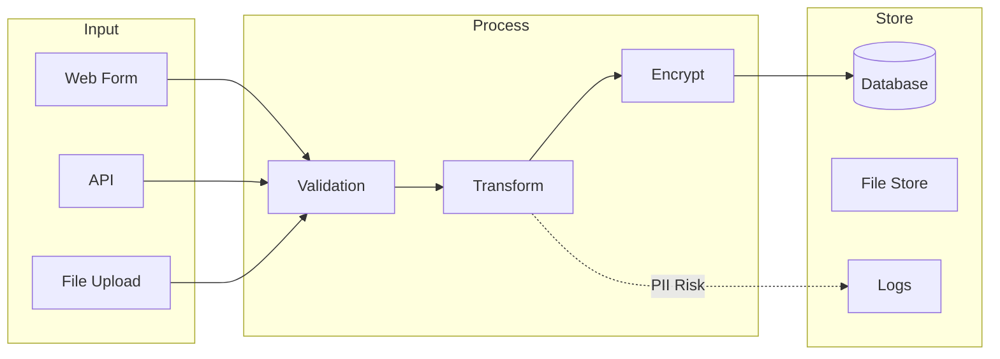
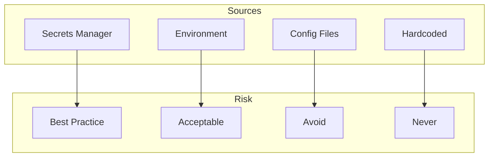
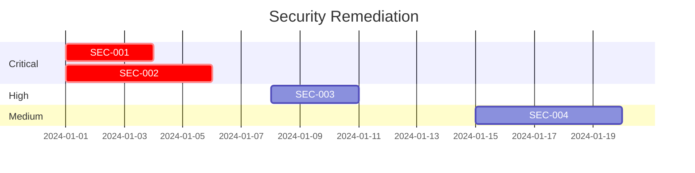

# Security Analysis Templates

Templates for all security analysis outputs.

---

## Index Template

```markdown
# Security Documentation

**Project**: {Project Name}
**Analysis Date**: {Date}
**Security Grade**: {A/B/C/D/F}
**Status**: {In Progress / Complete}

---

## Executive Summary

{2-3 paragraph summary of security posture, key findings, and recommendations}

### Finding Overview

| Severity | Count | Status |
|----------|-------|--------|
| Critical | X | X open |
| High | X | X open |
| Medium | X | X open |
| Low | X | X open |

### Immediate Actions Required

1. **{Critical Finding}** - {Brief description and remediation}
2. **{Critical Finding}** - {Brief description and remediation}
3. **{High Finding}** - {Brief description and remediation}

---

## Analysis Reports

| Document | Status | Description |
|----------|--------|-------------|
| [Security Surface](analysis/01-security-surface.md) | ✅ | Attack surface mapping |
| [Authentication](analysis/02-authentication.md) | ✅ | Auth mechanisms analysis |
| [Authorization](analysis/03-authorization.md) | ✅ | Access control analysis |
| [Data Protection](analysis/04-data-protection.md) | ✅ | Sensitive data handling |
| [Input Validation](analysis/05-input-validation.md) | ✅ | Injection prevention |
| [Secrets Management](analysis/06-secrets-management.md) | ✅ | Credentials security |
| [Findings Summary](analysis/07-findings-summary.md) | ✅ | Prioritized findings |

---

## Compliance Reports

| Framework | Status | Coverage |
|-----------|--------|----------|
| [OWASP ASVS](compliance/owasp-asvs.md) | ✅ | X/Y requirements |
| [NIST CSF](compliance/nist-csf.md) | ✅ | X/Y categories |
| [CIS Controls](compliance/cis-controls.md) | ✅ | X/Y safeguards |
| [ISO 27001](compliance/iso-27001.md) | ✅ | X/Y controls |
| [NIS 2](compliance/nis2.md) | ✅ | X/Y technical measures |

---

## Positive Observations

- {Security control working well}
- {Good practice observed}
- {Strength to maintain}

---

## Remediation Roadmap


```

---

## Analysis Report Templates

### 01 - Security Surface Template

```markdown
# Security Surface Analysis

**Analysis Date**: {Date}
**Analyst**: {Name}

---

## 1. Entry Points Inventory

### REST API Endpoints

| Endpoint | Method | Auth Required | Rate Limited | Input Validation |
|----------|--------|---------------|--------------|------------------|
| `/api/login` | POST | No | Yes | Schema |
| `/api/users` | GET | Yes (JWT) | No | Query params |
| `/api/users/:id` | GET | Yes (JWT) | No | Path param |

### Other Entry Points

| Entry Point | Type | Auth | Notes |
|-------------|------|------|-------|
| WebSocket `/ws` | WS | Token | Real-time notifications |
| Webhook `/hook` | POST | HMAC | Third-party integration |

---

## 2. Network Boundaries



---

## 3. Exposed Functionality Matrix

| Function | Public | Auth User | Admin | Risk |
|----------|--------|-----------|-------|------|
| Registration | ✅ | - | - | Abuse |
| Login | ✅ | - | - | Brute force |
| View profile | - | Own | All | IDOR |
| Edit profile | - | Own | All | - |
| Delete account | - | Own | All | - |
| Admin panel | - | - | ✅ | Privilege |

---

## 4. Attack Surface Summary

| Category | Count | Risk Level |
|----------|-------|------------|
| Public endpoints | X | Medium |
| Authenticated endpoints | X | Low |
| Admin endpoints | X | High |
| File upload points | X | High |
| External integrations | X | Medium |

---

## 5. Findings

| ID | Finding | Severity | Details |
|----|---------|----------|---------|
| SURF-001 | {Finding} | {Severity} | {Details} |
```

### 02 - Authentication Template

```markdown
# Authentication Analysis

**Analysis Date**: {Date}

---

## 1. Authentication Mechanisms

| Mechanism | Implementation | Where Used | Strength |
|-----------|----------------|------------|----------|
| Password | bcrypt (10 rounds) | Login | Medium |
| JWT | jsonwebtoken | API auth | Medium |
| OAuth 2.0 | passport-google | Social login | High |
| API Key | Custom header | External API | Low |

---

## 2. Authentication Flow



---

## 3. Password Security

| Control | Current | Recommended | Status |
|---------|---------|-------------|--------|
| Hashing | bcrypt | bcrypt/argon2 | ✅ |
| Salt rounds | 10 | 12+ | ⚠️ |
| Min length | 6 | 12+ | ❌ |
| Complexity | None | Required | ❌ |
| Breach check | No | Yes | ❌ |
| History | No | Last 5 | ❌ |

---

## 4. Token/Session Security

| Aspect | Current | Risk | Recommendation |
|--------|---------|------|----------------|
| JWT expiry | 24h | Medium | 1h + refresh |
| Refresh rotation | No | High | Implement |
| HttpOnly | No | High | Enable |
| Secure | Yes | - | ✅ |
| SameSite | Lax | Low | Strict |

---

## 5. Brute Force Protection

- [ ] Account lockout: {Yes/No, after N attempts}
- [ ] Progressive delays: {Yes/No}
- [ ] CAPTCHA: {Yes/No, after N failures}
- [ ] Rate limiting: {Yes/No, X req/min}
- [ ] IP blocking: {Yes/No}

---

## 6. Findings

| ID | Finding | Severity | Location | Remediation |
|----|---------|----------|----------|-------------|
| AUTH-001 | {Finding} | {Severity} | {Location} | {Fix} |
```

### 03 - Authorization Template

```markdown
# Authorization Analysis

**Analysis Date**: {Date}

---

## 1. Authorization Model

| Model | Usage | Implementation |
|-------|-------|----------------|
| RBAC | Primary | `user.role` field |
| Owner-based | Resources | `resource.userId === user.id` |
| Tenant isolation | Multi-tenant | `resource.tenantId === user.tenantId` |

---

## 2. Roles & Permissions

### Defined Roles

| Role | Level | Description |
|------|-------|-------------|
| guest | 0 | Unauthenticated |
| user | 1 | Registered user |
| editor | 2 | Content editor |
| admin | 3 | Administrator |
| super | 4 | Super admin |

### Permission Matrix

| Permission | guest | user | editor | admin | super |
|------------|-------|------|--------|-------|-------|
| Read public | ✅ | ✅ | ✅ | ✅ | ✅ |
| Read own | - | ✅ | ✅ | ✅ | ✅ |
| Write own | - | ✅ | ✅ | ✅ | ✅ |
| Read all | - | - | ✅ | ✅ | ✅ |
| Write all | - | - | - | ✅ | ✅ |
| Delete all | - | - | - | - | ✅ |

---

## 3. Authorization Enforcement

### Middleware/Guards

| Location | Check Type | Coverage |
|----------|------------|----------|
| `/api/*` | JWT validation | All API |
| `/api/admin/*` | Role = admin | Admin routes |
| Resource handlers | Ownership | Per resource |

### Code Patterns

```javascript
// Pattern found in codebase
{code example}
```

---

## 4. Privilege Escalation Risks

| ID | Risk | Severity | Location | Description |
|----|------|----------|----------|-------------|
| AUTHZ-001 | IDOR | High | `GET /users/:id` | No ownership check |
| AUTHZ-002 | Missing check | Critical | `/admin/config` | No role verification |

---

## 5. Multi-Tenancy (if applicable)

- [ ] Tenant ID enforced in all queries
- [ ] Cross-tenant access prevented
- [ ] Tenant-scoped admin roles
- [ ] Shared resources properly controlled

---

## 6. Findings

| ID | Finding | Severity | Location | Remediation |
|----|---------|----------|----------|-------------|
| AUTHZ-001 | {Finding} | {Severity} | {Location} | {Fix} |
```

### 04 - Data Protection Template

```markdown
# Data Protection Analysis

**Analysis Date**: {Date}

---

## 1. Sensitive Data Inventory

| Field | Entity | Classification | Encrypted | Logged | Retention |
|-------|--------|----------------|-----------|--------|-----------|
| email | User | PII | No | Yes ⚠️ | Forever |
| password | User | Secret | Hashed | No | N/A |
| ssn | Profile | Sensitive PII | AES-256 | No | 7 years |
| card_token | Payment | PCI | Tokenized | No | 1 year |

### Classification Key
- **PII**: Personally Identifiable Information
- **Sensitive PII**: SSN, health, financial details
- **Secret**: Passwords, keys, tokens
- **PCI**: Payment card data
- **PHI**: Health information

---

## 2. Data Flow Diagram



---

## 3. Encryption Assessment

| Data State | Method | Key Management | Status |
|------------|--------|----------------|--------|
| At Rest (DB) | {Method} | {How managed} | ✅/❌ |
| At Rest (Files) | {Method} | {How managed} | ✅/❌ |
| In Transit | TLS {version} | {Certificate} | ✅/❌ |
| In Backups | {Method} | {How managed} | ✅/❌ |

---

## 4. Logging Exposure

| Log Type | Contains | PII Risk | Mitigation |
|----------|----------|----------|------------|
| Access logs | IP, path | Low | Retention |
| Error logs | Request body | High | Redaction |
| Audit logs | User actions | Low | Expected |
| Debug logs | Everything | Critical | Disable |

---

## 5. Data Retention & Deletion

| Data Type | Retention | Deletion | Compliant |
|-----------|-----------|----------|-----------|
| User accounts | {Period} | {Method} | ✅/❌ |
| Transactions | {Period} | {Method} | ✅/❌ |
| Sessions | {Period} | {Method} | ✅/❌ |
| Logs | {Period} | {Method} | ✅/❌ |

---

## 6. Compliance Considerations

- [ ] GDPR: Right to erasure implemented
- [ ] GDPR: Data portability available
- [ ] CCPA: Opt-out mechanisms
- [ ] PCI-DSS: Card data handling
- [ ] HIPAA: PHI protections (if applicable)

---

## 7. Findings

| ID | Finding | Severity | Location | Remediation |
|----|---------|----------|----------|-------------|
| DATA-001 | {Finding} | {Severity} | {Location} | {Fix} |
```

### 05 - Input Validation Template

```markdown
# Input Validation Analysis

**Analysis Date**: {Date}

---

## 1. Input Sources

| Source | Validation | Sanitization | Risk |
|--------|------------|--------------|------|
| URL params | {Method} | {Method} | {Level} |
| Query strings | {Method} | {Method} | {Level} |
| Request body | {Method} | {Method} | {Level} |
| Headers | {Method} | {Method} | {Level} |
| File uploads | {Method} | {Method} | {Level} |
| Cookies | {Method} | {Method} | {Level} |

---

## 2. Injection Vulnerabilities

### SQL Injection

| Location | Pattern | Severity | Code |
|----------|---------|----------|------|
| {file:line} | {Pattern} | Critical | `{snippet}` |

### XSS (Cross-Site Scripting)

| Location | Pattern | Severity | Code |
|----------|---------|----------|------|
| {file:line} | {Pattern} | High | `{snippet}` |

### Command Injection

| Location | Pattern | Severity | Code |
|----------|---------|----------|------|
| {file:line} | {Pattern} | Critical | `{snippet}` |

### Other Injections

| Type | Location | Severity | Description |
|------|----------|----------|-------------|
| LDAP | {location} | {sev} | {desc} |
| XML/XXE | {location} | {sev} | {desc} |
| Template | {location} | {sev} | {desc} |

---

## 3. Output Encoding

| Context | Required | Implemented | Status |
|---------|----------|-------------|--------|
| HTML body | HTML entities | {Yes/No} | ✅/❌ |
| HTML attributes | Attribute encoding | {Yes/No} | ✅/❌ |
| JavaScript | JS escape | {Yes/No} | ✅/❌ |
| URL | URL encoding | {Yes/No} | ✅/❌ |
| CSS | CSS escape | {Yes/No} | ✅/❌ |

---

## 4. File Upload Security

| Control | Implemented | Risk if Missing |
|---------|-------------|-----------------|
| Extension whitelist | {Yes/No} | Medium |
| MIME validation | {Yes/No} | High |
| Size limit | {Yes/No} | Low |
| Filename sanitization | {Yes/No} | High |
| Content scanning | {Yes/No} | High |
| Separate domain | {Yes/No} | High |

---

## 5. Findings

| ID | Finding | Severity | Location | Remediation |
|----|---------|----------|----------|-------------|
| INPUT-001 | {Finding} | {Severity} | {Location} | {Fix} |
```

### 06 - Secrets Management Template

```markdown
# Secrets Management Analysis

**Analysis Date**: {Date}

---

## 1. Secrets Inventory

| Secret | Purpose | Storage | Rotation | Risk |
|--------|---------|---------|----------|------|
| DB_PASSWORD | Database auth | Env var | Never | Medium |
| JWT_SECRET | Token signing | Config | Never | High |
| API_KEY | Third-party | Env var | Never | Medium |
| ENCRYPTION_KEY | Data encryption | Vault | Yearly | Low |

---

## 2. Hardcoded Secrets Scan

| File | Line | Type | Severity | Status |
|------|------|------|----------|--------|
| {file} | {line} | {type} | Critical | Open |

---

## 3. Git History Check

| Commit | File | Secret Type | Action Required |
|--------|------|-------------|-----------------|
| {hash} | {file} | {type} | Rotate immediately |

---

## 4. Secrets Flow



---

## 5. Recommendations

| Current Practice | Recommendation | Priority |
|------------------|----------------|----------|
| Hardcoded secrets | Move to env/vault | Critical |
| No rotation | 90-day rotation | High |
| Secrets in git | Rotate exposed | Critical |
| Plain config | Encrypted vault | Medium |

---

## 6. Findings

| ID | Finding | Severity | Location | Remediation |
|----|---------|----------|----------|-------------|
| SECRET-001 | {Finding} | {Severity} | {Location} | {Fix} |
```

### 07 - Findings Summary Template

```markdown
# Security Findings Summary

**Analysis Date**: {Date}
**Security Grade**: {A/B/C/D/F}

---

## Executive Summary

{2-3 paragraphs summarizing overall security posture}

### Key Statistics

| Metric | Value |
|--------|-------|
| Total findings | X |
| Critical | X |
| High | X |
| Medium | X |
| Low | X |
| Fixed | X |

---

## Top Priority Findings

### 1. {Critical Finding Title}

**Severity**: Critical | **CVSS**: 9.8 | **Location**: `{file:line}`

**Description**: {What the vulnerability is}

**Impact**: {What could happen if exploited}

**Remediation**:
```{language}
// Before (vulnerable)
{vulnerable code}

// After (fixed)
{fixed code}
```

---

## All Findings

| ID | Finding | Severity | CVSS | Phase | Location | Status |
|----|---------|----------|------|-------|----------|--------|
| SEC-001 | {Title} | Critical | 9.8 | 5 | {loc} | Open |
| SEC-002 | {Title} | High | 7.5 | 2 | {loc} | Open |

---

## Remediation Roadmap



---

## Risk Matrix

| Finding | Likelihood | Impact | Risk |
|---------|------------|--------|------|
| SEC-001 | High | Critical | Critical |
| SEC-002 | Medium | High | High |

---

## Positive Observations

1. {Good practice observed}
2. {Security control working well}
3. {Strength to maintain}
```

---

## Compliance Report Templates

### OWASP ASVS Template

```markdown
# OWASP ASVS Compliance Report

**Project**: {Name}
**ASVS Version**: 4.0.3
**Target Level**: L1 / L2 / L3
**Assessment Date**: {Date}

---

## Compliance Summary

| Category | Total | Pass | Fail | N/A | Coverage |
|----------|-------|------|------|-----|----------|
| V1: Architecture | X | X | X | X | X% |
| V2: Authentication | X | X | X | X | X% |
| V3: Session | X | X | X | X | X% |
| V4: Access Control | X | X | X | X | X% |
| V5: Validation | X | X | X | X | X% |
| V6: Cryptography | X | X | X | X | X% |
| V7: Error Handling | X | X | X | X | X% |
| V8: Data Protection | X | X | X | X | X% |
| V9: Communication | X | X | X | X | X% |
| V10: Malicious Code | X | X | X | X | X% |
| V11: Business Logic | X | X | X | X | X% |
| V12: Files | X | X | X | X | X% |
| V13: API | X | X | X | X | X% |
| V14: Configuration | X | X | X | X | X% |
| **Total** | **X** | **X** | **X** | **X** | **X%** |

---

## V2: Authentication

### V2.1 Password Security

| # | Requirement | L1 | L2 | L3 | Status | Evidence |
|---|-------------|:--:|:--:|:--:|:------:|----------|
| 2.1.1 | Passwords at least 12 chars | ✓ | ✓ | ✓ | ❌ | Min 6 chars |
| 2.1.2 | 64+ char passwords allowed | ✓ | ✓ | ✓ | ✅ | No max limit |
| 2.1.3 | No truncation | ✓ | ✓ | ✓ | ✅ | Full length stored |

{Continue for all categories}

---

## Failed Requirements

| Req # | Requirement | Level | Gap | Remediation |
|-------|-------------|-------|-----|-------------|
| 2.1.1 | 12 char minimum | L1 | 6 chars | Update validation |
```

### NIST CSF Template

```markdown
# NIST Cybersecurity Framework Assessment

**Project**: {Name}
**CSF Version**: 2.0
**Assessment Date**: {Date}

---

## Function Summary

| Function | Categories | Implemented | Partial | Gap |
|----------|------------|-------------|---------|-----|
| IDENTIFY | 6 | X | X | X |
| PROTECT | 6 | X | X | X |
| DETECT | 3 | X | X | X |
| RESPOND | 4 | X | X | X |
| RECOVER | 3 | X | X | X |

---

## IDENTIFY (ID)

### ID.AM - Asset Management

| Subcategory | Requirement | Status | Evidence | Gap |
|-------------|-------------|:------:|----------|-----|
| ID.AM-1 | Physical devices | N/A | App scope | - |
| ID.AM-2 | Software inventory | ✅ | package.json | - |
| ID.AM-3 | Data flows mapped | ⚠️ | Partial | Complete mapping |

### ID.RA - Risk Assessment

| Subcategory | Requirement | Status | Evidence | Gap |
|-------------|-------------|:------:|----------|-----|
| ID.RA-1 | Vulnerabilities identified | ✅ | This assessment | - |
| ID.RA-2 | Threat intel received | ❌ | No subscription | Implement |

{Continue for all functions}

---

## Gaps and Recommendations

| Function | Gap | Priority | Recommendation |
|----------|-----|----------|----------------|
| PROTECT | No MFA | High | Implement TOTP |
| DETECT | No monitoring | High | Add logging |
```

### CIS Controls Template

```markdown
# CIS Controls Assessment

**Project**: {Name}
**CIS Version**: 8.0
**Implementation Group**: IG1 / IG2 / IG3
**Assessment Date**: {Date}

---

## Control Summary

| Control | Description | IG1 | IG2 | IG3 | Status |
|---------|-------------|:---:|:---:|:---:|:------:|
| 1 | Enterprise Assets | 2/5 | - | - | Partial |
| 2 | Software Assets | 3/7 | - | - | Partial |
| 3 | Data Protection | 2/14 | - | - | Low |
| 4 | Secure Configuration | 5/12 | - | - | Medium |
| 5 | Account Management | 4/6 | - | - | Good |
| 6 | Access Control | 3/8 | - | - | Medium |
| 7 | Vulnerability Mgmt | 2/7 | - | - | Low |
| 16 | App Software Security | 6/14 | - | - | Medium |

---

## Control 3: Data Protection

### Applicable Safeguards

| # | Safeguard | IG | Status | Evidence | Gap |
|---|-----------|:--:|:------:|----------|-----|
| 3.1 | Data classification | IG1 | ⚠️ | Implicit | Document |
| 3.4 | Encryption in transit | IG1 | ✅ | TLS 1.3 | - |
| 3.6 | Encryption at rest | IG1 | ⚠️ | DB only | Files |

{Continue for applicable controls}

---

## Priority Remediation

| Control | Safeguard | Current | Target | Effort |
|---------|-----------|---------|--------|--------|
| 3 | 3.6 | DB only | All data | Medium |
| 7 | 7.1 | Manual | Automated | High |
```

### ISO 27001 Template

```markdown
# ISO 27001 Annex A Controls Assessment

**Project**: {Name}
**ISO Version**: 2022
**Assessment Date**: {Date}

---

## Control Summary

| Domain | Controls | Implemented | Partial | N/A | Gap |
|--------|----------|-------------|---------|-----|-----|
| A.5 Organizational | 37 | X | X | X | X |
| A.6 People | 8 | X | X | X | X |
| A.7 Physical | 14 | X | X | X | X |
| A.8 Technological | 34 | X | X | X | X |

---

## A.8 Technological Controls

### A.8.1 - A.8.10: Endpoint & Access

| Control | Requirement | Status | Evidence | Gap |
|---------|-------------|:------:|----------|-----|
| A.8.2 | Privileged access | ⚠️ | RBAC | PAM needed |
| A.8.3 | Information access | ✅ | Auth checks | - |
| A.8.5 | Secure authentication | ⚠️ | Password only | Add MFA |

### A.8.11 - A.8.20: Data & Network

| Control | Requirement | Status | Evidence | Gap |
|---------|-------------|:------:|----------|-----|
| A.8.11 | Data masking | ❌ | Not implemented | Add masking |
| A.8.12 | Data leakage prevention | ⚠️ | Partial | Expand |
| A.8.15 | Logging | ✅ | Centralized | - |

{Continue for all applicable controls}

---

## Statement of Applicability Summary

| Status | Count | Percentage |
|--------|-------|------------|
| Implemented | X | X% |
| Partially Implemented | X | X% |
| Not Implemented | X | X% |
| Not Applicable | X | X% |

---

## Remediation Priority

| Control | Gap | Risk | Effort | Priority |
|---------|-----|------|--------|----------|
| A.8.5 | No MFA | High | Medium | 1 |
| A.8.11 | No masking | Medium | Low | 2 |
```

### NIS 2 Template

```markdown
# NIS 2 Directive Compliance Report

**Project**: {Name}
**NIS 2 Version**: Directive (EU) 2022/2555
**Assessment Date**: {Date}
**Entity Type**: Essential / Important

---

## Scope Disclaimer

> **Important**: This report covers **technical controls only** (~40-50% of NIS 2 requirements).
> Organizational measures (policies, governance, training, incident procedures) require separate assessment.
> See [NIS 2 Scope Limitations](README.md#nis-2-scope-limitations) for details.

---

## Executive Summary

| Category | Assessed | Compliant | Partial | Gap | N/A |
|----------|----------|-----------|---------|-----|-----|
| Technical Measures (Art. 21.2) | X | X | X | X | X |
| **Code-Analyzable Coverage** | **~45%** | - | - | - | - |

---

## Article 21(2) Technical Measures Assessment

### (c) Business Continuity - Backup & Recovery

**What we analyzed**: Backup code patterns, retry logic, failover configurations, disaster recovery code.

| Aspect | Status | Evidence | Gap |
|--------|:------:|----------|-----|
| Backup mechanisms in code | ✅/⚠️/❌ | {location} | {gap} |
| Retry patterns implemented | ✅/⚠️/❌ | {location} | {gap} |
| Failover configuration | ✅/⚠️/❌ | {location} | {gap} |
| Circuit breaker patterns | ✅/⚠️/❌ | {location} | {gap} |
| Graceful degradation | ✅/⚠️/❌ | {location} | {gap} |

**Findings**: {findings}

---

### (d) Supply Chain Security

**What we analyzed**: Dependencies, SBOM, known vulnerabilities, third-party integrations.

| Aspect | Status | Evidence | Gap |
|--------|:------:|----------|-----|
| Dependency manifest exists | ✅/⚠️/❌ | package.json, etc. | {gap} |
| Lock file present | ✅/⚠️/❌ | {location} | {gap} |
| Known vulnerabilities | ✅/⚠️/❌ | {count} found | {gap} |
| Dependency update policy | ✅/⚠️/❌ | {evidence} | {gap} |
| Third-party code review | ✅/⚠️/❌ | {evidence} | {gap} |

**Vulnerability Summary**:

| Severity | Count | Notable |
|----------|-------|---------|
| Critical | X | {package} |
| High | X | {package} |
| Medium | X | - |
| Low | X | - |

**Findings**: {findings}

---

### (e) Security in Development & Maintenance

**What we analyzed**: Input validation, secure coding patterns, output encoding.

| Aspect | Status | Evidence | Gap |
|--------|:------:|----------|-----|
| Input validation framework | ✅/⚠️/❌ | {library/pattern} | {gap} |
| Output encoding | ✅/⚠️/❌ | {implementation} | {gap} |
| Parameterized queries | ✅/⚠️/❌ | {ORM/prepared} | {gap} |
| Security linting | ✅/⚠️/❌ | {tool} | {gap} |
| Dependency scanning | ✅/⚠️/❌ | {tool} | {gap} |

**Findings**: {findings}

---

### (h) Cryptography & Encryption

**What we analyzed**: Encryption at rest, encryption in transit, key management code.

| Aspect | Status | Evidence | Gap |
|--------|:------:|----------|-----|
| TLS/HTTPS enforced | ✅/⚠️/❌ | {config} | {gap} |
| Data encryption at rest | ✅/⚠️/❌ | {method} | {gap} |
| Strong algorithms used | ✅/⚠️/❌ | AES-256, etc. | {gap} |
| Key management | ✅/⚠️/❌ | {approach} | {gap} |
| Certificate handling | ✅/⚠️/❌ | {validation} | {gap} |

**Cryptographic Inventory**:

| Purpose | Algorithm | Key Size | Status |
|---------|-----------|----------|--------|
| Password hashing | {bcrypt/argon2} | {rounds} | ✅/❌ |
| Data encryption | {AES/etc} | {bits} | ✅/❌ |
| Token signing | {RS256/HS256} | {bits} | ✅/❌ |

**Findings**: {findings}

---

### (i) Access Control & Asset Management

**What we analyzed**: RBAC implementation, authorization checks, session management.

| Aspect | Status | Evidence | Gap |
|--------|:------:|----------|-----|
| Access control model | ✅/⚠️/❌ | {RBAC/ABAC} | {gap} |
| Role definitions | ✅/⚠️/❌ | {location} | {gap} |
| Authorization enforcement | ✅/⚠️/❌ | {middleware} | {gap} |
| Session management | ✅/⚠️/❌ | {implementation} | {gap} |
| Privilege separation | ✅/⚠️/❌ | {evidence} | {gap} |

**Findings**: {findings}

---

### (j) Multi-Factor Authentication

**What we analyzed**: MFA implementation, supported factors, enforcement.

| Aspect | Status | Evidence | Gap |
|--------|:------:|----------|-----|
| MFA implemented | ✅/⚠️/❌ | {library} | {gap} |
| TOTP support | ✅/⚠️/❌ | {implementation} | {gap} |
| WebAuthn/FIDO2 | ✅/⚠️/❌ | {implementation} | {gap} |
| MFA enforcement | ✅/⚠️/❌ | {policy} | {gap} |
| Recovery mechanisms | ✅/⚠️/❌ | {backup codes} | {gap} |

**Findings**: {findings}

---

## Out of Scope (Organizational Measures)

The following NIS 2 requirements **cannot be assessed through code analysis** and require separate organizational review:

| Article | Requirement | Assessment Method |
|---------|-------------|-------------------|
| 21(2)(a) | Risk analysis policies | Policy document review |
| 21(2)(b) | Incident handling | Process/procedure review |
| 21(2)(f) | Effectiveness assessment | Audit process review |
| 21(2)(g) | Cybersecurity training | HR/training records |
| Art. 20 | Incident reporting (24h/72h) | Process verification |
| Art. 32 | Management accountability | Governance review |

---

## Cross-Framework Mapping

| NIS 2 Article | ISO 27001 | NIST CSF | This Assessment |
|---------------|-----------|----------|-----------------|
| Art. 21(2)(c) | A.8.14 | PR.IP-4, RC.RP | Phase 1, 4 |
| Art. 21(2)(d) | A.5.21-23 | ID.SC | Phase 6 |
| Art. 21(2)(e) | A.8.25-31 | PR.DS | Phase 5 |
| Art. 21(2)(h) | A.8.24 | PR.DS-1,2 | Phase 4 |
| Art. 21(2)(i) | A.8.2-5 | PR.AC | Phase 2, 3 |
| Art. 21(2)(j) | A.8.5 | PR.AC-7 | Phase 2 |

---

## Priority Remediation

| NIS 2 Article | Gap | Risk | Effort | Priority |
|---------------|-----|------|--------|----------|
| {article} | {gap} | High/Med/Low | High/Med/Low | 1 |

---

## References

- [NIS 2 Directive Full Text](https://eur-lex.europa.eu/eli/dir/2022/2555)
- [ENISA NIS 2 Guidance](https://www.enisa.europa.eu/topics/nis-directive)
- [NIS 2 Implementation Toolkit](https://digital-strategy.ec.europa.eu/en/policies/nis2-directive)
```
