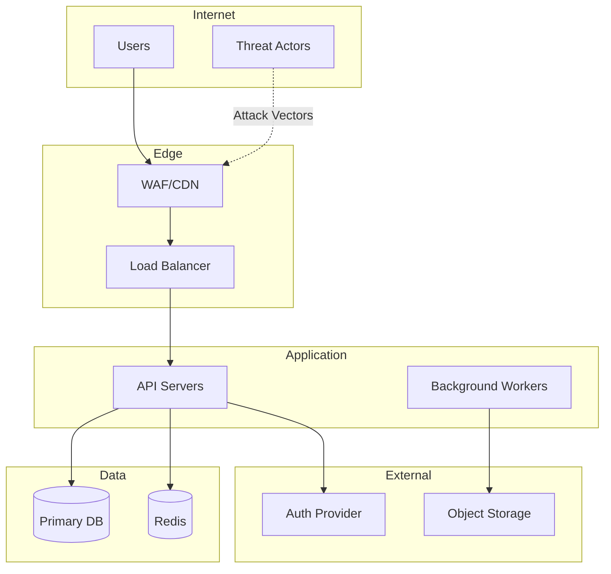
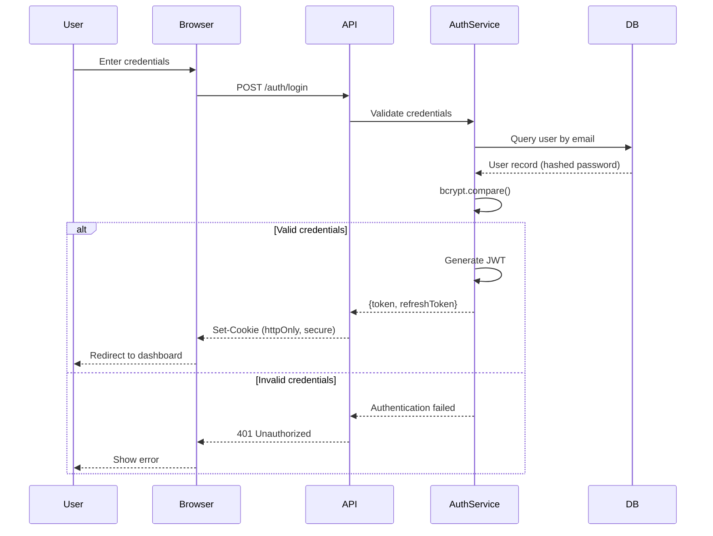
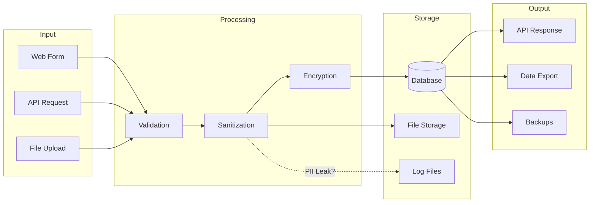
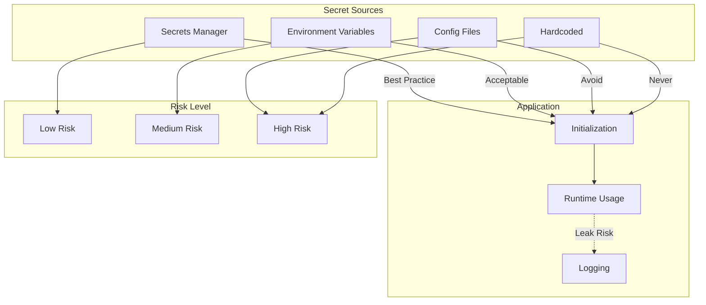

# Security Analysis Workflows

Step-by-step procedures for comprehensive security assessment.

---

## Main Analysis Workflow

### Phase 0: Setup

**Goal**: Establish output location and preferences.

#### 0.1 Ask for Documentation Directory

```
Where should I create the security documentation?

Please provide a path to your documentation directory (e.g., ./docs).
I will create a `security-docs` folder inside it with all analysis results.
```

#### 0.2 Create Output Structure

```
{docs-directory}/
└── security-docs/
    ├── index.md
    ├── analysis/
    │   ├── 01-security-surface.md
    │   ├── 02-authentication.md
    │   ├── 03-authorization.md
    │   ├── 04-data-protection.md
    │   ├── 05-input-validation.md
    │   ├── 06-secrets-management.md
    │   └── 07-findings-summary.md
    └── compliance/
        └── (generated per selected framework)
```

#### 0.3 Select Compliance Framework(s)

```
Which security framework(s) should I use for the compliance report?

Select one or more:
☐ OWASP ASVS - Application Security Verification Standard (L1/L2/L3)
☐ NIST CSF - Cybersecurity Framework (Identify/Protect/Detect/Respond/Recover)
☐ CIS Controls - Center for Internet Security prioritized controls (IG1/IG2/IG3)
☐ ISO 27001 - Information security management (Annex A controls)
☐ NIS 2 - EU Directive 2022/2555 (technical controls only, ~40-50% coverage)

Default: OWASP ASVS (most applicable for application security)
```

> **Note on NIS 2**: Code analysis can only assess technical controls. Organizational measures (policies, governance, training) require separate assessment. See [NIS 2 Scope Limitations](README.md#nis-2-scope-limitations).

#### 0.4 Select Diagram Format

```
What diagram format do you prefer?

1. **Mermaid** (Recommended) - Renders in GitHub, GitLab, markdown viewers
2. **ASCII** - Works everywhere, no rendering required
3. **PlantUML** - More features, requires PlantUML viewer
4. **Excalidraw** - Hand-drawn style, VS Code extension, collaborative
```

> **Note**: Excalidraw outputs `.excalidraw` JSON files. Edit visually in VS Code or export to PNG/SVG for embedding.

#### 0.5 Initialize Index

Create `index.md` with placeholder structure (see templates.md).

**Output**: Documentation structure ready for analysis

---

### Phase 1: Security Surface Analysis

**Goal**: Map the attack surface and entry points.

#### 1.1 Identify Entry Points

Search for:
- HTTP/REST endpoints (routes, controllers)
- GraphQL resolvers
- WebSocket handlers
- CLI entry points
- Event handlers (queues, webhooks)
- Scheduled jobs (cron, background tasks)

**Capture**:
```markdown
| Entry Point | Type | Method | Auth Required | Rate Limited |
|-------------|------|--------|---------------|--------------|
| `/api/login` | REST | POST | No | Yes |
| `/api/users/:id` | REST | GET | Yes (JWT) | No |
| `/ws/notifications` | WebSocket | - | Yes (Token) | No |
```

#### 1.2 Map Network Boundaries

Document:
- External-facing services
- Internal service mesh
- Database connections
- Third-party integrations
- CDN/proxy layers

**Diagram**:


#### 1.3 Exposed Functionality Matrix

| Function | Public | Authenticated | Admin | Notes |
|----------|--------|---------------|-------|-------|
| User registration | ✅ | - | - | Rate limit? |
| Password reset | ✅ | - | - | Token expiry? |
| View profile | - | Own only | All | IDOR check needed |
| Delete account | - | Own only | All | Soft delete? |
| Export data | - | Own only | All | Size limits? |

#### 1.4 Technology Security Implications

Cross-reference with arch-analysis technology manifest:
- Known CVEs for framework versions
- Security configurations for stack
- Default insecure settings to check

**Output**: `analysis/01-security-surface.md`

---

### Phase 2: Authentication Analysis

**Goal**: Assess authentication mechanisms and flows.

#### 2.1 Auth Mechanism Inventory

| Mechanism | Where Used | Implementation | Strength |
|-----------|------------|----------------|----------|
| JWT | API auth | jsonwebtoken | Medium |
| Session Cookie | Web app | express-session | Medium |
| API Key | External API | Custom header | Low |
| OAuth 2.0 | Social login | passport | High |
| MFA/2FA | Admin accounts | speakeasy | High |

#### 2.2 Authentication Flow Analysis

For each auth mechanism, document:
1. Credential submission
2. Validation process
3. Token/session creation
4. Token storage (client-side)
5. Token transmission
6. Token validation (subsequent requests)
7. Token refresh/rotation
8. Logout/invalidation

**Sequence Diagram**:


#### 2.3 Password Security

| Aspect | Current | Recommended | Status |
|--------|---------|-------------|--------|
| Hashing algorithm | bcrypt | bcrypt/argon2 | ✅ |
| Salt rounds | 10 | 12+ | ⚠️ |
| Minimum length | 6 | 12+ | ❌ |
| Complexity rules | None | Mixed case + numbers | ❌ |
| Breach check | No | HaveIBeenPwned API | ❌ |

#### 2.4 Session/Token Security

| Aspect | Implementation | Risk | Recommendation |
|--------|----------------|------|----------------|
| Token expiry | 24h | Medium | Reduce to 1h |
| Refresh rotation | No | High | Implement rotation |
| Secure flag | Yes | - | ✅ |
| HttpOnly flag | No | High | Enable |
| SameSite | None | Medium | Set to Strict |

#### 2.5 Brute Force Protection

- [ ] Account lockout after N attempts
- [ ] Progressive delays
- [ ] CAPTCHA after failures
- [ ] IP-based rate limiting
- [ ] Alerting on suspicious activity

**Output**: `analysis/02-authentication.md`

---

### Phase 3: Authorization Analysis

**Goal**: Assess access control model and implementation.

#### 3.1 Authorization Model Identification

| Model | Evidence | Where Used |
|-------|----------|------------|
| RBAC | `user.role` checks | Admin vs User separation |
| ABAC | `user.org === resource.org` | Multi-tenant isolation |
| ACL | `resource.permissions[]` | Document sharing |
| Owner-based | `resource.userId === user.id` | Personal data |

#### 3.2 Role/Permission Matrix

Document discovered roles and their permissions:

| Permission | Guest | User | Editor | Admin | Super |
|------------|-------|------|--------|-------|-------|
| View public content | ✅ | ✅ | ✅ | ✅ | ✅ |
| View own profile | - | ✅ | ✅ | ✅ | ✅ |
| Edit own profile | - | ✅ | ✅ | ✅ | ✅ |
| View all users | - | - | - | ✅ | ✅ |
| Edit any user | - | - | - | ✅ | ✅ |
| Delete users | - | - | - | - | ✅ |
| System config | - | - | - | - | ✅ |

#### 3.3 Authorization Check Patterns

Search for authorization patterns:

```javascript
// Pattern 1: Role check
if (user.role !== 'admin') throw new ForbiddenError();

// Pattern 2: Ownership check
if (resource.userId !== user.id) throw new ForbiddenError();

// Pattern 3: Permission check
if (!user.permissions.includes('delete:users')) throw new ForbiddenError();

// Pattern 4: Middleware
app.use('/admin', requireRole('admin'));
```

#### 3.4 Privilege Escalation Risks

| Risk | Location | Severity | Description |
|------|----------|----------|-------------|
| IDOR | `GET /api/users/:id` | High | No ownership verification |
| Missing auth check | `/api/admin/config` | Critical | Endpoint unprotected |
| Role confusion | `PATCH /api/users/:id` | High | User can set own role |
| Token scope bypass | JWT claims | Medium | Insufficient claim validation |

#### 3.5 Multi-Tenancy Isolation

If applicable:
- [ ] Tenant ID in all queries
- [ ] No cross-tenant data access
- [ ] Tenant-scoped admin roles
- [ ] Shared resource access controls

**Output**: `analysis/03-authorization.md`

---

### Phase 4: Data Protection Analysis

**Goal**: Trace sensitive data handling and protection.

#### 4.1 Sensitive Data Inventory

| Field | Entity | Classification | Location | Encrypted |
|-------|--------|----------------|----------|-----------|
| email | User | PII | DB, logs | No ⚠️ |
| password | User | Secret | DB | Hashed ✅ |
| ssn | Profile | Sensitive PII | DB | Yes ✅ |
| credit_card | Payment | PCI | External | Tokenized ✅ |
| api_key | Integration | Secret | DB, config | No ⚠️ |

**Classification Guide**:
- **PII**: Personally Identifiable Information
- **Sensitive PII**: SSN, health, financial
- **Secret**: Passwords, keys, tokens
- **PCI**: Payment card data
- **PHI**: Health information (HIPAA)

#### 4.2 Data Flow Diagram (Sensitive Data)



#### 4.3 Encryption Assessment

| Data State | Method | Key Management | Status |
|------------|--------|----------------|--------|
| At Rest (DB) | AES-256 | AWS KMS | ✅ |
| At Rest (Files) | None | - | ❌ |
| In Transit | TLS 1.3 | Auto-renewed | ✅ |
| In Backups | GPG | Manual key | ⚠️ |
| In Memory | None | - | N/A |

#### 4.4 Logging PII Exposure

Search logs configuration for:
- Request body logging (credentials?)
- Response body logging (tokens?)
- Error stack traces (sensitive data?)
- Audit logs (what's captured?)

| Log Type | PII Exposure | Risk | Mitigation |
|----------|--------------|------|------------|
| Access logs | IP, user-agent | Low | Retention policy |
| Error logs | Full request body | High | Redact sensitive fields |
| Audit logs | User ID, action | Low | Expected |
| Debug logs | Everything | Critical | Disable in production |

#### 4.5 Data Retention & Deletion

| Data Type | Retention | Deletion Method | GDPR Compliant |
|-----------|-----------|-----------------|----------------|
| User accounts | Forever | Soft delete | ❌ |
| Payment history | 7 years | N/A | ✅ |
| Session data | 30 days | Auto-expire | ✅ |
| Logs | 90 days | Rotation | ✅ |

**Output**: `analysis/04-data-protection.md`

---

### Phase 5: Input Validation Analysis

**Goal**: Assess input handling and injection prevention.

#### 5.1 Input Sources Inventory

| Source | Validation | Sanitization | Risk Level |
|--------|------------|--------------|------------|
| URL parameters | Partial | None | High |
| Query strings | None | None | Critical |
| Request body | JSON schema | None | Medium |
| Headers | Allowlist | N/A | Low |
| File uploads | Extension only | None | High |
| Cookies | Signed | N/A | Low |

#### 5.2 Injection Vulnerability Scan

**SQL Injection**:
```javascript
// VULNERABLE: String concatenation
const query = `SELECT * FROM users WHERE id = ${req.params.id}`;

// SAFE: Parameterized query
const query = 'SELECT * FROM users WHERE id = ?';
db.query(query, [req.params.id]);
```

| Location | Pattern | Severity | Fix |
|----------|---------|----------|-----|
| `search.js:42` | String concat in SQL | Critical | Parameterize |
| `export.js:18` | Template literal in SQL | Critical | Parameterize |

**XSS (Cross-Site Scripting)**:
```javascript
// VULNERABLE: Direct HTML insertion
element.innerHTML = userInput;

// SAFE: Text content or escaped
element.textContent = userInput;
```

| Location | Pattern | Severity | Fix |
|----------|---------|----------|-----|
| `profile.js:55` | innerHTML with user data | High | Use textContent |
| `comments.js:23` | dangerouslySetInnerHTML | High | Sanitize first |

**Command Injection**:
```javascript
// VULNERABLE: User input in exec
exec(`convert ${filename} output.png`);

// SAFE: Use array form, validate input
execFile('convert', [validatedFilename, 'output.png']);
```

| Location | Pattern | Severity | Fix |
|----------|---------|----------|-----|
| `export.js:88` | exec() with user input | Critical | Use execFile, validate |

#### 5.3 Output Encoding

| Context | Required Encoding | Implemented | Status |
|---------|-------------------|-------------|--------|
| HTML body | HTML entity | Yes | ✅ |
| HTML attribute | Attribute encoding | No | ❌ |
| JavaScript | JS string escape | No | ❌ |
| URL | URL encoding | Yes | ✅ |
| CSS | CSS escape | No | ❌ |
| JSON | JSON.stringify | Yes | ✅ |

#### 5.4 File Upload Security

| Check | Implemented | Risk if Missing |
|-------|-------------|-----------------|
| Extension validation | Yes | Medium |
| MIME type validation | No | High |
| File size limit | Yes | Low |
| Filename sanitization | No | High (path traversal) |
| Content scanning | No | High (malware) |
| Separate storage domain | No | High (XSS via upload) |

**Output**: `analysis/05-input-validation.md`

---

### Phase 6: Secrets Management Analysis

**Goal**: Assess credential handling and exposure.

#### 6.1 Secrets Inventory

| Secret Type | Purpose | Storage | Rotation | Exposure Risk |
|-------------|---------|---------|----------|---------------|
| DB password | Database auth | Env var | Never | Medium |
| JWT secret | Token signing | Config file | Never | High |
| API keys | Third-party | Env var | Never | Medium |
| OAuth secrets | Social login | Env var | Never | Medium |
| Encryption keys | Data encryption | AWS KMS | Yearly | Low |

#### 6.2 Hardcoded Secrets Scan

Search patterns:
- `password`, `secret`, `key`, `token`, `api_key`
- Base64-encoded strings
- AWS access keys (`AKIA...`)
- Private keys (`-----BEGIN`)

| File | Line | Type | Content (redacted) | Severity |
|------|------|------|-------------------|----------|
| `config.js:15` | 15 | API key | `sk_live_xxx...` | Critical |
| `auth.js:8` | 8 | JWT secret | `mysecret123` | Critical |
| `.env.example` | 12 | Template | `DB_PASS=changeme` | Info |

#### 6.3 Git History Check

```bash
# Check for secrets in git history
git log -p | grep -E "(password|secret|key|token)" | head -50
```

| Commit | File | Secret Type | Status |
|--------|------|-------------|--------|
| abc123 | config.js | API key | Still in history |
| def456 | .env | DB password | Rotated |

**Note**: Secrets in git history require rotation even if removed.

#### 6.4 Secrets Flow Diagram



#### 6.5 Secrets Management Recommendations

| Current | Recommendation | Priority |
|---------|----------------|----------|
| Hardcoded secrets | Move to env/vault | Critical |
| No rotation policy | Implement 90-day rotation | High |
| Secrets in git | Rotate all exposed secrets | Critical |
| Plain config files | Use encrypted secrets manager | Medium |

**Output**: `analysis/06-secrets-management.md`

---

### Phase 7: Findings Summary

**Goal**: Compile prioritized actionable findings.

#### 7.1 Executive Summary

```markdown
## Security Posture: [Grade: A/B/C/D/F]

**Assessment Date**: {Date}
**Scope**: {Application/Service name}
**Analyst**: {Name/AI}

### Finding Summary
| Severity | Count |
|----------|-------|
| Critical | X |
| High | X |
| Medium | X |
| Low | X |
| Info | X |

### Top 3 Immediate Actions
1. [Most critical finding with brief remediation]
2. [Second most critical]
3. [Third most critical]

### Positive Observations
- [Security controls working well]
- [Good practices observed]
```

#### 7.2 Consolidated Findings Table

| ID | Finding | Severity | CVSS | Phase | Location | Status |
|----|---------|----------|------|-------|----------|--------|
| SEC-001 | SQL Injection in search | Critical | 9.8 | 5 | `search.js:42` | Open |
| SEC-002 | Hardcoded JWT secret | Critical | 9.1 | 6 | `auth.js:8` | Open |
| SEC-003 | Missing rate limiting | High | 7.5 | 1 | `/api/login` | Open |
| SEC-004 | PII in logs | High | 7.2 | 4 | Logger config | Open |
| SEC-005 | Weak password policy | Medium | 5.3 | 2 | Auth module | Open |

#### 7.3 Findings by Category

Group findings for different audiences:

**For Developers**:
- Code-level vulnerabilities with exact locations
- Remediation code examples

**For Security Team**:
- Risk assessment and prioritization
- Compliance gaps

**For Management**:
- Executive summary
- Resource requirements for remediation

#### 7.4 Remediation Roadmap

```mermaid
gantt
    title Security Remediation Roadmap
    dateFormat YYYY-MM-DD

    section Critical (Week 1)
        SQL Injection fix        :crit, c1, 2024-01-01, 3d
        Secrets rotation         :crit, c2, 2024-01-01, 5d
        Hardcoded secrets removal:crit, c3, after c2, 2d

    section High (Week 2-3)
        Rate limiting           :high, h1, 2024-01-08, 3d
        PII logging cleanup     :high, h2, 2024-01-08, 2d
        Input validation        :high, h3, 2024-01-10, 5d

    section Medium (Week 4+)
        Password policy         :med, m1, 2024-01-15, 2d
        Session hardening       :med, m2, 2024-01-17, 3d
```

#### 7.5 Risk Matrix

```
Impact
  ^
  |  LOW    | MEDIUM  | HIGH    | CRITICAL
H |  [M]    | [H]     | [C]     | [C]
I |         |         |         |
G |---------|---------|---------|----------
H |  [L]    | [M]     | [H]     | [C]
  |         |         |         |
M |---------|---------|---------|----------
E |  [L]    | [L]     | [M]     | [H]
D |         |         |         |
  |---------|---------|---------|----------
L |  [I]    | [L]     | [L]     | [M]
O |         |         |         |
W +---------|---------|---------|--------> Likelihood
     LOW      MEDIUM    HIGH     CRITICAL
```

**Output**: `analysis/07-findings-summary.md`

---

## Compliance Report Generation

After completing analysis phases, generate selected compliance reports.

### OWASP ASVS Mapping

Map findings to ASVS requirements by category:
- V1: Architecture
- V2: Authentication
- V3: Session Management
- V4: Access Control
- V5: Validation
- V6: Cryptography
- V7: Error Handling
- V8: Data Protection
- V9: Communication
- V10: Malicious Code
- V11: Business Logic
- V12: Files
- V13: API
- V14: Configuration

### NIST CSF Mapping

Map findings to CSF functions:
- IDENTIFY: Asset management, risk assessment
- PROTECT: Access control, data security, training
- DETECT: Monitoring, detection processes
- RESPOND: Response planning, communications
- RECOVER: Recovery planning, improvements

### CIS Controls Mapping

Map findings to applicable controls:
- Control 3: Data Protection
- Control 4: Secure Configuration
- Control 5: Account Management
- Control 6: Access Control Management
- Control 7: Continuous Vulnerability Management
- Control 16: Application Software Security

### ISO 27001 Mapping

Map findings to Annex A controls:
- A.8: Technological Controls
- A.5: Organizational Controls (policies)

**Output**: `compliance/{framework}.md` for each selected framework

---

## Finalization

### Update Index

Update `index.md` with:
- Executive summary
- Links to all reports
- Security grade
- Key recommendations

### Completion Checklist

- [ ] All 7 analysis files completed
- [ ] Index updated with executive summary
- [ ] Compliance reports generated (per selection)
- [ ] All links verified working
- [ ] Findings prioritized and actionable
