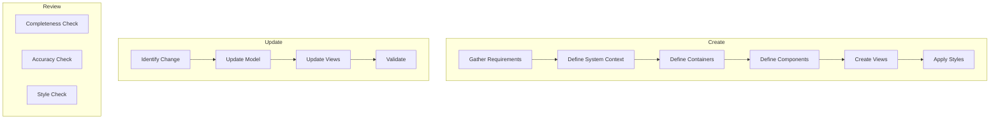

# Structurizr Authoring Workflows

Step-by-step procedures for creating and maintaining C4 models.

---

## Workflow Overview



---

## Workflow 1: Create New Workspace

### Step 1: Gather Requirements

Before modeling, understand:

```yaml
questions:
  - What is the system name and purpose?
  - Who are the users (people/roles)?
  - What external systems does it interact with?
  - What are the major technical components?
  - What technologies are used?
```

### Step 2: Create Workspace Structure

```dsl
workspace "{SystemName}" "{Brief description}" {

    !identifiers hierarchical

    model {
        # Elements will go here
    }

    views {
        # Diagrams will go here
    }
}
```

### Step 3: Define People and External Systems

Identify actors first:

```dsl
model {
    # People who use the system
    customer = person "Customer" "Places orders and tracks deliveries"
    admin = person "Admin" "Manages products and orders"

    # External systems
    paymentProvider = softwareSystem "Payment Gateway" "Processes payments" "External"
    emailService = softwareSystem "Email Service" "Sends notifications" "External"
}
```

### Step 4: Define the Main System

Create the software system boundary:

```dsl
model {
    # ... people and external systems ...

    system = softwareSystem "{SystemName}" "{Description}" {
        # Containers will go here
    }
}
```

### Step 5: Add Containers

Break down into deployable units:

```dsl
system = softwareSystem "E-Commerce Platform" "Online shopping" {

    # User-facing
    webApp = container "Web Application" "Customer storefront" "React" "webapp"
    mobileApp = container "Mobile App" "iOS/Android app" "React Native" "mobile"

    # Backend
    api = container "API" "Backend services" "Node.js/Express"

    # Data
    database = container "Database" "Product and order data" "PostgreSQL" "database"
    cache = container "Cache" "Session and product cache" "Redis" "cache"

    # Async
    queue = container "Message Queue" "Order processing" "RabbitMQ" "queue"
    worker = container "Worker" "Background jobs" "Node.js"
}
```

### Step 6: Add Relationships

Connect elements with meaningful descriptions:

```dsl
model {
    # People to system
    customer -> webApp "Browses and orders via" "HTTPS"
    customer -> mobileApp "Browses and orders via" "HTTPS"
    admin -> webApp "Manages via" "HTTPS"

    # Internal
    webApp -> api "Makes API calls to" "HTTPS/JSON"
    mobileApp -> api "Makes API calls to" "HTTPS/JSON"
    api -> database "Reads/writes" "SQL/TCP"
    api -> cache "Caches data in" "Redis Protocol"
    api -> queue "Publishes orders to" "AMQP"
    worker -> queue "Consumes from" "AMQP"
    worker -> database "Updates" "SQL/TCP"

    # External
    api -> paymentProvider "Processes payments via" "HTTPS/REST"
    worker -> emailService "Sends emails via" "SMTP"
}
```

### Step 7: Create Views

Define diagrams for each level:

```dsl
views {
    # Level 1: System Context
    systemContext system "SystemContext" {
        include *
        autoLayout
        description "System context showing users and external systems"
    }

    # Level 2: Containers
    container system "Containers" {
        include *
        autoLayout
        description "Container diagram showing technical building blocks"
    }

    # Default styles
    styles {
        element "Software System" {
            background #1168bd
            color #ffffff
        }
        element "Container" {
            background #438dd5
            color #ffffff
        }
        element "Person" {
            shape Person
            background #08427b
            color #ffffff
        }
        element "External" {
            background #999999
        }
        element "database" {
            shape Cylinder
        }
        element "queue" {
            shape Pipe
        }
        element "webapp" {
            shape WebBrowser
        }
        element "mobile" {
            shape MobileDeviceLandscape
        }
    }
}
```

### Step 8: Validate and Refine

```bash
# Validate syntax
structurizr-cli validate -workspace workspace.dsl

# Preview locally
docker run -it --rm -p 8080:8080 \
  -v $(pwd):/usr/local/structurizr \
  structurizr/lite
```

Check:
- [ ] All elements have descriptions
- [ ] All relationships have descriptions
- [ ] No orphan elements (unconnected)
- [ ] Views show all relevant elements
- [ ] Styles applied consistently

---

## Workflow 2: Add Components

When you need to detail a container's internals.

### Step 1: Identify Container

Determine which container needs component breakdown:

```yaml
criteria:
  - Complex enough to warrant decomposition
  - Multiple distinct responsibilities
  - Team needs to understand internals
```

### Step 2: List Components

Identify logical components:

```yaml
api_components:
  - name: "AuthController"
    responsibility: "Handle authentication"
    technology: "Express Router"

  - name: "OrderController"
    responsibility: "Handle order operations"
    technology: "Express Router"

  - name: "OrderService"
    responsibility: "Order business logic"
    technology: "TypeScript"

  - name: "OrderRepository"
    responsibility: "Order data access"
    technology: "Prisma"
```

### Step 3: Add Component Block

```dsl
api = container "API" "Backend services" "Node.js/Express" {

    # Controllers (presentation)
    authController = component "Auth Controller" "Authentication endpoints" "Express"
    orderController = component "Order Controller" "Order endpoints" "Express"
    productController = component "Product Controller" "Product endpoints" "Express"

    # Services (business logic)
    authService = component "Auth Service" "Authentication logic" "TypeScript"
    orderService = component "Order Service" "Order processing" "TypeScript"
    productService = component "Product Service" "Product management" "TypeScript"

    # Repositories (data access)
    userRepository = component "User Repository" "User data access" "Prisma"
    orderRepository = component "Order Repository" "Order data access" "Prisma"
    productRepository = component "Product Repository" "Product data access" "Prisma"
}
```

### Step 4: Add Component Relationships

```dsl
# Controller -> Service
authController -> authService "Uses"
orderController -> orderService "Uses"
productController -> productService "Uses"

# Service -> Repository
authService -> userRepository "Uses"
orderService -> orderRepository "Uses"
orderService -> productService "Validates products with"
productService -> productRepository "Uses"

# Repository -> Database
userRepository -> database "Queries"
orderRepository -> database "Queries"
productRepository -> database "Queries"
```

### Step 5: Create Component View

```dsl
views {
    component api "API-Components" {
        include *
        autoLayout
        description "Component diagram for the API container"
    }
}
```

---

## Workflow 3: Update Existing Model

When the system changes.

### Step 1: Identify the Change

```yaml
change_types:
  - new_container: "Adding a new service"
  - new_relationship: "New integration"
  - technology_change: "Migrating database"
  - remove_element: "Deprecating service"
  - rename: "Rebranding component"
```

### Step 2: Locate Affected Elements

Find in workspace.dsl:
- Element definitions
- Relationships involving the element
- Views that include the element

### Step 3: Make Changes

#### Adding New Container

```dsl
# Add to model
notificationService = container "Notification Service" "Push notifications" "Go"

# Add relationships
api -> notificationService "Sends notifications via" "gRPC"
notificationService -> database "Reads user preferences" "SQL"

# Update views (if not using include *)
container system "Containers" {
    include *  # Automatically includes new container
}
```

#### Removing Container

```dsl
# 1. Remove all relationships involving the container
# 2. Remove the container definition
# 3. Check views for explicit includes
```

#### Changing Technology

```dsl
# Before
database = container "Database" "Data storage" "MySQL" "database"

# After
database = container "Database" "Data storage" "PostgreSQL" "database"

# Update relationship descriptions if protocol changed
api -> database "Reads/writes" "SQL/TCP"  # May need update
```

### Step 4: Validate

```bash
structurizr-cli validate -workspace workspace.dsl
```

Check:
- [ ] No broken references
- [ ] Relationships still make sense
- [ ] Views include new elements
- [ ] Descriptions are accurate

---

## Workflow 4: Add Dynamic View

Show runtime behavior/sequences.

### Step 1: Identify the Flow

```yaml
flow:
  name: "User Login"
  actors: [user, webApp, api, database]
  trigger: "User submits credentials"
  outcome: "User receives JWT token"
```

### Step 2: List Steps

```yaml
steps:
  1: User -> webApp: "Enters credentials"
  2: webApp -> api: "POST /auth/login"
  3: api -> database: "Validate credentials"
  4: database -> api: "User record"
  5: api -> api: "Generate JWT"
  6: api -> webApp: "Return token"
  7: webApp -> user: "Redirect to dashboard"
```

### Step 3: Create Dynamic View

```dsl
views {
    dynamic system "UserLogin" "User authentication flow" {
        user -> webApp "1. Enters email and password"
        webApp -> api "2. POST /auth/login"
        api -> database "3. SELECT user WHERE email = ?"
        database -> api "4. User record or null"
        api -> webApp "5. JWT token or error"
        webApp -> user "6. Redirect to dashboard or show error"

        autoLayout
    }
}
```

### Step 4: Refine

- Use numbered steps for clarity
- Keep descriptions concise
- Show error paths in separate dynamic view if complex

---

## Workflow 5: Add Deployment View

Show infrastructure mapping.

### Step 1: Identify Environment

```yaml
environments:
  - Development
  - Staging
  - Production
```

### Step 2: Map Infrastructure

```yaml
production:
  cloud: AWS
  nodes:
    - name: "ECS Cluster"
      containers: [api, worker]
    - name: "RDS"
      containers: [database]
    - name: "ElastiCache"
      containers: [cache]
    - name: "CloudFront"
      containers: [webApp]
```

### Step 3: Create Deployment Model

```dsl
model {
    # ... existing model ...

    production = deploymentEnvironment "Production" {

        deploymentNode "AWS" "Amazon Web Services" "Cloud" {

            deploymentNode "us-east-1" "N. Virginia" "Region" {

                deploymentNode "ECS Cluster" "Container orchestration" "AWS ECS" {
                    containerInstance api
                    containerInstance worker
                }

                deploymentNode "RDS" "Managed database" "AWS RDS" {
                    containerInstance database
                }

                deploymentNode "ElastiCache" "Managed cache" "AWS ElastiCache" {
                    containerInstance cache
                }
            }

            deploymentNode "CloudFront" "CDN" "AWS CloudFront" {
                containerInstance webApp
            }
        }
    }
}
```

### Step 4: Create Deployment View

```dsl
views {
    deployment system production "Production" {
        include *
        autoLayout
        description "Production deployment on AWS"
    }
}
```

---

## Workflow 6: Review Model

Ensure model quality and accuracy.

### Step 1: Completeness Check

```yaml
checklist:
  elements:
    - All elements have names: true
    - All elements have descriptions: true
    - No orphan elements: true
    - Technologies specified: true

  relationships:
    - All have descriptions: true
    - Technologies/protocols specified: true
    - Direction is correct: true

  views:
    - System Context exists: true
    - Container view exists: true
    - All elements visible: true
```

### Step 2: Accuracy Check

Compare model to reality:

```yaml
verify:
  - Does the model match current architecture?
  - Are deprecated elements removed?
  - Are new services included?
  - Are relationships still valid?
```

### Step 3: Style Check

```yaml
style_review:
  - Consistent naming conventions
  - Appropriate shapes for element types
  - Colors distinguish element types
  - Layout is readable
```

### Step 4: Document Gaps

```yaml
gaps:
  - "Payment Service added but not in model"
  - "Legacy API deprecated but still shown"
  - "Missing deployment view for staging"
```

---

## Quick Reference: Common Tasks

| Task | Key Steps |
|------|-----------|
| Add person | Define in model, add relationships, check views |
| Add container | Define in system, add relationships, views update |
| Add component | Define in container block, add internal relationships |
| Add relationship | Source -> target with description and technology |
| Add view | Define in views block, include elements, autoLayout |
| Change technology | Update container/component definition, check descriptions |
| Remove element | Remove relationships first, then definition, check views |
