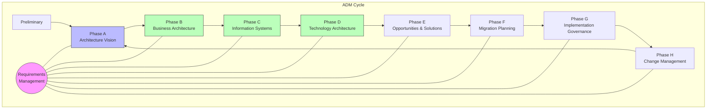

# TOGAF Skill Family

Enterprise architecture skills based on The Open Group Architecture Framework (TOGAF).

---

## Overview

TOGAF provides a comprehensive approach to designing, planning, implementing, and governing enterprise architecture. This skill family implements TOGAF concepts as modular, invokable workflows.

### Architecture

| Layer | Location | Purpose |
|-------|----------|---------|
| **Core Concepts** | [core/architecture-thinking.md](../../../core/architecture-thinking.md) | Foundational thinking (always active) |
| **ADM Phase Skills** | This directory | Invokable workflows per phase |
| **Templates & Artifacts** | Within each skill | TOGAF-compliant deliverables |

### Why Modular?

- ADM phases can be used independently
- Core concepts benefit all architecture work
- Allows gradual adoption vs all-or-nothing
- Skills can be invoked as needed

---

## The ADM Cycle

The Architecture Development Method (ADM) is TOGAF's core process.



### Phase Summary

| Phase | Name | Purpose | Key Outputs |
|-------|------|---------|-------------|
| **Preliminary** | Framework Setup | Establish architecture capability | Principles, Governance Framework |
| **A** | Architecture Vision | Define scope and stakeholders | Vision Document, Stakeholder Map |
| **B** | Business Architecture | Define business strategy and governance | Business Capability Map, Process Models |
| **C** | Information Systems | Define data and application architecture | Data Models, Application Portfolio |
| **D** | Technology Architecture | Define technology infrastructure | Technology Standards, Infrastructure Diagrams |
| **E** | Opportunities & Solutions | Identify implementation approach | Project List, Transition Architectures |
| **F** | Migration Planning | Create implementation roadmap | Migration Plan, Project Charters |
| **G** | Implementation Governance | Ensure conformance | Architecture Contracts, Compliance Reviews |
| **H** | Change Management | Manage ongoing changes | Change Requests, Architecture Updates |

---

## Available Skills

### Currently Implemented

| Skill | Phase | Status | Path |
|-------|-------|--------|------|
| **vision** | Phase A | Available | [vision/](vision/) |
| **business-architecture** | Phase B | Available | [business-architecture/](business-architecture/) |
| **information-systems** | Phase C | Available | [information-systems/](information-systems/) |
| **technology-architecture** | Phase D | Available | [technology-architecture/](technology-architecture/) |
| **opportunities-solutions** | Phase E | Available | [opportunities-solutions/](opportunities-solutions/) |

### Planned

| Skill | Phase | Status |
|-------|-------|--------|
| preliminary | Preliminary | Planned |
| migration-planning | Phase F | Planned |
| implementation-governance | Phase G | Planned |
| change-management | Phase H | Planned |

---

## When to Use Each Phase

### Starting a New Initiative

```
"We need to modernize our order management system"
```

**Start with**: Phase A (Architecture Vision)
- Define scope and objectives
- Identify stakeholders
- Create high-level vision
- Get approval to proceed

### Understanding the Business

```
"What capabilities do we need to support the new strategy?"
```

**Use**: Phase B (Business Architecture)
- Map business capabilities
- Model value streams
- Document processes
- Identify gaps

### Designing Systems

```
"How should we structure our data and applications?"
```

**Use**: Phase C (Information Systems Architecture)
- Define data entities and relationships
- Design application components
- Plan integrations

### Planning Technology

```
"What infrastructure and platforms do we need?"
```

**Use**: Phase D (Technology Architecture)
- Define technology standards
- Design infrastructure
- Plan platform evolution

### Planning Implementation

```
"How do we get from here to there?"
```

**Use**: Phases E + F (Opportunities & Migration)
- Identify projects
- Create roadmap
- Plan transitions

### Ensuring Compliance

```
"Is this implementation following our architecture?"
```

**Use**: Phase G (Implementation Governance)
- Review implementations
- Manage contracts
- Handle exceptions

### Managing Change

```
"The requirements have changed, now what?"
```

**Use**: Phase H (Change Management)
- Assess impact
- Update architectures
- Restart cycle if needed

---

## Invocation Patterns

```
"Apply TOGAF"                           → Determine phase, guide through
"Create Architecture Vision"            → Phase A workflow
"Develop Business Architecture"         → Phase B workflow
"Map business capabilities"             → Phase B specific task
"Assess architecture compliance"        → Phase G workflow
"What TOGAF phase for {task}?"          → ADM navigation help
```

---

## Integration with Other Skills

| Existing Skill | TOGAF Integration |
|----------------|-------------------|
| `arch-analysis` | Feeds into Baseline Architecture (B/C/D) |
| `software-design` | Aligns with Application Architecture (C) |
| `tech-stack-decisions` | Supports Technology Architecture (D) |
| `security-analysis` | Cross-cuts all phases (security viewpoint) |

### Workflow Integration

1. **Analyze first**: Use `arch-analysis` to understand current state
2. **Apply TOGAF**: Use ADM phases to plan target state
3. **Design solutions**: Use `software-design` for detailed design
4. **Choose technologies**: Use `tech-stack-decisions` for evaluations

---

## Tailoring TOGAF

TOGAF is meant to be tailored. These skills support:

### Full Formal Application

Complete ADM cycle with all artifacts for major initiatives.

### Lightweight Application

Subset of phases for smaller projects:
- Vision only (quick alignment)
- Vision + one architecture domain
- Vision + Roadmap (E/F)

### Partial Use

Individual phases used standalone:
- Business capability mapping
- Technology standards definition
- Compliance assessment

### Iteration

ADM is iterative, not waterfall:
- Re-enter at any phase
- Iterate between phases
- Track architecture versions

---

## Core Concepts Reference

These concepts from [architecture-thinking.md](../../../core/architecture-thinking.md) apply across all phases:

- **Architecture Domains**: Business, Data, Application, Technology
- **Stakeholder Thinking**: Identify concerns, tailor communication
- **Architecture Principles**: Guide decisions consistently
- **Baseline vs Target**: Document current and desired states
- **Gap Analysis**: Identify what needs to change
- **Roadmap Prioritization**: Prioritize gaps into actionable plans
- **Risk Analysis**: Identify and mitigate architecture risks
- **Enterprise Continuum**: Prefer reuse over custom

---

## Getting Started

### For New Architecture Work

1. Read [architecture-thinking.md](../../../core/architecture-thinking.md) for foundation
2. Start with [vision/](vision/) (Phase A) to define scope
3. Proceed through relevant phases based on scope

### For Existing Projects

1. Use `arch-analysis` to document current state
2. Apply relevant TOGAF phase for planning changes
3. Use gap analysis to create roadmap

### Quick Reference

```
Need to...                          Use...
─────────────────────────────────────────────────────
Define scope and get buy-in       → Phase A (Vision)
Understand business needs         → Phase B (Business)
Design data/apps                  → Phase C (Info Systems)
Plan infrastructure               → Phase D (Technology)
Create implementation plan        → Phase E/F (Planning)
Ensure compliance                 → Phase G (Governance)
Handle changes                    → Phase H (Change Mgmt)
```
