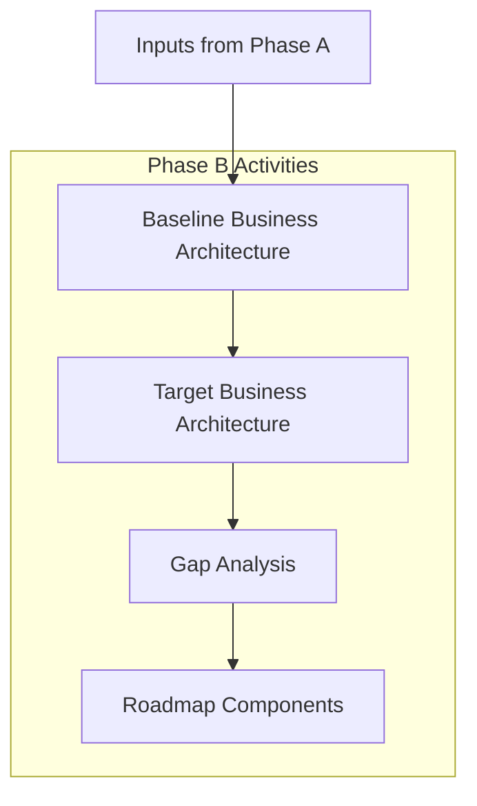

# Business Architecture Skill (TOGAF Phase B)

Develops the business architecture to support the agreed Architecture Vision.

---

## Purpose

Phase B establishes:
- **Business Capabilities**: What the organization can do
- **Value Streams**: How value flows to customers
- **Business Processes**: How work gets done
- **Organization Structure**: Who does what
- **Business Services**: What services the business provides

This phase bridges the **Vision** (Phase A) to **Information Systems** (Phase C).

---

## When to Use

Invoke this skill when:

- Architecture Vision (Phase A) is approved
- Need to understand business requirements for a system
- Mapping capabilities to support strategic goals
- Identifying business process improvements
- Analyzing organization impacts of change

**Trigger phrases**:
```
"Develop Business Architecture for..."
"Map business capabilities for..."
"Start TOGAF Phase B for..."
"What business processes support...?"
"Analyze the value stream for..."
```

---

## Key Concepts

### Business Capability

What the organization **can do** (not how it does it).

```
Capability: "Order Management"
├── Sub-capability: "Order Capture"
├── Sub-capability: "Order Fulfillment"
└── Sub-capability: "Order Tracking"
```

Capabilities are:
- Stable (don't change with org structure)
- Business-focused (not technology)
- Hierarchical (can decompose)

### Value Stream

How the organization **creates value** for stakeholders.

```
Value Stream: "Product to Cash"
├── Stage: Opportunity Identification
├── Stage: Solution Design
├── Stage: Order Processing
├── Stage: Delivery
└── Stage: Payment Collection
```

### Business Process

**How** capabilities are executed.

```
Process: "Process Customer Order"
├── Step: Receive order
├── Step: Validate items
├── Step: Check inventory
├── Step: Allocate stock
└── Step: Confirm order
```

### Business Service

What the business **exposes** to consumers.

```
Service: "Order Placement Service"
├── Input: Order request
├── Output: Order confirmation
├── SLA: < 500ms response
└── Channel: Web, Mobile, API
```

---

## Deliverables

| Artifact | Purpose |
|----------|---------|
| **Business Capability Map** | Hierarchical view of what the business does |
| **Value Stream Map** | How value flows to customers/stakeholders |
| **Business Process Models** | How work gets done (current and target) |
| **Organization Map** | Structure and responsibilities |
| **Business Service Catalog** | Services the business provides |
| **Gap Analysis** | Differences between baseline and target |

---

## Workflow Overview



1. **Baseline**: Document current state business architecture
2. **Target**: Define desired state aligned to vision
3. **Gap Analysis**: Identify what needs to change
4. **Roadmap**: Input to transition planning

---

## Prerequisites

Before starting Phase B:

- [ ] Architecture Vision (Phase A) complete
- [ ] Scope defined and approved
- [ ] Key stakeholders identified
- [ ] Access to business stakeholders for interviews

---

## Integration with Other Skills

| Skill | Integration |
|-------|-------------|
| `arch-analysis` | Provides baseline understanding |
| `vision` (Phase A) | Provides scope and objectives |
| `information-systems` (Phase C) | Consumes business requirements |
| `software-design` | Informs application structure |

---

## Modeling Notations

### Business Capability Heatmap

```
┌─────────────────────────────────────────────────┐
│           CUSTOMER-FACING CAPABILITIES          │
├───────────────┬───────────────┬─────────────────┤
│    Sales      │   Marketing   │    Service      │
│   🟡 Medium   │   🟢 Strong   │   🔴 Weak       │
├───────────────┼───────────────┼─────────────────┤
│ Lead Mgmt     │ Campaign Mgmt │ Case Mgmt       │
│ Quote Mgmt    │ Content Mgmt  │ Knowledge Base  │
│ Order Entry   │ Analytics     │ Self-Service    │
└───────────────┴───────────────┴─────────────────┘
```

Legend: 🟢 Strong | 🟡 Medium | 🔴 Weak/Gap

### Value Stream Diagram

```
┌────────┐    ┌────────┐    ┌────────┐    ┌────────┐
│ Stage 1│───▶│ Stage 2│───▶│ Stage 3│───▶│ Stage 4│
│ Engage │    │ Qualify│    │ Deliver│    │ Support│
└────────┘    └────────┘    └────────┘    └────────┘
     │             │             │             │
     ▼             ▼             ▼             ▼
 Capabilities  Capabilities  Capabilities  Capabilities
```

### Process Flow (BPMN-style)

```
┌─────┐    ┌─────────┐    ◇        ┌─────────┐    ○
│Start│───▶│ Receive │───▶│Decision│───▶│ Process │───▶│End│
└─────┘    │ Order   │    ◇        │ Payment │    ○
           └─────────┘    │        └─────────┘
                         ▼ No
                    ┌─────────┐
                    │ Reject  │
                    └─────────┘
```

---

## Analysis Techniques

### Capability Assessment

| Capability | Maturity | Strategic Value | Investment Priority |
|------------|----------|-----------------|---------------------|
| Order Mgmt | 3/5 | High | High |
| Inventory | 2/5 | High | Critical |
| Reporting | 4/5 | Medium | Low |

### Value Stream Mapping

| Stage | Activities | Pain Points | Improvement Opportunities |
|-------|------------|-------------|---------------------------|
| Order Entry | Manual data entry | Slow, error-prone | Automate validation |
| Fulfillment | Pick, pack, ship | Inventory mismatches | Real-time sync |

### Organization Impact

| Role | Current State | Target State | Gap |
|------|---------------|--------------|-----|
| Order Processor | Manual entry | Exception handling | Training, tools |
| Warehouse Staff | Paper-based | Mobile scanning | Devices, training |

---

## References

- [Workflows](workflows.md) - Step-by-step procedures
- [Templates](templates.md) - Artifact templates
- [Checklist](checklist.md) - Completion criteria
- [Examples](examples.md) - Sample artifacts
- [TOGAF Index](../_index.md) - ADM overview
