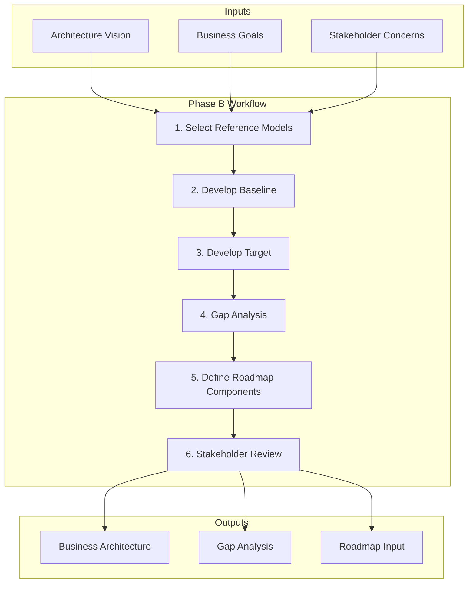

# Business Architecture Workflows

Step-by-step procedures for developing business architecture (TOGAF Phase B).

---

## Workflow Overview



---

## Step 1: Select Reference Models and Viewpoints

### 1.1 Choose Viewpoints

Based on stakeholder concerns, select relevant views:

| Viewpoint | When to Use | Stakeholders |
|-----------|-------------|--------------|
| Capability View | Always | Executives, strategists |
| Value Stream View | Value optimization | Product owners, customers |
| Process View | Operational improvement | Operations, process owners |
| Organization View | Restructuring, roles | HR, management |
| Information View | Data requirements | Data architects, analysts |

### 1.2 Select Reference Models

Consider industry frameworks:

| Industry | Reference Models |
|----------|------------------|
| Banking | BIAN, APQC Banking |
| Insurance | ACORD, LOMA |
| Retail | ARTS |
| Healthcare | HL7, HIMSS |
| Cross-industry | APQC PCF, eTOM |

### 1.3 Define Scope Boundaries

```yaml
in_scope:
  - capabilities: [list specific capabilities]
  - processes: [list specific processes]
  - organizations: [list specific units]

out_of_scope:
  - capabilities: [excluded capabilities]
  - note: "Phase 2 will address..."
```

---

## Step 2: Develop Baseline Business Architecture

### 2.1 Document Current Capabilities

Create capability inventory:

```yaml
capability:
  name: "Order Management"
  level: 1  # Top level
  description: "Ability to receive, process, and fulfill customer orders"
  owner: "VP Operations"
  maturity: 3  # 1-5 scale

  sub_capabilities:
    - name: "Order Capture"
      level: 2
      description: "Receive orders from all channels"
      maturity: 4
      applications: ["Order Portal", "Call Center System"]

    - name: "Order Fulfillment"
      level: 2
      description: "Pick, pack, and ship orders"
      maturity: 2
      applications: ["WMS", "Shipping System"]
      gaps: ["Manual processes", "No real-time inventory"]
```

### 2.2 Map Current Value Streams

Document how value flows:

```yaml
value_stream:
  name: "Order to Cash"
  customer_segment: "B2B Customers"
  value_proposition: "Reliable product delivery"

  stages:
    - name: "Order Placement"
      triggering_event: "Customer submits order"
      capabilities: ["Order Capture", "Customer Validation"]
      pain_points: ["Manual entry", "Duplicate data"]
      cycle_time: "15 min average"

    - name: "Order Processing"
      capabilities: ["Order Validation", "Inventory Check"]
      pain_points: ["Inventory sync delays"]
      cycle_time: "2 hours average"

    - name: "Fulfillment"
      capabilities: ["Order Fulfillment", "Shipping"]
      pain_points: ["Paper-based picking"]
      cycle_time: "1-2 days"

    - name: "Invoicing"
      capabilities: ["Billing", "A/R Management"]
      pain_points: ["Manual invoice creation"]
      cycle_time: "1 day"
```

### 2.3 Document Current Processes

For key processes, document:

```yaml
process:
  name: "Process Customer Order"
  owner: "Order Management Team"
  frequency: "500/day"
  trigger: "Order received from any channel"

  steps:
    - id: 1
      name: "Receive Order"
      actor: "System/Agent"
      system: "Order Portal"
      description: "Order enters system"

    - id: 2
      name: "Validate Customer"
      actor: "System"
      system: "CRM"
      description: "Check customer status and credit"
      decision: "Valid customer?"

    - id: 3
      name: "Check Inventory"
      actor: "System"
      system: "Inventory System"
      description: "Verify stock availability"
      pain_point: "Batch updates cause inaccuracy"

  metrics:
    - name: "Order Processing Time"
      current: "4 hours"
      target: "< 1 hour"
    - name: "Order Error Rate"
      current: "5%"
      target: "< 1%"
```

### 2.4 Document Organization Structure

```yaml
organization:
  unit: "Operations Division"
  head: "VP Operations"

  teams:
    - name: "Order Management"
      size: 25
      location: "HQ"
      capabilities: ["Order Capture", "Order Processing"]

    - name: "Warehouse Operations"
      size: 50
      location: "Distribution Center"
      capabilities: ["Inventory Mgmt", "Fulfillment"]
```

---

## Step 3: Develop Target Business Architecture

### 3.1 Define Target Capabilities

Based on vision and goals:

```yaml
target_capability:
  name: "Order Management"
  target_maturity: 5
  target_state:
    - "Real-time inventory visibility"
    - "Automated validation and routing"
    - "Self-service order tracking"

  new_sub_capabilities:
    - name: "Intelligent Order Routing"
      description: "Auto-route orders to optimal fulfillment center"
      rationale: "Reduce shipping costs, improve speed"
```

### 3.2 Define Target Value Streams

Optimize value flow:

```yaml
target_value_stream:
  name: "Order to Cash"

  improvements:
    - stage: "Order Placement"
      changes:
        - "Single-entry across channels"
        - "Real-time validation"
      target_cycle_time: "< 2 min"

    - stage: "Fulfillment"
      changes:
        - "Mobile-guided picking"
        - "Automated packing stations"
      target_cycle_time: "< 4 hours"
```

### 3.3 Define Target Processes

Design improved processes:

```yaml
target_process:
  name: "Process Customer Order"
  target_metrics:
    processing_time: "< 1 hour"
    error_rate: "< 1%"

  changes:
    - type: "Automation"
      step: "Validate Customer"
      description: "Automated credit check integration"

    - type: "Elimination"
      step: "Manual data entry"
      description: "Direct integration with customer systems"

    - type: "New Step"
      step: "Intelligent Routing"
      description: "Auto-select fulfillment location"
```

### 3.4 Define Organization Changes

```yaml
target_organization:
  changes:
    - type: "New Role"
      name: "Order Experience Manager"
      rationale: "End-to-end order journey ownership"

    - type: "Skill Development"
      team: "Order Management"
      skills: ["Exception handling", "Customer communication"]

    - type: "Consolidation"
      from: ["Manual Processing Team", "Data Entry Team"]
      to: "Automation Support Team"
```

---

## Step 4: Gap Analysis

### 4.1 Capability Gaps

| Capability | Baseline | Target | Gap | Priority |
|------------|----------|--------|-----|----------|
| Order Capture | 4 | 5 | Minor | Medium |
| Inventory Mgmt | 2 | 5 | Major | Critical |
| Analytics | 2 | 4 | Significant | High |

### 4.2 Process Gaps

| Process | Gap Type | Description | Impact |
|---------|----------|-------------|--------|
| Order Processing | Automation | Manual steps need automation | High |
| Inventory Sync | Integration | Real-time sync needed | Critical |
| Reporting | Data | Missing metrics | Medium |

### 4.3 Organization Gaps

| Area | Gap | Resolution |
|------|-----|------------|
| Skills | Digital skills lacking | Training program |
| Roles | No E2E ownership | Create new role |
| Capacity | Insufficient for growth | Hire + automate |

---

## Step 5: Define Roadmap Components

### 5.1 Identify Work Packages

From gaps, create work packages:

```yaml
work_packages:
  - id: "WP-B-001"
    name: "Real-time Inventory Capability"
    description: "Enable real-time inventory visibility across channels"
    gaps_addressed: ["Inventory Mgmt", "Order Processing"]
    dependencies: []
    estimated_effort: "Large"

  - id: "WP-B-002"
    name: "Order Automation"
    description: "Automate order validation and routing"
    gaps_addressed: ["Order Processing", "Order Capture"]
    dependencies: ["WP-B-001"]
    estimated_effort: "Medium"
```

### 5.2 Prioritize Work Packages

| Work Package | Business Value | Complexity | Dependencies | Priority |
|--------------|---------------|------------|--------------|----------|
| WP-B-001 | High | High | None | 1 |
| WP-B-002 | High | Medium | WP-B-001 | 2 |
| WP-B-003 | Medium | Low | None | 3 |

### 5.3 Define Transition States

```yaml
transitions:
  - state: "Baseline"
    description: "Current manual processes"

  - state: "Transition 1"
    description: "Real-time inventory enabled"
    work_packages: ["WP-B-001"]
    timeline: "Q2"

  - state: "Transition 2"
    description: "Order automation complete"
    work_packages: ["WP-B-002"]
    timeline: "Q4"

  - state: "Target"
    description: "Full automation and optimization"
    timeline: "Q2 Next Year"
```

---

## Step 6: Stakeholder Review

### 6.1 Prepare Review Materials

- Executive summary (1-2 pages)
- Capability map with gaps highlighted
- Value stream improvements
- Key process changes
- Organization impacts
- Roadmap summary

### 6.2 Conduct Reviews

| Audience | Focus | Materials |
|----------|-------|-----------|
| Executive | Business case, investment | Summary, roadmap |
| Operations | Process changes, impacts | Process models, org changes |
| IT | System implications | Capability-system mapping |
| HR | People impacts | Organization changes, training |

### 6.3 Incorporate Feedback

Document decisions and changes:

```yaml
review_decisions:
  - date: "YYYY-MM-DD"
    stakeholder: "VP Operations"
    decision: "Approved with changes"
    changes:
      - "Phase inventory project first"
      - "Add change management workstream"
```

---

## Quick Reference: Phase B Steps

| Step | Key Activities | Outputs |
|------|---------------|---------|
| 1. Setup | Select viewpoints, reference models | Scope definition |
| 2. Baseline | Document current capabilities, processes | Baseline architecture |
| 3. Target | Define future state aligned to vision | Target architecture |
| 4. Gap Analysis | Compare baseline to target | Gap catalog |
| 5. Roadmap | Identify work packages, transitions | Roadmap components |
| 6. Review | Validate with stakeholders | Approved architecture |
