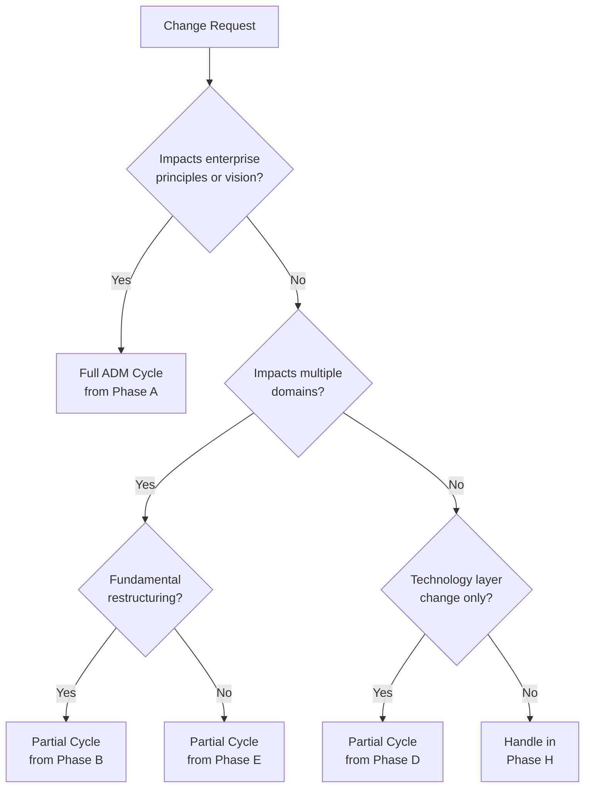

# Change Management Skill

TOGAF ADM Phase H: Architecture Change Management

---

## Purpose

Phase H ensures that the architecture remains relevant and responsive to business needs over time. It establishes processes to:

- **Monitor** the implemented architecture for required changes
- **Assess** change requests against architecture principles
- **Manage** the lifecycle of architecture changes
- **Decide** when to initiate a new ADM cycle
- **Maintain** architecture governance through evolution

---

## When to Use This Skill

| Scenario | Use Case |
|----------|----------|
| Post-Implementation | Architecture deployed, entering steady-state operations |
| Change Request Received | Business or technology change needs architectural assessment |
| Environmental Shift | Market, regulatory, or technology landscape changes |
| Performance Gap | Realized architecture not meeting expectations |
| Strategic Pivot | Business strategy shift requiring architecture review |
| Periodic Review | Scheduled architecture health assessment |

---

## Key Concepts

### Architecture Change Continuum

Changes exist on a spectrum from minor adjustments to major transformations:

```
┌─────────────────────────────────────────────────────────────────────┐
│                    ARCHITECTURE CHANGE CONTINUUM                     │
├─────────────┬─────────────────┬──────────────────┬──────────────────┤
│ Simplification │ Incremental   │   Re-Architecture  │ Radical        │
│                │ Change        │                    │ Change         │
├─────────────┼─────────────────┼──────────────────┼──────────────────┤
│ Minor config  │ Component      │ Domain rebuild   │ Enterprise      │
│ optimization  │ enhancements   │ or replacement   │ transformation  │
│               │                │                  │                 │
│ Local impact  │ Bounded impact │ Domain impact    │ Enterprise-wide │
│               │                │                  │                 │
│ Weeks         │ Months         │ Quarters         │ Years           │
├─────────────┼─────────────────┼──────────────────┼──────────────────┤
│ Phase H       │ Phase H        │ New ADM Cycle    │ New ADM Cycle   │
│ (internal)    │ (governance)   │ (partial)        │ (full)          │
└─────────────┴─────────────────┴──────────────────┴──────────────────┘
```

### Change Drivers

| Category | Examples |
|----------|----------|
| **Business Drivers** | Strategy shifts, M&A, new markets, regulatory changes |
| **Technology Drivers** | New capabilities, deprecations, security vulnerabilities |
| **Operational Drivers** | Performance issues, operational challenges, cost pressure |
| **External Drivers** | Market disruption, competitor actions, ecosystem changes |

### Governance Levels

| Level | Scope | Authority | Examples |
|-------|-------|-----------|----------|
| **Enterprise** | Cross-domain changes | Architecture Board | New integration patterns, shared services |
| **Domain** | Single domain changes | Domain Architect | Component replacement, interface updates |
| **Solution** | Project-level changes | Solution Architect | Implementation decisions, tactical fixes |

---

## Key Deliverables

| Deliverable | Description | Audience |
|-------------|-------------|----------|
| **Architecture Change Request** | Formal proposal for architecture modification | Governance body |
| **Change Impact Assessment** | Analysis of change effects across architecture | Decision makers |
| **Change Decision** | Approved/rejected change with rationale | Requestor, teams |
| **Architecture Update** | Modified architecture artifacts | All stakeholders |
| **ADM Cycle Trigger** | Recommendation to initiate new cycle | Architecture Board |

---

## Phase Inputs and Outputs

### Inputs

| Input | Source | Description |
|-------|--------|-------------|
| Change Request | Business, IT, operations | Proposed modification |
| Performance Data | Monitoring systems | Actual vs expected metrics |
| Compliance Assessments | Phase G | Identified gaps and issues |
| Technology Roadmaps | Vendors, industry | Future capabilities and EOL |
| Strategic Plans | Business strategy | Direction changes |

### Outputs

| Output | Destination | Description |
|--------|-------------|-------------|
| Updated Architecture | Repository | Modified artifacts |
| Architecture Updates | Stakeholders | Communication of changes |
| New ADM Work Request | Architecture function | Trigger for new cycle |
| Lessons Learned | Knowledge base | Process improvements |

---

## Change Request Types

### Type 1: Technology Refresh

Replacement of technology components at end-of-life or for improvement.

| Aspect | Details |
|--------|---------|
| Trigger | EOL notice, security advisory, capability gap |
| Scope | Component or technology layer |
| Impact | Typically bounded to specific systems |
| Process | Phase H assessment, may trigger Phase D/E cycle |

### Type 2: Strategic Change

Changes driven by business strategy or market forces.

| Aspect | Details |
|--------|---------|
| Trigger | Strategy shift, M&A, market entry/exit |
| Scope | Multiple domains, potentially enterprise-wide |
| Impact | Significant, cross-cutting |
| Process | Usually triggers new ADM cycle from Phase A |

### Type 3: Defect Resolution

Fixes to architecture gaps discovered in implementation.

| Aspect | Details |
|--------|---------|
| Trigger | Phase G findings, operational issues |
| Scope | Specific architecture decisions |
| Impact | Localized, corrective |
| Process | Phase H internal, expedited |

### Type 4: Enhancement

Improvements to realize additional value or capability.

| Aspect | Details |
|--------|---------|
| Trigger | Stakeholder request, opportunity identified |
| Scope | Varies by enhancement scope |
| Impact | Additive, extending current architecture |
| Process | Phase H if minor, new cycle if major |

---

## Decision Framework

### Should This Change Trigger a New ADM Cycle?



### Change Classification Matrix

| Criteria | Minor (H) | Moderate (Partial) | Major (Full) |
|----------|-----------|--------------------|--------------| 
| Principle Impact | None | Limited | Significant |
| Domain Scope | Single | 2-3 Domains | Enterprise |
| Stakeholder Impact | Team | Department | Organization |
| Investment | < $100K | $100K-$1M | > $1M |
| Duration | < 3 months | 3-12 months | > 12 months |
| Risk | Low | Medium | High |

---

## Architecture Monitoring

### What to Monitor

| Category | Metrics | Threshold Examples |
|----------|---------|-------------------|
| **Conformance** | Deviation count, compliance score | >10% drift triggers review |
| **Performance** | Response times, availability, throughput | Missed SLAs trigger assessment |
| **Cost** | TCO, cloud spend, operational cost | >20% variance triggers review |
| **Technical Health** | Security vulnerabilities, tech debt score | Critical CVEs immediate, debt >threshold triggers |
| **Business Value** | Capability utilization, ROI metrics | <60% utilization triggers review |

### Monitoring Rhythm

| Activity | Frequency | Participants | Output |
|----------|-----------|--------------|--------|
| Health Dashboard Review | Weekly | Architecture team | Issue log |
| Architecture Health Report | Monthly | Domain architects | Status report |
| Strategic Alignment Review | Quarterly | Architecture Board | Priority changes |
| Comprehensive Assessment | Annually | Enterprise + business | ADM cycle decision |

---

## Integration with Other Phases

### Phase G → Phase H

- Compliance issues become change requests
- Deviation patterns indicate architecture gaps
- Lessons learned inform changes

### Phase H → Phase A

- Major changes trigger new vision work
- Architecture principles may need update
- Stakeholder concerns drive new initiatives

### Phase H → Phase E

- Moderate changes may skip to opportunities analysis
- New transition architectures may be needed
- Project portfolio adjustments

---

## Tools and Artifacts

| Tool | Purpose |
|------|---------|
| Change Request Register | Track all requests through lifecycle |
| Architecture Health Dashboard | Visualize monitoring metrics |
| Impact Assessment Template | Standardize change analysis |
| Decision Log | Record change decisions with rationale |
| Architecture Calendar | Schedule reviews and assessments |

---

## Invocation

Use this skill when:
- Processing architecture change requests
- Assessing impact of proposed modifications  
- Deciding between Phase H resolution vs new cycle
- Conducting periodic architecture reviews
- Managing architecture evolution

**Invoke with:**
```
Use skill: togaf/change-management
```
