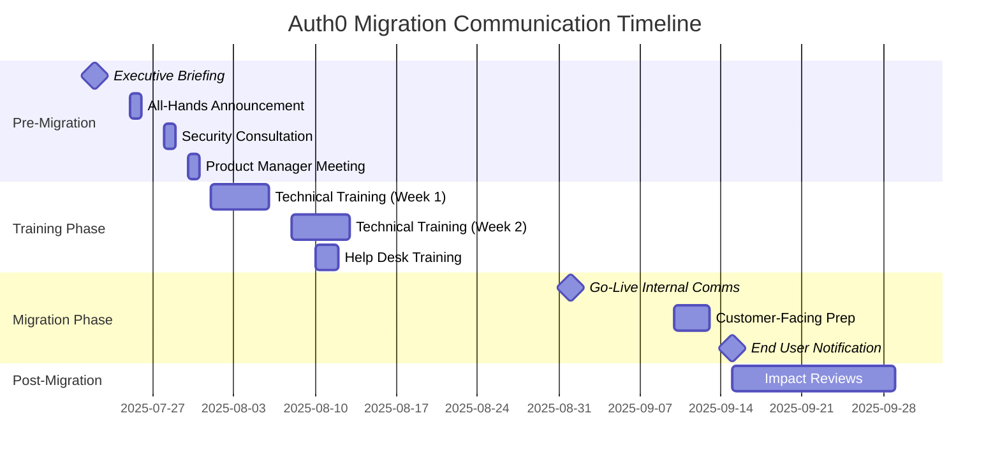

# Change Management Examples

Concrete examples for TOGAF Phase H deliverables.

---

## Architecture Change Request Example

```markdown
# Architecture Change Request

**Request ID**: ACR-2025-042
**Status**: Submitted
**Date**: 2025-06-15

---

## Request Information

| Attribute | Value |
|-----------|-------|
| **Request ID** | ACR-2025-042 |
| **Title** | Migrate Authentication to Auth0 |
| **Requestor** | David Kim |
| **Department** | Platform Engineering |
| **Date Submitted** | 2025-06-15 |
| **Urgency** | Medium |

---

## Change Description

### Summary
Replace our current on-premise Keycloak authentication system with Auth0 
cloud identity platform to reduce operational overhead and gain advanced 
identity features.

### Detailed Description
Our current authentication infrastructure uses self-managed Keycloak 
clusters across three data centers. This proposal is to migrate to 
Auth0's cloud-based identity platform, which would provide:

- Managed infrastructure (no patching, upgrades, or HA management)
- Built-in multi-factor authentication options
- Better social login integrations
- Passwordless authentication capabilities
- Improved developer experience with SDKs

The migration would affect all customer-facing applications (12 apps) 
and internal applications (8 apps) that currently authenticate against 
Keycloak.

### Current State
- Keycloak 22.x deployed across 3 data centers
- 6 VMs per cluster (18 VMs total)
- 2 FTEs dedicated to identity infrastructure
- ~500,000 active user accounts
- OAuth 2.0 / OIDC protocols in use

### Proposed Future State
- Auth0 Enterprise subscription
- Applications migrated to Auth0 SDKs
- User accounts migrated to Auth0
- Keycloak decommissioned
- Identity team refocused on IAM governance

---

## Change Driver

### Driver Type
| Type | Selected |
|------|----------|
| Business Strategy | ☐ |
| Technology Lifecycle | ☑ |
| Regulatory/Compliance | ☐ |
| Performance Issue | ☐ |
| Security Concern | ☐ |
| Cost Optimization | ☑ |
| Enhancement Request | ☑ |
| Defect Resolution | ☐ |

### Driver Details
1. **Operational Burden**: Keycloak requires significant operational 
   investment (patching, upgrades, HA). Recent Keycloak 23/24 upgrade 
   issues caused 3 days of team effort.

2. **Cost Optimization**: Total cost of Keycloak (infrastructure + 2 FTEs) 
   is approximately $450K/year. Auth0 Enterprise would be ~$180K/year 
   for our user volume.

3. **Feature Gap**: Business is requesting passwordless auth and improved 
   social login. Keycloak can do this but requires significant configuration 
   and maintenance.

### What Happens If We Don't Change
- Continued operational burden (2 FTEs focused on identity infra)
- Higher ongoing costs (~$270K/year more than Auth0)
- Slower delivery of identity features
- Keycloak 22 EOL in Q4 2025 requires major upgrade regardless

---

## Scope Estimate

### Affected Domains
| Domain | Affected | Impact Level |
|--------|----------|--------------|
| Business Architecture | ☐ | None |
| Data Architecture | ☑ | Low (user data migration) |
| Application Architecture | ☑ | High (all apps affected) |
| Technology Architecture | ☑ | High (identity platform change) |

### Affected Systems
| System | Impact Description |
|--------|-------------------|
| Customer Portal | SDK replacement, auth flow update |
| Mobile Apps (iOS/Android) | SDK replacement |
| Partner Portal | SDK replacement, SSO reconfiguration |
| Internal Apps (8) | SDK replacement |
| API Gateway | Token validation changes |
| User Database | Account migration to Auth0 |

### Estimated Scope
| Scope Level | Selected | Criteria |
|-------------|----------|----------|
| Minor | ☐ | Single domain, <3 months, <$100K |
| Moderate | ☑ | 2-3 domains, 3-12 months, $100K-$1M |
| Major | ☐ | Enterprise-wide, >12 months, >$1M |

---

## Stakeholders

| Stakeholder | Interest | Impact |
|-------------|----------|--------|
| End Users | Authentication experience | Medium |
| Application Teams | SDK changes, testing | High |
| Security Team | Identity security posture | High |
| Platform Team | Infrastructure changes | High |
| Finance | Cost impact | Medium |

---

## Supporting Information

### Related Documents
| Document | Link/Reference |
|----------|----------------|
| Auth0 Evaluation Report | /docs/evaluations/auth0-2025.pdf |
| Keycloak TCO Analysis | /docs/analysis/keycloak-tco.xlsx |
| Identity Roadmap | /architecture/roadmaps/identity.md |

### Related Changes
| Change ID | Relationship |
|-----------|--------------|
| ACR-2025-038 | Related (MFA enhancement - could be solved by this) |
| ACR-2025-041 | Prerequisite (API gateway upgrade) |

---

## Submission

| Submitted By | Date | Notes |
|--------------|------|-------|
| David Kim | 2025-06-15 | Initial submission |
```

---

## Change Impact Assessment Example

```markdown
# Change Impact Assessment

**Assessment ID**: CIA-2025-042
**Change Request**: ACR-2025-042
**Date**: 2025-06-22

---

## Assessment Information

| Attribute | Value |
|-----------|-------|
| **Assessment ID** | CIA-2025-042 |
| **Change Request** | ACR-2025-042: Migrate Authentication to Auth0 |
| **Assessor** | Sarah Chen, Enterprise Architect |
| **Assessment Date** | 2025-06-22 |
| **Assessment Duration** | 5 days |

---

## Executive Summary

### Recommendation
| Recommendation | Rationale |
|----------------|-----------|
| Approve | Cost savings, reduced operational burden, and feature benefits justify moderate implementation effort. Risk manageable with phased approach. |

### Key Findings
1. Migration is technically feasible with established patterns
2. Cost savings of ~$270K/year after first-year investment
3. All 20 applications will require updates
4. User migration can be done with zero password reset
5. 6-month implementation timeline is realistic

### Critical Considerations
- API Gateway upgrade (ACR-2025-041) must complete first
- Need Auth0 Enterprise contract negotiation
- Phased rollout recommended to manage risk

---

## Architecture Impact

### Principle Conformance
| Principle | Conformance | Notes |
|-----------|-------------|-------|
| Cloud-First | Conforms | Moves from on-prem to cloud |
| Buy vs Build | Conforms | SaaS over self-managed |
| Security by Design | Conforms | Auth0 has strong security posture |
| Loose Coupling | Conforms | Standard OIDC, apps not tied to vendor |

### Business Architecture Impact
| Aspect | Current | Proposed | Impact |
|--------|---------|----------|--------|
| Capabilities | On-prem identity | Cloud identity | Low |
| Processes | Manual user provisioning | SCIM automation | Low (positive) |
| Organization | 2 FTE identity ops | 0.5 FTE governance | Low (positive) |

### Data Architecture Impact
| Aspect | Current | Proposed | Impact |
|--------|---------|----------|--------|
| Data Entities | Users in PostgreSQL | Users in Auth0 | Medium |
| Data Quality | Managed internally | Auth0 managed | Low |
| Data Governance | Full control | Shared responsibility | Low |

### Application Architecture Impact
| Aspect | Current | Proposed | Impact |
|--------|---------|----------|--------|
| Applications | 20 apps with Keycloak SDK | 20 apps with Auth0 SDK | High |
| Integrations | LDAP, AD, SAML | Auth0 connectors | Medium |
| Services | Custom token service | Auth0 APIs | Medium |

### Technology Architecture Impact
| Aspect | Current | Proposed | Impact |
|--------|---------|----------|--------|
| Infrastructure | 18 VMs, 3 PostgreSQL clusters | Auth0 SaaS | High (reduction) |
| Platforms | Keycloak 22 | Auth0 | High |
| Standards | OIDC, OAuth 2.0 | OIDC, OAuth 2.0 | None |

---

## Dependency Analysis

### Upstream Dependencies
| Dependency | Type | Impact of Change |
|------------|------|------------------|
| Active Directory | Identity source | Needs Auth0 AD connector |
| HR System | User provisioning | Needs SCIM integration |
| API Gateway | Token validation | Must support Auth0 tokens |

### Downstream Dependencies
| Dependent | Type | Impact on Dependent |
|-----------|------|---------------------|
| All Applications | Auth | SDK replacement required |
| Mobile Apps | Auth | SDK and config update |
| Partner SSO | Federation | Reconfiguration needed |

### Related Initiatives
| Initiative | Relationship | Coordination Needed |
|------------|--------------|---------------------|
| API Gateway Upgrade | Prerequisite | Must complete first |
| Mobile App Refresh | Complementary | Can bundle auth changes |
| Customer Portal v3 | Parallel | Time auth change with release |

---

## Risk Assessment

### Implementation Risks
| Risk | Probability | Impact | Mitigation |
|------|-------------|--------|------------|
| User migration data loss | Low | High | Dry-run migrations, rollback plan |
| Application breaking changes | Medium | High | Phased rollout, extensive testing |
| Performance issues | Low | Medium | Load testing before go-live |
| Auth0 outage | Low | High | Review Auth0 SLA, DR procedures |
| Timeline slip | Medium | Medium | Buffer in schedule, MVP approach |

### Non-Implementation Risks
| Risk | Probability | Impact | Notes |
|------|-------------|--------|-------|
| Keycloak EOL | High | High | Keycloak 22 EOL Q4 2025 |
| Continued high cost | High | Medium | $270K/year opportunity cost |
| Feature requests delayed | High | Medium | Passwordless, social login |

### Risk Summary
| Factor | Assessment |
|--------|------------|
| Overall Risk Level | Medium |
| Risk Trend | Decreasing (with mitigations) |
| Reversibility | Partially Reversible (can re-deploy Keycloak) |

---

## Resource Estimate

### Effort Estimate
| Phase | Effort (person-days) | Notes |
|-------|---------------------|-------|
| Analysis/Design | 20 | Architecture, migration planning |
| Implementation | 120 | SDK updates across 20 apps |
| Testing | 40 | Integration, security, UAT |
| Deployment | 20 | Phased rollout, monitoring |
| **Total** | **200** | ~10 months with 2 developers |

### Timeline Estimate
| Milestone | Target Date | Notes |
|-----------|-------------|-------|
| API Gateway Complete | 2025-07-31 | Prerequisite |
| Design Complete | 2025-08-31 | |
| Pilot Apps Live | 2025-10-31 | 3 internal apps |
| Customer Apps Live | 2025-12-31 | Customer portal, mobile |
| Full Migration | 2026-02-28 | All apps, Keycloak decommissioned |

### Cost Estimate
| Category | Estimate | Notes |
|----------|----------|-------|
| Internal Labor | $160,000 | 200 person-days @ $800/day |
| External Labor | $0 | None needed |
| Software/Licenses | $180,000 | Auth0 Year 1 |
| Infrastructure | -$150,000 | Savings from Keycloak decomm |
| Other | $20,000 | Contingency |
| **Total Year 1** | **$210,000** | |
| **Annual Savings** | **$270,000** | Starting Year 2 |

### Skills Required
| Skill | Quantity | Availability |
|-------|----------|--------------|
| Identity/Auth specialist | 1 | Available |
| Full-stack developers | 2 | Available |
| DevOps engineer | 0.5 | Available |
| QA engineer | 1 | Constrained (Oct-Nov) |

---

## Stakeholder Impact

| Stakeholder | Impact | Concerns | Mitigation |
|-------------|--------|----------|------------|
| End Users | Low | Login experience change | Seamless migration, same UX |
| App Teams | High | Development effort | Clear migration guide, support |
| Security | Medium | New platform risk | Auth0 SOC2, security review |
| Platform | High | Decommission work | Phased, parallel operation |
| Finance | Low (positive) | Upfront investment | ROI within 12 months |

---

## Disposition Analysis

### Phase H vs New ADM Cycle
| Criterion | Assessment | Score |
|-----------|------------|-------|
| Impacts Enterprise Vision | No | 1 |
| Multi-Domain Impact | Limited (Tech + App) | 2 |
| Requires New Capabilities | Minor | 2 |
| Investment Scale | $100K-$1M | 3 |
| Timeline | 6-8 months | 2 |
| **Total Score** | | **10** |

| Score Range | Recommendation |
|-------------|----------------|
| 5-10 | Handle in Phase H ✓ |
| 11-18 | Partial ADM Cycle |
| 19-25 | Full ADM Cycle |

### Recommended Disposition
| Disposition | Rationale |
|-------------|-----------|
| Approve | Change is significant but contained to identity domain. Does not fundamentally alter enterprise architecture. Can be handled through normal change and project governance. Phase H approval with project-level oversight appropriate. |

---

## Appendices

### A. Affected Artifacts
| Artifact | Current Version | Changes Needed |
|----------|-----------------|----------------|
| Identity Architecture | v2.3 | Update for Auth0 |
| Security Standards | v1.8 | Add Auth0 requirements |
| Integration Patterns | v3.1 | Update auth pattern |
| Technology Catalog | v4.2 | Add Auth0, deprecate Keycloak |

### B. Consultation Log
| Date | Consulted | Input |
|------|-----------|-------|
| 2025-06-17 | Security Architect | Approved approach, requested pentest |
| 2025-06-18 | App Team Leads | Confirmed capacity, raised QA concern |
| 2025-06-19 | Platform Lead | Confirmed API Gateway timeline |
| 2025-06-20 | Finance | Approved cost model |
```

---

## Change Decision Record Example

```markdown
# Change Decision Record

**Decision ID**: CDR-2025-042
**Change Request**: ACR-2025-042
**Date**: 2025-06-28

---

## Decision Summary

| Attribute | Value |
|-----------|-------|
| **Change Request** | ACR-2025-042: Migrate Authentication to Auth0 |
| **Decision** | Approved with Conditions |
| **Decision Date** | 2025-06-28 |
| **Decision Authority** | Architecture Review Board |

---

## Decision Details

### Decision
The Architecture Review Board approves the migration from Keycloak to 
Auth0 as described in ACR-2025-042 and assessed in CIA-2025-042.

### Rationale
1. Strong business case with $270K annual savings after Year 1
2. Reduces operational burden, allowing team to focus on IAM governance
3. Enables feature requests (passwordless, enhanced MFA)
4. Addresses Keycloak 22 EOL requirement
5. Risk is manageable with phased approach and rollback plan

### Key Factors
1. Positive ROI within 12 months
2. Architecture principles alignment (Cloud-First, Buy vs Build)
3. Stakeholder support across teams
4. Manageable implementation risk
5. Clear migration path with established patterns

---

## Conditions

| Condition | Description | Due Date | Owner |
|-----------|-------------|----------|-------|
| Security Review | Complete Auth0 security assessment and pentest | 2025-08-15 | Security Team |
| Contract Review | Legal review of Auth0 Enterprise agreement | 2025-07-31 | Legal / Procurement |
| Rollback Plan | Document tested rollback procedures | 2025-09-30 | Platform Team |
| QA Capacity | Confirm QA resource availability Oct-Nov | 2025-07-15 | QA Manager |

---

## Next Steps

| Step | Owner | Due Date | Status |
|------|-------|----------|--------|
| Initiate Auth0 contract process | Procurement | 2025-07-05 | Open |
| Complete API Gateway upgrade | Platform Team | 2025-07-31 | In Progress |
| Create detailed project plan | David Kim | 2025-07-15 | Open |
| Schedule security assessment | Security Team | 2025-07-10 | Open |
| Communicate decision to stakeholders | Sarah Chen | 2025-06-30 | Open |

---

## Decision Record

| Role | Name | Decision | Date |
|------|------|----------|------|
| Enterprise Architect | Sarah Chen | Approve | 2025-06-28 |
| Security Architect | Michael Torres | Approve (with security review) | 2025-06-28 |
| Platform Lead | Jennifer Walsh | Approve | 2025-06-28 |
| CTO (Board Chair) | Robert Anderson | Approve | 2025-06-28 |

### Discussion Notes
- Board discussed Auth0 vendor lock-in concern; mitigated by using 
  standard OIDC protocols and abstraction layer in apps
- Security requested pre-production penetration test before customer 
  apps go live
- Platform confirmed API Gateway is on track for July completion
- Finance confirmed budget availability for Year 1 investment
- Board agreed to quarterly progress reviews during migration

---

## Change Request Closure

| Attribute | Value |
|-----------|-------|
| Closed Date | 2025-06-28 |
| Closed By | Sarah Chen |
| Final Status | Approved - Implementing |
```

---

## Architecture Health Report Excerpt

```markdown
# Architecture Health Report

**Report Period**: Q2 2025
**Report Date**: 2025-07-05

---

## Executive Summary

### Overall Health: Attention Needed

| Dimension | Status | Trend |
|-----------|--------|-------|
| Conformance | 🟡 Yellow | → |
| Performance | 🟢 Green | ↑ |
| Technical Health | 🟡 Yellow | ↓ |
| Business Alignment | 🟢 Green | → |

### Key Highlights
- Performance improved after CDN optimization (ACR-2025-031)
- 3 technologies approaching EOL requiring attention (Keycloak, Oracle 12c, Node 16)
- Customer Portal conformance at 92%, within target
- New strategic initiative (Digital Wallet) requiring architecture work

### Recommended Actions
| Priority | Action | Owner |
|----------|--------|-------|
| High | Proceed with Auth0 migration (ACR-2025-042 approved) | David Kim |
| High | Initiate Oracle 12c to 19c upgrade planning | DBA Team |
| Medium | Node 16 upgrade for 4 microservices | App Teams |
| Medium | Architecture assessment for Digital Wallet | Sarah Chen |

---

## Technical Health

### Technology Lifecycle
| Status | Count | Notable |
|--------|-------|---------|
| Current | 42 | |
| Approaching EOL | 3 | Keycloak 22, Oracle 12c, Node 16 |
| Past EOL | 1 | jQuery 2.x (legacy admin) |
| Unsupported | 0 | |

### Action Required
| Technology | EOL Date | Systems Affected | Change Request |
|------------|----------|------------------|----------------|
| Keycloak 22 | 2025-10 | 20 apps | ACR-2025-042 (approved) |
| Oracle 12c | 2025-12 | Finance, HR systems | ACR-2025-044 (pending) |
| Node 16 | 2025-09 | 4 microservices | ACR-2025-045 (pending) |

---

## Change Activity

### Change Requests This Quarter
| Metric | Q2 2025 | Q1 2025 | Trend |
|--------|---------|---------|-------|
| Submitted | 12 | 9 | ↑ |
| Approved | 8 | 7 | ↑ |
| Rejected | 2 | 1 | ↑ |
| In Progress | 4 | 3 | ↑ |

### Notable Changes
| Change | Status | Impact |
|--------|--------|--------|
| Auth0 Migration | Approved | High - identity platform |
| CDN Optimization | Complete | Medium - performance |
| GraphQL Gateway | In Progress | Medium - API layer |
| Mobile BFF | Approved | Medium - mobile platform |

---

## Recommendations

### ADM Cycle Candidates
| Area | Driver | Recommended Scope |
|------|--------|-------------------|
| Digital Wallet | New strategic initiative | Phase A - new capability requiring vision |
| Data Platform | Analytics strategy | Phase B/E - business + opportunities |

*Recommendation: Initiate Phase A cycle for Digital Wallet initiative 
given strategic importance and new capability requirements.*
```

---

## ADM Cycle Trigger Example

```markdown
# ADM Cycle Trigger

**Trigger ID**: ADM-2025-003
**Date**: 2025-07-10

---

## Trigger Information

| Attribute | Value |
|-----------|-------|
| **Trigger ID** | ADM-2025-003 |
| **Source Change Request** | N/A (Strategic Initiative) |
| **Triggered By** | Sarah Chen, Enterprise Architect |
| **Trigger Date** | 2025-07-10 |
| **Proposed Start** | 2025-08-01 |

---

## Business Context

### Driver
The Board of Directors has approved a strategic initiative to launch 
a Digital Wallet capability, enabling customers to store payment 
methods, loyalty points, and digital credentials in a unified wallet 
experience across web and mobile platforms.

This represents a new business capability that does not exist in our 
current architecture. It requires:
- New customer-facing applications
- Integration with payment processors and card networks
- Digital credential issuance and verification
- Enhanced security and compliance (PCI-DSS scope expansion)
- New data entities and services

### Strategic Alignment
This initiative directly supports Strategic Objective #2: "Enhance 
digital customer experience" and contributes to the Digital 
Transformation Program 2025-2027.

### Urgency
| Urgency | Rationale |
|---------|-----------|
| High | Competitive pressure - 2 competitors launched wallets in 2024. Board wants MVP in market by Q2 2026. |

---

## Cycle Scope

### Starting Phase
| Starting Phase | Rationale |
|----------------|-----------|
| Phase A (Vision) | ✓ | New capability requiring stakeholder alignment and vision |

### Domains In Scope
| Domain | In Scope | Focus |
|--------|----------|-------|
| Business Architecture | ☑ | Wallet capability design, customer journeys |
| Data Architecture | ☑ | Wallet data model, PII handling |
| Application Architecture | ☑ | Wallet services, mobile integration |
| Technology Architecture | ☑ | Payment integration, security controls |

### Out of Scope
- Changes to existing payment processing (separate initiative)
- Back-office finance systems
- B2B/partner capabilities

---

## Key Stakeholders

| Stakeholder | Role in Cycle | Involvement |
|-------------|---------------|-------------|
| VP Digital Products | Sponsor | Part-time oversight |
| Product Manager (Wallet) | Business Lead | Full-time participation |
| Sarah Chen | Lead Architect | 50% allocation |
| Security Architect | Security SME | 25% allocation |
| Mobile Team Lead | Technical SME | 25% allocation |

---

## Resource Requirements

| Resource | Quantity | Duration |
|----------|----------|----------|
| Enterprise Architect | 0.5 FTE | 4 months |
| Solution Architect | 1 FTE | 4 months |
| Business Analyst | 1 FTE | 2 months |
| Security Architect | 0.25 FTE | 4 months |

---

## Timeline Estimate

| Phase | Duration | Target Dates |
|-------|----------|--------------|
| Phase A (Vision) | 4 weeks | Aug 1 - Aug 31 |
| Phase B (Business) | 4 weeks | Sep 1 - Sep 30 |
| Phase C (Info Systems) | 6 weeks | Oct 1 - Nov 15 |
| Phase D (Technology) | 3 weeks | Nov 16 - Dec 7 |
| Phase E (Opportunities) | 3 weeks | Dec 8 - Dec 31 |
| Phase F (Planning) | 2 weeks | Jan 2 - Jan 15 |
| **Total Cycle** | **5 months** | **Aug 2025 - Jan 2026** |

---

## Expected Outcomes

### Deliverables
| Deliverable | Description |
|-------------|-------------|
| Architecture Vision | Wallet capability vision and stakeholder buy-in |
| Business Architecture | Capability model, value streams, process designs |
| Information Architecture | Data models, application designs, integrations |
| Technology Architecture | Platform decisions, security controls |
| Implementation Roadmap | Projects, transitions, migration plan |

### Success Criteria
| Criterion | Measure |
|-----------|---------|
| Stakeholder Alignment | Vision approved by all stakeholders |
| Completeness | All required artifacts produced |
| Feasibility | Implementation plan validated by teams |
| Timeline | Phase F complete by Jan 15, 2026 |

---

## Approval

| Approver | Role | Decision | Date |
|----------|------|----------|------|
| Robert Anderson | CTO | Approved | 2025-07-12 |
| Jennifer Walsh | VP Digital | Approved | 2025-07-12 |
| Architecture Review Board | Governance | Approved | 2025-07-12 |

### Approval Notes
- CTO emphasized importance of security architecture given PCI scope
- VP Digital requested monthly progress updates to Digital Steering Committee
- ARB approved with recommendation to engage PCI-QSA early

---

## Next Steps (Upon Approval)

| Step | Owner | Due Date |
|------|-------|----------|
| Assign lead architect | Robert Anderson | 2025-07-15 |
| Allocate architecture resources | Sarah Chen | 2025-07-20 |
| Engage Product Manager | VP Digital | 2025-07-15 |
| Schedule Phase A kickoff | Lead Architect | 2025-07-25 |
| Begin Phase A | Architecture Team | 2025-08-01 |
```

---

## Communication Plan Example

```markdown
# Change Communication Plan

**Change Reference**: ACR-2025-042 (Migrate Authentication to Auth0)
**Plan Date**: 2025-07-20
**Communication Lead**: Maria Santos

---

## Communication Objectives

| Objective | Description |
|-----------|-------------|
| Awareness | Inform all stakeholders about the Auth0 migration timeline and impact |
| Alignment | Gain buy-in from development teams for the migration effort |
| Enablement | Equip teams with knowledge to integrate with Auth0 |
| Feedback | Collect concerns about migration approach and timing |

---

## Communication Matrix

| Stakeholder | Message Type | Owner | Delivery Date | Team/Domain | Channel | Status | Impact Review Date |
|-------------|--------------|-------|---------------|-------------|---------|--------|-------------------|
| Executive Leadership | Announcement | David Kim | 2025-07-22 | Leadership | Executive Briefing | Planned | 2025-08-05 |
| All Engineering | Announcement | Maria Santos | 2025-07-25 | Engineering | All-Hands Meeting | Planned | 2025-08-08 |
| Frontend Teams | Training | Alex Chen | 2025-08-01 | Web/Mobile | Workshop (3 sessions) | Planned | 2025-08-22 |
| Backend Teams | Training | James Wu | 2025-08-01 | Platform | Workshop (2 sessions) | Planned | 2025-08-22 |
| DevOps | Training | Sarah Kim | 2025-08-05 | Infrastructure | Hands-on Lab | Planned | 2025-08-26 |
| Security Team | Consultation | David Kim | 2025-07-28 | Security | Meeting | Planned | 2025-08-11 |
| Customer Success | Status Update | Maria Santos | 2025-08-01 | Customer Success | Email + FAQ | Planned | 2025-08-15 |
| Help Desk | Training | Alex Chen | 2025-08-10 | Support | Training Session | Planned | 2025-08-31 |
| Product Managers | Consultation | David Kim | 2025-07-30 | Product | Meeting | Planned | 2025-08-13 |
| All Staff | Announcement | Maria Santos | 2025-09-01 | All | Company Newsletter | Planned | 2025-09-15 |
| Customer-Facing Teams | Alert | Maria Santos | 2025-09-10 | Sales/Support | Email | Planned | 2025-09-17 |
| End Users | Announcement | Comms Team | 2025-09-15 | External | App Notification | Planned | 2025-09-29 |

---

## Stakeholder Groups

### Group 1: Technical Teams (High Impact)

| Attribute | Value |
|-----------|-------|
| **Members** | Frontend developers, Backend developers, DevOps engineers |
| **Primary Concern** | Migration complexity, learning curve, timeline pressure |
| **Preferred Channel** | Workshops, Slack channels, technical documentation |
| **Timing Sensitivity** | Need 4+ weeks before migration begins |
| **Change Impact Level** | High |

### Group 2: Leadership (Medium Impact)

| Attribute | Value |
|-----------|-------|
| **Members** | CTO, VP Engineering, VP Product, VP Customer Success |
| **Primary Concern** | Timeline, budget, risk, customer impact |
| **Preferred Channel** | Executive briefings, dashboards, written summaries |
| **Timing Sensitivity** | Early notification required for planning |
| **Change Impact Level** | Medium |

### Group 3: Customer-Facing Teams (Medium Impact)

| Attribute | Value |
|-----------|-------|
| **Members** | Customer Success, Support, Sales |
| **Primary Concern** | Customer questions, service continuity, training on new flows |
| **Preferred Channel** | Email, FAQ documents, short training sessions |
| **Timing Sensitivity** | Need materials before customer communications |
| **Change Impact Level** | Medium |

### Group 4: End Users (Low Direct Impact)

| Attribute | Value |
|-----------|-------|
| **Members** | All application users (external customers) |
| **Primary Concern** | Login experience changes, password reset if needed |
| **Preferred Channel** | In-app notifications, email, help center articles |
| **Timing Sensitivity** | Close to go-live, not too early |
| **Change Impact Level** | Low (improved experience) |

---

## Communication Schedule



---

## Impact Review Process

### Review Schedule

| Communication | Delivery Date | Review Date | Reviewer | Review Method |
|---------------|---------------|-------------|----------|---------------|
| Executive Briefing | 2025-07-22 | 2025-08-05 | David Kim | 1:1 follow-up |
| All-Hands Announcement | 2025-07-25 | 2025-08-08 | Maria Santos | Survey |
| Technical Training | 2025-08-01 | 2025-08-22 | Alex Chen | Quiz + Feedback |
| DevOps Training | 2025-08-05 | 2025-08-26 | Sarah Kim | Hands-on assessment |
| Customer Success | 2025-08-01 | 2025-08-15 | Maria Santos | FAQ usage metrics |
| Help Desk Training | 2025-08-10 | 2025-08-31 | Alex Chen | Ticket resolution metrics |
| End User Notification | 2025-09-15 | 2025-09-29 | Comms Team | Login success rate |

### Review Questions

1. Did stakeholders receive the communication?
2. Did stakeholders understand the migration timeline and their role?
3. Did technical teams complete required training?
4. What concerns were raised that need addressing?
5. Are there any blockers to the migration timeline?
6. Is additional communication or training needed?

### Review Outcomes (Template)

| Stakeholder Group | Understanding | Action Taken | Satisfaction | Follow-up Needed |
|-------------------|---------------|--------------|--------------|------------------|
| Technical Teams | High | Training completed | 4.2/5 | Update SDK docs |
| Leadership | High | Budget approved | 4.5/5 | No |
| Customer-Facing | Medium | FAQ reviewed | 3.8/5 | Additional Q&A session |
| End Users | TBD | TBD | TBD | TBD |

---

## Key Messages by Audience

### For Executives

**Key Points:**
- Migration reduces operational cost by 40% ($120K/year)
- Improves security posture with advanced MFA options
- Enables faster feature delivery with Auth0's developer tools
- Timeline: Complete by October 2025
- Risk: Managed through phased rollout, starting with internal apps

### For Technical Teams

**Key Points:**
- New Auth0 SDKs are simpler than current Keycloak integration
- Training sessions will cover migration patterns
- Internal apps migrate first (August), external apps follow (September)
- Dedicated Slack channel #auth0-migration for questions
- Migration guide and code samples available in wiki

### For Customer-Facing Teams

**Key Points:**
- Customer login experience will improve (faster, more options)
- Most customers won't notice the change
- Some customers may need to re-authenticate once
- FAQ document covers common customer questions
- Escalation path: #auth0-support Slack channel

### For End Users

**Key Points:**
- Your login experience is getting an upgrade
- You may be asked to log in again on [date]
- New options: passwordless login, social login
- If you have issues, contact support at [link]

---

## Communication Governance

### Approval Workflow

| Communication Type | Approval Required From | Status |
|--------------------|----------------------|--------|
| Executive Briefing | CTO | Approved |
| All-Hands Announcement | VP Engineering | Pending |
| Technical Training Materials | Tech Lead | In Review |
| Customer Communications | VP Customer Success | Not Started |
| End User Notifications | Marketing + Legal | Not Started |

---

## Metrics

| Metric | Target | Actual | Status |
|--------|--------|--------|--------|
| Communications sent on time | 100% | - | Tracking |
| Training attendance | >90% | - | Tracking |
| Training satisfaction | >4.0/5 | - | Tracking |
| Questions answered within SLA | >95% | - | Tracking |
| Impact reviews completed | 100% | - | Tracking |
| No customer escalations | 0 | - | Tracking |
```
