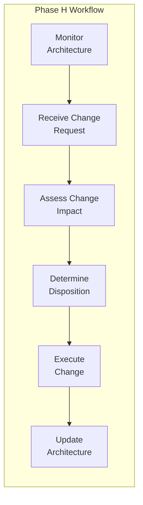

# Change Management Workflows

Step-by-step procedures for TOGAF Phase H activities.

---

## Workflow Overview



| Step | Activity | Key Output |
|------|----------|------------|
| 1 | Monitor Architecture | Issues, opportunities identified |
| 2 | Receive Change Request | Formal change request |
| 3 | Assess Change Impact | Impact assessment |
| 4 | Determine Disposition | Change decision |
| 5 | Execute Change | Implemented modification |
| 6 | Update Architecture | Updated artifacts, communications |

---

## Step 1: Monitor Architecture

### Purpose
Continuously observe the implemented architecture to identify when changes may be needed.

### Activities

#### 1.1 Technical Monitoring

**Actions:**
1. Review architecture health dashboard
2. Check conformance metrics from Phase G
3. Monitor technology lifecycle status
4. Track security vulnerability reports
5. Assess technical debt accumulation

**Questions to Answer:**
- Is the architecture performing as designed?
- Are there emerging technology gaps?
- What is the current security posture?
- Is technical debt within acceptable limits?

#### 1.2 Business Alignment Monitoring

**Actions:**
1. Review business strategy updates
2. Track capability utilization metrics
3. Gather stakeholder feedback
4. Monitor market and competitor changes
5. Check regulatory environment updates

**Questions to Answer:**
- Does the architecture still support business strategy?
- Are capabilities being used as expected?
- What are stakeholder pain points?
- Are there external factors requiring response?

#### 1.3 Operational Monitoring

**Actions:**
1. Review performance against SLAs
2. Track operational costs
3. Monitor incident patterns
4. Assess user satisfaction metrics
5. Check capacity and scalability headroom

**Questions to Answer:**
- Is the architecture meeting operational expectations?
- Are costs tracking to projections?
- Are there recurring operational issues?

### Output
- Architecture health report
- Identified issues and opportunities
- Proactive change recommendations

---

## Step 2: Receive Change Request

### Purpose
Formally capture and document proposed architecture changes.

### Activities

#### 2.1 Change Request Intake

**Actions:**
1. Receive change request through governance channel
2. Log request in change request register
3. Assign tracking identifier
4. Validate request completeness
5. Acknowledge receipt to requestor

**Change Request Elements:**
| Element | Description |
|---------|-------------|
| Request ID | Unique identifier |
| Requestor | Person/team submitting |
| Date | Submission date |
| Title | Brief descriptive title |
| Description | Detailed change description |
| Driver | Why this change is needed |
| Urgency | Critical/High/Medium/Low |
| Scope Estimate | Initial scope assessment |

#### 2.2 Initial Triage

**Actions:**
1. Classify change type (tech refresh, strategic, defect, enhancement)
2. Estimate initial scope (minor/moderate/major)
3. Identify affected domains
4. Assign to appropriate architect
5. Set SLA for assessment completion

**Triage Decision:**
| Classification | SLA | Assessor |
|----------------|-----|----------|
| Minor | 5 days | Solution Architect |
| Moderate | 10 days | Domain Architect |
| Major | 20 days | Enterprise Architect |

### Output
- Logged change request
- Initial classification
- Assigned assessor

---

## Step 3: Assess Change Impact

### Purpose
Thoroughly analyze the implications of the proposed change across all architecture dimensions.

### Activities

#### 3.1 Architecture Impact Analysis

**Actions:**
1. Identify affected architecture artifacts
2. Trace dependencies through architecture
3. Assess principle conformance of change
4. Evaluate alignment with target architecture
5. Identify conflicts with in-flight initiatives

**Impact Dimensions:**
| Dimension | Questions |
|-----------|-----------|
| Business | Which capabilities affected? Process impacts? |
| Data | What data entities impacted? Quality effects? |
| Application | Which applications modified? Integrations affected? |
| Technology | What infrastructure changes? Standards impacts? |

#### 3.2 Risk Assessment

**Actions:**
1. Identify risks of implementing change
2. Identify risks of NOT implementing change
3. Assess reversibility
4. Evaluate implementation complexity
5. Consider precedent implications

**Risk Categories:**
| Category | Considerations |
|----------|---------------|
| Technical | Complexity, stability, security |
| Business | Continuity, capability gaps |
| Organizational | Skills, capacity, change fatigue |
| Financial | Cost, ROI, opportunity cost |

#### 3.3 Stakeholder Impact

**Actions:**
1. Identify affected stakeholders
2. Assess impact severity per stakeholder
3. Gauge change support/resistance
4. Identify communication needs
5. Consider timing sensitivities

#### 3.4 Resource Estimation

**Actions:**
1. Estimate implementation effort
2. Identify required skills
3. Assess resource availability
4. Estimate timeline
5. Preliminary cost estimate

### Output
- Impact assessment report
- Risk register update
- Resource estimate
- Recommendation

---

## Step 4: Determine Disposition

### Purpose
Decide how to handle the change request based on assessment findings.

### Activities

#### 4.1 Classification Confirmation

**Actions:**
1. Confirm change scope (minor/moderate/major)
2. Determine if new ADM cycle needed
3. Identify governance pathway
4. Prepare decision recommendation

**Decision Tree:**
```
Is it a fundamental strategic change?
├── Yes → New ADM cycle from Phase A
└── No → Does it impact multiple domains significantly?
    ├── Yes → Partial ADM cycle (Phase B or E)
    └── No → Is it a technology-only change?
        ├── Yes → Consider Phase D cycle
        └── No → Handle within Phase H
```

#### 4.2 Decision Authority

**Actions:**
1. Route to appropriate governance body
2. Present assessment findings
3. Provide recommendation with rationale
4. Facilitate decision discussion
5. Document decision

| Scope | Decision Authority |
|-------|-------------------|
| Minor | Domain Architect |
| Moderate | Domain Architecture Board |
| Major | Enterprise Architecture Board |

#### 4.3 Disposition Options

| Disposition | Description | Next Step |
|-------------|-------------|-----------|
| **Approve** | Change accepted as proposed | Proceed to execution |
| **Approve with Modifications** | Change accepted with adjustments | Revise, then execute |
| **Defer** | Change valid but timing not right | Schedule for future |
| **Reject** | Change not appropriate | Document rationale, close |
| **Trigger ADM Cycle** | Change too significant for Phase H | Initiate new cycle |

### Output
- Change decision record
- Approved change scope (if approved)
- ADM cycle trigger (if applicable)

---

## Step 5: Execute Change

### Purpose
Implement the approved change through appropriate mechanisms.

### Activities

#### 5.1 For Phase H Changes (Minor/Moderate)

**Actions:**
1. Create change implementation plan
2. Update architecture artifacts
3. Coordinate with affected teams
4. Implement technical changes
5. Validate changes

**Implementation Plan Elements:**
| Element | Description |
|---------|-------------|
| Scope | Specific artifacts and systems |
| Approach | How change will be implemented |
| Timeline | Key dates and milestones |
| Resources | Who will do the work |
| Validation | How success will be verified |

#### 5.2 For New ADM Cycle (Major)

**Actions:**
1. Document ADM cycle trigger
2. Define cycle scope and focus
3. Identify starting phase
4. Allocate architecture resources
5. Initiate Phase A (or appropriate phase)

**ADM Trigger Documentation:**
| Element | Description |
|---------|-------------|
| Trigger ID | Reference to change request |
| Cycle Scope | What will be addressed |
| Starting Phase | Which phase to begin with |
| Business Context | Why this cycle is needed |
| Stakeholders | Key participants |

#### 5.3 Change Execution Governance

**Actions:**
1. Apply appropriate oversight level
2. Track progress against plan
3. Manage issues and risks
4. Report status to stakeholders
5. Escalate as needed

### Output
- Updated architecture (for Phase H changes)
- New ADM cycle initiated (for major changes)

---

## Step 6: Update Architecture

### Purpose
Ensure all architecture artifacts and communications reflect the implemented change.

### Activities

#### 6.1 Artifact Updates

**Actions:**
1. Update affected architecture documents
2. Revise diagrams and models
3. Update architecture repository
4. Version control changes
5. Archive superseded artifacts

**Artifacts to Consider:**
- Architecture definitions
- Principles and standards
- Reference models
- Design patterns
- Technology catalogs
- Roadmaps

#### 6.2 Communications

**Actions:**
1. Create communication plan (see [Communication Plan Template](templates.md#communication-plan-template))
2. Identify all stakeholder groups and their concerns
3. Build communication matrix with owners, dates, and channels
4. Set impact review dates for each communication
5. Execute communications per schedule
6. Track delivery and acknowledgment status
7. Conduct impact reviews on scheduled dates

**Communication Matrix Fields:**
| Field | Description |
|-------|-------------|
| Stakeholder | Who receives the communication |
| Message Type | Announcement, Training, Status Update, etc. |
| Owner | Person responsible for delivery |
| Delivery Date | When to send |
| Team/Domain | Affected organizational unit |
| Channel | Email, Meeting, Slack, Wiki, etc. |
| Status | Planned → Scheduled → Sent → Acknowledged → Completed |
| Impact Review Date | When to assess understanding (2-4 weeks post-delivery) |

**Communication Workflow:**
```
1. Stakeholder Analysis
   - Identify all affected groups
   - Understand their concerns
   - Determine impact level

2. Plan Communications
   - Create communication matrix
   - Assign owners
   - Schedule deliveries
   - Set review dates

3. Execute Communications
   - Send per schedule
   - Track status
   - Handle feedback

4. Review Impact
   - Conduct reviews on scheduled dates
   - Assess understanding
   - Identify gaps
   - Follow up as needed
```

**Communication Elements:**
| Element | Description |
|---------|-------------|
| What Changed | Clear description of modification |
| Why | Business driver and rationale |
| Impact | What it means for audience |
| Effective Date | When change takes effect |
| Next Steps | Any required actions |
| Review Date | When we'll assess if message was understood |

#### 6.3 Closure and Learning

**Actions:**
1. Verify all artifacts updated
2. Confirm stakeholder awareness
3. Close change request
4. Capture lessons learned
5. Update change metrics

### Output
- Updated architecture repository
- Change communications sent
- Closed change request
- Lessons learned captured

---

## Supporting Workflows

### Periodic Architecture Review Workflow

**Purpose:** Scheduled assessment of architecture health

**Cadence:** Quarterly (strategic), Monthly (operational)

```
1. Gather Metrics
   - Collect monitoring data
   - Compile compliance status
   - Aggregate feedback

2. Analyze Health
   - Compare to baselines
   - Identify trends
   - Spot anomalies

3. Report Findings
   - Prepare health report
   - Present to governance
   - Document decisions

4. Generate Actions
   - Create change requests (if needed)
   - Update monitoring focus
   - Adjust thresholds
```

### Emergency Change Workflow

**Purpose:** Expedited handling of urgent changes

**Trigger:** Security vulnerability, critical defect, regulatory mandate

```
1. Immediate Assessment (4 hours)
   - Confirm urgency
   - Assess immediate impact
   - Identify containment

2. Emergency Approval (24 hours)
   - Convene emergency authority
   - Present findings
   - Obtain approval

3. Rapid Implementation (per urgency)
   - Execute fix
   - Monitor results
   - Communicate status

4. Post-Implementation (1 week)
   - Full impact assessment
   - Architecture updates
   - Process improvements
```

### Technology Lifecycle Workflow

**Purpose:** Manage planned technology changes

**Trigger:** Vendor roadmap, end-of-life notice, new capability

```
1. Lifecycle Tracking
   - Monitor vendor announcements
   - Track technology status
   - Maintain lifecycle inventory

2. Impact Assessment
   - Identify affected systems
   - Assess migration complexity
   - Estimate timeline needs

3. Planning
   - Develop migration strategy
   - Create change requests
   - Prioritize updates

4. Execution
   - Coordinate with projects
   - Track migrations
   - Retire deprecated tech
```

---

## Workflow Governance

### Change Request SLAs

| Phase | Minor | Moderate | Major |
|-------|-------|----------|-------|
| Triage | 1 day | 2 days | 3 days |
| Assessment | 5 days | 10 days | 20 days |
| Decision | 2 days | 5 days | 10 days |
| **Total** | **8 days** | **17 days** | **33 days** |

### Escalation Triggers

| Trigger | Action |
|---------|--------|
| SLA breach | Escalate to governance lead |
| Stakeholder conflict | Escalate to Architecture Board |
| Resource constraint | Escalate to architecture management |
| Security/compliance issue | Immediate escalation to CISO/Compliance |

### Metrics

| Metric | Target | Measurement |
|--------|--------|-------------|
| Request Processing Time | Within SLA | Submitted → Decided |
| Assessment Quality | <10% rework | Decision reversals |
| Change Success Rate | >95% | Successful implementations |
| Stakeholder Satisfaction | >4/5 | Feedback surveys |
