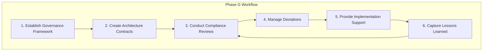
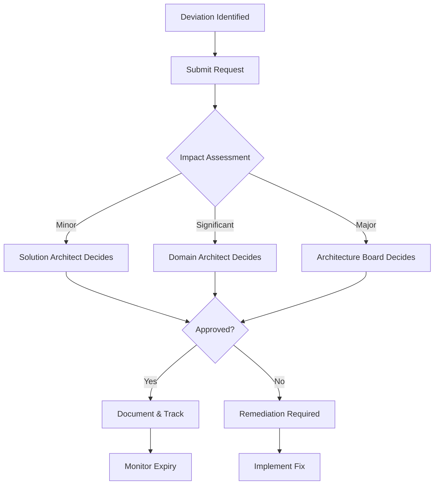

# Implementation Governance Workflows

Step-by-step procedures for TOGAF Phase G.

---

## Workflow Overview



---

## Step 1: Establish Governance Framework

### 1.1 Define Governance Structure

```yaml
governance_structure:
  levels:
    - name: "Enterprise Architecture Board"
      scope: "Strategic decisions, enterprise-wide impact"
      frequency: "Quarterly + as needed"
      chair: "Chief Architect"
      
    - name: "Domain Architecture Review"
      scope: "Domain-specific decisions"
      frequency: "Monthly"
      chair: "Domain Architect"
      
    - name: "Solution Architecture Review"
      scope: "Project-level decisions"
      frequency: "Per milestone"
      chair: "Solution Architect"
```

### 1.2 Define Review Criteria

```markdown
## Architecture Review Criteria

### Alignment
- [ ] Conforms to target architecture
- [ ] Supports business capabilities
- [ ] Follows architecture principles

### Standards
- [ ] Technology standards applied
- [ ] Security standards met
- [ ] Integration patterns followed
- [ ] Data standards observed

### Quality
- [ ] Non-functional requirements addressed
- [ ] Scalability considered
- [ ] Maintainability ensured
- [ ] Documentation adequate
```

### 1.3 Establish Review Calendar

```markdown
## Review Schedule

### Regular Reviews
| Review Type | Frequency | Timing | Duration |
|-------------|-----------|--------|----------|
| Enterprise ARB | Quarterly | First Monday | 2 hours |
| Domain Review | Monthly | Second Tuesday | 1 hour |
| Solution Review | Per milestone | As scheduled | 30-60 min |

### Gate Reviews
| Gate | Timing | Required For |
|------|--------|--------------|
| Design Approval | End of design phase | All projects |
| Implementation Check | Mid-development | Strategic projects |
| Go-Live Approval | Before production | All deployments |
```

---

## Step 2: Create Architecture Contracts

### 2.1 Identify Contract Scope

```yaml
contract_scope:
  project: "{project name}"
  architecture_reference:
    - target_state: "TA-{n} specifications"
    - standards: "Technology standards v{x}"
    - principles: "Architecture principles catalog"
  
  deliverables:
    - name: "{deliverable}"
      acceptance_criteria: "{criteria}"
```

### 2.2 Draft Contract

```markdown
## Architecture Contract Template

### Parties
| Role | Name | Responsibility |
|------|------|----------------|
| Architecture Authority | {name} | Standards, reviews, guidance |
| Implementation Lead | {name} | Delivery, compliance, escalation |

### Scope
- Project: {project name}
- Transition: {transition reference}
- Timeline: {start} to {end}

### Architecture Commitments

#### Target Architecture
The implementation shall conform to:
- {architecture artifact 1}
- {architecture artifact 2}
- {architecture artifact 3}

#### Standards
The following standards apply:
| Standard | Version | Applicability |
|----------|---------|---------------|
| {standard} | {version} | {how it applies} |

#### Principles
These architecture principles must be observed:
| Principle | Implication for Project |
|-----------|------------------------|
| {principle} | {how to apply} |

### Review Points
| Checkpoint | Timing | Deliverable | Reviewer |
|------------|--------|-------------|----------|
| Design Review | {date} | Design document | Solution Architect |
| Mid-Point Check | {date} | Code + tests | Domain Architect |
| Pre-Go-Live | {date} | Full system | Architecture Board |

### Exception Process
- Minor deviations: Approved by Solution Architect with documentation
- Significant deviations: Require Domain Architect approval
- Major deviations: Require Architecture Board approval

### Acceptance
| Authority | Signature | Date |
|-----------|-----------|------|
| Architecture | | |
| Implementation | | |
```

### 2.3 Contract Review Checklist

```markdown
## Contract Completeness Check

- [ ] All parties identified
- [ ] Scope clearly defined
- [ ] Architecture references specific and current
- [ ] Standards explicitly listed
- [ ] Review points scheduled
- [ ] Exception process documented
- [ ] Acceptance criteria measurable
- [ ] Signatures obtained
```

---

## Step 3: Conduct Compliance Reviews

### 3.1 Prepare for Review

```yaml
review_preparation:
  before_review:
    - collect_artifacts
    - review_against_standards
    - identify_questions
    - prepare_assessment_template
  
  artifacts_needed:
    - design_documents
    - architecture_diagrams
    - api_specifications
    - data_models
    - security_assessment
    - deployment_architecture
```

### 3.2 Conduct Review

```markdown
## Review Agenda

### Opening (5 min)
- Confirm attendees
- Review objectives
- Confirm scope

### Presentation (15-30 min)
- Solution overview
- Architecture decisions
- Key challenges and resolutions

### Assessment (15-30 min)
- Walk through compliance checklist
- Discuss findings
- Capture questions

### Summary (5-10 min)
- Summarize findings
- Agree on action items
- Confirm next steps
```

### 3.3 Document Findings

```markdown
## Compliance Assessment Report

### Review Information
| Attribute | Value |
|-----------|-------|
| Project | {project name} |
| Review Type | {Design/Implementation/Go-Live} |
| Date | {date} |
| Reviewers | {names} |

### Overall Assessment
| Dimension | Status | Notes |
|-----------|--------|-------|
| Architecture Conformance | {✓/⚠/✗} | {notes} |
| Standards Compliance | {✓/⚠/✗} | {notes} |
| Principle Adherence | {✓/⚠/✗} | {notes} |

### Detailed Findings

| ID | Finding | Category | Severity | Status |
|----|---------|----------|----------|--------|
| F-{nnn} | {description} | {category} | {H/M/L} | {Compliant/Deviation/Non-Compliant} |

### Finding Details

#### F-{nnn}: {Finding Title}

| Attribute | Value |
|-----------|-------|
| Category | {Architecture/Standard/Principle} |
| Reference | {what it should comply with} |
| Actual | {what was found} |
| Severity | {High/Medium/Low} |
| Status | {Compliant/Deviation Requested/Non-Compliant} |

**Recommendation**: {what should be done}

### Action Items

| ID | Action | Owner | Due Date | Status |
|----|--------|-------|----------|--------|
| A-{nnn} | {action} | {who} | {date} | {status} |

### Review Decision

| Decision | Authority | Date |
|----------|-----------|------|
| {Approved/Approved with Conditions/Deferred/Rejected} | {name} | {date} |

**Conditions** (if applicable):
1. {condition 1}
2. {condition 2}
```

---

## Step 4: Manage Deviations

### 4.1 Deviation Request Process



### 4.2 Submit Deviation Request

```markdown
## Deviation Request

### Request Information
| Attribute | Value |
|-----------|-------|
| Request ID | DEV-{nnn} |
| Project | {project name} |
| Requestor | {name} |
| Date | {date} |

### Deviation Details
| Attribute | Value |
|-----------|-------|
| Type | {Waiver/Deferral/Variance} |
| Category | {Architecture/Standard/Principle} |
| Reference | {what should be complied with} |
| Deviation | {what is being requested} |

### Justification
**Why is this deviation needed?**
{explanation}

**What alternatives were considered?**
| Alternative | Why Not Viable |
|-------------|----------------|
| {alternative} | {reason} |

### Impact Assessment
| Factor | Assessment | Notes |
|--------|------------|-------|
| Security | {None/Low/Medium/High} | {notes} |
| Integration | {None/Low/Medium/High} | {notes} |
| Technical Debt | {None/Low/Medium/High} | {notes} |
| Precedent Risk | {None/Low/Medium/High} | {notes} |

### Remediation Plan (for Deferrals)
| Milestone | Target Date | Deliverable |
|-----------|-------------|-------------|
| {milestone} | {date} | {what will be delivered} |

### Recommendation
{Approving authority's recommendation}
```

### 4.3 Track Deviations

```markdown
## Deviation Register

| ID | Project | Type | Status | Expiry | Owner |
|----|---------|------|--------|--------|-------|
| DEV-{nnn} | {project} | {Waiver/Deferral/Variance} | {Active/Remediated/Expired} | {date or N/A} | {owner} |

### Active Deviations Summary
| Category | Count | High Impact | Expiring Soon |
|----------|-------|-------------|---------------|
| Waivers | {n} | {n} | N/A |
| Deferrals | {n} | {n} | {n} |
| Variances | {n} | {n} | N/A |

### Deviation Trends
| Period | New | Remediated | Net Change |
|--------|-----|------------|------------|
| {period} | {n} | {n} | {+/-n} |
```

---

## Step 5: Provide Implementation Support

### 5.1 Architecture Office Hours

```markdown
## Architecture Support Model

### Office Hours
- **When**: {day/time}
- **Format**: {drop-in/scheduled}
- **Topics**: Design questions, standard clarifications, deviation discussions

### On-Demand Support
- **How to Request**: {process}
- **Response Time**: {SLA}
- **Escalation**: {path}

### Documentation
- **Standards Portal**: {location}
- **Reference Architectures**: {location}
- **Example Implementations**: {location}
```

### 5.2 Implementation Recommendations

```markdown
## Implementation Recommendation

### Context
| Attribute | Value |
|-----------|-------|
| Project | {project} |
| Topic | {what guidance is about} |
| Requestor | {name} |
| Date | {date} |

### Question/Challenge
{What the team is trying to solve}

### Recommendation
{Recommended approach}

### Rationale
| Factor | Consideration |
|--------|---------------|
| {factor} | {how it influenced recommendation} |

### Alternatives Considered
| Option | Pros | Cons |
|--------|------|------|
| {option} | {pros} | {cons} |

### References
- {relevant standards}
- {reference architectures}
- {example implementations}
```

---

## Step 6: Capture Lessons Learned

### 6.1 Collect Lessons

```yaml
lessons_sources:
  - compliance_reviews
  - deviation_requests
  - implementation_feedback
  - project_retrospectives
  - production_incidents

lesson_categories:
  - architecture_gaps
  - standard_issues
  - process_improvements
  - tooling_needs
  - training_gaps
```

### 6.2 Document Lessons

```markdown
## Lesson Learned

### Identification
| Attribute | Value |
|-----------|-------|
| Lesson ID | LL-{nnn} |
| Source | {review/project/incident} |
| Category | {category} |
| Date | {date} |

### Description
{What was learned}

### Context
{Situation where this arose}

### Impact
{What happened or could have happened}

### Recommendation
{What should change}

### Action
| Action | Owner | Status |
|--------|-------|--------|
| {action} | {who} | {status} |
```

### 6.3 Feed Back to Architecture

```markdown
## Lessons Learned Summary (Quarterly)

### Architecture Updates Needed
| Lesson | Architecture Artifact | Proposed Change | Priority |
|--------|----------------------|-----------------|----------|
| LL-{nnn} | {artifact} | {change} | {H/M/L} |

### Standards Updates Needed
| Lesson | Standard | Proposed Change | Priority |
|--------|----------|-----------------|----------|
| LL-{nnn} | {standard} | {change} | {H/M/L} |

### Process Improvements
| Lesson | Process | Proposed Change | Priority |
|--------|---------|-----------------|----------|
| LL-{nnn} | {process} | {change} | {H/M/L} |

### Submitted for Phase H Review
- [ ] Architecture change requests created
- [ ] Standards updates proposed
- [ ] Process improvements submitted
```

---

## Output Summary

At the end of Phase G activities, you should have:

```
implementation-governance/
├── governance-framework.md         # Structure and processes
├── contracts/
│   ├── prj-001-contract.md         # Project contracts
│   └── prj-002-contract.md
├── reviews/
│   ├── prj-001-design-review.md    # Compliance assessments
│   ├── prj-001-impl-check.md
│   └── prj-002-design-review.md
├── deviations/
│   ├── deviation-register.md       # Active deviations
│   ├── dev-001-request.md          # Individual requests
│   └── dev-002-request.md
├── recommendations/
│   └── rec-001.md                  # Implementation guidance
└── lessons-learned/
    ├── ll-summary-q1.md            # Quarterly summaries
    └── ll-001.md                   # Individual lessons
```
