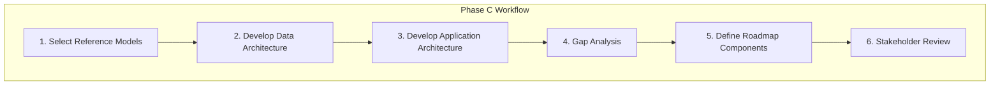

# Information Systems Architecture Workflows

Step-by-step procedures for TOGAF Phase C.

---

## Workflow Overview



---

## Step 1: Select Reference Models

### 1.1 Identify Applicable Standards

Determine which reference models apply:

```yaml
data_standards:
  - industry: "Retail"
    models:
      - "ARTS Data Model (retail)"
      - "GS1 standards (product data)"

  - industry: "Finance"
    models:
      - "BIAN (banking)"
      - "FIBO (financial ontology)"

  - industry: "Healthcare"
    models:
      - "HL7 FHIR"
      - "SNOMED CT"

application_patterns:
  - "Cloud-native patterns (12-factor)"
  - "Microservices patterns"
  - "Event-driven architecture"
  - "API-first design"
```

### 1.2 Review Existing Architecture

Gather baseline documentation:

```yaml
baseline_inputs:
  - Application inventory
  - Current data models
  - Integration documentation
  - API catalogs
  - Database schemas
```

### 1.3 Define Architecture Principles

Establish IS-specific principles:

```yaml
data_principles:
  - name: "Single Source of Truth"
    rationale: "Eliminates data inconsistency"
    implications: "Master data management required"

  - name: "Data Quality at Source"
    rationale: "Prevents downstream issues"
    implications: "Validation at entry points"

application_principles:
  - name: "Loose Coupling"
    rationale: "Independent deployment and scaling"
    implications: "Well-defined interfaces required"

  - name: "API-First"
    rationale: "Enables integration and reuse"
    implications: "API design precedes implementation"
```

---

## Step 2: Develop Data Architecture

### 2.1 Identify Data Entities

Extract entities from business processes:

```yaml
entity_discovery:
  sources:
    - Business capability model
    - Process models
    - Existing databases
    - User interviews

  questions:
    - "What information does this process use?"
    - "What information does this process produce?"
    - "Who owns this data?"
    - "Where is it stored today?"
```

### 2.2 Create Entity Catalog

Document each entity:

```markdown
| Entity ID | Entity Name | Description | Owner | Sensitivity |
|-----------|-------------|-------------|-------|-------------|
| ENT-001 | Customer | Person or org that buys | Sales | Confidential |
| ENT-002 | Order | Purchase transaction | Order Mgmt | Internal |
| ENT-003 | Product | Item for sale | Product Mgmt | Internal |
| ENT-004 | Payment | Financial transaction | Finance | Restricted |
```

### 2.3 Create Logical Data Model

Define entity relationships:

```yaml
relationships:
  - from: Customer
    to: Order
    cardinality: "1:N"
    description: "Customer places orders"

  - from: Order
    to: OrderLine
    cardinality: "1:N"
    description: "Order contains line items"

  - from: OrderLine
    to: Product
    cardinality: "N:1"
    description: "Line item references product"

  - from: Order
    to: Payment
    cardinality: "1:N"
    description: "Order has payments"
```

### 2.4 Map Data Stores

Document where data resides:

```markdown
| Store ID | Name | Type | Technology | Entities | Owner |
|----------|------|------|------------|----------|-------|
| DS-001 | Customer DB | OLTP | PostgreSQL | Customer, Address | IT-DBA |
| DS-002 | Order DB | OLTP | PostgreSQL | Order, OrderLine | IT-DBA |
| DS-003 | Data Warehouse | OLAP | Snowflake | All (analytics) | BI Team |
| DS-004 | Search Index | Index | Elasticsearch | Product | Platform |
```

### 2.5 Document Data Flows

Map how data moves:

```yaml
data_flows:
  - flow_id: "DF-001"
    name: "Order Creation"
    source: "Web Application"
    destination: "Order DB"
    entities: ["Order", "OrderLine"]
    trigger: "Customer checkout"
    frequency: "Real-time"
    protocol: "SQL"

  - flow_id: "DF-002"
    name: "Order Analytics"
    source: "Order DB"
    destination: "Data Warehouse"
    entities: ["Order", "OrderLine"]
    trigger: "Nightly batch"
    frequency: "Daily"
    protocol: "ETL"
```

### 2.6 Define Data Governance

Establish ownership and rules:

```yaml
governance:
  data_owners:
    - entity: "Customer"
      owner: "VP Sales"
      steward: "CRM Admin"

    - entity: "Order"
      owner: "VP Operations"
      steward: "Order Ops Lead"

  quality_rules:
    - entity: "Customer"
      rule: "Email must be valid format"
      enforcement: "Application validation"

    - entity: "Order"
      rule: "Total must equal sum of line items"
      enforcement: "Database constraint"
```

---

## Step 3: Develop Application Architecture

### 3.1 Inventory Applications

Catalog all applications:

```yaml
application_discovery:
  sources:
    - Asset management system
    - Infrastructure inventory
    - Department interviews
    - Expense reports (SaaS subscriptions)

  capture:
    - Application name
    - Description
    - Technology stack
    - Owner
    - Users
    - Capabilities supported
    - Integrations
```

### 3.2 Create Application Catalog

Document each application:

```markdown
| App ID | Name | Type | Technology | Owner | Lifecycle |
|--------|------|------|------------|-------|-----------|
| APP-001 | Customer CRM | Commercial | Salesforce | Sales | Maintain |
| APP-002 | Order System | Custom | Node.js/PostgreSQL | Engineering | Invest |
| APP-003 | Legacy ERP | Commercial | SAP | Finance | Migrate |
| APP-004 | Product Catalog | Custom | Python/MongoDB | Product | Invest |
```

### 3.3 Map Applications to Capabilities

Create capability-application matrix:

```markdown
| Capability | APP-001 CRM | APP-002 OMS | APP-003 ERP | APP-004 Catalog |
|------------|-------------|-------------|-------------|-----------------|
| Customer Mgmt | ★★★ | ★ | ★ | - |
| Order Mgmt | ★ | ★★★ | ★★ | - |
| Product Mgmt | - | - | ★ | ★★★ |
| Pricing | - | ★ | ★★ | ★★★ |
| Reporting | ★★ | ★ | ★★★ | - |

★★★ = Primary | ★★ = Secondary | ★ = Minimal | - = None
```

### 3.4 Document Interfaces

Catalog application interfaces:

```yaml
interfaces:
  - interface_id: "INT-001"
    application: "APP-002 Order System"
    name: "Order API"
    type: "REST"
    direction: "Inbound"
    description: "Create and query orders"
    consumers: ["Web App", "Mobile App"]

  - interface_id: "INT-002"
    application: "APP-002 Order System"
    name: "Inventory Check"
    type: "gRPC"
    direction: "Outbound"
    description: "Check product availability"
    providers: ["APP-004 Product Catalog"]
```

### 3.5 Map Integrations

Document integration relationships:

```markdown
| From App | To App | Interface | Pattern | Data Exchanged |
|----------|--------|-----------|---------|----------------|
| Web App | Order System | REST API | Sync | Order request |
| Order System | Product Catalog | gRPC | Sync | Availability check |
| Order System | ERP | Message Queue | Async | Order confirmation |
| Order System | CRM | Event | Async | Customer update |
```

### 3.6 Assess Application Health

Evaluate each application:

```yaml
assessment:
  - app_id: "APP-003"
    app_name: "Legacy ERP"
    scores:
      business_fit: 3
      technical_health: 2
      operational_health: 3
      cost_efficiency: 2
    overall: 2.5
    lifecycle: "Migrate"
    notes: "Legacy tech stack, high maintenance cost"

  - app_id: "APP-002"
    app_name: "Order System"
    scores:
      business_fit: 4
      technical_health: 4
      operational_health: 4
      cost_efficiency: 4
    overall: 4.0
    lifecycle: "Invest"
    notes: "Core system, modern stack"
```

---

## Step 4: Gap Analysis

### 4.1 Compare Baseline to Target

Identify gaps across dimensions:

```yaml
gap_categories:
  data_gaps:
    - "Missing master data management"
    - "No real-time data sync"
    - "Data quality issues"
    - "Missing data governance"

  application_gaps:
    - "Missing capability coverage"
    - "Redundant applications"
    - "Integration gaps"
    - "Technical debt"
    - "Lifecycle issues (retire needed)"
```

### 4.2 Document Data Gaps

```markdown
| Gap ID | Type | Baseline | Target | Impact | Priority |
|--------|------|----------|--------|--------|----------|
| DG-001 | Quality | Manual validation | Automated validation | Data errors | High |
| DG-002 | Integration | Batch sync (daily) | Real-time sync | Stale data | Critical |
| DG-003 | Governance | No defined owners | Clear ownership | Accountability | Medium |
```

### 4.3 Document Application Gaps

```markdown
| Gap ID | Type | Baseline | Target | Impact | Priority |
|--------|------|----------|--------|--------|----------|
| AG-001 | Coverage | Manual pricing | Automated pricing engine | Efficiency | High |
| AG-002 | Redundancy | 3 CRM systems | Single CRM | Cost, complexity | Medium |
| AG-003 | Technical | Legacy ERP | Modern cloud ERP | Maintenance cost | High |
| AG-004 | Integration | Point-to-point | API gateway | Scalability | Medium |
```

### 4.4 Prioritize Gaps

Score and rank gaps:

```yaml
prioritization:
  criteria:
    - Business impact (1-5)
    - Technical urgency (1-5)
    - Strategic alignment (1-5)
    - Effort required (inverse)

  scored_gaps:
    - gap_id: "DG-002"
      business: 5
      technical: 4
      strategic: 5
      effort: 3
      total: 17
      rank: 1

    - gap_id: "AG-001"
      business: 4
      technical: 3
      strategic: 4
      effort: 3
      total: 14
      rank: 2
```

---

## Step 5: Define Roadmap Components

### 5.1 Group Gaps into Work Packages

```yaml
work_packages:
  - id: "WP-C-001"
    name: "Real-time Data Integration"
    gaps_addressed: ["DG-002", "AG-004"]
    description: "Implement event-driven data sync"
    dependencies: []

  - id: "WP-C-002"
    name: "Pricing Engine Implementation"
    gaps_addressed: ["AG-001"]
    description: "Build automated pricing capability"
    dependencies: ["WP-C-001"]

  - id: "WP-C-003"
    name: "ERP Modernization"
    gaps_addressed: ["AG-003"]
    description: "Replace legacy ERP"
    dependencies: ["WP-C-001"]
```

### 5.2 Define Work Package Details

For each work package:

```yaml
work_package:
  id: "WP-C-001"
  name: "Real-time Data Integration"

  scope:
    in:
      - "Event bus implementation"
      - "Order system integration"
      - "Product catalog integration"
    out:
      - "ERP integration (separate WP)"
      - "Analytics (separate WP)"

  deliverables:
    - "Event bus infrastructure"
    - "Order events publisher"
    - "Product events publisher"
    - "Event consumers"

  dependencies:
    predecessor: []
    parallel: ["WP-C-002"]
    successor: ["WP-C-003"]

  estimates:
    duration: "16 weeks"
    effort: "640 person-days"
    cost: "$500,000"
```

### 5.3 Sequence Work Packages

Create implementation roadmap:

```
Quarter 1          Quarter 2          Quarter 3          Quarter 4
    │                  │                  │                  │
    ▼                  ▼                  ▼                  ▼
┌──────────────────────────────────────┐
│ WP-C-001: Real-time Integration      │
└──────────────────────────────────────┘
                       ┌──────────────────────────────────────┐
                       │ WP-C-002: Pricing Engine             │
                       └──────────────────────────────────────┘
                                          ┌─────────────────────────────────────┐
                                          │ WP-C-003: ERP Modernization         │
                                          └─────────────────────────────────────┘
```

---

## Step 6: Stakeholder Review

### 6.1 Prepare Review Materials

```yaml
presentation:
  - Executive Summary
  - Data Architecture Overview
  - Logical Data Model
  - Application Portfolio
  - Capability-Application Matrix
  - Integration Architecture
  - Gap Analysis Summary
  - Proposed Roadmap
```

### 6.2 Conduct Reviews

Schedule stakeholder reviews:

```yaml
reviews:
  - audience: "Data Owners"
    focus: "Data model, governance, quality"
    duration: "2 hours"

  - audience: "Application Owners"
    focus: "Application assessment, lifecycle"
    duration: "2 hours"

  - audience: "Integration Team"
    focus: "Interface catalog, integration patterns"
    duration: "2 hours"

  - audience: "Architecture Board"
    focus: "Full architecture, gaps, roadmap"
    duration: "4 hours"
```

### 6.3 Incorporate Feedback

Track and address feedback:

```yaml
feedback_tracking:
  - id: "FB-001"
    source: "Data Owners"
    feedback: "Missing Customer Preferences entity"
    action: "Add to data model"
    status: "Resolved"

  - id: "FB-002"
    source: "App Owners"
    feedback: "ERP migration too aggressive"
    action: "Extend timeline by 2 quarters"
    status: "Under review"
```

### 6.4 Obtain Sign-off

Secure approvals:

```yaml
approvals:
  - artifact: "Data Architecture"
    approver: "Chief Data Officer"
    status: "Approved"
    date: "2024-01-15"

  - artifact: "Application Architecture"
    approver: "CTO"
    status: "Approved"
    date: "2024-01-16"

  - artifact: "Phase C Overall"
    approver: "Architecture Board"
    status: "Pending"
    date: ""
```

---

## Quick Reference

| Step | Key Activities | Primary Output |
|------|----------------|----------------|
| 1. Reference Models | Select standards, review baseline | Architecture principles |
| 2. Data Architecture | Entities, relationships, flows, governance | Data Architecture artifacts |
| 3. Application Architecture | Inventory, mapping, interfaces, assessment | Application Architecture artifacts |
| 4. Gap Analysis | Compare baseline/target, prioritize | Gap Analysis document |
| 5. Roadmap | Define work packages, sequence | Roadmap components |
| 6. Review | Present, incorporate feedback, sign-off | Approved Phase C |
