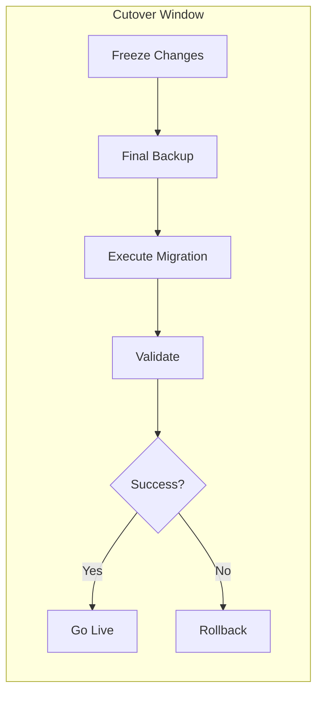

# TOGAF Phase F: Migration Planning

Guidelines for creating implementation and migration plans from architecture work.

---

## Overview

Phase F transforms architecture outputs into actionable implementation plans:

1. **Finalize Transition Architectures** - Confirm intermediate states
2. **Create Implementation Plan** - Detailed project sequencing
3. **Develop Project Charters** - Individual project definitions
4. **Estimate Resources** - Budget, skills, timeline
5. **Assess Migration Risks** - Identify and mitigate risks

```
Phase E (Solutions) → Phase F (Planning) → Phase G (Governance)
                           ↑
                      YOU ARE HERE
```

---

## When to Use This Skill

Use Phase F when you need to:

- Create detailed implementation roadmaps
- Define project charters for architecture initiatives
- Estimate resources and timelines
- Assess migration risks
- Plan rollback strategies
- Coordinate multiple workstreams

---

## Key Concepts

### Implementation and Migration Plan

The master plan that coordinates all architecture implementation:

```
┌─────────────────────────────────────────────────────────────┐
│              IMPLEMENTATION & MIGRATION PLAN                 │
├─────────────────────────────────────────────────────────────┤
│                                                             │
│  Strategic Context                                          │
│  ├── Business drivers                                       │
│  ├── Architecture vision reference                          │
│  └── Success criteria                                       │
│                                                             │
│  Implementation Approach                                    │
│  ├── Transition architectures                               │
│  ├── Project portfolio                                      │
│  └── Dependency management                                  │
│                                                             │
│  Execution Framework                                        │
│  ├── Governance model                                       │
│  ├── Resource allocation                                    │
│  └── Risk management                                        │
│                                                             │
└─────────────────────────────────────────────────────────────┘
```

### Transition Architecture Specifications

Detailed documentation of each intermediate state:

```
Transition 1              Transition 2              Target
    │                         │                       │
    ▼                         ▼                       ▼
┌──────────┐             ┌──────────┐           ┌──────────┐
│ Scope    │             │ Scope    │           │ Scope    │
│ ├ Apps   │             │ ├ Apps   │           │ ├ Apps   │
│ ├ Data   │             │ ├ Data   │           │ ├ Data   │
│ └ Tech   │             │ └ Tech   │           │ └ Tech   │
├──────────┤             ├──────────┤           ├──────────┤
│ Duration │             │ Duration │           │ Complete │
│ 6 months │             │ 6 months │           │          │
└──────────┘             └──────────┘           └──────────┘
```

### Project Charter

Essential document for each implementation project:

```
┌─────────────────────────────────────────────────────────────┐
│                    PROJECT CHARTER                           │
├─────────────────────────────────────────────────────────────┤
│                                                             │
│  Project Identity                                           │
│  ├── Name and ID                                            │
│  ├── Sponsor and stakeholders                               │
│  └── Architecture reference                                 │
│                                                             │
│  Scope Definition                                           │
│  ├── Objectives (linked to gaps/work packages)              │
│  ├── In scope / Out of scope                                │
│  └── Success criteria                                       │
│                                                             │
│  Planning                                                   │
│  ├── Timeline and milestones                                │
│  ├── Resource requirements                                  │
│  ├── Budget estimate                                        │
│  └── Dependencies                                           │
│                                                             │
│  Risk & Governance                                          │
│  ├── Key risks and mitigations                              │
│  ├── Governance approach                                    │
│  └── Reporting structure                                    │
│                                                             │
└─────────────────────────────────────────────────────────────┘
```

---

## Resource Estimation

### Estimation Approaches

| Approach | When to Use | Accuracy |
|----------|-------------|----------|
| **Analogous** | Early planning, similar past projects | ±50% |
| **Parametric** | Repeatable work, known metrics | ±25% |
| **Bottom-up** | Detailed planning, clear scope | ±10% |
| **Three-point** | Uncertain work, risk-aware | Variable |

### Three-Point Estimation

```
Expected = (Optimistic + 4×Most_Likely + Pessimistic) / 6

Example:
  Optimistic:  3 months
  Most Likely: 5 months
  Pessimistic: 10 months
  
  Expected = (3 + 4×5 + 10) / 6 = 5.5 months
```

### Resource Categories

| Category | What to Estimate |
|----------|-----------------|
| **People** | FTEs, roles, skills, availability |
| **Budget** | CapEx, OpEx, contingency |
| **Technology** | Licenses, infrastructure, tools |
| **Time** | Duration, calendar constraints |
| **External** | Vendors, consultants, partners |

---

## Risk Assessment

### Migration Risk Categories

```
┌─────────────────────────────────────────────────────────────┐
│                  MIGRATION RISK TAXONOMY                     │
├─────────────────────────────────────────────────────────────┤
│                                                             │
│  Technical Risks                                            │
│  ├── Integration complexity                                 │
│  ├── Data migration quality                                 │
│  ├── Performance degradation                                │
│  ├── Security exposure during transition                    │
│  └── Rollback feasibility                                   │
│                                                             │
│  Operational Risks                                          │
│  ├── Business disruption                                    │
│  ├── Knowledge transfer gaps                                │
│  ├── Support readiness                                      │
│  └── Parallel running costs                                 │
│                                                             │
│  Organizational Risks                                       │
│  ├── Change resistance                                      │
│  ├── Resource availability                                  │
│  ├── Stakeholder commitment                                 │
│  └── Training effectiveness                                 │
│                                                             │
│  External Risks                                             │
│  ├── Vendor dependencies                                    │
│  ├── Regulatory changes                                     │
│  ├── Market conditions                                      │
│  └── Third-party readiness                                  │
│                                                             │
└─────────────────────────────────────────────────────────────┘
```

### Risk Assessment Matrix

```
              │ Low Impact │ Medium Impact │ High Impact │
─────────────────────────────────────────────────────────
High Prob     │   Medium   │     High      │  Critical   │
─────────────────────────────────────────────────────────
Medium Prob   │    Low     │    Medium     │    High     │
─────────────────────────────────────────────────────────
Low Prob      │    Low     │     Low       │   Medium    │
─────────────────────────────────────────────────────────
```

---

## Migration Strategies

### Big Bang vs Incremental

| Strategy | Description | When to Use |
|----------|-------------|-------------|
| **Big Bang** | All at once cutover | Simple systems, low risk tolerance for extended parallel |
| **Parallel Run** | Both systems active | Critical systems, validation needed |
| **Phased** | Incremental by function | Complex systems, risk mitigation |
| **Pilot** | Limited user group first | New technology, user acceptance |
| **Strangler** | Gradual replacement | Legacy modernization |

### Cutover Planning



---

## Rollback Planning

### Rollback Strategies

| Strategy | Description | Recovery Time |
|----------|-------------|---------------|
| **Full Rollback** | Restore complete baseline | Hours to days |
| **Partial Rollback** | Restore specific components | Hours |
| **Forward Fix** | Fix issues in new state | Minutes to hours |
| **Failover** | Switch to standby | Minutes |

### Rollback Criteria

Define clear triggers for rollback decision:

```markdown
## Rollback Triggers

### Automatic Rollback
- Critical functionality unavailable > 30 minutes
- Data integrity issues detected
- Security breach identified

### Decision-Based Rollback
- Performance degradation > 50% from baseline
- User error rate > threshold
- Business process failure rate > X%

### No-Rollback Point
- After {time} in production
- After {milestone} achieved
- After data synchronization complete
```

---

## Phase F Inputs

From previous phases:

| Input | Source | Usage |
|-------|--------|-------|
| Work Package Portfolio | Phase E | Projects to plan |
| Transition Architectures | Phase E | States to achieve |
| Dependency Analysis | Phase E | Sequencing constraints |
| Solution Building Blocks | Phase E | Components to implement |
| Architecture Vision | Phase A | Success criteria |

---

## Phase F Outputs

Deliverables from this phase:

| Output | Description | Audience |
|--------|-------------|----------|
| **Implementation & Migration Plan** | Master coordination document | Program Board |
| **Transition Architecture Specs** | Detailed intermediate states | Solution Architects |
| **Project Charters** | Individual project definitions | Project Managers |
| **Resource Estimates** | Budget, people, timeline | Finance, HR |
| **Risk Assessment** | Migration risks and mitigations | Governance Board |
| **Rollback Plans** | Recovery procedures | Operations |

---

## Key Principles

1. **Realistic Planning** - Base estimates on evidence, not optimism
2. **Risk-Aware** - Plan for what can go wrong
3. **Dependency-Conscious** - Respect technical and organizational constraints
4. **Stakeholder-Aligned** - Ensure buy-in for timeline and resources
5. **Flexible** - Build in contingency and adaptation points
6. **Measurable** - Define clear success criteria
7. **Fitness-Guided** - Use fitness functions to validate evolution

---

## Fitness-Guided Migration

### Overview

Fitness functions from evolutionary architecture provide objective measures to guide and validate migration progress. Integrating fitness functions ensures:

- **Measurable progress** - Quantifiable validation at each stage
- **Controlled degradation** - Know when temporary trade-offs are acceptable
- **Early warning** - Detect issues before they become critical
- **Confidence in decisions** - Data-driven go/no-go at each gate

### Fitness Function Integration Points

```
┌─────────────────────────────────────────────────────────────┐
│              FITNESS-GUIDED MIGRATION                        │
├─────────────────────────────────────────────────────────────┤
│                                                             │
│  1. Baseline Fitness                                        │
│     ├── Measure current state fitness functions             │
│     ├── Document baseline conditions                        │
│     └── Establish comparison point                          │
│                                                             │
│  2. Define Target Fitness                                   │
│     ├── Set fitness targets for end state                   │
│     ├── Identify expected improvements                      │
│     └── Define acceptable temporary degradation             │
│                                                             │
│  3. Transition Fitness Gates                                │
│     ├── Pre-transition fitness requirements                 │
│     ├── Post-transition fitness validation                  │
│     └── Rollback triggers based on fitness                  │
│                                                             │
│  4. Continuous Fitness Monitoring                           │
│     ├── Real-time dashboard during migration                │
│     ├── Alerting on threshold breaches                      │
│     └── Fitness-based phase progression                     │
│                                                             │
└─────────────────────────────────────────────────────────────┘
```

### Fitness Categories for Migration

| Category | Migration Relevance | Key Metrics |
|----------|-------------------|-------------|
| **Performance** | Must not degrade user experience | Response time, throughput |
| **Reliability** | Critical during cutover | Availability, error rate |
| **Data Integrity** | Essential for data migration | Consistency, completeness |
| **Security** | Cannot introduce vulnerabilities | Compliance score, exposure |
| **Operational** | Support team readiness | MTTR, incident rate |

### Migration Fitness Patterns

#### Non-Negotiable Fitness
Functions that MUST NOT degrade:
```yaml
non_negotiable:
  - availability: ">= current baseline"
  - data_integrity: "100%"
  - security_compliance: "no regression"
```

#### Expected Improvement
Functions that SHOULD improve:
```yaml
expected_improvement:
  - response_time: "target < 200ms"
  - deployment_frequency: "target 5x current"
  - technical_debt: "reduce by 30%"
```

#### Acceptable Temporary Degradation
Functions that MAY temporarily degrade:
```yaml
acceptable_degradation:
  - deployment_frequency:
      during: "phase 2-3"
      acceptable: "50% of normal"
      recovery: "within 2 weeks of phase end"
```

### See Also

For comprehensive fitness function implementation:
- [Fitness Functions Skill](../../fitness-functions/) - Full skill documentation
- [Fitness Workflows](../../fitness-functions/workflows.md) - Step-by-step procedures
- [Fitness Templates](../../fitness-functions/templates.md) - Reusable formats

---

## Related Skills

- [Opportunities and Solutions](../opportunities-solutions/) - Provides inputs
- [Implementation Governance](../implementation-governance/) - Consumes outputs
- [Architecture Vision](../vision/) - Strategic context
- [Fitness Functions](../../fitness-functions/) - Evolutionary architecture validation

---

## References

- TOGAF 10 Chapter 22: Phase F - Migration Planning
- Managing Successful Programmes (MSP)
- Project Management Body of Knowledge (PMBOK)
