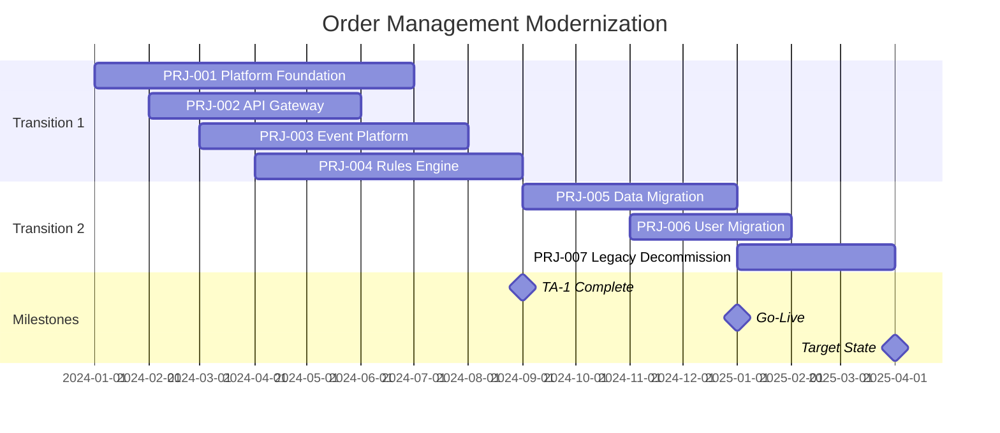
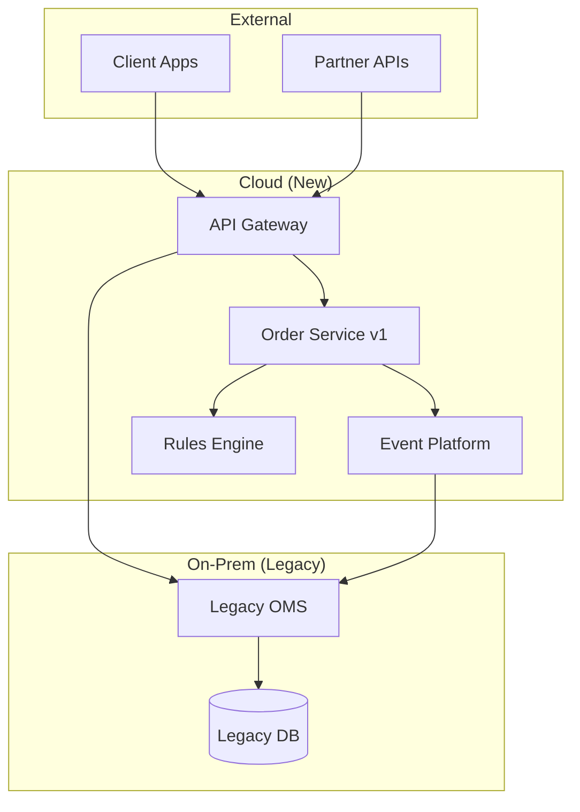

# Migration Planning Examples

Concrete examples for TOGAF Phase F deliverables.

---

## Example 1: Implementation and Migration Plan

### Executive Summary

This plan outlines the implementation of the Order Management Modernization initiative over 18 months through two major transitions. The initiative addresses 16 gaps identified in architecture phases B-D and delivers a modern, event-driven order management platform.

**Key Highlights:**
- **Budget**: $3.2M total ($2.8M base + $400K contingency)
- **Timeline**: Q1 2024 - Q2 2025 (18 months)
- **Team**: 15 FTE peak, 8 roles
- **Risk Profile**: 2 critical, 4 high risks identified with mitigations

### Strategic Context

| Driver | Description | Priority |
|--------|-------------|----------|
| Customer Experience | Reduce order processing time from 48h to 4h | High |
| Operational Efficiency | Eliminate manual routing, reduce errors | High |
| Scalability | Support 10x order volume growth | Medium |
| Technical Debt | Replace end-of-life legacy system | High |

### Transition Overview

| Transition | Theme | Duration | Target Date |
|------------|-------|----------|-------------|
| TA-1 | Foundation & Integration | 9 months | Q3 2024 |
| TA-2 | Migration & Go-Live | 6 months | Q1 2025 |
| Target | Optimization & Decommission | 3 months | Q2 2025 |

### Project Portfolio

| Project ID | Name | Transition | Start | End | Budget |
|------------|------|------------|-------|-----|--------|
| PRJ-001 | Platform Foundation | TA-1 | Jan 2024 | Jun 2024 | $600K |
| PRJ-002 | API Gateway | TA-1 | Feb 2024 | May 2024 | $250K |
| PRJ-003 | Event Platform | TA-1 | Mar 2024 | Jul 2024 | $400K |
| PRJ-004 | Rules Engine | TA-1 | Apr 2024 | Aug 2024 | $350K |
| PRJ-005 | Data Migration | TA-2 | Sep 2024 | Dec 2024 | $500K |
| PRJ-006 | User Migration | TA-2 | Nov 2024 | Jan 2025 | $300K |
| PRJ-007 | Legacy Decommission | TA-2 | Jan 2025 | Mar 2025 | $200K |
| | **Contingency (15%)** | | | | $400K |
| | **Total** | | | | **$3,000K** |

### Resource Summary

| Role | FTE-Months | Peak FTE | Cost |
|------|------------|----------|------|
| Solution Architect | 12 | 1.0 | $240K |
| Senior Developer | 36 | 4.0 | $540K |
| Developer | 48 | 5.0 | $576K |
| QA Engineer | 18 | 2.0 | $216K |
| DevOps Engineer | 12 | 1.0 | $180K |
| Data Engineer | 9 | 1.5 | $162K |
| Project Manager | 18 | 1.0 | $270K |
| Business Analyst | 12 | 1.0 | $156K |
| **Total Personnel** | **165** | **15** | **$2,340K** |

### Top Risks

| Rank | Risk | Score | Mitigation |
|------|------|-------|------------|
| 1 | Data migration errors cause business disruption | Critical (20) | Parallel run, validation scripts, rollback plan |
| 2 | Legacy system knowledge lost before migration | Critical (16) | Documentation, cross-training, consultant retention |
| 3 | Event platform learning curve delays | High (12) | Early POC, training program, vendor support |
| 4 | Integration complexity exceeds estimates | High (12) | Staged integration, buffer in schedule |

---

## Example 2: Transition Architecture Specification

### Transition Architecture: TA-1 (Foundation & Integration)

| Attribute | Value |
|-----------|-------|
| **Transition ID** | TA-1 |
| **Name** | Foundation & Integration |
| **Theme** | Establish core platform and integration layer |
| **Duration** | 9 months |
| **Target Date** | September 2024 |

### Scope Summary

| Domain | Baseline State | Transition State |
|--------|----------------|------------------|
| **Business** | Manual order routing | Automated routing for 50% of order types |
| **Data** | Monolithic database | Event sourcing for orders, legacy for master data |
| **Application** | Legacy monolith | New order service + legacy via API gateway |
| **Technology** | On-prem servers | Hybrid: new services on cloud, legacy on-prem |

### Work Packages

| WP ID | Name | Description | Duration |
|-------|------|-------------|----------|
| WP-001 | Cloud Foundation | AWS account setup, VPC, security baseline | 2 months |
| WP-002 | API Gateway | Kong gateway deployment, legacy API wrapping | 4 months |
| WP-003 | Event Platform | Kafka cluster, schema registry, initial topics | 5 months |
| WP-004 | Rules Engine | Drools deployment, routing rules migration | 5 months |
| WP-005 | Order Service v1 | New order service, basic CRUD, event publishing | 6 months |

### Architecture Diagram (TA-1 End State)

### Success Criteria

| Criterion | Measure | Target |
|-----------|---------|--------|
| Platform operational | All components deployed and healthy | 100% |
| API Gateway coverage | Legacy APIs wrapped | 100% |
| Event throughput | Messages per second | > 1000 |
| Routing accuracy | Orders routed correctly | > 95% |

### Exit Criteria

- [ ] All work packages complete
- [ ] Platform stability verified (7 days, <1% error rate)
- [ ] API gateway handling all traffic
- [ ] Event platform processing all order events
- [ ] Rules engine routing 50% of order types
- [ ] Monitoring and alerting operational
- [ ] Support team trained on new platform

---

## Example 3: Project Charter

### Project Charter: PRJ-005 Data Migration

| Attribute | Value |
|-----------|-------|
| **Project ID** | PRJ-005 |
| **Project Name** | Order Data Migration |
| **Sponsor** | Sarah Chen, VP Operations |
| **Project Manager** | TBD |
| **Transition** | TA-2 |
| **Work Packages** | WP-010, WP-011 |

### Problem Statement

The legacy order management system contains 5 years of historical order data (12M records) that must be migrated to the new event-sourced architecture while maintaining data integrity and supporting ongoing business operations.

### Objectives

1. Migrate 100% of active order data (last 2 years) with zero data loss
2. Archive historical data (3-5 years) in queryable format
3. Complete migration within 4-month window
4. Achieve <4 hour cutover window for go-live

### Benefits

| Benefit | Type | Measurement |
|---------|------|-------------|
| Eliminate dual maintenance | Tangible | -$50K/year |
| Enable new analytics | Tangible | +$200K/year revenue |
| Reduce query latency | Tangible | 80% faster reporting |
| Data consistency | Intangible | Single source of truth |

### Scope

**In Scope:**
- Order header and line item migration
- Customer reference data synchronization
- Order status history conversion
- Attachment/document migration
- Data validation and reconciliation

**Out of Scope:**
- Master data migration (separate project)
- BI/reporting data warehouse migration
- Archive data older than 5 years

### Timeline

| Phase | Start | End | Key Deliverables |
|-------|-------|-----|------------------|
| Planning | Sep 1 | Sep 30 | Migration design, scripts |
| Development | Oct 1 | Nov 15 | ETL pipelines, validation |
| Testing | Nov 16 | Dec 15 | Full migration dry-run |
| Execution | Dec 16 | Dec 20 | Production migration |
| Validation | Dec 21 | Dec 31 | Reconciliation complete |

### Resources

| Role | Count | Cost |
|------|-------|------|
| Data Engineer | 2 | $120K |
| Database Admin | 1 | $45K |
| QA Engineer | 1 | $48K |
| Business Analyst | 0.5 | $26K |
| Project Manager | 0.5 | $38K |
| **Subtotal** | | **$277K** |
| Contingency (15%) | | $42K |
| Technology | | $50K |
| **Total** | | **$369K** |

### Risks

| Risk | Probability | Impact | Mitigation |
|------|-------------|--------|------------|
| Data quality issues | High | High | Pre-migration cleansing, validation scripts |
| Cutover window exceeded | Medium | High | Rehearsals, parallel strategy |
| Legacy system instability | Low | Critical | Backup before migration, rollback plan |
| Resource availability | Medium | Medium | Early commitment, backup resources |

### Success Criteria

| Criterion | Measure | Target |
|-----------|---------|--------|
| Data completeness | Records migrated | 100% |
| Data accuracy | Validation errors | <0.01% |
| Cutover duration | Hours | <4 |
| Rollback capability | Tested and documented | Yes |

---

## Example 4: Resource Estimate

### Order Management Modernization - Resource Estimate

**Estimation Method**: Bottom-up with three-point for uncertain items
**Confidence Level**: Medium-High
**Date**: December 2023

### Personnel Summary

| Role | Rate | FTE-Months | Cost |
|------|------|------------|------|
| Solution Architect | $20K/mo | 12 | $240K |
| Senior Developer | $15K/mo | 36 | $540K |
| Developer | $12K/mo | 48 | $576K |
| QA Engineer | $12K/mo | 18 | $216K |
| DevOps Engineer | $15K/mo | 12 | $180K |
| Data Engineer | $18K/mo | 9 | $162K |
| Project Manager | $15K/mo | 18 | $270K |
| Business Analyst | $13K/mo | 12 | $156K |
| **Total** | | **165** | **$2,340K** |

### Technology

| Item | Type | Cost |
|------|------|------|
| AWS Infrastructure (18 mo) | OpEx | $216K |
| Kong Enterprise License | OpEx | $60K |
| Confluent Kafka | OpEx | $120K |
| Development Tools | CapEx | $30K |
| Testing Environments | OpEx | $54K |
| **Total Technology** | | **$480K** |

### External Services

| Service | Vendor | Cost |
|---------|--------|------|
| Kafka Training | Confluent | $25K |
| Legacy System Consultant | TechRetain | $80K |
| Security Assessment | SecureCo | $35K |
| **Total External** | | **$140K** |

### Contingency Calculation

| Category | Base Cost | Risk Factor | Contingency |
|----------|-----------|-------------|-------------|
| Personnel | $2,340K | 12% | $281K |
| Technology | $480K | 10% | $48K |
| External | $140K | 15% | $21K |
| Integration Risk | - | - | $50K |
| **Total Contingency** | | | **$400K** |

### Grand Total

| Category | Amount |
|----------|--------|
| Personnel | $2,340K |
| Technology | $480K |
| External Services | $140K |
| Contingency | $400K |
| **Total** | **$3,360K** |

---

## Example 5: Risk Assessment

### Migration Risk Register

| ID | Risk | Category | P | I | Score | Status |
|----|------|----------|---|---|-------|--------|
| R-001 | Data migration errors cause order loss | Technical | 4 | 5 | 20 | Open |
| R-002 | Legacy SME leaves during project | Organizational | 4 | 4 | 16 | Mitigating |
| R-003 | Event platform performance issues | Technical | 3 | 4 | 12 | Open |
| R-004 | Integration complexity exceeds estimate | Technical | 3 | 4 | 12 | Open |
| R-005 | User adoption resistance | Organizational | 4 | 3 | 12 | Open |
| R-006 | Vendor support delays | External | 2 | 4 | 8 | Open |
| R-007 | Budget overrun | Organizational | 3 | 3 | 9 | Open |

### R-001: Data Migration Errors (Critical)

| Attribute | Value |
|-----------|-------|
| **Description** | Data migration errors could cause order loss or corruption, impacting customer orders and revenue |
| **Probability** | 4 (High) - Complex data model, legacy inconsistencies |
| **Impact** | 5 (Critical) - Direct revenue and customer impact |
| **Score** | 20 (Critical) |

**Root Cause**: Legacy system has undocumented data relationships and inconsistent data quality

**Consequence if Realized**: 
- Lost orders = lost revenue
- Customer complaints and churn
- Manual recovery effort
- Delayed go-live

**Early Warning Signs**:
- Validation script failures in testing
- Increasing error rates in dry runs
- Data reconciliation mismatches

**Response Strategy**: Mitigate

**Response Actions**:
| Action | Owner | Due Date | Status |
|--------|-------|----------|--------|
| Develop comprehensive validation scripts | Data Lead | Oct 15 | In Progress |
| Conduct 3 full migration dry runs | QA Lead | Dec 1 | Planned |
| Implement parallel run strategy | Solution Arch | Nov 1 | In Progress |
| Document rollback procedure | DevOps | Nov 15 | Planned |

**Contingency Plan**: Execute rollback to legacy system within 4-hour window, restore from backup

---

## Example 6: Rollback Plan

### Rollback Plan: Order Service Go-Live

| Attribute | Value |
|-----------|-------|
| **Component** | Order Service v2 + Data Migration |
| **Migration Type** | Big Bang (with parallel validation) |
| **Rollback Window** | 4 hours from go-live start |
| **RTO** | 2 hours |
| **RPO** | 0 (no data loss) |

### Rollback Triggers

**Automatic Rollback**:
| Trigger | Threshold | Detection |
|---------|-----------|-----------|
| Order creation failure | >5% error rate for 15 min | Monitoring alert |
| Database connectivity | Connection failures >30 sec | Health check |
| Data validation failure | Reconciliation mismatch >0.1% | Validation job |

**Decision-Based**:
| Condition | Assessment | Authority |
|-----------|------------|-----------|
| Performance degradation | Order latency >5x baseline | Technical Lead |
| Business process failure | Unable to process priority orders | Business Owner |
| Integration failure | Partner APIs returning errors | Integration Lead |

### Rollback Procedure

#### Step 1: Assess and Decide (15 min)
| Task | Owner | Time |
|------|-------|------|
| Confirm trigger condition | On-call Engineer | 5 min |
| Assess impact and alternatives | Tech Lead | 5 min |
| Decision: rollback or fix forward | Rollback Lead | 5 min |

#### Step 2: Initiate Rollback (15 min)
| Task | Owner | Time |
|------|-------|------|
| Announce rollback to team | Rollback Lead | 2 min |
| Freeze all changes | DevOps | 3 min |
| Notify stakeholders | Communications | 5 min |
| Switch DNS to legacy | DevOps | 5 min |

#### Step 3: Restore Legacy (60 min)
| Task | Owner | Time | Verification |
|------|-------|------|--------------|
| Disable new order service | DevOps | 5 min | Health check fails |
| Replay missed events to legacy | Data Engineer | 30 min | Event count matches |
| Validate legacy data | QA | 15 min | Reconciliation report |
| Enable legacy order processing | DevOps | 10 min | Test order succeeds |

#### Step 4: Validate (30 min)
| Check | Method | Expected |
|-------|--------|----------|
| Order creation | Create test order | Success |
| Order retrieval | Query recent orders | All present |
| Integration | Partner test call | Success |
| Performance | Response time check | <2 sec |

### Point of No Return

| Milestone | Timeframe | Why No Rollback |
|-----------|-----------|-----------------|
| Legacy DB archive started | +48 hours | Backup only, no live restore |
| Partner cutover complete | +72 hours | Partners configured for new APIs |
| Legacy decommission | +30 days | Infrastructure removed |

### Contacts

| Role | Name | Phone | Backup |
|------|------|-------|--------|
| Rollback Lead | Alex Kim | 555-0101 | Maria Santos |
| Technical Lead | James Wu | 555-0102 | Lisa Park |
| Business Owner | Sarah Chen | 555-0103 | Tom Anderson |
| DevOps | Carlos Rivera | 555-0104 | Dev On-call |
