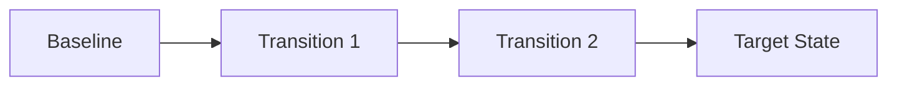
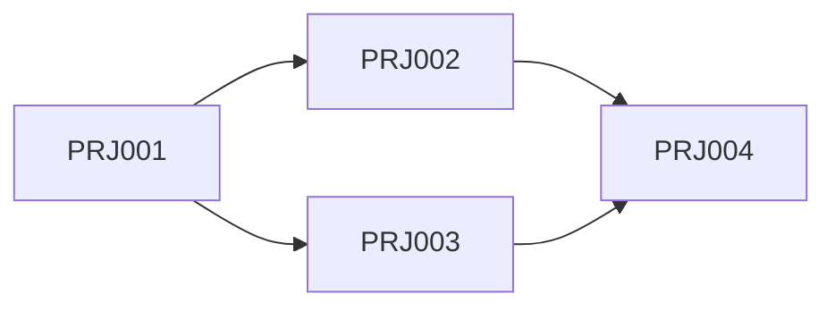
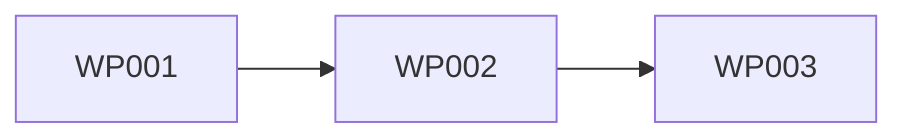
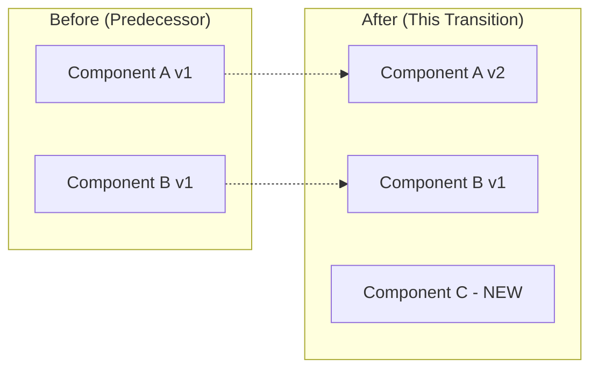

# Migration Planning Templates

Artifact templates for TOGAF Phase F deliverables.

---

## Implementation and Migration Plan Template

```markdown
# Implementation and Migration Plan

**Initiative**: {name}
**Version**: {version}
**Date**: {date}
**Status**: {Draft | Review | Approved}

---

## Executive Summary

{2-3 paragraphs summarizing the implementation approach, key milestones, resource requirements, and critical risks}

---

## Strategic Context

### Business Drivers
| Driver | Description | Priority |
|--------|-------------|----------|
| {driver} | {why this matters} | {H/M/L} |

### Architecture Vision Reference
- Vision Document: {link}
- Target State: {summary}
- Success Criteria: {key measures}

### Scope
- **In Scope**: {what's included}
- **Out of Scope**: {what's excluded}
- **Assumptions**: {key assumptions}

---

## Transition Overview

### Transition Summary
| Transition | Theme | Duration | Target Date |
|------------|-------|----------|-------------|
| TA-1 | {theme} | {duration} | {date} |
| TA-2 | {theme} | {duration} | {date} |
| Target | Complete | - | {date} |

### Transition Diagram


---

## Project Portfolio

### Portfolio Summary
| Project ID | Name | Transition | Start | End | Budget | Status |
|------------|------|------------|-------|-----|--------|--------|
| PRJ-{nnn} | {name} | TA-{n} | {date} | {date} | ${amount} | {status} |

### Project Dependencies


---

## Timeline and Milestones

### Master Timeline
```mermaid
gantt
    title Implementation Roadmap
    dateFormat YYYY-MM
    
    section {Transition 1}
    {Project 1}    :{start}, {duration}
    {Project 2}    :{start}, {duration}
    
    section {Transition 2}
    {Project 3}    :{start}, {duration}
    
    section Milestones
    {Milestone 1}  :milestone, {date}, 0d
    {Milestone 2}  :milestone, {date}, 0d
```

### Key Milestones
| ID | Milestone | Target Date | Exit Criteria | Owner |
|----|-----------|-------------|---------------|-------|
| M{n} | {name} | {date} | {criteria} | {owner} |

---

## Resource Summary

### People
| Role | Total FTE-Months | Peak FTE | Timing |
|------|------------------|----------|--------|
| {role} | {total} | {peak} | {when} |

### Budget
| Category | Amount | Notes |
|----------|--------|-------|
| Personnel | ${amount} | |
| Technology | ${amount} | |
| External | ${amount} | |
| Contingency | ${amount} | {%} |
| **Total** | **${amount}** | |

### Critical Skills
| Skill | Gap | Mitigation |
|-------|-----|------------|
| {skill} | {gap description} | {how addressed} |

---

## Risk Summary

### Top Risks
| Rank | Risk | Score | Mitigation Status |
|------|------|-------|-------------------|
| 1 | {risk} | {Critical/High} | {status} |
| 2 | {risk} | {Critical/High} | {status} |
| 3 | {risk} | {High} | {status} |

### Risk Trend
| Assessment Date | Critical | High | Medium | Low |
|-----------------|----------|------|--------|-----|
| {date} | {n} | {n} | {n} | {n} |

---

## Governance Model

### Decision Authority
| Decision Type | Authority | Escalation |
|---------------|-----------|------------|
| Scope change | Project Sponsor | Steering Committee |
| Budget variance >10% | Finance Committee | Executive Sponsor |
| Timeline change | PMO | Steering Committee |
| Architecture deviation | Architecture Board | Chief Architect |

### Reporting Cadence
| Report | Frequency | Audience |
|--------|-----------|----------|
| Status Report | Weekly | Project Team |
| Steering Update | Bi-weekly | Steering Committee |
| Executive Dashboard | Monthly | Executive Sponsor |

---

## Success Criteria

| Criterion | Measure | Target | Tracking |
|-----------|---------|--------|----------|
| {what} | {how measured} | {threshold} | {frequency} |

---

## Approvals

| Authority | Name | Decision | Date |
|-----------|------|----------|------|
| Architecture Board | | | |
| Finance Committee | | | |
| Executive Sponsor | | | |
```

---

## Transition Architecture Specification Template

```markdown
# Transition Architecture Specification

**Transition ID**: TA-{nnn}
**Name**: {descriptive name}
**Version**: {version}
**Date**: {date}

---

## Transition Identity

| Attribute | Value |
|-----------|-------|
| **Transition ID** | TA-{nnn} |
| **Name** | {name} |
| **Theme** | {what this transition achieves} |
| **Predecessor** | {Baseline or TA-{n-1}} |
| **Successor** | {TA-{n+1} or Target} |
| **Duration** | {estimated duration} |
| **Target Date** | {completion date} |

---

## Scope Summary

### Business Architecture
| Component | Baseline State | Transition State |
|-----------|----------------|------------------|
| {capability} | {current} | {after transition} |

### Data Architecture
| Component | Baseline State | Transition State |
|-----------|----------------|------------------|
| {entity/store} | {current} | {after transition} |

### Application Architecture
| Component | Baseline State | Transition State |
|-----------|----------------|------------------|
| {application} | {current} | {after transition} |

### Technology Architecture
| Component | Baseline State | Transition State |
|-----------|----------------|------------------|
| {technology} | {current} | {after transition} |

---

## Work Packages

| WP ID | Name | Description | Dependencies |
|-------|------|-------------|--------------|
| WP-{nnn} | {name} | {description} | {dependencies} |

### Work Package Sequencing


---

## Architecture Diagrams

### Transition State Overview
{Insert architecture diagram showing state at end of this transition}

### Key Changes from Predecessor


---

## Integration Points

### Active Integrations
| Source | Target | Protocol | Status |
|--------|--------|----------|--------|
| {component} | {component} | {API/Event/File} | {Active/Modified/New} |

### Deprecated Integrations
| Integration | Reason | Decommission Date |
|-------------|--------|-------------------|
| {integration} | {why removed} | {date} |

---

## Success Criteria

| Criterion | Measure | Target |
|-----------|---------|--------|
| {what} | {how measured} | {threshold} |

---

## Exit Criteria

- [ ] All work packages complete
- [ ] Integration tests passed
- [ ] Performance validated
- [ ] Stakeholder sign-off obtained
- [ ] Documentation updated
- [ ] Support team trained

---

## Dependencies

### Prerequisites (must be complete before start)
| Dependency | Source | Status |
|------------|--------|--------|
| {dependency} | {TA-{n}/External} | {Complete/In Progress} |

### Enables (unblocked by completion)
| Dependency | Consumer | Notes |
|------------|----------|-------|
| {what} | {TA-{n+1}/Project} | {notes} |

---

## Risks

| Risk | Impact | Mitigation |
|------|--------|------------|
| {risk} | {impact if realized} | {mitigation action} |
```

---

## Project Charter Template

```markdown
# Project Charter

**Project ID**: PRJ-{nnn}
**Project Name**: {name}
**Version**: {version}
**Date**: {date}

---

## Project Identity

| Attribute | Value |
|-----------|-------|
| **Project ID** | PRJ-{nnn} |
| **Project Name** | {name} |
| **Sponsor** | {name, title} |
| **Project Manager** | {name or TBD} |
| **Transition** | TA-{n} |
| **Work Packages** | {WP-nnn, WP-nnn} |

---

## Business Case

### Problem Statement
{What problem does this project solve? Why is it important?}

### Objectives
1. {SMART objective 1}
2. {SMART objective 2}
3. {SMART objective 3}

### Benefits
| Benefit | Type | Measurement | Timeline |
|---------|------|-------------|----------|
| {benefit} | {Tangible/Intangible} | {how measured} | {when realized} |

### Strategic Alignment
- Vision Reference: {link to Architecture Vision}
- Capability Impacted: {business capability}
- Strategic Priority: {which strategic goal}

---

## Scope

### In Scope
- {deliverable/activity 1}
- {deliverable/activity 2}
- {deliverable/activity 3}

### Out of Scope
- {exclusion 1}
- {exclusion 2}

### Assumptions
| ID | Assumption | Impact if Wrong |
|----|------------|-----------------|
| A{n} | {assumption} | {consequence} |

### Constraints
| ID | Constraint | Implication |
|----|------------|-------------|
| C{n} | {constraint} | {how it limits project} |

---

## Timeline

### High-Level Schedule
| Phase | Start | End | Key Deliverables |
|-------|-------|-----|------------------|
| Initiation | {date} | {date} | Charter, Team |
| Planning | {date} | {date} | Detailed plan, Design |
| Execution | {date} | {date} | {main deliverables} |
| Transition | {date} | {date} | Deployment, Training |
| Closure | {date} | {date} | Handover, Lessons |

### Key Milestones
| Milestone | Target Date | Criteria |
|-----------|-------------|----------|
| {milestone} | {date} | {what defines completion} |

---

## Resources

### Team Structure
| Role | Count | Skills Required | Source |
|------|-------|-----------------|--------|
| {role} | {n} | {skills} | {internal/external} |

### Budget
| Category | Estimate | Basis | Notes |
|----------|----------|-------|-------|
| Personnel | ${amount} | {calculation basis} | |
| Technology | ${amount} | {quotes/estimates} | |
| External Services | ${amount} | {vendor quotes} | |
| Training | ${amount} | | |
| Contingency | ${amount} | {%} of total | |
| **Total** | **${amount}** | | |

### Resource Timeline
| Role | M1 | M2 | M3 | M4 | M5 | M6 |
|------|----|----|----|----|----|----|
| {role} | {FTE} | {FTE} | {FTE} | {FTE} | {FTE} | {FTE} |

---

## Dependencies

### Incoming Dependencies
| Dependency | Source | Expected Date | Impact if Delayed |
|------------|--------|---------------|-------------------|
| {dependency} | {project/system} | {date} | {impact} |

### Outgoing Dependencies
| Deliverable | Consumer | Committed Date | Status |
|-------------|----------|----------------|--------|
| {deliverable} | {project/system} | {date} | {status} |

---

## Risks

| ID | Risk | Probability | Impact | Score | Mitigation | Owner |
|----|------|-------------|--------|-------|------------|-------|
| R{n} | {risk description} | {H/M/L} | {H/M/L} | {score} | {action} | {who} |

### Risk Response Plan
| Risk ID | Response Strategy | Actions | Status |
|---------|-------------------|---------|--------|
| R{n} | {Avoid/Mitigate/Transfer/Accept} | {specific actions} | {status} |

---

## Governance

### Decision Authority
| Decision Type | Authority | Escalation Path |
|---------------|-----------|-----------------|
| Day-to-day | Project Manager | Sponsor |
| Scope change | Sponsor | Steering Committee |
| Budget variance | Finance | Executive Sponsor |

### Reporting
| Report | Frequency | Audience | Content |
|--------|-----------|----------|---------|
| Status | Weekly | Team + Sponsor | Progress, issues, risks |
| Steering | Bi-weekly | Steering Committee | Milestones, decisions |

### Change Control
{Process for managing scope/requirement changes}

---

## Success Criteria

| Criterion | Measure | Target | Method |
|-----------|---------|--------|--------|
| {what defines success} | {how measured} | {threshold} | {how verified} |

---

## Approvals

| Role | Name | Signature | Date |
|------|------|-----------|------|
| Project Sponsor | | | |
| Architecture Board | | | |
| PMO | | | |
| Finance | | | |
```

---

## Resource Estimate Template

```markdown
# Resource Estimate

**Project/Initiative**: {name}
**Version**: {version}
**Date**: {date}
**Estimation Method**: {Analogous/Parametric/Bottom-up/Three-point}

---

## Estimate Summary

| Category | Amount | Confidence |
|----------|--------|------------|
| Personnel | ${amount} | {High/Medium/Low} |
| Technology | ${amount} | {High/Medium/Low} |
| External Services | ${amount} | {High/Medium/Low} |
| Other | ${amount} | {High/Medium/Low} |
| Subtotal | ${amount} | |
| Contingency ({%}) | ${amount} | |
| **Total** | **${amount}** | |

---

## Personnel Estimate

### Roles Required
| Role | Rate | FTE-Months | Cost | Source |
|------|------|------------|------|--------|
| {role} | ${rate}/month | {months} | ${cost} | {internal/contractor/vendor} |

### Timeline View
| Role | Q1 | Q2 | Q3 | Q4 | Total |
|------|----|----|----|----|-------|
| {role} | {FTE} | {FTE} | {FTE} | {FTE} | {FTE-months} |

### Skills Matrix
| Skill | Required Level | Available | Gap | Mitigation |
|-------|----------------|-----------|-----|------------|
| {skill} | {Expert/Proficient/Basic} | {Yes/No/Partial} | {description} | {action} |

---

## Technology Estimate

### Infrastructure
| Item | Type | Quantity | Unit Cost | Total | Timing |
|------|------|----------|-----------|-------|--------|
| {item} | {CapEx/OpEx} | {n} | ${cost} | ${total} | {when needed} |

### Licenses
| Product | License Type | Quantity | Annual Cost | Notes |
|---------|--------------|----------|-------------|-------|
| {product} | {perpetual/subscription} | {n} | ${cost} | |

### Environments
| Environment | Purpose | Monthly Cost | Duration | Total |
|-------------|---------|--------------|----------|-------|
| {env} | {dev/test/staging/prod} | ${cost} | {months} | ${total} |

---

## External Services Estimate

| Vendor/Service | Purpose | Estimate | Basis |
|----------------|---------|----------|-------|
| {vendor} | {what they provide} | ${amount} | {quote/estimate} |

---

## Three-Point Estimate Details

| Component | Optimistic | Most Likely | Pessimistic | Expected | Std Dev |
|-----------|------------|-------------|-------------|----------|---------|
| {component} | ${O} | ${M} | ${P} | ${E} | ${SD} |

**Expected** = (O + 4M + P) / 6
**Standard Deviation** = (P - O) / 6

---

## Contingency Calculation

| Risk Category | Exposure | Contingency % | Amount |
|---------------|----------|---------------|--------|
| Technical | ${exposure} |  | ${amount} |
| External | ${exposure} | {%} | ${amount} |
| **Total Contingency** | | | **${amount}** |

---

## Assumptions

| ID | Assumption | Impact if Wrong |
|----|------------|-----------------|
| A{n} | {assumption made in estimate} | {cost impact if wrong} |

---

## Estimate Confidence

| Factor | Assessment | Notes |
|--------|------------|-------|
| Scope clarity | {High/Medium/Low} | {notes} |
| Technical complexity | {High/Medium/Low} | {notes} |
| Team experience | {High/Medium/Low} | {notes} |
| Vendor quotes | {Firm/Indicative/Guess} | {notes} |
| **Overall Confidence** | **{High/Medium/Low}** | |
```

---

## Risk Assessment Template

```markdown
# Migration Risk Assessment

**Initiative**: {name}
**Version**: {version}
**Date**: {date}
**Risk Owner**: {name}

---

## Risk Summary

| Severity | Count | Trend |
|----------|-------|-------|
| Critical | {n} | {↑↓→} |
| High | {n} | {↑↓→} |
| Medium | {n} | {↑↓→} |
| Low | {n} | {↑↓→} |

---

## Risk Register

| ID | Risk | Category | Probability | Impact | Score | Status |
|----|------|----------|-------------|--------|-------|--------|
| R-{nnn} | {description} | {Tech/Ops/Org/Ext} | {1-5} | {1-5} | {P×I} | {Open/Mitigating/Closed} |

---

## Risk Details

### R-{nnn}: {Risk Title}

| Attribute | Value |
|-----------|-------|
| **Risk ID** | R-{nnn} |
| **Description** | {detailed description} |
| **Category** | {Technical/Operational/Organizational/External} |
| **Probability** | {1-5} - {rationale} |
| **Impact** | {1-5} - {rationale} |
| **Score** | {P×I} |
| **Owner** | {name} |

**Root Cause**:
{What could cause this risk to occur?}

**Consequence if Realized**:
{What happens if this risk occurs?}

**Early Warning Signs**:
- {indicator 1}
- {indicator 2}

**Response Strategy**: {Avoid/Mitigate/Transfer/Accept}

**Response Actions**:
| Action | Owner | Due Date | Status |
|--------|-------|----------|--------|
| {action} | {who} | {date} | {status} |

**Contingency Plan** (if risk occurs):
{What to do if risk materializes}

---

## Risk Matrix

|           | Impact 1 | Impact 2 | Impact 3 | Impact 4 | Impact 5 |
|-----------|----------|----------|----------|----------|----------|
| **Prob 5** | 5 | 10 | 15 | 20 | 25 |
| **Prob 4** | 4 | 8 | 12 | 16 | 20 |
| **Prob 3** | 3 | 6 | 9 | 12 | 15 |
| **Prob 2** | 2 | 4 | 6 | 8 | 10 |
| **Prob 1** | 1 | 2 | 3 | 4 | 5 |

**Severity Thresholds**:
- Critical: 20-25
- High: 12-19
- Medium: 6-11
- Low: 1-5

---

## Top Risks by Project

| Project | Critical Risks | High Risks | Risk Focus |
|---------|----------------|------------|------------|
| PRJ-{nnn} | {risk IDs} | {risk IDs} | {key concern} |

---

## Risk Trends

| Risk ID | Previous Score | Current Score | Trend | Reason |
|---------|----------------|---------------|-------|--------|
| R-{nnn} | {score} | {score} | {↑↓→} | {why changed} |
```

---

## Rollback Plan Template

```markdown
# Rollback Plan

**Component/Release**: {name}
**Version**: {version}
**Date**: {date}
**Rollback Owner**: {name}

---

## Rollback Overview

| Attribute | Value |
|-----------|-------|
| **Migration Type** | {Big Bang/Phased/Parallel} |
| **Rollback Window** | {time before no-rollback point} |
| **Recovery Time Objective** | {target time to restore} |
| **Recovery Point Objective** | {acceptable data loss} |

---

## Rollback Triggers

### Automatic Rollback
| Trigger | Threshold | Detection | Action |
|---------|-----------|-----------|--------|
| {condition} | {threshold} | {how detected} | {immediate action} |

### Decision-Based Rollback
| Condition | Assessment Criteria | Decision Authority |
|-----------|---------------------|-------------------|
| {condition} | {how evaluated} | {who decides} |

---

## Pre-Rollback Requirements

### Must Be Available
- [ ] {Backup location and verification}
- [ ] {Rollback scripts tested}
- [ ] {Team availability confirmed}
- [ ] {Communication channels ready}

### Must Be True
- [ ] {Pre-condition 1}
- [ ] {Pre-condition 2}

---

## Rollback Procedure

### Step 1: Assess and Decide
| Task | Owner | Est. Time |
|------|-------|-----------|
| Confirm rollback trigger met | {role} | {time} |
| Notify stakeholders | {role} | {time} |
| Obtain authorization | {role} | {time} |

### Step 2: Prepare
| Task | Owner | Est. Time |
|------|-------|-----------|
| Freeze changes | {role} | {time} |
| Notify users | {role} | {time} |
| Prepare rollback environment | {role} | {time} |

### Step 3: Execute Rollback
| Task | Owner | Est. Time | Verification |
|------|-------|-----------|--------------|
| {rollback step 1} | {role} | {time} | {how to verify} |
| {rollback step 2} | {role} | {time} | {how to verify} |
| {rollback step 3} | {role} | {time} | {how to verify} |

### Step 4: Validate
| Validation | Method | Expected Result |
|------------|--------|-----------------|
| {what to check} | {how} | {expected} |

### Step 5: Communicate
| Audience | Message | Channel | Owner |
|----------|---------|---------|-------|
| {audience} | {message} | {channel} | {who} |

---

## Point of No Return

| Milestone | Description | Date/Condition |
|-----------|-------------|----------------|
| {PONR milestone} | {why rollback not possible after} | {when reached} |

### Post-PONR Strategy
{What to do if issues arise after point of no return}

---

## Contacts

| Role | Name | Phone | Backup |
|------|------|-------|--------|
| Rollback Lead | {name} | {phone} | {backup name} |
| Technical Lead | {name} | {phone} | {backup name} |
| Business Owner | {name} | {phone} | {backup name} |
| Communications | {name} | {phone} | {backup name} |

---

## Lessons from Previous Rollbacks

| Date | Component | Issue | Lesson |
|------|-----------|-------|--------|
| {date} | {what} | {what went wrong} | {what we learned} |
```
