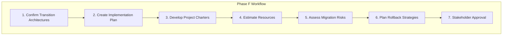
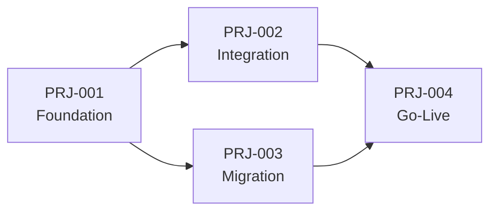
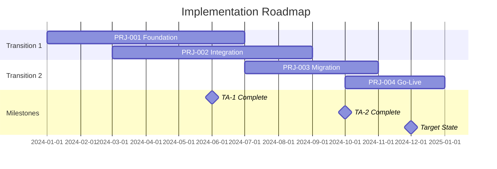
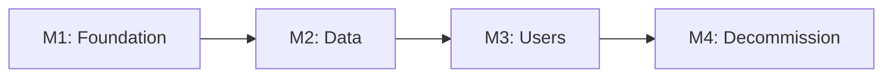

# Migration Planning Workflows

Step-by-step procedures for TOGAF Phase F.

---

## Workflow Overview



---

## Step 1: Confirm Transition Architectures

### 1.1 Review Phase E Outputs

Gather transition architecture definitions:

```yaml
transition_review:
  source: "Phase E - Opportunities and Solutions"
  artifacts:
    - transition_architectures.md
    - work_package_portfolio.md
    - dependency_analysis.md
  
  validation:
    - All transitions clearly defined
    - Dependencies mapped
    - Work packages assigned to transitions
```

### 1.2 Validate Transition Boundaries

For each transition, confirm:

```markdown
## Transition {N} Validation

### Scope Confirmation
- [ ] Business capabilities in scope
- [ ] Applications in scope
- [ ] Data entities in scope
- [ ] Technology components in scope

### Boundary Check
- [ ] Clean boundaries (no partial implementations)
- [ ] Logical grouping (related changes together)
- [ ] Value delivery (measurable outcome)

### Dependency Verification
- [ ] Prerequisites from prior transitions complete
- [ ] External dependencies identified
- [ ] No circular dependencies
```

### 1.3 Finalize Transition Specifications

Create detailed specification per transition:

```markdown
## Transition Architecture Specification

### Identity
| Attribute | Value |
|-----------|-------|
| **Transition ID** | TA-{nnn} |
| **Name** | {descriptive name} |
| **Duration** | {estimated duration} |
| **Target Date** | {completion date} |

### Scope Summary
| Domain | Baseline State | Transition State |
|--------|----------------|------------------|
| Business | {current} | {after transition} |
| Data | {current} | {after transition} |
| Application | {current} | {after transition} |
| Technology | {current} | {after transition} |

### Work Packages Included
| WP ID | Name | Dependencies |
|-------|------|--------------|
| WP-{nnn} | {name} | {deps} |

### Success Criteria
1. {measurable criterion 1}
2. {measurable criterion 2}
3. {measurable criterion 3}
```

---

## Step 2: Create Implementation Plan

### 2.1 Define Plan Structure

```yaml
implementation_plan:
  sections:
    - executive_summary
    - strategic_context
    - transition_overview
    - project_portfolio
    - timeline_and_milestones
    - resource_summary
    - risk_summary
    - governance_model
    - success_criteria
```

### 2.2 Develop Project Portfolio View

Map projects across transitions:

```markdown
## Project Portfolio

### Portfolio Summary
| Project | Transition | Start | End | Status |
|---------|------------|-------|-----|--------|
| PRJ-001 | TA-1 | Q1 2024 | Q2 2024 | Planned |
| PRJ-002 | TA-1 | Q1 2024 | Q3 2024 | Planned |
| PRJ-003 | TA-2 | Q3 2024 | Q4 2024 | Planned |

### Project Dependencies


### 2.3 Create Timeline



### 2.4 Define Milestones

```markdown
## Key Milestones

| ID | Milestone | Target Date | Exit Criteria |
|----|-----------|-------------|---------------|
| M1 | TA-1 Foundation Complete | 2024-06-30 | Platform operational |
| M2 | Data Migration Complete | 2024-09-30 | All data validated |
| M3 | User Migration Complete | 2024-11-30 | All users on new system |
| M4 | Legacy Decommission | 2024-12-31 | Old system retired |

### Milestone Dependencies


---

## Step 3: Develop Project Charters

### 3.1 Charter Template

For each project, create charter:

```markdown
# Project Charter: {Project Name}

## Project Identity

| Attribute | Value |
|-----------|-------|
| **Project ID** | PRJ-{nnn} |
| **Project Name** | {name} |
| **Sponsor** | {name, title} |
| **Project Manager** | {TBD or assigned} |
| **Transition** | TA-{n} |
| **Work Packages** | WP-{nnn}, WP-{nnn} |

## Business Case

### Problem Statement
{What problem does this project solve?}

### Objectives
1. {SMART objective 1}
2. {SMART objective 2}
3. {SMART objective 3}

### Benefits
| Benefit | Type | Measurement |
|---------|------|-------------|
| {benefit} | {Tangible/Intangible} | {how measured} |

## Scope

### In Scope
- {item 1}
- {item 2}
- {item 3}

### Out of Scope
- {exclusion 1}
- {exclusion 2}

### Assumptions
- {assumption 1}
- {assumption 2}

### Constraints
- {constraint 1}
- {constraint 2}

## Timeline

| Phase | Start | End | Key Deliverables |
|-------|-------|-----|------------------|
| Initiation | {date} | {date} | Charter, Team |
| Planning | {date} | {date} | Detailed plan |
| Execution | {date} | {date} | {deliverables} |
| Closure | {date} | {date} | Handover, lessons |

## Resources

### Team Structure
| Role | Count | Skills Required |
|------|-------|-----------------|
| {role} | {n} | {skills} |

### Budget
| Category | Estimate | Notes |
|----------|----------|-------|
| Personnel | ${amount} | {basis} |
| Technology | ${amount} | {basis} |
| External | ${amount} | {basis} |
| Contingency | ${amount} | {%} |
| **Total** | **${amount}** | |

## Dependencies

| Dependency | Type | Owner | Impact if Delayed |
|------------|------|-------|-------------------|
| {dependency} | {Internal/External} | {who} | {impact} |

## Risks

| Risk | Probability | Impact | Mitigation |
|------|-------------|--------|------------|
| {risk} | {H/M/L} | {H/M/L} | {action} |

## Success Criteria

| Criterion | Measure | Target |
|-----------|---------|--------|
| {what} | {how measured} | {threshold} |

## Approvals

| Role | Name | Date | Signature |
|------|------|------|-----------|
| Sponsor | | | |
| Architecture Board | | | |
| PMO | | | |
```

### 3.2 Charter Review Checklist

```markdown
## Charter Quality Check

- [ ] Aligned with architecture vision
- [ ] Clear, measurable objectives
- [ ] Scope clearly bounded
- [ ] Realistic timeline
- [ ] Resource estimates justified
- [ ] Dependencies identified and owned
- [ ] Key risks documented
- [ ] Success criteria measurable
- [ ] Sponsor approval obtained
```

---

## Step 4: Estimate Resources

### 4.1 Resource Categories

```yaml
resource_estimation:
  people:
    - roles_required
    - fte_count
    - skill_profiles
    - availability_windows
  
  budget:
    - capital_expenditure
    - operational_expenditure
    - contingency_allowance
  
  technology:
    - licenses
    - infrastructure
    - tools
    - environments
  
  external:
    - vendors
    - consultants
    - partners
```

### 4.2 Estimation Techniques

#### Analogous Estimation
```markdown
## Analogous Estimate

### Reference Project
| Attribute | Reference Project | Current Project |
|-----------|-------------------|-----------------|
| **Scope** | {description} | {description} |
| **Complexity** | {H/M/L} | {H/M/L} |
| **Team Size** | {n} | {adjusted} |
| **Duration** | {months} | {adjusted} |
| **Cost** | ${amount} | ${adjusted} |

### Adjustment Factors
| Factor | Adjustment | Rationale |
|--------|------------|-----------|
| Complexity | +20% | More integrations |
| Team experience | -10% | Similar tech stack |
| **Net Adjustment** | **+10%** | |
```

#### Three-Point Estimation
```markdown
## Three-Point Estimate

| Work Package | Optimistic | Most Likely | Pessimistic | Expected |
|--------------|------------|-------------|-------------|----------|
| WP-001 | 2 months | 3 months | 6 months | 3.3 months |
| WP-002 | 1 month | 2 months | 4 months | 2.2 months |
| WP-003 | 3 months | 4 months | 8 months | 4.5 months |

**Formula**: Expected = (O + 4M + P) / 6
```

### 4.3 Create Resource Plan

```markdown
## Resource Allocation Plan

### People
| Role | Q1 | Q2 | Q3 | Q4 | Total FTE-Months |
|------|----|----|----|----|------------------|
| Solution Architect | 1.0 | 1.0 | 0.5 | 0.25 | 8.25 |
| Developer | 0 | 4.0 | 4.0 | 2.0 | 30.0 |
| QA Engineer | 0 | 1.0 | 2.0 | 2.0 | 15.0 |
| Project Manager | 0.5 | 1.0 | 1.0 | 0.5 | 9.0 |

### Budget Summary
| Category | Amount | Timing |
|----------|--------|--------|
| Personnel | $750,000 | Spread |
| Technology | $200,000 | Q1-Q2 |
| External Services | $150,000 | Q2-Q3 |
| Contingency (15%) | $165,000 | Reserve |
| **Total** | **$1,265,000** | |

### Critical Skills
| Skill | Required | Available | Gap | Mitigation |
|-------|----------|-----------|-----|------------|
| Kafka | 2 | 1 | 1 | Training + hire |
| React | 3 | 3 | 0 | - |
| Legacy System | 1 | 1 | 0 | Knowledge transfer |
```

---

## Step 5: Assess Migration Risks

### 5.1 Risk Identification

Systematic risk discovery:

```yaml
risk_identification:
  techniques:
    - checklist_review
    - assumption_analysis
    - dependency_analysis
    - expert_interviews
    - lessons_learned_review
  
  categories:
    - technical
    - operational
    - organizational
    - external
```

### 5.2 Risk Register

```markdown
## Migration Risk Register

| ID | Risk | Category | Probability | Impact | Score | Mitigation | Owner | Status |
|----|------|----------|-------------|--------|-------|------------|-------|--------|
| R-001 | Data migration errors | Technical | High | High | Critical | Validation scripts, parallel run | Data Lead | Open |
| R-002 | Key person leaves | Organizational | Medium | High | High | Cross-training, documentation | PM | Open |
| R-003 | Vendor delay | External | Medium | Medium | Medium | Buffer in schedule, alternatives | Vendor Manager | Open |
| R-004 | User resistance | Organizational | High | Medium | High | Change management, training | Change Lead | Open |
```

### 5.3 Risk Response Strategies

| Strategy | When to Use | Example |
|----------|-------------|---------|
| **Avoid** | Change plan to eliminate risk | Remove risky feature from scope |
| **Mitigate** | Reduce probability or impact | Add testing, parallel run |
| **Transfer** | Shift risk to another party | Insurance, vendor SLA |
| **Accept** | Risk within tolerance | Budget contingency |

### 5.4 Risk-to-Project Mapping

```markdown
## Risk Impact Analysis

### By Project
| Project | Critical Risks | High Risks | Action |
|---------|----------------|------------|--------|
| PRJ-001 | R-001 | R-002, R-003 | Risk review weekly |
| PRJ-002 | None | R-004 | Change management focus |

### By Transition
| Transition | Risk Exposure | Confidence |
|------------|---------------|------------|
| TA-1 | High (3 critical risks) | Medium |
| TA-2 | Medium (1 high risk) | High |
```

---

## Step 6: Plan Rollback Strategies

### 6.1 Rollback Planning per Component

```markdown
## Rollback Plans

### Component: {Component Name}

| Attribute | Value |
|-----------|-------|
| **Component** | {name} |
| **Migration Type** | {big bang/phased/parallel} |
| **Rollback Window** | {hours/days before no-rollback} |
| **Recovery Time Objective** | {target time} |

#### Rollback Procedure
1. {step 1}
2. {step 2}
3. {step 3}

#### Rollback Triggers
- [ ] {trigger condition 1}
- [ ] {trigger condition 2}

#### Pre-requisites for Rollback
- [ ] {pre-requisite 1}
- [ ] {pre-requisite 2}

#### Post-Rollback Actions
1. {action 1}
2. {action 2}
```

### 6.2 Rollback Decision Matrix

```markdown
## Rollback Decision Matrix

| Severity | Business Impact | Decision | Authority |
|----------|-----------------|----------|-----------|
| Critical | System unusable | Immediate rollback | On-call lead |
| High | Major function broken | Assess → Rollback if no fix in 2hr | Project Manager |
| Medium | Degraded performance | Fix forward if possible | Tech Lead |
| Low | Minor issues | Fix forward | Development Team |
```

### 6.3 Point of No Return

```markdown
## Point of No Return (PONR)

### Definition
After these events, rollback is no longer feasible:

| Milestone | Why No Rollback | Alternative |
|-----------|-----------------|-------------|
| Data sync complete | Source data deleted | Restore from backup |
| Old system decommissioned | Infrastructure gone | Full rebuild |
| Cutover + 30 days | Business adapted | Fix forward only |

### Pre-PONR Checklist
- [ ] All validation complete
- [ ] Stakeholder sign-off obtained
- [ ] Backup verified and tested
- [ ] Support team ready
```

---

## Step 7: Stakeholder Approval

### 7.1 Approval Package

Prepare materials for approval:

```yaml
approval_package:
  documents:
    - implementation_plan_summary
    - project_portfolio_overview
    - resource_requirements
    - risk_assessment_summary
    - timeline_and_milestones
  
  presentations:
    - executive_briefing
    - detailed_walkthrough
  
  supporting:
    - project_charters
    - detailed_estimates
    - risk_register
```

### 7.2 Governance Review

```markdown
## Governance Review Checklist

### Architecture Board
- [ ] Alignment with architecture vision
- [ ] Technical feasibility confirmed
- [ ] Standards compliance
- [ ] Risk assessment adequate

### Finance
- [ ] Budget justified
- [ ] Funding approved
- [ ] Contingency appropriate

### PMO
- [ ] Resource availability confirmed
- [ ] Portfolio conflicts resolved
- [ ] Dependencies manageable

### Sponsor
- [ ] Business case valid
- [ ] Timeline acceptable
- [ ] Success criteria agreed
```

### 7.3 Approval Record

```markdown
## Implementation Plan Approval

| Authority | Decision | Date | Conditions |
|-----------|----------|------|------------|
| Architecture Board | Approved | {date} | {any conditions} |
| Finance Committee | Approved | {date} | {any conditions} |
| PMO | Approved | {date} | {any conditions} |
| Executive Sponsor | Approved | {date} | {any conditions} |

### Conditions to Address
| Condition | Owner | Due Date | Status |
|-----------|-------|----------|--------|
| {condition} | {who} | {date} | {status} |
```

---

## Output Summary

At the end of Phase F, you should have:

```
migration-planning/
├── implementation-plan.md          # Master coordination document
├── transition-specs/
│   ├── ta-1-specification.md       # Transition 1 details
│   └── ta-2-specification.md       # Transition 2 details
├── project-charters/
│   ├── prj-001-charter.md          # Individual project charters
│   ├── prj-002-charter.md
│   └── ...
├── resource-plan.md                # People, budget, timeline
├── risk-assessment.md              # Migration risks
├── rollback-plans.md               # Recovery procedures
└── approval-record.md              # Governance sign-off
```
