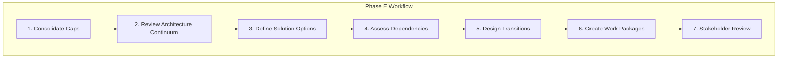

# Opportunities and Solutions Workflows

Step-by-step procedures for TOGAF Phase E.

---

## Workflow Overview



---

## Step 1: Consolidate Gaps

### 1.1 Gather Gap Registers

Collect gaps from all domains:

```yaml
gap_sources:
  - source: "Phase B Gap Analysis"
    file: "business-architecture/gap-analysis.md"
    gap_ids: "G-B-*"

  - source: "Phase C Gap Analysis"
    file: "information-systems/gap-analysis.md"
    gap_ids: "G-C-*"

  - source: "Phase D Gap Analysis"
    file: "technology-architecture/gap-analysis.md"
    gap_ids: "G-D-*"
```

### 1.2 Create Consolidated Register

Merge into unified view:

```markdown
| Gap ID | Domain | Category | Description | Priority | Related Gaps |
|--------|--------|----------|-------------|----------|--------------|
| G-B-001 | Business | Capability | {description} | {H/M/L} | G-C-002 |
| G-C-001 | IS-Data | Entity | {description} | {H/M/L} | G-D-001 |
| G-C-002 | IS-App | Application | {description} | {H/M/L} | G-B-001 |
| G-D-001 | Tech | Platform | {description} | {H/M/L} | G-C-001 |
```

### 1.3 Identify Cross-Domain Relationships

Map dependencies between gaps:

```yaml
gap_relationships:
  - gap: "G-B-001"
    description: "Need automated order routing capability"
    requires:
      - gap: "G-C-002"
        reason: "Needs routing rules application"
      - gap: "G-D-001"
        reason: "Needs real-time processing platform"

  - gap: "G-C-002"
    description: "Need routing rules engine"
    requires:
      - gap: "G-D-001"
        reason: "Runs on event platform"
```

### 1.4 Categorize Gaps

Group by resolution approach:

```yaml
gap_categories:
  new_capability:
    description: "Build or buy new"
    gaps: ["G-B-001", "G-C-002"]

  enhancement:
    description: "Extend existing"
    gaps: ["G-C-003", "G-D-002"]

  migration:
    description: "Replace existing"
    gaps: ["G-D-001"]

  retirement:
    description: "Decommission"
    gaps: ["G-C-004"]
```

---

## Step 2: Review Architecture Continuum

### 2.1 Check Existing Solutions

Search for reusable components:

```yaml
continuum_review:
  foundation:
    - "Industry reference models"
    - "Standards (e.g., BIAN, HL7)"
    - "Open source frameworks"

  common_systems:
    - "Enterprise platforms already deployed"
    - "Shared services catalog"
    - "Integration patterns library"

  organization_specific:
    - "Previous project solutions"
    - "Internal component library"
    - "Proven patterns"
```

### 2.2 Identify Reuse Candidates

```yaml
reuse_opportunities:
  - gap: "G-C-002"
    candidate: "Rules Engine from Order Platform"
    reuse_level: "Extend"
    effort_reduction: "60%"

  - gap: "G-D-001"
    candidate: "Event Platform from Analytics Team"
    reuse_level: "Leverage"
    effort_reduction: "80%"
```

### 2.3 Document Building Blocks

Define Architecture Building Blocks (ABBs):

```yaml
building_blocks:
  - id: "ABB-001"
    name: "Real-time Event Processing"
    type: "Technology"
    description: "Capability to process events in real-time"
    addresses_gaps: ["G-D-001", "G-B-001"]
    interfaces:
      - "Event Producer API"
      - "Event Consumer API"
      - "Admin Console"

  - id: "ABB-002"
    name: "Business Rules Engine"
    type: "Application"
    description: "Externalized business rules execution"
    addresses_gaps: ["G-C-002"]
    interfaces:
      - "Rules API"
      - "Rules Admin UI"
```

---

## Step 3: Define Solution Options

### 3.1 Generate Options

For each major gap or gap cluster:

```yaml
solution_options:
  gap_cluster: "Order Routing Automation"
  gaps_addressed: ["G-B-001", "G-C-002", "G-D-001"]

  options:
    - id: "OPT-1"
      name: "Build Custom"
      description: "Develop in-house routing solution"
      approach: "Build"

    - id: "OPT-2"
      name: "Buy OMS Platform"
      description: "Commercial order management system"
      approach: "Buy"

    - id: "OPT-3"
      name: "Extend Existing"
      description: "Add routing to current order system"
      approach: "Enhance"
```

### 3.2 Evaluate Options

Score each option:

```yaml
evaluation:
  criteria:
    - name: "Strategic Fit"
      weight: 25
    - name: "Time to Value"
      weight: 20
    - name: "Total Cost"
      weight: 20
    - name: "Risk"
      weight: 15
    - name: "Flexibility"
      weight: 10
    - name: "Skills Available"
      weight: 10

  scores:
    OPT-1:
      strategic_fit: 5
      time_to_value: 2
      total_cost: 3
      risk: 2
      flexibility: 5
      skills_available: 4
      weighted_total: 3.45

    OPT-2:
      strategic_fit: 3
      time_to_value: 4
      total_cost: 3
      risk: 4
      flexibility: 2
      skills_available: 3
      weighted_total: 3.25

    OPT-3:
      strategic_fit: 4
      time_to_value: 4
      total_cost: 4
      risk: 3
      flexibility: 4
      skills_available: 5
      weighted_total: 4.00
```

### 3.3 Select Preferred Options

Document decisions:

```yaml
decisions:
  - gap_cluster: "Order Routing Automation"
    selected: "OPT-3"
    rationale: "Highest score, leverages existing investment"
    alternatives_rejected:
      - option: "OPT-1"
        reason: "Too long, higher risk"
      - option: "OPT-2"
        reason: "Limited flexibility, integration complexity"
```

### 3.4 Define Solution Building Blocks

Convert ABBs to specific SBBs:

```yaml
solution_building_blocks:
  - id: "SBB-001"
    name: "Kafka Event Platform"
    implements: "ABB-001"
    technology: "Apache Kafka (MSK)"
    vendor: "AWS"
    deployment: "Managed service"

  - id: "SBB-002"
    name: "Drools Rules Engine"
    implements: "ABB-002"
    technology: "Drools"
    vendor: "Red Hat"
    deployment: "Container on EKS"
```

---

## Step 4: Assess Dependencies

### 4.1 Map Technical Dependencies

```yaml
technical_dependencies:
  - component: "SBB-002 Rules Engine"
    depends_on:
      - component: "SBB-001 Event Platform"
        type: "Finish-to-Start"
        reason: "Rules engine consumes events"

  - component: "Order Routing Feature"
    depends_on:
      - component: "SBB-002 Rules Engine"
        type: "Finish-to-Start"
        reason: "Routing uses rules engine"
      - component: "Inventory API v2"
        type: "Start-to-Start"
        reason: "Needs availability data"
```

### 4.2 Map Resource Dependencies

```yaml
resource_dependencies:
  - project: "Event Platform"
    constraints:
      - type: "Team"
        description: "Platform team required"
        availability: "Q2 onwards"

      - type: "Budget"
        description: "Cloud infrastructure budget"
        availability: "Approved FY25"
```

### 4.3 Map External Dependencies

```yaml
external_dependencies:
  - project: "Payment Integration"
    external:
      - type: "Vendor"
        description: "Stripe new API version"
        expected: "Q3 2025"

      - type: "Regulatory"
        description: "PSD2 compliance deadline"
        deadline: "2025-12-31"
```

### 4.4 Create Dependency Matrix

```markdown
| From \ To | Platform | Rules | Routing | Integration | Analytics |
|-----------|----------|-------|---------|-------------|-----------|
| Platform | - | FS | - | - | - |
| Rules | - | - | FS | - | - |
| Routing | - | - | - | SS | - |
| Integration | - | - | - | - | SS |
| Analytics | FS | - | - | FS | - |

FS = Finish-to-Start, SS = Start-to-Start
```

---

## Step 5: Design Transitions

### 5.1 Determine Number of Transitions

```yaml
transition_factors:
  - factor: "Number of major changes"
    count: 5
    suggests: "2-3 transitions"

  - factor: "Risk tolerance"
    level: "Medium"
    suggests: "More transitions"

  - factor: "Time pressure"
    level: "High"
    suggests: "Fewer transitions"

  - factor: "Resource constraints"
    level: "Moderate"
    suggests: "2 transitions"

decision: "2 transition architectures"
```

### 5.2 Define Transition Boundaries

```yaml
transitions:
  transition_1:
    name: "Foundation"
    target_date: "Q4 2025"
    theme: "Platform and infrastructure"
    includes:
      - "SBB-001: Event Platform"
      - "Database migrations"
      - "Network changes"
    delivers:
      - "Real-time event capability"
      - "Modernized data layer"

  transition_2:
    name: "Capabilities"
    target_date: "Q2 2026"
    theme: "Business capabilities"
    includes:
      - "SBB-002: Rules Engine"
      - "Order Routing"
      - "Integration Layer"
    delivers:
      - "Automated order routing"
      - "API gateway"
```

### 5.3 Document Transition Architecture

For each transition:

```yaml
transition_architecture:
  id: "TA-1"
  name: "Foundation"

  state:
    changed:
      - component: "Event Platform"
        from: "None"
        to: "Kafka (MSK)"

      - component: "Order Database"
        from: "MySQL 5.7"
        to: "PostgreSQL 15"

    unchanged:
      - "Order Application (legacy)"
      - "Customer CRM"
      - "Legacy integrations"

  value_delivered:
    - "Real-time event processing available"
    - "Modern database platform"
    - "Foundation for future capabilities"

  risks:
    - "Database migration complexity"
    - "Team learning curve on Kafka"
```

---

## Step 6: Create Work Packages

### 6.1 Group into Work Packages

```yaml
work_packages:
  - id: "WP-E-001"
    name: "Event Platform Implementation"
    transition: "TA-1"
    gaps_addressed: ["G-D-001"]
    sbbs_delivered: ["SBB-001"]

  - id: "WP-E-002"
    name: "Database Modernization"
    transition: "TA-1"
    gaps_addressed: ["G-D-002", "G-C-001"]
    sbbs_delivered: []

  - id: "WP-E-003"
    name: "Rules Engine & Routing"
    transition: "TA-2"
    gaps_addressed: ["G-B-001", "G-C-002"]
    sbbs_delivered: ["SBB-002"]
```

### 6.2 Detail Work Packages

For each work package:

```yaml
work_package:
  id: "WP-E-001"
  name: "Event Platform Implementation"

  description: "Deploy Kafka-based event platform for real-time processing"

  scope:
    in:
      - "MSK cluster provisioning"
      - "Event schema registry"
      - "Producer/consumer libraries"
      - "Monitoring and alerting"
    out:
      - "Application integration (separate WPs)"
      - "Event sourcing implementation"

  dependencies:
    predecessor: []
    parallel: ["WP-E-002"]
    successor: ["WP-E-003"]

  resources:
    team: "Platform Team"
    skills: ["Kafka", "AWS", "Terraform"]
    external: "AWS Professional Services (optional)"

  estimates:
    duration: "10 weeks"
    effort: "400 person-days"
    cost: "$350,000"

  risks:
    - risk: "MSK configuration complexity"
      mitigation: "Engage AWS support early"
```

### 6.3 Sequence Work Packages

Create implementation roadmap draft:

```
Q3 2025           Q4 2025           Q1 2026           Q2 2026
    │                 │                 │                 │
    ▼                 ▼                 ▼                 ▼
┌─────────────────────────────┐
│ WP-E-001: Event Platform    │
└─────────────────────────────┘
┌─────────────────────────────┐
│ WP-E-002: Database Modern   │
└─────────────────────────────┘
                   ┌─────────────────────────────────────┐
                   │ WP-E-003: Rules & Routing           │
                   └─────────────────────────────────────┘
                                      ┌──────────────────────────────┐
                                      │ WP-E-004: Integration Layer  │
                                      └──────────────────────────────┘
```

---

## Step 7: Stakeholder Review

### 7.1 Prepare Review Materials

```yaml
presentation:
  sections:
    - "Consolidated Gap Summary"
    - "Solution Options Evaluated"
    - "Recommended Building Blocks"
    - "Transition Architecture Plan"
    - "Work Package Portfolio"
    - "Draft Implementation Roadmap"
    - "Resource and Cost Summary"
    - "Key Risks and Mitigations"
```

### 7.2 Conduct Reviews

```yaml
reviews:
  - audience: "Technical Leads"
    focus: "Solution feasibility, dependencies"
    duration: "2 hours"

  - audience: "Business Stakeholders"
    focus: "Value delivery, timing"
    duration: "2 hours"

  - audience: "PMO"
    focus: "Resource planning, sequencing"
    duration: "2 hours"

  - audience: "Architecture Board"
    focus: "Full package, approval"
    duration: "4 hours"
```

### 7.3 Incorporate Feedback

Track and address:

```yaml
feedback:
  - id: "FB-001"
    source: "Business"
    feedback: "Need routing capability sooner"
    action: "Evaluate accelerated path"
    status: "Under review"

  - id: "FB-002"
    source: "Technical"
    feedback: "Add service mesh to platform"
    action: "Defer to future phase"
    status: "Accepted"
```

### 7.4 Obtain Approval

```yaml
approvals:
  - artifact: "Transition Architectures"
    approver: "Enterprise Architect"
    status: "Approved"

  - artifact: "Work Package Portfolio"
    approver: "PMO Director"
    status: "Approved"

  - artifact: "Phase E Overall"
    approver: "Architecture Board"
    status: "Approved"
```

---

## Quick Reference

| Step | Key Activities | Primary Output |
|------|----------------|----------------|
| 1. Consolidate Gaps | Merge domain gaps, identify relationships | Consolidated Gap Register |
| 2. Review Continuum | Find reuse opportunities, define ABBs | Building Block Catalog |
| 3. Define Solutions | Generate options, evaluate, select | Solution Decisions |
| 4. Assess Dependencies | Map technical/resource/external deps | Dependency Matrix |
| 5. Design Transitions | Define intermediate states | Transition Architectures |
| 6. Create Work Packages | Group, detail, sequence | Work Package Portfolio |
| 7. Stakeholder Review | Present, feedback, approve | Approved Phase E |
