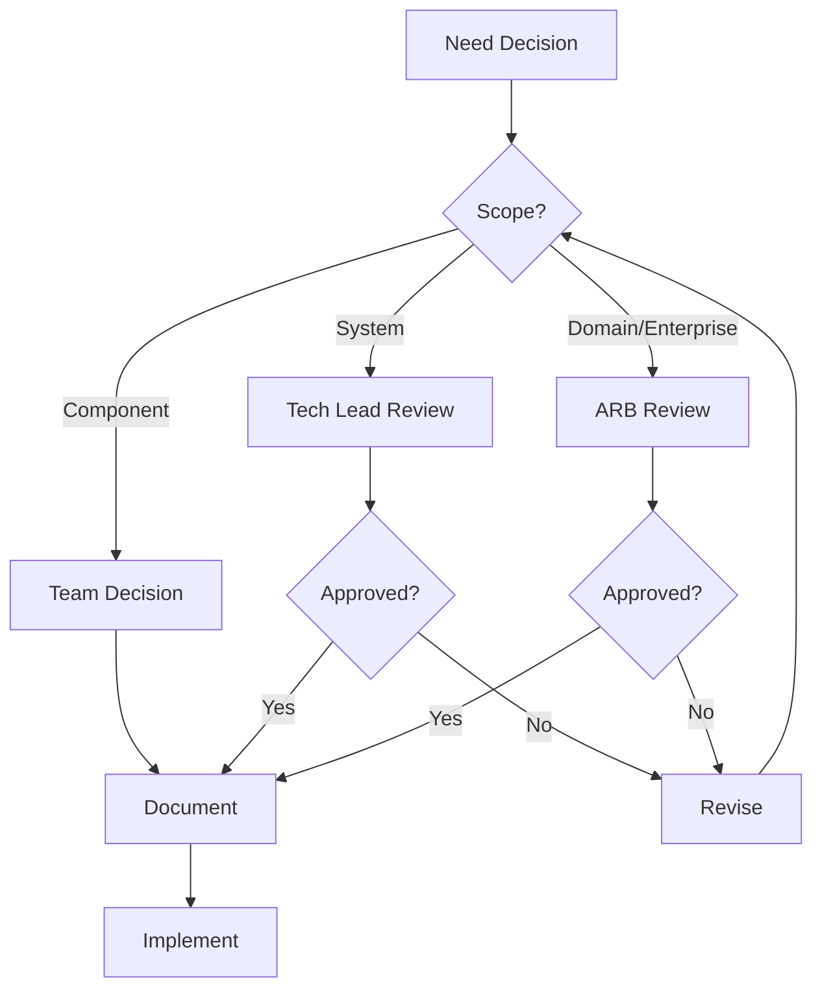

# Preliminary Phase Templates

Templates for establishing architecture capability.

---

## Architecture Principles Template

```markdown
# Architecture Principles

**Organization**: {Organization Name}
**Version**: {1.0}
**Last Updated**: {Date}
**Owner**: {Architecture Team}

---

## Purpose

These principles guide architecture decisions across {scope}. They ensure consistency, alignment with business strategy, and technical excellence.

---

## Business Principles

### BP-1: {Principle Name}

**Statement**: {One clear sentence}

**Rationale**: {Why this matters to the business}

**Implications**:
- {What this means in practice}
- {Constraints or requirements it creates}

---

### BP-2: Business Value First

**Statement**: Technology decisions must demonstrably support business objectives.

**Rationale**: Technology exists to serve business needs. Investments in technology should have clear business justification.

**Implications**:
- All architecture proposals include business case
- Technical debt addressed when impacting business
- Features prioritized by business value

---

## Data Principles

### DP-1: Data is a Shared Asset

**Statement**: Data belongs to the organization, not individual systems or teams.

**Rationale**: Siloed data creates redundancy, inconsistency, and barriers to insight.

**Implications**:
- Systems must provide data access via APIs
- Master data has single source of truth
- Data sharing agreements documented

---

### DP-2: Data Quality at Source

**Statement**: Data quality is the responsibility of the creating system.

**Rationale**: Poor data quality compounds through downstream systems.

**Implications**:
- Validation at data entry points
- Data quality metrics tracked
- Issues fixed at source, not downstream

---

## Application Principles

### AP-1: Modularity Over Monolith

**Statement**: Build loosely coupled components with well-defined interfaces.

**Rationale**: Modular systems are easier to understand, test, deploy, and evolve.

**Implications**:
- Clear component boundaries
- API-first integration
- Independent deployability preferred

---

### AP-2: API-First Design

**Statement**: All functionality is accessible via well-designed APIs.

**Rationale**: APIs enable integration, automation, and future flexibility.

**Implications**:
- API design before implementation
- Documentation required for all APIs
- Versioning strategy defined

---

### AP-3: Security by Design

**Statement**: Security is built in from the start, not added later.

**Rationale**: Retrofitting security is expensive and often incomplete.

**Implications**:
- Security review in design phase
- Authentication/authorization in every service
- Sensitive data encrypted at rest and in transit

---

## Technology Principles

### TP-1: Prefer Proven Technologies

**Statement**: Choose technologies with strong track records unless innovation is justified.

**Rationale**: Proven technologies reduce risk and improve maintainability.

**Implications**:
- New technologies require ADR with justification
- Evaluate community, support, longevity
- Proof of concept for novel technologies

---

### TP-2: Automation First

**Statement**: Automate repetitive tasks, testing, and deployments.

**Rationale**: Automation improves consistency, speed, and reduces human error.

**Implications**:
- CI/CD for all deployments
- Infrastructure as code
- Automated testing required

---

### TP-3: Cloud-Native When Appropriate

**Statement**: Leverage cloud capabilities where they provide clear benefits.

**Rationale**: Cloud services can reduce operational burden and improve scalability.

**Implications**:
- Evaluate managed services vs self-hosted
- Design for horizontal scalability
- Consider vendor lock-in trade-offs

---

## Principle Governance

### Updates
- Principles reviewed annually
- Changes require Architecture Owner approval
- Stakeholder feedback incorporated

### Exceptions
- Exceptions documented as ADRs
- Must include justification and mitigation
- Time-bounded when possible

### Compliance
- Architecture reviews verify principle adherence
- Non-compliance escalated to Architecture Owner
```

---

## Governance Framework Template

```markdown
# Architecture Governance Framework

**Organization**: {Organization Name}
**Version**: {1.0}
**Effective Date**: {Date}

---

## Purpose

This framework defines how architecture decisions are made, documented, and enforced within {scope}.

---

## Governance Scope

Architecture governance applies to:

| Category | Examples | Governance Level |
|----------|----------|------------------|
| Strategic Decisions | New product lines, major platforms | Full Review |
| Technology Adoption | New languages, frameworks, databases | Full Review |
| Cross-Team Integration | Service contracts, shared data | Review Required |
| Component Design | Service internals, database schema | Team Decision |
| Implementation Details | Code patterns, libraries | Team Decision |

---

## Decision Authority

| Decision Type | Authority | Process |
|---------------|-----------|---------|
| Enterprise Architecture | Architecture Review Board | Formal proposal + ARB approval |
| Domain Architecture | Domain Architect | Design review + documentation |
| System Architecture | Tech Lead | Team review + ADR |
| Component Design | Developer | Code review |

---

## Architecture Review Board (ARB)

### Purpose
The ARB provides oversight, guidance, and approval for significant architecture decisions.

### Composition
| Role | Responsibility |
|------|----------------|
| Chair | {Name} - Facilitates meetings, final decision authority |
| Domain Architects | {Names} - Domain expertise |
| Tech Leads | {Names} - Implementation perspective |
| Security | {Name} - Security review |
| Operations | {Name} - Operational concerns |

### Meeting Cadence
- Regular: {Weekly / Bi-weekly}
- Ad-hoc: As needed for urgent decisions

### Inputs
- Design proposals
- ADR drafts
- Exception requests
- Compliance concerns

### Outputs
- Approved/rejected decisions
- Guidance and recommendations
- Updated standards

---

## Decision Process



### Proposal Requirements

| Section | Content |
|---------|---------|
| Context | What problem are we solving? |
| Options | What alternatives were considered? |
| Recommendation | What do we propose and why? |
| Implications | What are the consequences? |
| Risks | What could go wrong? |

---

## Architecture Decision Records (ADRs)

### When Required
- New service or component
- Technology adoption
- Integration pattern selection
- Significant refactoring
- Exception to principles

### Template
See [ADR Template](../../../templates/ADR.md)

### Storage
- Location: `docs/architecture/decisions/`
- Naming: `NNNN-short-title.md`
- Status tracking: Proposed → Accepted → Deprecated

---

## Exception Process

### When Exceptions Occur
Exceptions to architecture principles may be necessary when:
- Business urgency requires faster delivery
- Technical constraints prevent compliance
- Cost/benefit analysis favors exception

### Exception Request

| Field | Description |
|-------|-------------|
| Principle | Which principle is affected |
| Justification | Why exception is needed |
| Impact | What are the consequences |
| Mitigation | How risks are managed |
| Duration | Time-bound or permanent |
| Review Date | When to re-evaluate |

### Approval
- Documented in ADR
- Approved by Architecture Owner
- Tracked for future remediation

---

## Compliance Monitoring

### Architecture Reviews
| Review Type | Frequency | Focus |
|-------------|-----------|-------|
| Design Review | Per project | Principle adherence |
| Code Review | Per PR | Standards compliance |
| Periodic Audit | Quarterly | Drift detection |

### Non-Compliance Handling
1. Issue identified and documented
2. Impact assessed
3. Remediation plan created
4. Tracked to resolution

---

## Framework Maintenance

### Review Schedule
- Annual review of governance framework
- Quarterly review of active exceptions
- Continuous improvement from feedback

### Change Process
- Propose changes to Architecture Owner
- Review with ARB
- Communicate updates to all teams
```

---

## Capability Assessment Template

```markdown
# Architecture Capability Assessment

**Organization**: {Organization Name}
**Assessment Date**: {Date}
**Assessor**: {Name}

---

## Current State Assessment

### Architecture Practice Maturity

| Capability | Level 1 (Initial) | Level 2 (Developing) | Level 3 (Defined) | Level 4 (Managed) | Level 5 (Optimizing) | Current |
|------------|-------------------|----------------------|-------------------|-------------------|----------------------|---------|
| Principles | None | Informal | Documented | Applied | Measured | {L1-5} |
| Governance | None | Ad-hoc | Defined | Consistent | Optimized | {L1-5} |
| Documentation | None | Minimal | Standard | Comprehensive | Living | {L1-5} |
| Decision Records | None | Occasional | Regular | Required | Analyzed | {L1-5} |
| Reference Arch | None | Partial | Complete | Enforced | Evolved | {L1-5} |
| Reviews | None | Reactive | Scheduled | Mandatory | Predictive | {L1-5} |

### Maturity Levels

- **Level 1**: No formal practice
- **Level 2**: Some awareness, inconsistent application
- **Level 3**: Defined processes, regular use
- **Level 4**: Measured and managed consistently
- **Level 5**: Continuous improvement, industry-leading

---

## Gap Analysis

| Capability | Current | Target | Gap | Priority |
|------------|---------|--------|-----|----------|
| Principles | {L} | {L} | {Description} | {H/M/L} |
| Governance | {L} | {L} | {Description} | {H/M/L} |
| Documentation | {L} | {L} | {Description} | {H/M/L} |
| Decision Records | {L} | {L} | {Description} | {H/M/L} |
| Reference Arch | {L} | {L} | {Description} | {H/M/L} |
| Reviews | {L} | {L} | {Description} | {H/M/L} |

---

## Improvement Roadmap

### Phase 1: Foundation (Month 1-2)

| Action | Owner | Target | Status |
|--------|-------|--------|--------|
| Define architecture principles | {name} | {date} | {status} |
| Establish ADR process | {name} | {date} | {status} |
| Create documentation structure | {name} | {date} | {status} |

### Phase 2: Governance (Month 2-4)

| Action | Owner | Target | Status |
|--------|-------|--------|--------|
| Define governance framework | {name} | {date} | {status} |
| Establish review process | {name} | {date} | {status} |
| Train teams on process | {name} | {date} | {status} |

### Phase 3: Maturation (Month 4-6)

| Action | Owner | Target | Status |
|--------|-------|--------|--------|
| Develop reference architectures | {name} | {date} | {status} |
| Implement compliance monitoring | {name} | {date} | {status} |
| Measure and improve | {name} | {date} | {status} |

---

## Success Metrics

| Metric | Baseline | Target | Measurement |
|--------|----------|--------|-------------|
| ADR coverage |  | % decisions documented |
| Principle compliance |  | % reviews passing |
| Review completion |  | % projects reviewed |
| Time to decision | {days} | {days} | Avg decision cycle time |
```

---

## Quick Principles Template (Lightweight)

```markdown
# Architecture Principles

> These principles guide technical decisions for {project/team}.

## Core Principles

### 1. Simplicity First
Keep solutions as simple as possible. Complexity should be justified.

### 2. API-Driven
All services expose well-documented APIs. No direct database access between services.

### 3. Data Ownership
Each service owns its data. Shared data accessed via APIs or events.

### 4. Security Built-In
Authentication, authorization, and encryption are requirements, not features.

### 5. Observable Systems
All services emit logs, metrics, and traces. Failures are detectable.

### 6. Automated Everything
Tests, deployments, and infrastructure are automated. Manual steps are exceptions.

### 7. Documented Decisions
Significant decisions are recorded as ADRs with context and rationale.

---

## Decision Process

1. **Small decisions**: Team decides, document if notable
2. **Medium decisions**: Tech lead review, document as ADR
3. **Large decisions**: Architecture review, formal ADR

---

## Exceptions

Exceptions to principles are allowed with:
- Documented justification
- Tech lead approval
- Plan for future compliance (if temporary)
```
