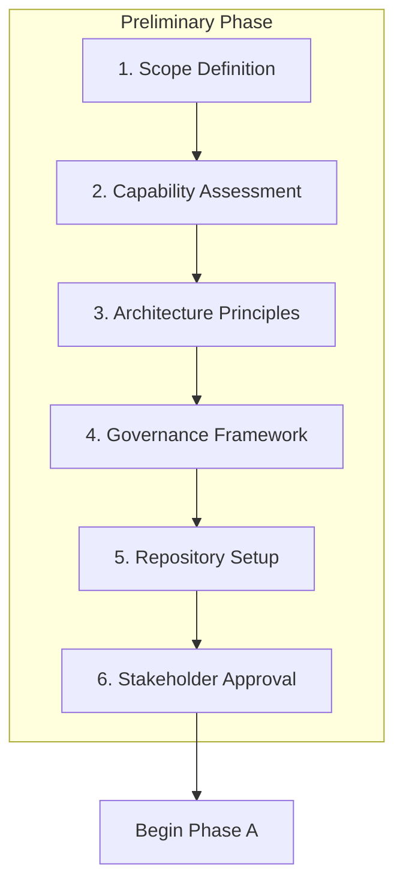
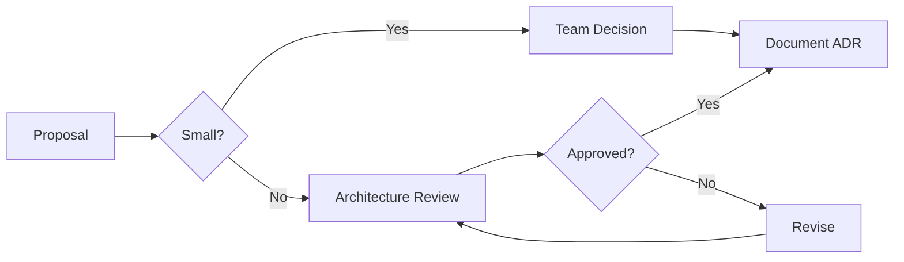

# Preliminary Phase Workflows

Step-by-step procedures for establishing architecture capability.

---

## Workflow Overview



---

## Quick Path vs Full Path

| Aspect | Quick Path | Full Path |
|--------|------------|-----------|
| **For** | Single project, small team | Enterprise, multiple teams |
| **Steps** | 1, 3, 6 | All steps |
| **Deliverables** | Principles only | Full framework |
| **Duration** | 1-2 hours | 1-2 weeks |

---

## Step 1: Scope Definition

**Goal**: Define the scope of architecture effort.

### 1.1 Identify Architecture Scope

```
What is the scope of this architecture effort?

☐ Single System - One application/service
☐ Product Line - Related set of applications
☐ Domain - Business domain (e.g., Order Management)
☐ Enterprise - Organization-wide
```

### 1.2 Identify Stakeholders

| Stakeholder Type | Examples | Concern |
|------------------|----------|---------|
| Executive Sponsor | CTO, VP Engineering | Strategic alignment |
| Architecture Owner | Lead Architect | Technical direction |
| Development Teams | Engineers | Implementability |
| Operations | SRE, DevOps | Operability |
| Business | Product Managers | Business value |

### 1.3 Define Objectives

```markdown
## Architecture Objectives

1. **Primary**: {main goal}
2. **Secondary**: {supporting goals}

## Success Criteria

- [ ] {measurable outcome}
- [ ] {measurable outcome}
```

**Output**: Scope statement, stakeholder list, objectives

---

## Step 2: Capability Assessment (Full Path)

**Goal**: Understand current architecture maturity.

### 2.1 Assess Current State

| Capability | Current | Target | Gap |
|------------|---------|--------|-----|
| Architecture Principles | None / Informal / Documented | Documented | Define principles |
| Design Standards | None / Informal / Documented | Documented | Create standards |
| Decision Records | None / Informal / ADRs | ADRs | Implement ADRs |
| Reference Architecture | None / Partial / Complete | Complete | Develop reference |
| Governance Process | None / Informal / Formal | Formal | Establish process |
| Architecture Review | None / Ad-hoc / Regular | Regular | Schedule reviews |

### 2.2 Identify Gaps

Prioritize gaps by:
- **Impact**: High impact on quality
- **Effort**: Reasonable effort to close
- **Dependencies**: Enables other improvements

### 2.3 Plan Improvements

```markdown
## Capability Improvement Plan

| Gap | Action | Owner | Target Date |
|-----|--------|-------|-------------|
| No principles | Define principles | {name} | {date} |
| No ADRs | Implement ADR process | {name} | {date} |
```

**Output**: Capability assessment, improvement plan

---

## Step 3: Architecture Principles

**Goal**: Define guiding principles for architecture decisions.

### 3.1 Gather Input

Sources for principles:
- Business strategy and goals
- Technical debt and pain points
- Industry best practices
- Regulatory requirements
- Existing conventions

### 3.2 Draft Principles

For each principle, document:

```markdown
## Principle: {Name}

**Statement**: {One sentence statement}

**Rationale**: {Why this principle matters}

**Implications**:
- {What this means in practice}
- {Constraints it creates}
- {Decisions it guides}
```

### 3.3 Recommended Categories

**Business Principles** (3-5):
- Alignment with business strategy
- Customer focus
- Agility and responsiveness

**Data Principles** (3-5):
- Data ownership
- Data quality
- Data sharing and access

**Application Principles** (3-5):
- Modularity and reuse
- API-first design
- Security by design

**Technology Principles** (3-5):
- Cloud-native preference
- Open standards
- Automation first

### 3.4 Review and Refine

Checklist for each principle:
- [ ] Clear and understandable
- [ ] Not conflicting with others
- [ ] Actionable (guides decisions)
- [ ] Appropriate scope
- [ ] Stakeholder buy-in

**Output**: Architecture Principles document

---

## Step 4: Governance Framework (Full Path)

**Goal**: Establish decision-making and compliance processes.

### 4.1 Define Governance Scope

```
What requires architecture governance?

☐ Major design decisions (new services, technologies)
☐ Cross-team integrations
☐ Technology selections
☐ Security and compliance
☐ All of the above
```

### 4.2 Establish Decision Process



### 4.3 Define Roles

| Role | Responsibility | Who |
|------|----------------|-----|
| Architecture Owner | Strategic direction | {name} |
| Domain Architect | Domain expertise | {name} |
| Tech Lead | Implementation guidance | {name} |
| Review Board | Decision approval | {names} |

### 4.4 Establish Review Process

**Architecture Review Board (ARB)**:
- Frequency: {Weekly / Bi-weekly / As needed}
- Attendees: {roles}
- Inputs: Design proposals, ADRs
- Outputs: Decisions, guidance

**Review Triggers**:
- New service or component
- New technology adoption
- Cross-boundary integration
- Security-sensitive changes
- Significant refactoring

**Output**: Governance Framework document

---

## Step 5: Repository Setup (Full Path)

**Goal**: Organize where architecture artifacts live.

### 5.1 Define Repository Structure

```
docs/architecture/
├── principles.md              # Architecture principles
├── decisions/                 # ADRs
│   ├── 0001-use-postgresql.md
│   └── template.md
├── standards/                 # Design standards
│   ├── api-design.md
│   ├── error-handling.md
│   └── security.md
├── reference/                 # Reference architectures
│   ├── microservice-template.md
│   └── event-driven-pattern.md
├── current-state/             # Baseline documentation
│   └── system-context.md
└── target-state/              # Target architecture
    └── roadmap.md
```

### 5.2 ADR Template

```markdown
# ADR-NNNN: {Title}

## Status

{Proposed | Accepted | Deprecated | Superseded}

## Context

{What is the issue or decision that needs to be made?}

## Decision

{What is the decision that was made?}

## Consequences

{What becomes easier or harder as a result?}

## Alternatives Considered

{What other options were evaluated?}
```

### 5.3 Establish Conventions

- ADR numbering: Sequential (0001, 0002, ...)
- Review process: PR with architect approval
- Update frequency: As decisions are made
- Ownership: Architecture team maintains

**Output**: Repository structure, templates, conventions

---

## Step 6: Stakeholder Approval

**Goal**: Get commitment to architecture practice.

### 6.1 Prepare Summary

```markdown
# Architecture Capability Proposal

## Scope
{Brief scope statement}

## Principles Summary
1. {Principle 1}
2. {Principle 2}
...

## Governance Overview
{Brief governance summary}

## Investment Required
- Time: {hours/week for reviews}
- Roles: {new/existing roles}
- Tools: {any new tools}

## Expected Benefits
- {Benefit 1}
- {Benefit 2}
```

### 6.2 Review with Stakeholders

Present to:
- Executive sponsor (strategic approval)
- Development leads (practical feedback)
- Operations (operational concerns)

### 6.3 Incorporate Feedback

Common adjustments:
- Simplify governance for smaller teams
- Add/remove principles based on context
- Clarify decision authority

### 6.4 Finalize and Communicate

- [ ] Final documents approved
- [ ] Communicated to all teams
- [ ] Repository set up
- [ ] First review scheduled

**Output**: Approved architecture capability

---

## Quick Path Workflow

For projects not needing full enterprise setup:

### Step 1: Define Scope (15 min)

Identify:
- System/project scope
- Key stakeholders
- Primary objectives

### Step 2: Define Principles (30-60 min)

Create 5-7 core principles:
1. {Modularity principle}
2. {API principle}
3. {Data principle}
4. {Security principle}
5. {Technology principle}

### Step 3: Document (15 min)

Add to project documentation:
- `docs/architecture/principles.md`
- Link from main README

### Step 4: Proceed to Phase A

Begin Architecture Vision for specific initiative.

---

## Tailoring for Context

### Startup / Small Team

- Skip formal governance
- 3-5 principles only
- Lightweight ADR process
- Focus on Phase A

### Growth Stage

- Add governance as needed
- Expand principles
- Regular architecture reviews
- Reference architectures

### Enterprise

- Full governance framework
- Comprehensive principles
- Architecture review board
- Enterprise repository
