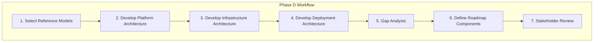

# Technology Architecture Workflows

Step-by-step procedures for TOGAF Phase D.

---

## Workflow Overview



---

## Step 1: Select Reference Models

### 1.1 Identify Applicable Standards

Determine which standards and frameworks apply:

```yaml
cloud_frameworks:
  - AWS Well-Architected Framework
  - Azure Architecture Center
  - Google Cloud Architecture Framework

security_standards:
  - CIS Benchmarks
  - NIST Cybersecurity Framework
  - SOC 2 Controls

operational_standards:
  - SRE Principles
  - ITIL Service Management
  - DevOps Practices
```

### 1.2 Review Existing Infrastructure

Gather baseline documentation:

```yaml
baseline_inputs:
  - Current infrastructure inventory
  - Network diagrams
  - Security controls
  - Monitoring setup
  - Cloud accounts/subscriptions
  - Cost reports
```

### 1.3 Gather Requirements

Extract from Phase C artifacts:

```yaml
requirements:
  from_applications:
    - Compute requirements (CPU, memory)
    - Storage requirements (type, capacity)
    - Network requirements (latency, bandwidth)
    - Availability requirements (SLA targets)

  from_data:
    - Database technologies needed
    - Data residency requirements
    - Backup/recovery requirements

  from_integration:
    - Messaging platform needs
    - API gateway requirements
    - Connectivity patterns
```

### 1.4 Define Technology Principles

Establish guiding principles:

```yaml
principles:
  - name: "Cloud-First"
    rationale: "Leverage managed services for agility"
    implications: "Prefer PaaS over IaaS over on-premises"

  - name: "Infrastructure as Code"
    rationale: "Repeatability, version control, automation"
    implications: "All infra changes through code pipelines"

  - name: "Design for Failure"
    rationale: "Components will fail"
    implications: "Redundancy, circuit breakers, graceful degradation"

  - name: "Security by Default"
    rationale: "Secure baseline"
    implications: "Encryption, least privilege, zero trust"
```

---

## Step 2: Develop Platform Architecture

### 2.1 Define Container Platform

If using containers:

```yaml
container_platform:
  orchestration:
    technology: "Kubernetes"
    distribution: "EKS / AKS / GKE"
    version_policy: "N-1 from latest"

  components:
    ingress:
      technology: "NGINX Ingress"
      configuration: "External ALB + Ingress"

    service_mesh:
      decision: "Yes / No / Later"
      technology: "Istio / Linkerd / None"

    secrets_management:
      technology: "AWS Secrets Manager + External Secrets"

    observability:
      metrics: "Prometheus + Grafana"
      logs: "Fluent Bit + CloudWatch"
      traces: "OpenTelemetry + Jaeger"
```

### 2.2 Define Database Platform

Document database standards:

```yaml
database_standards:
  relational:
    primary: "PostgreSQL (RDS)"
    rationale: "Open source, feature-rich, well-known"
    versions: "14, 15, 16"

  document:
    primary: "DynamoDB"
    rationale: "Serverless, scalable, low-ops"

  cache:
    primary: "Redis (ElastiCache)"
    rationale: "Versatile, widely used"

  search:
    primary: "OpenSearch"
    rationale: "Managed, compatible with Elasticsearch"
```

### 2.3 Define Messaging Platform

Document messaging standards:

```yaml
messaging_standards:
  event_streaming:
    technology: "Kafka (MSK)"
    use_cases: "Domain events, event sourcing"
    retention: "7 days default"

  task_queue:
    technology: "SQS"
    use_cases: "Async tasks, job processing"

  notifications:
    technology: "SNS"
    use_cases: "Fan-out, alerts"
```

### 2.4 Document Platform Services

Create platform catalog:

```markdown
| Service | Technology | Purpose | Owner |
|---------|------------|---------|-------|
| Container Orchestration | EKS | App hosting | Platform Team |
| Relational DB | RDS PostgreSQL | Transactional data | Platform Team |
| Cache | ElastiCache Redis | Session, caching | Platform Team |
| Message Queue | SQS | Async processing | Platform Team |
| Event Bus | MSK (Kafka) | Domain events | Platform Team |
| Secrets | Secrets Manager | Credential storage | Security Team |
```

---

## Step 3: Develop Infrastructure Architecture

### 3.1 Design Network Architecture

Define network topology:

```yaml
network_architecture:
  cloud_provider: "AWS"
  regions:
    primary: "us-east-1"
    dr: "us-west-2"

  vpc:
    cidr: "10.0.0.0/16"
    subnets:
      public:
        purpose: "Load balancers, NAT gateways"
        cidrs: ["10.0.1.0/24", "10.0.2.0/24", "10.0.3.0/24"]
      private_app:
        purpose: "Application workloads"
        cidrs: ["10.0.10.0/24", "10.0.11.0/24", "10.0.12.0/24"]
      private_data:
        purpose: "Databases, caches"
        cidrs: ["10.0.20.0/24", "10.0.21.0/24", "10.0.22.0/24"]

  connectivity:
    internet: "NAT Gateway per AZ"
    vpn: "Site-to-site VPN to corporate"
    peering: "Transit Gateway for multi-VPC"
```

### 3.2 Define Security Zones

Document security boundaries:

```yaml
security_zones:
  - zone: "Public (DMZ)"
    components: ["ALB", "CloudFront", "WAF"]
    access: "Internet facing"
    controls: ["WAF rules", "DDoS protection", "TLS termination"]

  - zone: "Application"
    components: ["EKS nodes", "Lambda functions"]
    access: "Internal only"
    controls: ["Security groups", "Network policies", "IAM roles"]

  - zone: "Data"
    components: ["RDS", "ElastiCache", "S3"]
    access: "Application zone only"
    controls: ["Encryption at rest", "VPC endpoints", "IAM policies"]

  - zone: "Management"
    components: ["Bastion", "CI/CD", "Monitoring"]
    access: "VPN + MFA"
    controls: ["Jump host", "Session logging", "Privileged access"]
```

### 3.3 Define Compute Standards

Document compute options:

```yaml
compute_standards:
  containers:
    default: "EKS Fargate"
    use_when: "Stateless workloads"
    sizing: "Defined per service"

  ec2:
    when: "Specialized hardware, stateful workloads"
    instance_families: ["m6i", "r6i", "c6i"]
    ami: "Amazon Linux 2023"

  serverless:
    technology: "Lambda"
    use_when: "Event-driven, sporadic load"
    limits: "15 min timeout, 10GB memory"
```

### 3.4 Define Storage Standards

Document storage options:

```yaml
storage_standards:
  block:
    technology: "EBS gp3"
    use_cases: "Database volumes, persistent storage"
    encryption: "Required (KMS)"

  object:
    technology: "S3"
    use_cases: "Files, backups, logs"
    encryption: "SSE-S3 or SSE-KMS"
    lifecycle: "Intelligent tiering"

  file:
    technology: "EFS"
    use_cases: "Shared file access"
    mode: "Regional, multi-AZ"
```

---

## Step 4: Develop Deployment Architecture

### 4.1 Define Deployment Topology

Map applications to infrastructure:

```yaml
deployment_topology:
  production:
    region: "us-east-1"
    availability_zones: ["us-east-1a", "us-east-1b", "us-east-1c"]

    applications:
      - name: "Web App"
        hosting: "CloudFront + S3"
        replicas: "N/A (static)"

      - name: "Order Service"
        hosting: "EKS"
        replicas: "3 (one per AZ)"
        resources:
          cpu: "500m"
          memory: "1Gi"

      - name: "Order Database"
        hosting: "RDS PostgreSQL"
        instance: "db.r6g.large"
        multi_az: true
```

### 4.2 Define High Availability

Document HA patterns:

```yaml
high_availability:
  application_tier:
    pattern: "Multi-AZ deployment"
    load_balancing: "ALB with health checks"
    auto_scaling: "HPA based on CPU/memory"

  database_tier:
    pattern: "Multi-AZ RDS"
    failover: "Automatic (DNS-based)"
    read_replicas: "1 per region"

  caching_tier:
    pattern: "ElastiCache cluster mode"
    replicas: "1 per primary"

  dns:
    provider: "Route 53"
    health_checks: "Enabled"
    failover: "DNS-based regional"
```

### 4.3 Define Disaster Recovery

Document DR strategy:

```yaml
disaster_recovery:
  strategy: "Warm Standby"
  rto: "4 hours"
  rpo: "1 hour"

  primary_region: "us-east-1"
  dr_region: "us-west-2"

  replication:
    databases:
      method: "Cross-region read replica"
      frequency: "Continuous"

    object_storage:
      method: "S3 Cross-Region Replication"
      frequency: "Continuous"

    secrets:
      method: "Multi-region secrets"

  failover_process:
    - "Promote DR database replica"
    - "Update DNS to DR region"
    - "Scale up DR compute"
    - "Verify services healthy"
```

### 4.4 Create Deployment Diagrams

Document for each environment:

```yaml
environments:
  - name: "Development"
    purpose: "Developer testing"
    infrastructure: "Reduced scale, single AZ"

  - name: "Staging"
    purpose: "Pre-production testing"
    infrastructure: "Production-like, reduced scale"

  - name: "Production"
    purpose: "Live traffic"
    infrastructure: "Full scale, multi-AZ, DR"
```

---

## Step 5: Gap Analysis

### 5.1 Compare Baseline to Target

Identify gaps:

```yaml
gap_categories:
  platform_gaps:
    - "No container orchestration"
    - "No event streaming platform"
    - "Manual database provisioning"

  infrastructure_gaps:
    - "Single AZ deployment"
    - "No DR capability"
    - "Legacy network architecture"

  security_gaps:
    - "Unencrypted data at rest"
    - "No WAF protection"
    - "Manual secret management"

  operational_gaps:
    - "No infrastructure as code"
    - "Limited observability"
    - "Manual scaling"
```

### 5.2 Document Technology Gaps

```markdown
| Gap ID | Area | Baseline | Target | Description | Priority |
|--------|------|----------|--------|-------------|----------|
| TG-001 | Compute | EC2 instances | EKS | No container platform | Critical |
| TG-002 | DR | None | Warm standby | No disaster recovery | Critical |
| TG-003 | IaC | Manual | Terraform | Manual infrastructure | High |
| TG-004 | Observability | CloudWatch only | Full stack | Limited visibility | High |
```

### 5.3 Prioritize Gaps

Score and rank:

```yaml
prioritization:
  criteria:
    - Security risk (1-5)
    - Operational risk (1-5)
    - Business impact (1-5)
    - Effort (inverse)

  scored_gaps:
    - gap_id: "TG-002"
      security: 3
      operational: 5
      business: 5
      effort: 4
      total: 17
      rank: 1

    - gap_id: "TG-001"
      security: 2
      operational: 4
      business: 4
      effort: 3
      total: 13
      rank: 2
```

---

## Step 6: Define Roadmap Components

### 6.1 Group Gaps into Work Packages

```yaml
work_packages:
  - id: "WP-D-001"
    name: "Container Platform Implementation"
    gaps_addressed: ["TG-001"]
    description: "Deploy EKS cluster with supporting components"

  - id: "WP-D-002"
    name: "Disaster Recovery Implementation"
    gaps_addressed: ["TG-002"]
    description: "Set up DR region with warm standby"

  - id: "WP-D-003"
    name: "Infrastructure as Code Migration"
    gaps_addressed: ["TG-003"]
    description: "Codify all infrastructure in Terraform"
```

### 6.2 Define Work Package Details

For each work package:

```yaml
work_package:
  id: "WP-D-001"
  name: "Container Platform Implementation"

  scope:
    in:
      - "EKS cluster provisioning"
      - "Ingress controller setup"
      - "Observability stack deployment"
      - "CI/CD pipeline integration"
    out:
      - "Application migration (separate WPs)"
      - "Service mesh (future consideration)"

  deliverables:
    - "EKS cluster (multi-AZ)"
    - "NGINX Ingress controller"
    - "Prometheus/Grafana stack"
    - "ArgoCD for GitOps"
    - "Documentation and runbooks"

  dependencies:
    predecessor: ["WP-D-003"]  # Need IaC first
    parallel: []
    successor: ["WP-C-* (app migrations)"]

  estimates:
    duration: "8 weeks"
    effort: "320 person-days"
    cost: "$250,000"
```

### 6.3 Sequence Work Packages

Create technology roadmap:

```
Quarter 1          Quarter 2          Quarter 3          Quarter 4
    │                  │                  │                  │
    ▼                  ▼                  ▼                  ▼
┌──────────────────────────┐
│ WP-D-003: IaC Migration  │
└──────────────────────────┘
            ┌──────────────────────────┐
            │ WP-D-001: Container Platform │
            └──────────────────────────┘
                        ┌──────────────────────────────────────┐
                        │ WP-D-002: Disaster Recovery          │
                        └──────────────────────────────────────┘
                                    ┌──────────────────────────┐
                                    │ WP-D-004: Observability  │
                                    └──────────────────────────┘
```

---

## Step 7: Stakeholder Review

### 7.1 Prepare Review Materials

```yaml
presentation:
  - Executive Summary
  - Platform Architecture Overview
  - Network Architecture Diagrams
  - Deployment Architecture
  - Security Architecture
  - Technology Standards
  - Gap Analysis Summary
  - Technology Roadmap
  - Cost Estimates
```

### 7.2 Conduct Reviews

Schedule stakeholder reviews:

```yaml
reviews:
  - audience: "Platform Team"
    focus: "Platform architecture, operational concerns"
    duration: "2 hours"

  - audience: "Security Team"
    focus: "Security architecture, compliance"
    duration: "2 hours"

  - audience: "Network Team"
    focus: "Network design, connectivity"
    duration: "2 hours"

  - audience: "Development Teams"
    focus: "Deployment model, developer experience"
    duration: "2 hours"

  - audience: "Architecture Board"
    focus: "Full architecture, gaps, roadmap"
    duration: "4 hours"
```

### 7.3 Incorporate Feedback

Track and address:

```yaml
feedback_tracking:
  - id: "FB-001"
    source: "Security Team"
    feedback: "Need WAF rules before go-live"
    action: "Add WAF configuration to WP-D-001"
    status: "Incorporated"

  - id: "FB-002"
    source: "Platform Team"
    feedback: "Consider service mesh for mTLS"
    action: "Add to future roadmap, not Phase 1"
    status: "Deferred"
```

### 7.4 Obtain Sign-off

Secure approvals:

```yaml
approvals:
  - artifact: "Platform Architecture"
    approver: "Platform Lead"
    status: "Approved"

  - artifact: "Security Architecture"
    approver: "CISO"
    status: "Approved"

  - artifact: "Technology Standards"
    approver: "CTO"
    status: "Approved"

  - artifact: "Phase D Overall"
    approver: "Architecture Board"
    status: "Pending"
```

---

## Quick Reference

| Step | Key Activities | Primary Output |
|------|----------------|----------------|
| 1. Reference Models | Select standards, gather requirements | Technology principles |
| 2. Platform Architecture | Containers, databases, messaging | Platform catalog |
| 3. Infrastructure | Network, security zones, compute, storage | Infrastructure architecture |
| 4. Deployment | HA, DR, environments | Deployment diagrams |
| 5. Gap Analysis | Compare baseline/target, prioritize | Gap analysis |
| 6. Roadmap | Work packages, sequence | Technology roadmap |
| 7. Review | Present, incorporate feedback | Approved Phase D |
