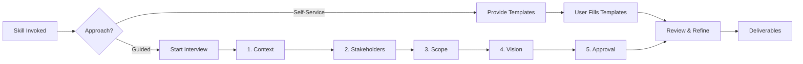

# Architecture Vision Workflows

Step-by-step procedures for completing Phase A deliverables.

---

## Workflow Overview



---

## Self-Service Workflow

### Step 1: Provide Templates

When user requests self-service or wants to fill templates independently:

**Response:**
```markdown
Here are the Phase A templates for your Architecture Vision:

## 1. Architecture Vision Document
[Provide template from templates.md - Architecture Vision Document section]

## 2. Stakeholder Map
[Provide template from templates.md - Stakeholder Map section]

## 3. Statement of Architecture Work (Optional)
[Provide template from templates.md - Statement section]

---

Fill these in and return them when ready. I'll help review and refine.

Tips:
- Start with what you know; gaps are fine
- Use bullet points for quick capture
- Mark uncertain items with "?"
```

### Step 2: Review Completed Templates

When user returns filled templates:

1. **Check completeness** - Flag any critical gaps
2. **Check consistency** - Ensure scope/stakeholders/vision align
3. **Suggest refinements** - Clarify vague items
4. **Validate feasibility** - Note any red flags

**Response format:**
```markdown
## Template Review

### Completeness
- [x] Initiative name and description
- [x] Business drivers
- [ ] Missing: Success metrics (recommend adding)
...

### Consistency Check
- Scope aligns with stated goals: Yes/No
- Stakeholders cover all affected areas: Yes/No
...

### Suggestions
1. {Specific refinement suggestion}
2. {Specific refinement suggestion}

### Ready for Phase B?
{Assessment of readiness to proceed}
```

---

## Guided Interview Workflow

### Overview

Walk through each section with focused prompts. Capture answers and build documents incrementally.

### Interview Flow

```
1. Context & Drivers (5-10 questions)
   ↓
2. Stakeholder Identification (3-5 questions)
   ↓
3. Scope Definition (5-8 questions)
   ↓
4. Vision & Goals (4-6 questions)
   ↓
5. Review & Approval Prep (2-3 questions)
```

---

### Section 1: Context & Drivers

**Goal**: Understand why this initiative exists.

**Opening prompt:**
```
Let's start with the context.

What is this initiative about? Give me a brief description
(1-2 sentences) of what you're trying to accomplish.
```

**Follow-up prompts** (use as needed):

| Question | Captures |
|----------|----------|
| "What business problem or opportunity is driving this?" | Business drivers |
| "What happens if we don't do this?" | Urgency, consequences |
| "Is this tied to any strategic goals or OKRs?" | Strategic alignment |
| "Are there any deadlines or time constraints?" | Timeline constraints |
| "Has anything been tried before? What happened?" | Background context |

**Capture into**: Architecture Vision Document → Background & Drivers

---

### Section 2: Stakeholder Identification

**Goal**: Identify who's affected and what they care about.

**Opening prompt:**
```
Now let's identify stakeholders.

Who requested or is sponsoring this initiative?
(This is typically an executive or business owner)
```

**Follow-up prompts:**

| Question | Captures |
|----------|----------|
| "Who will use the end result?" | End users |
| "Who builds or maintains related systems?" | Technical teams |
| "Who needs to approve or sign off?" | Decision makers |
| "Are there external parties affected? (vendors, customers, regulators)" | External stakeholders |
| "Who might resist or be disrupted by this change?" | Change management concerns |

**For each stakeholder, ask:**
```
For [stakeholder], what do they care most about?
What would success look like from their perspective?
```

**Capture into**: Stakeholder Map

---

### Section 3: Scope Definition

**Goal**: Define boundaries clearly.

**Opening prompt:**
```
Let's define the scope.

What systems, processes, or capabilities are definitely IN scope?
```

**Follow-up prompts:**

| Question | Captures |
|----------|----------|
| "What is explicitly OUT of scope?" | Exclusions |
| "Are there gray areas we should clarify?" | Scope risks |
| "What organizational boundaries apply? (teams, departments)" | Organizational scope |
| "What technical boundaries? (systems, platforms)" | Technical scope |
| "Any geographic or regulatory boundaries?" | Compliance scope |

**Capture into**: Architecture Vision Document → Scope

---

### Section 4: Vision & Goals

**Goal**: Define target state and success criteria.

**Opening prompt:**
```
Now let's capture the vision.

In an ideal future state, what does success look like?
Describe what would be different or better.
```

**Follow-up prompts:**

| Question | Captures |
|----------|----------|
| "What capabilities will exist that don't exist today?" | New capabilities |
| "What problems will be solved?" | Pain points addressed |
| "How will we measure success?" | Success metrics |
| "What's the single most important outcome?" | Priority |
| "What are the key principles that should guide decisions?" | Architecture principles |

**Capture into**: Architecture Vision Document → Vision & Goals

---

### Section 5: Review & Approval Prep

**Goal**: Validate and prepare for formal approval.

**Prompts:**

```
Let me summarize what we've captured:

[Present summary of Vision Document and Stakeholder Map]

1. Does this accurately reflect your intent?
2. Is anything missing or incorrect?
3. Who needs to approve this before we proceed to detailed architecture?
```

**Final prompt:**
```
Would you like me to format this as a formal Statement of
Architecture Work for approval, or is the Vision Document sufficient?
```

---

## Output Compilation

After either workflow, compile final deliverables:

### Deliverable Checklist

- [ ] **Architecture Vision Document** - Complete and reviewed
- [ ] **Stakeholder Map** - All key stakeholders identified
- [ ] **Statement of Architecture Work** - If formal approval needed

### Handoff to Next Phase

```markdown
## Phase A Complete

### Deliverables
- Architecture Vision Document: [link/location]
- Stakeholder Map: [link/location]
- Statement of Architecture Work: [if created]

### Recommended Next Steps
Based on the scope, the following phases are relevant:
- [ ] Phase B (Business Architecture) - If business processes in scope
- [ ] Phase C (Information Systems) - If data/applications in scope
- [ ] Phase D (Technology) - If infrastructure in scope

### Open Questions for Next Phase
- {Any unresolved items to carry forward}
```

---

## Tips for Effective Interviews

### Keep It Moving
- Accept partial answers and move on
- Mark gaps with "TBD" rather than stalling
- Circle back if needed

### Match the Formality
- Startup: Lighter touch, bullet points fine
- Enterprise: More formal, complete all fields
- Regulated: Maximum rigor, document everything

### Common Blockers

| Blocker | Solution |
|---------|----------|
| "I don't know who the stakeholders are" | Start with requester, build out from there |
| "Scope keeps changing" | Document current understanding, flag as risk |
| "No clear success metrics" | Ask "How would you know it worked?" |
| "Multiple competing visions" | Document variants, escalate for decision |
