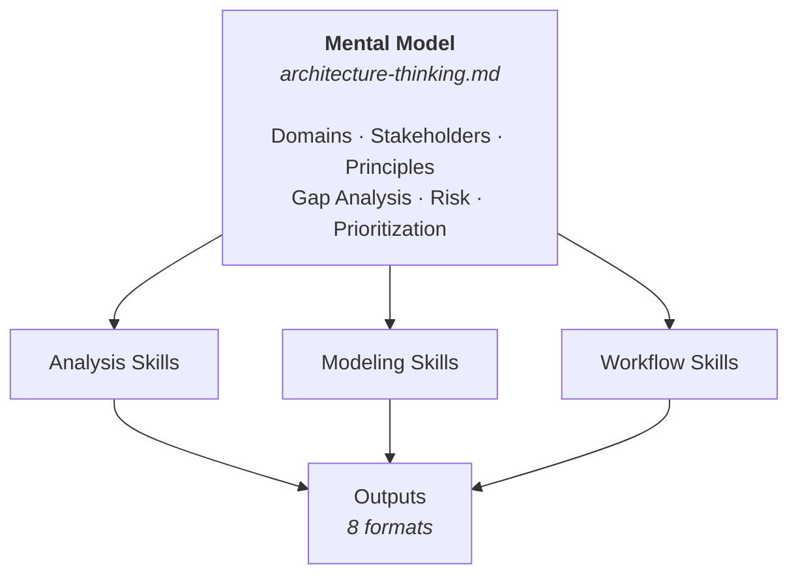

# AI Agent Toolbox for Architects

> **Audience:** Humans (GitHub landing page)

A toolbox of skills, workflows, and patterns for AI coding agents - designed for software architects and senior developers.

## Overview

Equip your AI coding assistant with architectural knowledge, analysis skills, and proven patterns. This toolbox includes:

- **Analysis Skills** - Understand codebases systematically
- **Architecture Patterns** - TOGAF ADM, C4 modeling, enterprise architecture
- **Development Workflows** - Git conventions, task management, code quality
- **Templates & Checklists** - Consistent, high-quality deliverables

Designed to be used as a git submodule that AI agents can reference when working on your code.

---

## Quick Start

### One-Prompt Setup

Copy and paste this prompt to your AI assistant:

> Add the AI architect toolbox by adding a git submodule from `https://github.com/rastko-vukasinovic/agents-setup.git` into `.ai-toolkit`. Once downloaded, read through the toolkit to learn its capabilities. When done, tell me "what skills do you have?"

This will:
1. Add the toolbox as a submodule
2. Train your agent on all available skills
3. Trigger the skill discovery workflow
4. Present capabilities organized by category
5. Offer to elaborate on any skill

### Anytime Refresh

Ask your agent:

> "What skills do you have?"

This re-reads the toolkit and presents all capabilities with invokable commands. Useful after toolkit updates or when you want a reminder of what's available.

### Recommended Models

| Model | Best For | When to Use |
|-------|----------|-------------|
| **Claude Haiku** | Fast, simple tasks | Quick edits, simple questions, code formatting |
| **Claude Sonnet** | Balanced performance | Most coding tasks, analysis, debugging |
| **Claude Opus** | Complex reasoning | Architecture design, large refactors, multi-file changes |

---

## How It Works

The toolkit is built around a single core idea: **the mental model is the engine**.



[`core/architecture-thinking.md`](core/architecture-thinking.md) defines **how the agent thinks about architecture** — which domains to consider, which stakeholders matter, how to analyze gaps, assess risk, and prioritize work. Every analysis skill, every TOGAF phase, every output adapter inherits its lens from this file.

**This means you can change how the toolkit thinks:**

- **Override sections** — Add a domain, swap prioritization criteria, adjust stakeholder types. Drop an `architecture-thinking.local.md` in your project root and the agent layers your changes on top of the defaults.
- **Swap the entire model** *(coming soon)* — Select a named profile (`lean-startup`, `platform-eng`, `regulated-enterprise`) for a fundamentally different architectural worldview.

The skills are the tools. The mental model is what makes them coherent.

---

## Skills at a Glance

The toolkit provides **27+ specialized skills** organized into 4 categories:

| Category | Count | Skills |
|----------|-------|--------|
| **Analysis** | 6 | codebase-analysis, arch-analysis, security-analysis, nonfunctional-analysis, architecture-synthesis, fitness-functions |
| **Architecture** | 11 | structurizr, TOGAF ADM (Preliminary + Phases A-H) |
| **Workflow** | 2 | git-workflow (core), todo-workflow |
| **Output** | 8 | core-architecture, architecture-docs, coding-context, product-spec, structurizr, archimate, presentation, pdf-report |

### Common Invocations

```
"Analyze the architecture"              → arch-analysis
"Analyze security with OWASP"          → security-analysis
"Apply TOGAF Business Architecture"    → togaf/business-architecture
"Create C4 model"                      → structurizr
"Export to PDF"                        → pdf-report
"Generate presentation"                → presentation
```

**Full skill documentation**: [docs/skills/README.md](docs/skills/README.md)

---

## Repository Structure

```
.
├── AGENTS.md              # Agent entry point (lean router)
├── core/                  # Core concepts and workflows
│   ├── instructions.md    # Coding rules, safety
│   ├── workflows.md       # Development processes
│   ├── architecture-thinking.md  # TOGAF foundations
│   └── glossary.md        # Standard terminology
├── skills/                # Modular skill packages
│   ├── _index.md          # Canonical skill catalog
│   ├── core/              # Always-active skills
│   └── optional/          # Opt-in skills
├── templates/             # Commit, PR templates
├── docs/                  # Human-readable guides
└── specs/                 # Specifications & roadmaps
```

---

## Example Project

See the toolkit in action on a real codebase: **[quantum-blockchain](https://github.com/rastko-vukasinovic/quantum-blockchain/tree/ai-toolkit-example)** — a Python/Flask blockchain microservice with the toolkit wired up, custom mental model overrides (Consensus Architecture, Network Topology), and copy-paste prompts to try.

---

## Documentation

| Resource | Description |
|----------|-------------|
| [Skills Documentation](docs/skills/README.md) | Full skill listing with detailed guides |
| [Skills Index](skills/_index.md) | Skill catalog and activation guide |
| [TOGAF Index](skills/optional/togaf/_index.md) | ADM phases and when to use each |
| [Analysis Outputs](skills/optional/analysis-outputs/_index.md) | Available export formats |
| [Architecture Guide](docs/arch-analysis-guide.md) | How to analyze unfamiliar codebases |
| [Roadmap](specs/ROADMAP-TRACKER.md) | Planned work and progress |

---

## License

MIT
