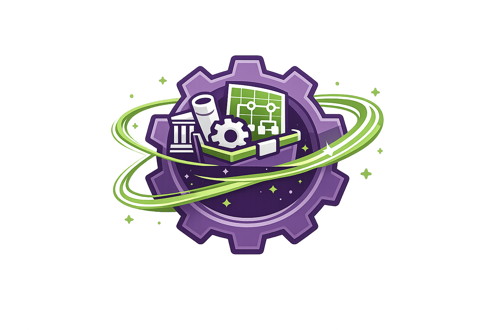
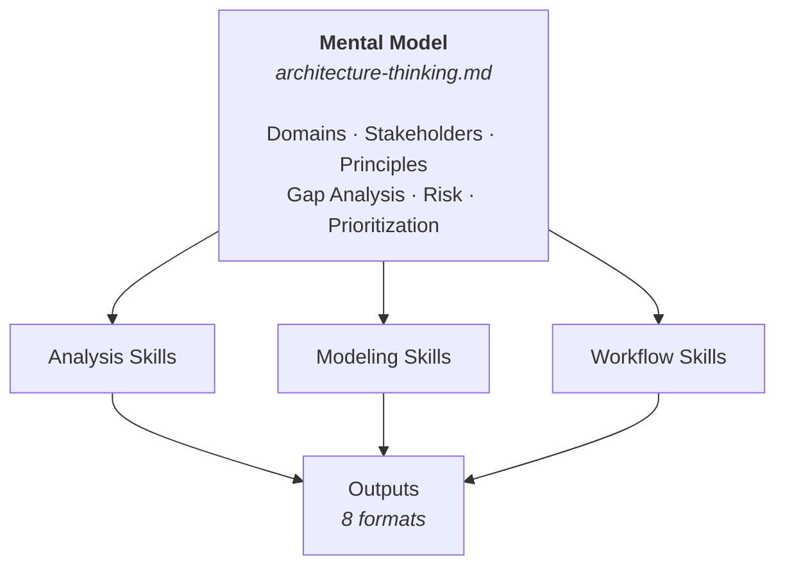

<p align="center">
  
</p>

<h1 align="center">quantum-toolbox</h1>

<p align="center"><em>AI Agent toolbox for software architecture</em></p>

<p align="center"><a href="CHANGELOG.md#300---2026-05-12">What's new in v3.0.0</a></p>

> **Audience:** Humans (GitHub landing page)

A structured knowledge base that turns AI coding agents into architecture-aware partners — built for senior software professionals: architects, tech leads, principal engineers, solution architects, technical consultants, and anyone working at the intersection of code and architecture decisions.

## Overview

Give your AI coding assistant the skills to do real architecture work — analysis, synthesis, auditing, contextualization, documentation, reporting, planning, and more.

It ships as a git submodule your agent reads at session start. No plugins, no API calls — just markdown that teaches the agent how to think about architecture.

- **Analysis** — Codebase analysis, security analysis, nonfunctional analysis, architecture synthesis, fitness functions
- **Architecture** — TOGAF ADM (Preliminary + Phases A-H), C4 modeling with Structurizr DSL
- **Workflows** — Git conventions, task management, autonomous development loop
- **Outputs** — 8 structured formats: architecture docs, PDF reports, presentations, C4 workspaces, and more

---

## Quick Start

### One-Prompt Setup

Copy and paste this prompt to your AI assistant:

> Add the AI architect toolbox by adding a git submodule from `https://github.com/quantum-crowbar/quantum-toolbox.git` into `.quantum-toolbox`. Once downloaded, read through the toolkit to learn its capabilities. When done, tell me "what skills do you have?"

This will:
1. Add the toolbox as a submodule
2. Train your agent on all available skills
3. Trigger the skill discovery workflow
4. Present capabilities organized by category
5. Offer to elaborate on any skill

### Anytime Refresh

Ask your agent:

> "What skills do you have?"

This re-reads the toolkit and presents all capabilities with invokable commands. Useful after toolkit updates or when you want a reminder of what's available.

### Commands

All commands are invoked by typing them directly to your agent:

| Command | What it does | Modifies files? |
|---------|-------------|-----------------|
| `/start` | Orient the agent: presents project state, enabled skills, and available commands. Detects first-time setup vs. established project. | No |
| `/help` | Full command reference with descriptions and examples. | No |
| `/skills` | Lists all registered skills with enabled/disabled status for your project. | No |
| `/update` | **Refresh the KB.** Re-runs enabled analysis skills on source repos that have changed since the last run, regenerates affected views and documentation, then writes updated SHAs and view lists back to the manifest and context files. Also checks toolkit version — flags if `/upgrade` should follow. | Yes |
| `/upgrade` | **Apply a new toolkit version.** Pulls the latest toolkit, diffs old→new (new skills, views, reports, config requirements), checks source staleness, then generates new views/reports and re-runs analysis where needed. By the end, project is fully current with the new toolkit version. | Yes (on confirm) |

> **`/update` vs `/upgrade`** — `/update` keeps your KB current with *code changes* (source repos moved ahead). `/upgrade` keeps your KB current with *toolkit changes* (new skills, views, hooks shipped in a new version). Run both after updating the submodule.

### Keeping Your KB Current

There are two commands for keeping your knowledge base in sync — one for source changes, one for toolkit changes.

**When your source repos have changed** (code commits since the last analysis run):

```
/update
```

Re-runs enabled analysis skills on the repos that moved, regenerates the affected architecture-docs views, and writes updated SHAs + view lists back to the manifest and context files. Both source and documentation are refreshed together.

**When the toolkit has a new version** (you've pulled a new `.quantum-toolbox`):

```
/upgrade
```

Pulls the latest toolkit, diffs v_old → v_new for new skills, views, reports, and config requirements, then generates new views/reports and re-runs analysis where the new views need fresh source data. By the end, your project is fully current with the new toolkit version — new views generated, missing config inserted, source re-analysed where needed.

> Run `/update` routinely as code evolves. Run `/upgrade` after pulling a new toolkit version — and `/update` first if your sources are also stale.

### Recommended Models

| Model | Best For | When to Use |
|-------|----------|-------------|
| **Claude Haiku** | Fast, simple tasks | Quick edits, simple questions, code formatting |
| **Claude Sonnet** | Balanced performance | Most coding tasks, analysis, debugging |
| **Claude Opus** | Complex reasoning | Architecture design, large refactors, multi-file changes |

---

## How It Works

The toolkit is built around a single core idea: **the mental model is the engine**.



[`core/architecture-thinking.md`](core/architecture-thinking.md) defines **how the agent thinks about architecture** — which domains to consider, which stakeholders matter, how to analyze gaps, assess risk, and prioritize work. Every analysis skill, every TOGAF phase, every output adapter inherits its lens from this file.

**This means you can change how the toolkit thinks:**

- **Override sections** — Add a domain, swap prioritization criteria, adjust stakeholder types. Drop an `architecture-thinking.local.md` in your project root and the agent layers your changes on top of the defaults.
- **Swap the entire model** *(coming soon)* — Select a named profile (`lean-startup`, `platform-eng`, `regulated-enterprise`) for a fundamentally different architectural worldview.

The skills are the tools. The mental model is what makes them coherent.

---

## Skills at a Glance

The toolkit provides **27+ specialized skills** organized into 4 categories:

| Category | Count | Skills |
|----------|-------|--------|
| **Analysis** | 6 | codebase-analysis, arch-analysis, security-analysis, nonfunctional-analysis, architecture-synthesis, fitness-functions |
| **Architecture** | 11 | structurizr, TOGAF ADM (Preliminary + Phases A-H) |
| **Workflow** | 2 | git-workflow (core), todo-workflow |
| **Output** | 8 | core-architecture, architecture-docs, coding-context, product-spec, structurizr, archimate, presentation, pdf-report |

### Common Invocations

```
"Analyze the architecture"              → arch-analysis
"Analyze security with OWASP"          → security-analysis
"Apply TOGAF Business Architecture"    → togaf/business-architecture
"Create C4 model"                      → structurizr
"Export to PDF"                        → pdf-report
"Generate presentation"                → presentation
```

**Full skill documentation**: [docs/skills/README.md](docs/skills/README.md)

---

## Repository Structure

```
.
├── AGENTS.md              # Agent entry point (lean router)
├── core/                  # Core concepts and workflows
│   ├── instructions.md    # Coding rules, safety
│   ├── workflows.md       # Development processes
│   ├── architecture-thinking.md  # TOGAF foundations
│   └── glossary.md        # Standard terminology
├── skills/                # Modular skill packages
│   ├── _index.md          # Canonical skill catalog
│   ├── core/              # Always-active skills
│   └── optional/          # Opt-in skills
├── templates/             # Commit, PR templates
├── docs/                  # Human-readable guides
└── specs/                 # Specifications & roadmaps
```

---

## Example Project

See the toolkit in action on a real codebase: **[quantum-blockchain](https://github.com/quantum-crowbar/quantum-blockchain/tree/ai-toolkit-example)** — a Python/Flask blockchain microservice with the toolkit wired up, custom mental model overrides (Consensus Architecture, Network Topology), and copy-paste prompts to try.

---

## Documentation

| Resource | Description |
|----------|-------------|
| [Skills Documentation](docs/skills/README.md) | Full skill listing with detailed guides |
| [Skills Index](skills/_index.md) | Skill catalog and activation guide |
| [TOGAF Index](skills/optional/togaf/_index.md) | ADM phases and when to use each |
| [Analysis Outputs](skills/optional/analysis-outputs/_index.md) | Available export formats |
| [Architecture Guide](docs/arch-analysis-guide.md) | How to analyze unfamiliar codebases |
| [Roadmap](specs/ROADMAP-TRACKER.md) | Planned work and progress |

---

## License

MIT
