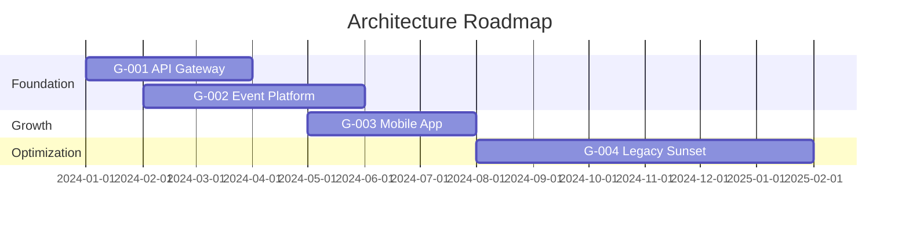
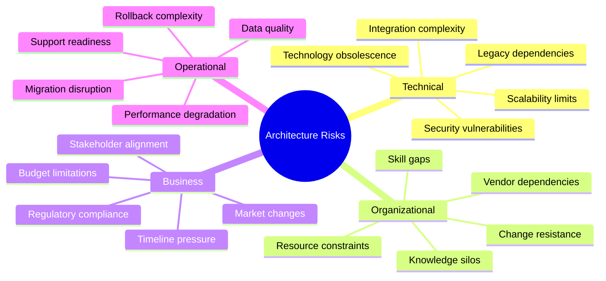

# Architecture Thinking

> **Audience:** AI Agents

Core architectural concepts that apply automatically during architecture discussions and decision-making.

---

## Architecture Domains

When analyzing or designing systems, always consider which domains are affected:

### Business Architecture
- **Processes**: Business workflows, procedures, activities
- **Organization**: Teams, roles, responsibilities, reporting structures
- **Capabilities**: What the business can do (abstracted from how)
- **Value Streams**: End-to-end value delivery to customers

**Questions to ask**:
- What business processes does this change affect?
- Which teams/roles are impacted?
- What capabilities are being added, modified, or removed?

### Data Architecture
- **Entities**: Core data objects and their definitions
- **Relationships**: How data entities relate to each other
- **Governance**: Data ownership, quality, lifecycle
- **Flow**: How data moves through the organization

**Questions to ask**:
- What data entities are involved?
- Who owns this data? Who can access it?
- How does data flow between systems?
- What are the retention and compliance requirements?

### Application Architecture
- **Components**: Application modules, services, functions
- **Interactions**: How applications communicate
- **Integration**: APIs, events, data exchanges
- **Portfolio**: The collection of applications and their relationships

**Questions to ask**:
- Which applications are affected?
- How do they interact with other systems?
- What interfaces need to change?

### Technology Architecture
- **Infrastructure**: Servers, networks, storage, cloud resources
- **Platforms**: Runtime environments, containers, orchestration
- **Tools**: Development, deployment, monitoring tools
- **Standards**: Technology standards and constraints

**Questions to ask**:
- What infrastructure is required?
- What platforms and tools are involved?
- Are there technology standards to follow or exceptions needed?

---

## Stakeholder Thinking

Architecture decisions affect multiple stakeholders. Always identify and consider:

### Stakeholder Identification

| Stakeholder Type | Concerns | Viewpoint Needed |
|------------------|----------|------------------|
| **Business Executives** | ROI, risk, strategic alignment | Value, cost, timeline |
| **Product Owners** | Features, usability, time-to-market | Functionality, roadmap |
| **Developers** | Maintainability, developer experience | Technical design, patterns |
| **Operations** | Reliability, monitoring, deployment | Infrastructure, runbooks |
| **Security** | Threats, compliance, access control | Security controls, audit |
| **End Users** | Performance, usability, reliability | User experience |
| **Regulators** | Compliance, audit trails | Compliance mapping |

### Stakeholder Analysis Questions

1. **Who is affected?** - Direct and indirect stakeholders
2. **What are their concerns?** - What do they care about?
3. **What viewpoint do they need?** - How should we present information?
4. **What's their influence?** - Can they approve/block decisions?
5. **How do we communicate?** - What format, frequency, detail level?

### Tailoring Communication

- **Executive level**: Business value, risks, costs, timelines
- **Management level**: Resource needs, dependencies, milestones
- **Technical level**: Design details, trade-offs, implementation
- **Operational level**: Deployment, monitoring, support requirements

---

## Architecture Principles

Principles guide architecture decisions. Understand and apply them consistently.

### Principle Structure

Every principle should have:

```markdown
## Principle: {Name}

**Statement**: {Clear, actionable statement of the principle}

**Rationale**: {Why this principle exists - business and technical reasons}

**Implications**:
- {Consequence 1 - what this means in practice}
- {Consequence 2}
- {Consequence 3}

**Examples**:
- {Good example following the principle}
- {Counter-example violating the principle}
```

### Applying Principles

When making decisions:
1. **Reference applicable principles** - Which principles apply?
2. **Check alignment** - Does the decision follow them?
3. **Document exceptions** - If violating, why and what's the plan to resolve?
4. **Flag conflicts** - When principles conflict, escalate for guidance

### Common Principle Categories

- **Business principles**: Customer-first, regulatory compliance
- **Data principles**: Single source of truth, data quality
- **Application principles**: Loose coupling, API-first
- **Technology principles**: Cloud-native, infrastructure as code

---

## Baseline vs Target Thinking

Always distinguish between current state and desired state.

### Baseline Architecture (Current State)

What exists today:
- Current systems and their capabilities
- Existing integrations and data flows
- Known issues and technical debt
- Actual performance and constraints

### Target Architecture (Desired State)

What we're building toward:
- Future systems and capabilities
- Desired integrations and flows
- Resolved issues and reduced debt
- Expected performance and scalability

### Transition States

The journey between baseline and target:
- Intermediate architectures during migration
- Temporary scaffolding and bridges
- Phased rollout milestones
- Coexistence strategies

### Documentation Pattern

```markdown
## {Domain/Component}

### Baseline
{Current state description}

### Target
{Desired state description}

### Gap
{What needs to change}

### Transition
{How we get there}
```

---

## Gap Analysis

Systematically identify what needs to change between baseline and target.

### Gap Types

| Gap Type | Description | Example |
|----------|-------------|---------|
| **Missing** | Capability doesn't exist | No mobile app |
| **Outdated** | Exists but needs modernization | Legacy monolith |
| **Incompatible** | Conflicts with target | Different data formats |
| **Redundant** | Duplicate to be eliminated | Multiple CRM systems |
| **Insufficient** | Exists but inadequate | Can't scale to requirements |

### Gap Register Template

```markdown
## Gap Register

| ID | Domain | Baseline | Target | Gap Type | Priority | Dependencies |
|----|--------|----------|--------|----------|----------|--------------|
| G-001 | Application | Monolith | Microservices | Outdated | High | G-002 |
| G-002 | Data | Shared DB | Event-driven | Incompatible | High | None |
| G-003 | Technology | On-premise | Cloud | Missing | Medium | G-001 |
```

### Gap-to-Roadmap Mapping

Each gap should map to:
- **Work packages**: Specific projects or initiatives
- **Dependencies**: Other gaps that must be addressed first
- **Resources**: Teams, skills, budget needed
- **Timeline**: When it should be addressed

---

## Roadmap Prioritization

Determine the order in which to address gaps.

### Prioritization Criteria

| Criterion | Description | Weight (1-5) |
|-----------|-------------|--------------|
| **Business Value** | Revenue impact, cost savings, strategic alignment | {weight} |
| **Risk Reduction** | Security, compliance, operational risk mitigated | {weight} |
| **Dependencies** | Enables other initiatives, blocked by others | {weight} |
| **Complexity** | Effort, technical difficulty, organizational change | {weight} |
| **Time Sensitivity** | Regulatory deadlines, market windows, contracts | {weight} |
| **Resource Availability** | Skills, budget, vendor capacity | {weight} |

### Prioritization Matrix

| Gap ID | Candidate | BizVal | Risk | Deps | Complex | Time | Resources | Score | Rank |
|--------|-----------|--------|------|------|---------|------|-----------|-------|------|
| G-001 | API Gateway | 4 | 3 | 5 | 3 | 2 | 4 | {calc} | 1 |
| G-002 | Event Platform | 5 | 4 | 4 | 4 | 3 | 3 | {calc} | 2 |

### Prioritization Approaches

Choose the approach that fits the context:

- **Weighted Scoring** (default): Numeric scoring with weighted criteria
- **MoSCoW**: Must have / Should have / Could have / Won't have
- **Value vs Effort Quadrant**: Quick wins, strategic, fill-ins, time sinks
- **WSJF**: Weighted Shortest Job First (for SAFe alignment)
- **Business Impact**: Pure business value ranking

### Roadmap Visualization



---

## Risk Analysis

Identify and manage risks from architecture decisions.

### Risk Categories



### Non-Technical Risks (Require User Input)

These risks cannot be inferred from code and must be gathered:

- **Ownership risks**: Unclear accountability, shared ownership conflicts
- **Political risks**: Competing priorities, executive sponsorship gaps
- **Organizational risks**: Restructuring, M&A activity, key person dependencies
- **Operating model risks**: Outsourcing changes, vendor relationships, SLA gaps
- **Cultural risks**: Change fatigue, skill resistance, innovation appetite
- **Governance risks**: Approval bottlenecks, compliance interpretation
- **Financial risks**: Budget cycles, funding uncertainty, cost allocation

### Risk Register Template

| ID | Risk | Category | Probability | Impact | Score | Mitigation | Owner | Status |
|----|------|----------|-------------|--------|-------|------------|-------|--------|
| R-001 | Integration fails | Technical | Medium | High | 6 | POC first | {name} | Open |
| R-002 | Key resource leaves | Org | Low | High | 4 | Document, cross-train | {name} | Monitoring |

### Risk Scoring

- **Probability**: Low (1), Medium (2), High (3)
- **Impact**: Low (1), Medium (2), High (3)
- **Score**: Probability × Impact (1-9)

### Risk Response Strategies

- **Avoid**: Change approach to eliminate risk
- **Mitigate**: Reduce probability or impact
- **Transfer**: Shift risk to another party (insurance, vendor)
- **Accept**: Acknowledge and monitor

---

## Enterprise Continuum

Prefer reusable solutions over custom development.

### Solution Spectrum

```
Foundation ←→ Common Systems ←→ Industry ←→ Organization-Specific
(Most Reusable)                                    (Most Custom)
```

| Level | Description | Example |
|-------|-------------|---------|
| **Foundation** | Industry-agnostic patterns | REST API design, event sourcing |
| **Common Systems** | Cross-industry solutions | CRM, ERP, identity management |
| **Industry** | Sector-specific patterns | SWIFT for banking, HL7 for healthcare |
| **Organization** | Company-specific solutions | Custom business logic |

### Reuse Preference

When designing solutions:

1. **First**: Look for foundation patterns and standards
2. **Then**: Consider common/industry solutions
3. **Finally**: Build custom only when necessary

### Reuse Checklist

- [ ] Is there an existing pattern for this?
- [ ] Can we use a standard component?
- [ ] Is there an industry solution?
- [ ] If building custom, can it be generalized for reuse?
- [ ] Have we documented the decision to build vs buy?

---

## Applying These Concepts

### During Analysis

1. Identify which **domains** are in scope
2. Map **stakeholders** and their concerns
3. Document **baseline** state with evidence
4. Define **target** state aligned with principles
5. Perform **gap analysis**
6. Assess **risks**
7. Create prioritized **roadmap**

### During Design

1. Check alignment with **principles**
2. Consider all affected **domains**
3. Address **stakeholder** concerns
4. Evaluate **reuse** opportunities
5. Document **transition** approach
6. Identify and mitigate **risks**

### During Review

1. Validate **domain** coverage
2. Confirm **stakeholder** sign-off
3. Verify **principle** alignment
4. Check **gap** coverage
5. Review **risk** status
6. Update **roadmap** as needed
