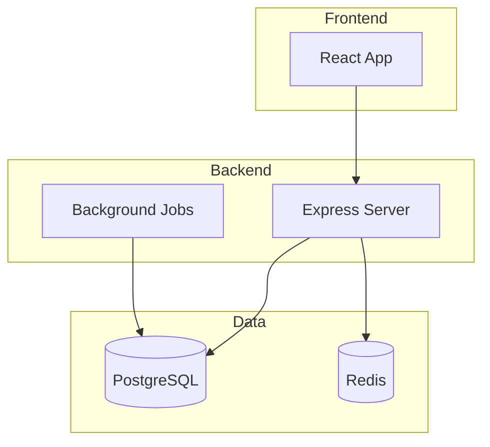
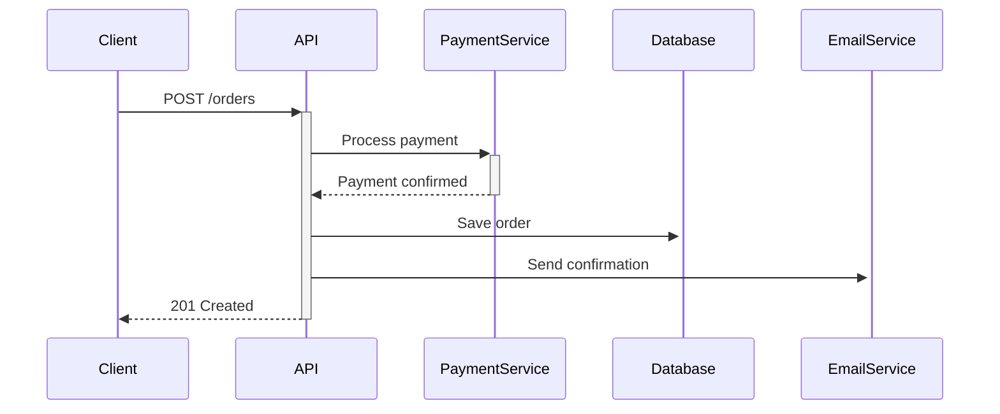

# Architectural Analysis Guide

A human-readable guide to analyzing unfamiliar codebases with AI assistance.

## What This Skill Does

When you encounter a new codebase and need to understand how it works, this skill provides a systematic approach to:

1. **Map everything** - Technologies, interfaces, components
2. **Verify documentation** - Check if existing docs match reality
3. **Create diagrams** - Visual architecture and flow diagrams
4. **Document findings** - Structured, evidence-based outputs

## When to Use It

- Joining a new project and need to get up to speed
- Auditing a codebase for technical debt or modernization
- Preparing for a major refactoring effort
- Due diligence on acquired or inherited code
- Creating documentation for an undocumented system

## How to Invoke

Simply ask your AI assistant to analyze the architecture:

> "Analyze the architecture of this codebase"

More specific variants:
- "Map all technologies used in this project"
- "Find and document all APIs"
- "Create an architecture diagram for this system"
- "Audit the documentation accuracy"

## The Analysis Process

### Phase 1: Reconnaissance

The AI first gets oriented by:

- Finding existing documentation (README, docs/, wiki)
- Mapping the directory structure
- Identifying entry points (main files, index files)
- Locating configuration files

**You'll see**: Initial structure overview, documentation inventory

### Phase 2: Technology Inventory

A systematic sweep to identify:

| Category | What's Found |
|----------|--------------|
| Languages | All programming languages with versions |
| Frameworks | Web frameworks, CLI tools, etc. |
| Libraries | Dependencies from package files |
| Infrastructure | Databases, caches, message queues |
| DevOps | CI/CD, containers, deployment tools |

**You'll see**: Technology manifest with evidence (file paths, line numbers)

### Phase 3: Interface Discovery

Finding all the ways the system communicates:

- **External APIs** - REST, GraphQL, gRPC endpoints
- **Internal APIs** - Service-to-service calls
- **Events** - Message queues, event buses
- **Data** - Import/export formats, file interfaces
- **User** - CLI commands, web routes

**You'll see**: Interface specifications with request/response details

### Phase 4: Architecture Synthesis

Creating visual representations:



**You'll see**: Mermaid diagrams you can render and share

### Phase 5: Documentation Audit

Comparing findings against existing docs:

| Finding | Documented? | Accurate? | Action |
|---------|-------------|-----------|--------|
| Uses Redis for caching | No | N/A | Add to docs |
| "MySQL database" in README | Yes | No (actually PostgreSQL) | Fix docs |
| Auth uses JWT | Yes | Yes | None |

**You'll see**: Discrepancy report with specific recommendations

## Understanding the Outputs

### Technology Manifest

A complete inventory with evidence:

```markdown
## Languages
| Language | Version | Evidence |
|----------|---------|----------|
| TypeScript | 5.3 | tsconfig.json:1 |
| Python | 3.11 | pyproject.toml:3 |
```

Every claim links to proof in the codebase.

### Interface Specifications

Detailed API documentation:

```markdown
### POST /api/users
Creates a new user account.

**Request Body**:
- `email` (string, required)
- `password` (string, required)

**Response**: 201 Created
**Evidence**: src/routes/users.ts:45
```

### Sequence Diagrams

For complex integrations:



### Documentation Audit Report

Actionable findings:

```markdown
## Discrepancies Found

### DISC-001: Outdated database reference
- **Docs say**: "Uses MongoDB"
- **Reality**: PostgreSQL (see docker-compose.yml:12)
- **Impact**: High - misleading for new developers
- **Action**: Update README.md line 34
```

## Tips for Best Results

### Provide Context

Help the AI focus:
- "This is a microservices architecture"
- "Focus on the payment flow"
- "Ignore the legacy/ directory"

### Ask Follow-ups

The initial analysis is a starting point:
- "Go deeper on the authentication system"
- "Create a sequence diagram for user registration"
- "What's not documented that should be?"

### Verify Key Findings

For critical systems:
- Ask for more evidence on important claims
- Request alternative interpretations
- Have the AI trace specific code paths

## What You Get at the End

A complete analysis typically produces:

1. **Technology Manifest** - Everything the system uses
2. **Interface Catalog** - All APIs and contracts
3. **Architecture Diagram** - Visual system overview
4. **Sequence Diagrams** - Key flow visualizations
5. **Documentation Audit** - What's missing or wrong
6. **Recommendations** - Prioritized actions

All outputs use templates that can be directly added to your project's documentation.

## Limitations

The AI analysis is thorough but has bounds:

- **No runtime analysis** - Can't observe actual behavior
- **No external access** - Can't check live APIs or databases
- **Inference limits** - Some patterns may be misidentified
- **Large codebases** - May need to analyze in sections

For critical decisions, validate findings against actual system behavior.

## Related Skills

- [software-design](../skills/optional/software-design/) - For design decisions after analysis
- [tech-stack-decisions](../skills/optional/tech-stack-decisions/) - For evaluating modernization options
