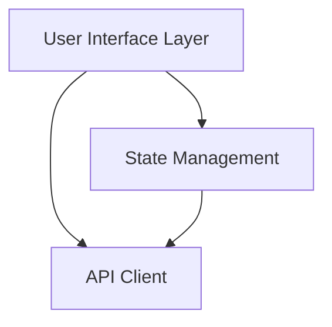
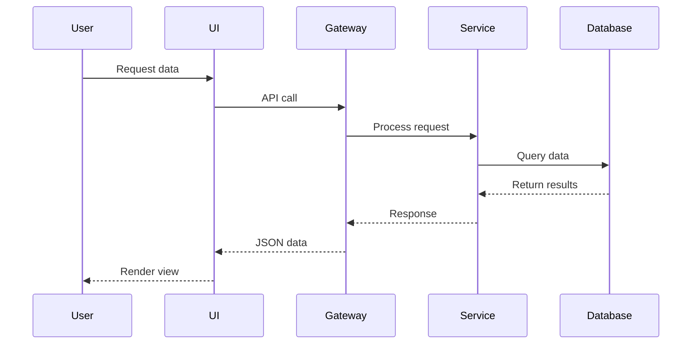
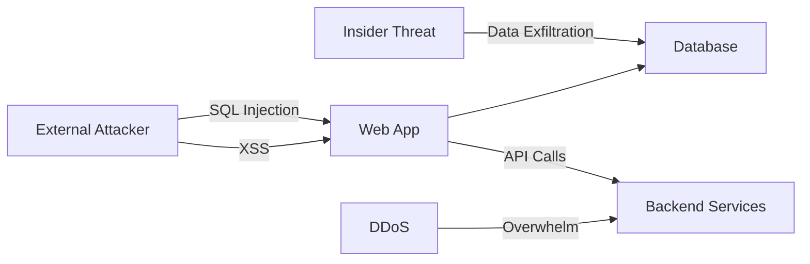
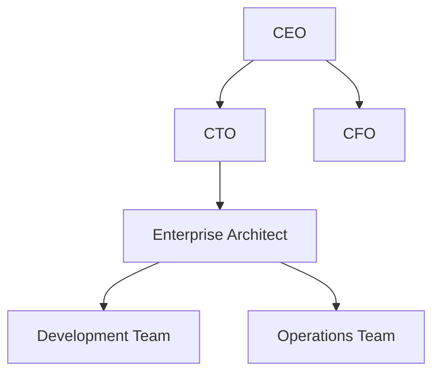
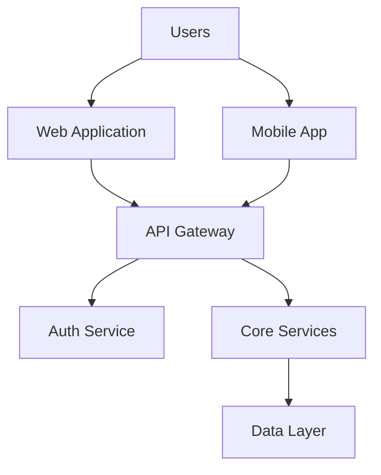
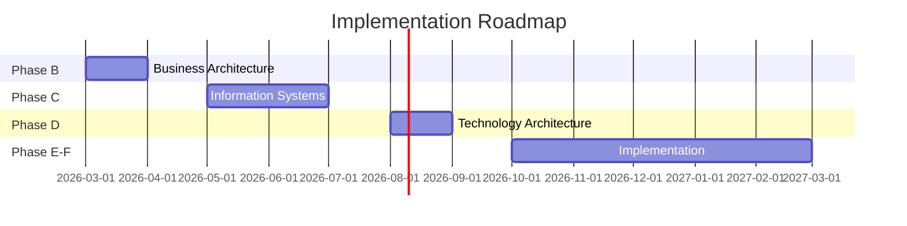

# PDF Report Examples

Real-world examples of PDF generation workflows and outputs.

---

## Example 1: Single Architecture Report

### Scenario

Generate a PDF for the component architecture analysis report.

### Input File

`architecture-docs/02-components.md`:

```markdown
---
title: Component Architecture Analysis
author: Architecture Team
date: 2026-02-06
---

# Component Architecture Analysis

## Overview

This document analyzes the component architecture of the [Project Name] system,
identifying key components, their responsibilities, and interactions.

## Component Inventory

### Frontend Components

#### 1. User Interface Layer

**Responsibility**: Handle user interactions and rendering

**Technology**: React 18.2.0

**Key Modules**:
- `components/` - Reusable UI components
- `pages/` - Page-level components
- `hooks/` - Custom React hooks

**Dependencies**:
```json
{
  "react": "^18.2.0",
  "react-dom": "^18.2.0",
  "react-router-dom": "^6.10.0"
}
```

**Architecture Diagram**:



### Backend Components

#### 2. API Gateway

**Responsibility**: Route requests and handle authentication

**Technology**: Express.js 4.18.2

**Endpoints**:
| Endpoint | Method | Purpose |
|----------|--------|---------|
| /api/users | GET | List users |
| /api/users/:id | GET | Get user details |
| /api/auth/login | POST | Authenticate user |

## Component Interactions

The following diagram shows the interaction flow:



## Findings

### ✓ Strengths

- Clear separation of concerns
- Well-defined interfaces
- Comprehensive error handling

### ⚠ Areas for Improvement

- Component coupling could be reduced
- Testing coverage needs improvement
- Documentation gaps identified

## Recommendations

1. **Introduce Adapter Pattern**: Decouple UI from API client
2. **Add Integration Tests**: Cover component interactions
3. **Document Interfaces**: Add JSDoc comments to all public APIs
```

### Workflow

```bash
# Step 1: Prepare diagrams
cd architecture-docs
mmdc -i components-architecture.mmd -o diagrams/components-architecture.png
mmdc -i components-sequence.mmd -o diagrams/components-sequence.png

# Step 2: Update markdown (replace mermaid blocks with images)
sed -i 's|```mermaid||' 02-components.md

# Step 3: Generate PDF
pandoc 02-components.md \
  --defaults=../pdf-config.yml \
  --metadata title="Component Architecture Analysis" \
  --metadata author="Architecture Team" \
  -o ../analysis/pdf/02-components.pdf

# Step 4: Validate
pdfinfo ../analysis/pdf/02-components.pdf
```

### Output

```
File: 02-components.pdf
Size: 1.8 MB
Pages: 18
Title: Component Architecture Analysis
Author: Architecture Team
Created: 2026-02-06
Features:
  - Table of contents (3 levels)
  - Embedded diagrams (2)
  - Syntax highlighted code (3 blocks)
  - Formatted tables (1)
  - Headers and footers
  - Page numbers
```

---

## Example 2: Combined Multi-Section Report

### Scenario

Generate a complete architecture analysis PDF from multiple markdown reports.

### Input Files

```
architecture-docs/
├── 01-tech-stack.md       (12 pages)
├── 02-components.md       (18 pages)
├── 03-integration.md      (15 pages)
├── 04-data-flow.md        (14 pages)
├── 05-dependencies.md     (10 pages)
├── 06-infrastructure.md   (16 pages)
└── 07-recommendations.md  (15 pages)
```

### Workflow

```bash
# Step 1: Create cover page
cat > cover.md << 'EOF'
---
title: |
  Complete Architecture Analysis
  
  [Project Name]
subtitle: Comprehensive Technical Assessment
author: Architecture Team
date: February 6, 2026
---

\newpage

# Document Information

| Field | Value |
|-------|-------|
| **Project** | [Project Name] |
| **Version** | 1.0 |
| **Date** | February 6, 2026 |
| **Status** | Final |
| **Classification** | Internal |

## Executive Summary

This document provides a comprehensive analysis of the [Project Name] architecture,
covering technology stack, component design, integration patterns, data flows,
dependencies, infrastructure, and strategic recommendations.

### Key Findings

- **Technology Stack**: Modern, well-maintained frameworks
- **Component Design**: Clear separation, some coupling issues
- **Integration**: RESTful APIs, event-driven messaging
- **Infrastructure**: Cloud-native, container-based deployment

### Critical Recommendations

1. Reduce component coupling through adapter patterns
2. Implement comprehensive integration testing
3. Migrate legacy dependencies to supported versions
4. Enhance monitoring and observability

\newpage
EOF

# Step 2: Export all diagrams
for file in architecture-docs/*.md; do
  echo "Processing $file..."
  # Extract and export mermaid diagrams
  grep -Pzo '```mermaid[\s\S]*?```' "$file" | \
    split -d -a 2 - /tmp/diagram-
  
  for diagram in /tmp/diagram-*; do
    mmdc -i "$diagram" -o "$(basename $file .md)-$(basename $diagram).png"
  done
done

# Step 3: Combine markdown files
cat cover.md \
    architecture-docs/01-tech-stack.md \
    architecture-docs/02-components.md \
    architecture-docs/03-integration.md \
    architecture-docs/04-data-flow.md \
    architecture-docs/05-dependencies.md \
    architecture-docs/06-infrastructure.md \
    architecture-docs/07-recommendations.md \
    > combined-report.md

# Step 4: Generate combined PDF
pandoc combined-report.md \
  --defaults=pdf-config.yml \
  --metadata title="Complete Architecture Analysis" \
  --metadata subtitle="[Project Name]" \
  --metadata author="Architecture Team" \
  --toc \
  --toc-depth=2 \
  --number-sections \
  -o analysis/pdf/architecture-analysis.pdf

# Step 5: Generate metadata
cat > analysis/pdf/metadata.json << EOF
{
  "title": "Complete Architecture Analysis",
  "project": "[Project Name]",
  "version": "1.0",
  "date": "2026-02-06",
  "status": "final",
  "generated_at": "$(date -Iseconds)",
  "source_files": 8,
  "total_pages": 100,
  "file_size_mb": 5.2,
  "diagrams": 15,
  "sections": [
    "Technology Stack",
    "Component Architecture",
    "Integration Patterns",
    "Data Flow Analysis",
    "Dependency Analysis",
    "Infrastructure Design",
    "Recommendations"
  ]
}
EOF
```

### Output Structure

```
analysis/pdf/
├── architecture-analysis.pdf    (5.2 MB, 100 pages)
├── metadata.json                (generation metadata)
├── diagrams/                    (exported diagrams)
│   ├── tech-stack-01.png
│   ├── components-01.png
│   ├── components-02.png
│   ├── integration-01.png
│   └── ...
└── README.md                    (package documentation)
```

---

## Example 3: Security Analysis Report

### Scenario

Generate a security analysis PDF with threat models and risk matrices.

### Input File

`analysis/security/security-analysis.md`:

```markdown
---
title: Security Analysis Report
subtitle: Vulnerability Assessment & Threat Modeling
author: Security Team
date: 2026-02-06
classification: Confidential
---

# Security Analysis Report

## Executive Summary

This report presents findings from a comprehensive security analysis of
[Project Name], including vulnerability assessment, threat modeling, and
risk analysis.

### Risk Overview

| Risk Level | Count | Percentage |
|------------|-------|------------|
| Critical   | 2     | 8%         |
| High       | 5     | 20%        |
| Medium     | 10    | 40%        |
| Low        | 8     | 32%        |
| **Total**  | **25**| **100%**   |

## Threat Model



## Critical Findings

### CVE-2023-12345: SQL Injection in User Input

**CVSS Score**: 9.8 (Critical)  
**Affected Component**: User authentication module  
**CWE**: CWE-89 (SQL Injection)

**Description**:
User input in the login form is not properly sanitized, allowing SQL injection
attacks that could compromise the entire database.

**Proof of Concept**:
```sql
-- Malicious input
username: admin' OR '1'='1' --
password: anything

-- Resulting query
SELECT * FROM users 
WHERE username='admin' OR '1'='1' --' 
AND password='anything'
```

**Impact**:
- Complete database compromise
- User credential theft
- Data manipulation
- Privilege escalation

**Remediation**:
```javascript
// ❌ Vulnerable code
const query = `SELECT * FROM users WHERE username='${username}' 
               AND password='${password}'`;

// ✅ Fixed code
const query = 'SELECT * FROM users WHERE username=? AND password=?';
db.execute(query, [username, password]);
```

**Priority**: P0 - Fix immediately  
**Estimated Effort**: 4 hours  
**Target Date**: 2026-02-07

## Risk Matrix

| Likelihood →<br>Impact ↓ | Rare | Unlikely | Possible | Likely | Certain |
|---------------------------|------|----------|----------|--------|---------|
| **Catastrophic**          |      | **CVE-12345** | | | |
| **Major**                 |      |          | CVE-12346 | **CVE-12347** | |
| **Moderate**              | CVE-12348 | CVE-12349 | CVE-12350 | | |
| **Minor**                 | CVE-12351 | | | | |
| **Negligible**            | | | | | |

## Recommendations

1. **Immediate Actions** (P0):
   - Patch SQL injection vulnerability
   - Update authentication library
   - Deploy WAF rules

2. **Short-term** (1-2 weeks):
   - Implement input validation
   - Add rate limiting
   - Enable security logging

3. **Long-term** (1-3 months):
   - Conduct penetration testing
   - Implement security training
   - Establish vulnerability management program
```

### Workflow

```bash
# Generate security report PDF
pandoc analysis/security/security-analysis.md \
  --defaults=pdf-config-security.yml \
  --metadata classification="Confidential" \
  --metadata watermark="Internal Use Only" \
  -o analysis/pdf/security-analysis.pdf

# Add password protection (optional)
qpdf --encrypt user-password owner-password 256 -- \
  analysis/pdf/security-analysis.pdf \
  analysis/pdf/security-analysis-protected.pdf
```

### Output

```
File: security-analysis.pdf
Size: 2.1 MB
Pages: 25
Classification: Confidential
Features:
  - Password protected
  - Watermarked pages
  - Encrypted content
  - Risk color coding
  - CVSS score formatting
  - Code syntax highlighting
```

---

## Example 4: TOGAF Phase Deliverable

### Scenario

Generate PDF for TOGAF Architecture Vision (Phase A) deliverable.

### Input File

`togaf/phase-a/architecture-vision.md`:

```markdown
---
title: Architecture Vision
subtitle: TOGAF Phase A Deliverable
author: Enterprise Architecture Team
date: 2026-02-06
togaf-phase: A
togaf-version: 9.2
---

# Architecture Vision

## 1. Introduction

### 1.1 Purpose

This Architecture Vision establishes the high-level aspirational vision for
the [Project Name] initiative, providing direction and context for the
detailed architecture work to follow.

### 1.2 Scope

| Aspect | Scope |
|--------|-------|
| **Business** | Customer-facing services |
| **Data** | Customer and transaction data |
| **Application** | Web and mobile applications |
| **Technology** | Cloud infrastructure |

### 1.3 Stakeholders



## 2. Business Context

### 2.1 Current State

[Description of as-is architecture]

### 2.2 Future State

[Description of to-be architecture]

### 2.3 Gap Analysis

| Capability | Current | Target | Gap |
|------------|---------|--------|-----|
| Performance | 100 TPS | 1000 TPS | ❌ 10x increase needed |
| Availability | 99.5% | 99.95% | ❌ Improvement required |
| Scalability | Manual | Auto-scale | ❌ Automation needed |

## 3. Architecture Principles

### P1: API-First Design

**Statement**: All services must expose well-defined APIs

**Rationale**: Enables integration and future extensibility

**Implications**:
- OpenAPI specifications required
- API versioning strategy needed
- Gateway infrastructure required

## 4. Solution Overview



## 5. Business Value

### 5.1 Benefits

- **Cost Reduction**: 30% infrastructure cost savings
- **Time to Market**: 50% faster feature delivery
- **Customer Satisfaction**: NPS improvement from 45 to 65

### 5.2 ROI Analysis

| Year | Investment | Savings | Net Benefit | ROI |
|------|------------|---------|-------------|-----|
| 2026 | $500K      | $100K   | -$400K      | -80% |
| 2027 | $200K      | $400K   | $200K       | 40% |
| 2028 | $100K      | $600K   | $500K       | 150% |

## 6. Risks and Mitigation

| Risk | Impact | Probability | Mitigation |
|------|--------|-------------|------------|
| Skills gap | High | Medium | Training program |
| Integration complexity | High | High | POC before commitment |
| Vendor lock-in | Medium | Low | Multi-cloud strategy |

## 7. Roadmap



## 8. Approval

| Role | Name | Signature | Date |
|------|------|-----------|------|
| Sponsor | [Name] | _______________ | ________ |
| CTO | [Name] | _______________ | ________ |
| Enterprise Architect | [Name] | _______________ | ________ |
```

### Workflow

```bash
# Generate TOGAF deliverable
pandoc togaf/phase-a/architecture-vision.md \
  --defaults=pdf-config-togaf.yml \
  --metadata title="Architecture Vision" \
  --metadata subtitle="TOGAF Phase A Deliverable" \
  --metadata togaf-phase="A" \
  --template=togaf-template.tex \
  -o deliverables/pdf/phase-a-architecture-vision.pdf
```

---

## Example 5: Batch Generation with Script

### Scenario

Automate PDF generation for all architecture documentation.

### Script

`scripts/generate-all-pdfs.sh`:

```bash
#!/bin/bash
set -euo pipefail

# Configuration
DOCS_DIR="architecture-docs"
OUTPUT_DIR="analysis/pdf"
DIAGRAMS_DIR="$OUTPUT_DIR/diagrams"

echo "=== Architecture PDF Generation ==="

# Create directories
mkdir -p "$OUTPUT_DIR" "$DIAGRAMS_DIR"

# Step 1: Export diagrams
echo "Step 1: Exporting diagrams..."
find "$DOCS_DIR" -name "*.mmd" | while read mmd_file; do
    basename=$(basename "$mmd_file" .mmd)
    echo "  - $basename"
    mmdc -i "$mmd_file" \
         -o "$DIAGRAMS_DIR/$basename.png" \
         -w 1920 -H 1080 -b transparent
done

# Step 2: Generate individual PDFs
echo "Step 2: Generating individual PDFs..."
find "$DOCS_DIR" -name "*.md" -type f | sort | while read md_file; do
    basename=$(basename "$md_file" .md)
    echo "  - $basename.pdf"
    
    pandoc "$md_file" \
        --defaults=pdf-config.yml \
        --resource-path="$DIAGRAMS_DIR" \
        -o "$OUTPUT_DIR/$basename.pdf"
done

# Step 3: Generate combined PDF
echo "Step 3: Generating combined PDF..."
cat "$DOCS_DIR"/*.md > /tmp/combined.md

pandoc /tmp/combined.md \
    --defaults=pdf-config.yml \
    --metadata title="Complete Architecture Analysis" \
    --toc --toc-depth=2 --number-sections \
    -o "$OUTPUT_DIR/architecture-analysis.pdf"

rm /tmp/combined.md

# Step 4: Generate index
echo "Step 4: Generating index..."
cat > "$OUTPUT_DIR/README.md" << EOF
# Architecture Documentation (PDF)

Generated: $(date)

## Files

$(ls -lh "$OUTPUT_DIR"/*.pdf | awk '{print "- " $9 " (" $5 ")"}')

## Total Size

$(du -sh "$OUTPUT_DIR" | cut -f1)
EOF

echo "=== Complete ==="
ls -lh "$OUTPUT_DIR"/*.pdf
```

### Usage

```bash
# Generate all PDFs
./scripts/generate-all-pdfs.sh

# Output:
# === Architecture PDF Generation ===
# Step 1: Exporting diagrams...
#   - tech-stack-overview
#   - component-architecture
#   - integration-flow
# Step 2: Generating individual PDFs...
#   - 01-tech-stack.pdf
#   - 02-components.pdf
#   - 03-integration.pdf
# Step 3: Generating combined PDF...
# Step 4: Generating index...
# === Complete ===
# -rw-r--r-- 1 user user 1.8M Feb 6 10:30 01-tech-stack.pdf
# -rw-r--r-- 1 user user 2.1M Feb 6 10:31 02-components.pdf
# -rw-r--r-- 1 user user 1.9M Feb 6 10:32 03-integration.pdf
# -rw-r--r-- 1 user user 5.2M Feb 6 10:33 architecture-analysis.pdf
```

---

## Common Patterns Summary

| Use Case | Input | Output | Key Features |
|----------|-------|--------|--------------|
| Single Report | 1 MD file | 1 PDF | Basic formatting |
| Combined Report | Multiple MD | 1 PDF | TOC, chapters |
| Security Report | Analysis MD | Protected PDF | Encryption, watermark |
| TOGAF Deliverable | Phase MD | Branded PDF | Custom template |
| Batch Generation | Multiple MD | Multiple PDFs | Automation script |

---

## Quality Examples

### Good PDF Output

✅ **Characteristics**:
- Clear hierarchy (H1 → H2 → H3)
- Readable diagrams (300 DPI)
- Syntax highlighted code
- Formatted tables
- Working TOC links
- Consistent styling
- Reasonable file size (<5 MB)

### Poor PDF Output

❌ **Issues**:
- Inconsistent heading levels
- Low-resolution images (pixelated)
- Plain text code blocks
- Broken table formatting
- Missing TOC or broken links
- Inconsistent fonts
- Bloated file size (>20 MB)

---

## Performance Benchmarks

Based on typical architecture documentation:

| Metric | Value | Notes |
|--------|-------|-------|
| **Generation Time** | 2-5 sec | Per page |
| **Diagram Export** | 1-2 sec | Per diagram |
| **Combine Operation** | 10-30 sec | 100 pages |
| **File Size** | 50-100 KB | Per page |
| **Total Workflow** | 5-15 min | Complete report |
