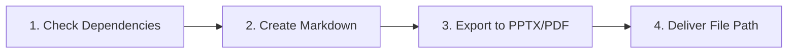
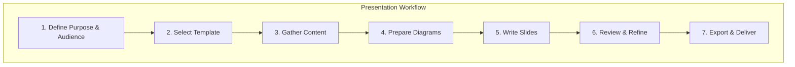

# Presentation Workflows

Step-by-step procedures for generating architecture presentations.

---

## AI Agent: End-to-End Delivery

**IMPORTANT:** When asked to create a presentation, the AI agent MUST complete the full workflow including final export. Do not stop at the markdown file.

### Automated Workflow



### Step 1: Ensure Dependencies

Before creating any presentation, check and install marp-cli:

```bash
# Check if marp is installed
which marp || npm install -g @marp-team/marp-cli
```

### Step 2: Create Presentation

1. Determine presentation type from user request
2. Create markdown file with Marp front matter
3. Write slides following templates
4. Save to appropriate location (e.g., `docs/presentations/` or user-specified)

### Step 3: Export to Final Format

**Always export after creating the markdown:**

```bash
# Default: Export to PPTX
marp {slides.md} --pptx -o {slides.pptx}

# If PDF requested
marp {slides.md} --pdf -o {slides.pdf}

# If HTML requested
marp {slides.md} -o {slides.html}
```

### Step 4: Deliver

Report the final file path to the user:
- Markdown source location
- Exported file location (PPTX/PDF)

### Example Agent Flow

```
User: "Create a presentation about our API migration"

Agent:
1. npm install -g @marp-team/marp-cli (if needed)
2. Create docs/presentations/api-migration.md
3. Write slides with migration content
4. Run: marp docs/presentations/api-migration.md --pptx -o docs/presentations/api-migration.pptx
5. Report: "Created presentation at docs/presentations/api-migration.pptx"
```

### Default Export Format

- **PPTX** is the default export format (most portable)
- User can request PDF or HTML specifically
- Always provide the exported file, not just the markdown

---

## Workflow Overview



---

## Step 1: Define Purpose & Audience

### 1.1 Identify Presentation Type

| Type | Audience | Duration | Depth |
|------|----------|----------|-------|
| Executive Briefing | C-level, Directors | 10-15 min | High-level |
| Architecture Review | Architects, Tech Leads | 30-60 min | Medium |
| Technical Deep Dive | Engineers | 45-90 min | Detailed |
| Decision Presentation | Stakeholders | 20-30 min | Focused |
| Migration Briefing | All affected teams | 30 min | Operational |

### 1.2 Define Key Messages

Answer before writing:

```markdown
## Presentation Brief

**Title:** {presentation title}
**Type:** {briefing/review/deep dive/decision}
**Audience:** {who will attend}
**Duration:** {time allocated}

### Key Questions to Answer
1. {primary question audience has}
2. {secondary question}
3. {tertiary question}

### Success Criteria
- [ ] Audience understands {concept}
- [ ] Decision on {item} is made
- [ ] Next steps are agreed
```

### 1.3 Output

- Presentation brief document
- Clear scope and objectives

---

## Step 2: Select Template

### 2.1 Choose Base Template

| Template | Use For |
|----------|---------|
| `vision-deck.md` | Architecture vision, strategy |
| `adr-deck.md` | Architecture decisions |
| `deep-dive-deck.md` | Technical details |
| `migration-deck.md` | Migration briefings |
| `status-deck.md` | Progress updates |

### 2.2 Copy Template

```bash
# Create presentation directory
mkdir -p presentations/{topic}/diagrams
mkdir -p presentations/{topic}/exports

# Copy template (adjust path to your toolkit location)
cp .ai-toolkit/skills/optional/presentation/templates/{template}.md \
   presentations/{topic}/slides.md
```

### 2.3 Customize Front Matter

Edit the front matter for your presentation:

```yaml
---
marp: true
theme: architecture
paginate: true
header: "Company Name - Architecture"
footer: "{presentation date}"
---
```

### 2.4 Output

- Presentation directory created
- Template copied and customized

---

## Step 3: Gather Content

### 3.1 From Architecture Analysis

If architecture analysis exists, extract:

```bash
# Typical locations
docs/architecture/
├── architecture-vision.md      # Context, goals, principles
├── current-state.md            # Baseline architecture
├── target-state.md             # Target architecture
├── gap-analysis.md             # Differences
├── risks.md                    # Risk register
└── diagrams/                   # Architecture diagrams
```

### 3.2 From TOGAF Outputs

| TOGAF Phase | Content for Presentations |
|-------------|---------------------------|
| Phase A (Vision) | Business context, objectives, principles |
| Phase B (Business) | Capabilities, processes |
| Phase C (IS) | Data models, application components |
| Phase D (Technology) | Infrastructure, platforms |
| Phase E (O&S) | Solutions, work packages |
| Phase F (Migration) | Timeline, milestones, risks |

### 3.3 From ADRs

If presenting a decision:

```markdown
## Content from ADR

- **Context:** Why decision needed
- **Options:** Alternatives considered
- **Decision:** What was chosen
- **Rationale:** Why this option
- **Consequences:** What changes
```

### 3.4 Output

- Content outline
- Source documents identified

---

## Step 4: Prepare Diagrams

### 4.1 Export Mermaid Diagrams

```bash
# Single diagram
mmdc -i diagrams/context.mmd -o diagrams/context.png -t neutral -b transparent

# With custom config
mmdc -i diagrams/sequence.mmd -o diagrams/sequence.png -c mermaid.config.json

# Batch export all diagrams
for f in diagrams/*.mmd; do
  mmdc -i "$f" -o "${f%.mmd}.png"
done
```

### 4.2 Export Structurizr Diagrams

If using Structurizr:

1. Open Structurizr workspace
2. Navigate to each diagram
3. Export as PNG (File > Export > PNG)
4. Save to `diagrams/` folder

### 4.3 Export Excalidraw Diagrams

1. Open `.excalidraw` file in VS Code
2. Click Export icon
3. Choose PNG with transparent background
4. Save to `diagrams/` folder

### 4.4 Image Optimization

```bash
# Optimize PNG files (requires optipng)
optipng diagrams/*.png

# Or use ImageMagick to resize
convert diagrams/large.png -resize 1920x1080\> diagrams/large.png
```

### 4.5 Output

- All diagrams exported as PNG/SVG
- Images optimized for presentation size

---

## Step 5: Write Slides

### 5.1 Structure Content

Follow the pattern for your deck type:

**Vision Deck Structure:**
```
1. Title
2. Agenda
3. Business Context
4. Current State (with diagram)
5. Problems/Pain Points
6. Target State (with diagram)
7. Key Changes
8. Benefits
9. Risks & Mitigations
10. Roadmap
11. Next Steps
12. Q&A
```

### 5.2 Write Each Slide

For each slide:

1. **Start with the message** - What's the one point?
2. **Add supporting content** - Bullets, diagrams, data
3. **Include speaker notes** - What to say
4. **Apply formatting** - Images, classes

Example slide:

```markdown
---

<!-- _class: lead -->

# Current State Architecture

Our existing platform has grown organically over 5 years

---

# Current Architecture


**Key Components:**
- Monolithic application
- Single database
- Manual deployments

**Pain Points:**
- 2-week release cycles
- Scaling limitations
- Technical debt

<!--
Notes:
- Point out the monolith in the diagram
- Mention the team has grown from 5 to 30 engineers
- Deployment requires weekend maintenance windows
-->
```

### 5.3 Apply Visual Hierarchy

| Element | Use For |
|---------|---------|
| `# H1` | Slide title only |
| `## H2` | Section headers within slide |
| `**Bold**` | Key terms, emphasis |
| Bullets | 3-6 points per slide |
| Images | Diagrams, supporting visuals |

### 5.4 Output

- Complete slides.md file
- All content written with speaker notes

---

## Step 6: Review & Refine

### 6.1 Preview Presentation

```bash
# Live preview with hot reload
marp -w -p presentations/{topic}/slides.md
```

Opens browser at http://localhost:8080

### 6.2 Review Checklist

**Content Review:**
- [ ] Clear message per slide
- [ ] Logical flow between slides
- [ ] Appropriate depth for audience
- [ ] Speaker notes for complex slides

**Visual Review:**
- [ ] Diagrams readable at presentation size
- [ ] Text not too small
- [ ] Consistent styling throughout
- [ ] No slide overload (max 6 bullets)

**Technical Review:**
- [ ] All images load correctly
- [ ] Code blocks syntax highlighted
- [ ] Pagination working
- [ ] Theme applied correctly

### 6.3 Get Feedback

Share HTML preview for async review:

```bash
# Generate HTML for sharing
marp presentations/{topic}/slides.md -o presentations/{topic}/preview.html
```

### 6.4 Iterate

Based on feedback:
1. Update content
2. Re-export diagrams if needed
3. Preview again
4. Repeat until ready

### 6.5 Output

- Reviewed and refined slides
- Feedback incorporated

---

## Step 7: Export & Deliver

### 7.1 Export Formats

```bash
# Export to PPTX (for corporate templates)
marp presentations/{topic}/slides.md \
  --pptx \
  -o presentations/{topic}/exports/slides.pptx

# Export to PDF (for distribution)
marp presentations/{topic}/slides.md \
  --pdf \
  -o presentations/{topic}/exports/slides.pdf

# Export to HTML (for web)
marp presentations/{topic}/slides.md \
  -o presentations/{topic}/exports/slides.html

# Export slide images
marp presentations/{topic}/slides.md \
  --images png \
  -o presentations/{topic}/exports/
```

### 7.2 Verify Exports

- [ ] PPTX opens in PowerPoint/Keynote
- [ ] PDF renders correctly
- [ ] All images visible in exports
- [ ] Page numbers correct

### 7.3 Distribute

| Channel | Format |
|---------|--------|
| Email | PDF attachment |
| Confluence | Upload PDF or HTML |
| SharePoint | PPTX or PDF |
| GitHub | Link to HTML, MD source |

### 7.4 Archive

```bash
# Commit presentation to git
git add presentations/{topic}/
git commit -m "docs: add {topic} presentation"
```

### 7.5 Output

- Final exports (PPTX, PDF, HTML)
- Presentation archived in version control

---

## Quick Reference: Marp Commands

```bash
# Preview with live reload
marp -w -p slides.md

# Export to PDF
marp slides.md --pdf -o slides.pdf

# Export to PPTX
marp slides.md --pptx -o slides.pptx

# Export to HTML
marp slides.md -o slides.html

# Use custom theme
marp slides.md --theme ./themes/architecture.css -o slides.pptx

# Export with engine options
marp slides.md --html --allow-local-files -o slides.html
```

---

## Workflow Variants

### Quick Presentation (30 min prep)

For simple updates or informal presentations:

1. Copy minimal template
2. Write 5-10 slides inline
3. Preview in browser
4. Present from HTML

### Formal Presentation (2-4 hours prep)

For stakeholder presentations:

1. Full workflow Steps 1-7
2. Multiple review rounds
3. PPTX export for corporate template
4. Practice run-through

### Technical Documentation

For persistent documentation:

1. Write comprehensive slides
2. Include all speaker notes in slides
3. Export as PDF for reference
4. Store in docs/ folder

---

## Automation Options

### Pre-commit Hook

Auto-export on commit:

```bash
#!/bin/bash
# .git/hooks/pre-commit

for md in presentations/*/slides.md; do
  dir=$(dirname "$md")
  marp "$md" --pdf -o "$dir/exports/slides.pdf"
done
```

### CI/CD Export

GitHub Actions example:

```yaml
name: Export Presentations
on:
  push:
    paths:
      - 'presentations/**/*.md'

jobs:
  export:
    runs-on: ubuntu-latest
    steps:
      - uses: actions/checkout@v4
      - uses: actions/setup-node@v4
      - run: npm install -g @marp-team/marp-cli
      - run: |
          for md in presentations/*/slides.md; do
            dir=$(dirname "$md")
            marp "$md" --pdf -o "$dir/exports/slides.pdf"
            marp "$md" --pptx -o "$dir/exports/slides.pptx"
          done
      - uses: actions/upload-artifact@v4
        with:
          name: presentations
          path: presentations/*/exports/
```
