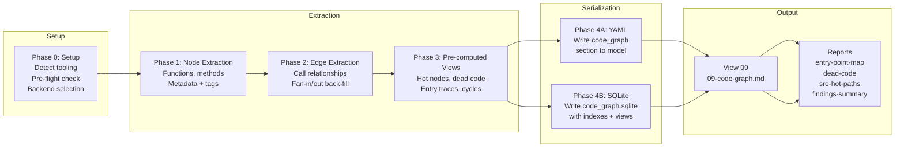

# Code-Graph Workflows

Step-by-step procedures for building and querying the function-level call graph.

---

## Workflow Overview



---

## Phase 0: Setup

**Goal**: Detect available tooling, run pre-flight size estimate, confirm backend with user.

### 0.1 Detect Static Analysis Tooling

Check for available tools in the project environment:

```
TypeScript/JS detected?
  → Check: npx ts-morph --version | tsc --version
Python detected?
  → Check: pyan3 --version | pyright --version
Java/Kotlin detected?
  → Check tooling availability via jdtls or build system
Go detected?
  → Check: go version (go/callgraph is stdlib)
C# detected?
  → Check .NET SDK for Roslyn availability
Unknown/multi-lang?
  → Fall back to tree-sitter or AI-only extraction
```

Capture:
```yaml
meta.code_graph_tooling:
  tool: string        # e.g. "ts-morph", "pyan3", "ai-only"
  available: boolean
  fallback: boolean   # true if using AI extraction
```

### 0.2 Pre-flight Size Estimate

Before full extraction, estimate graph size from the codebase:

1. Count source files (exclude tests, generated, vendor)
2. Estimate nodes: `file_count × avg_functions_per_file`
   - TypeScript/JS: ~8–15 functions/file
   - Python: ~6–12 functions/file
   - Java/Kotlin: ~10–20 methods/file
   - Go: ~5–10 functions/file
3. Estimate edges: `node_estimate × avg_fan_out`
   - avg_fan_out ≈ 4–6 for typical application code

If static tool is available, run in count-only mode (faster than full extraction):
```bash
# Example for pyan3
pyan3 src/**/*.py --no-defines --dot 2>/dev/null | grep -c "\->"

# Example for ts-morph (count functions via script)
# Run lightweight AST walk counting FunctionDeclarations + MethodDeclarations
```

### 0.3 Apply Backend Thresholds

```
node_count < 2,000 AND edge_count < 10,000
  → YAML backend. Proceed silently.

node_count 2,000–5,000 OR edge_count 10,000–25,000
  → Prompt:
    "This codebase has ~{node_count} functions and ~{edge_count} call edges.
     YAML will work but may hit context limits during deep traversal.

     Continue with:
       1. YAML (default) — works now, may degrade on large deep-dives
       2. SQLite — full fidelity, AI uses SQL for all traversal

     Default: YAML"

node_count > 5,000 OR edge_count > 25,000
  → Prompt:
    "This codebase has ~{node_count} functions and ~{edge_count} call edges.
     YAML at this scale will exceed context limits during analysis.
     SQLite is strongly recommended for reliable results.

     Continue with:
       1. SQLite (recommended)
       2. YAML — proceed anyway (not recommended for this codebase)

     Default: SQLite"
```

Persist selection:
```yaml
meta.preferences.code_graph_backend: yaml | sqlite
```

---

## Phase 1: Node Extraction

**Goal**: Enumerate all functions, methods, constructors, and significant callables.

### 1.1 Run Static Analysis Tool

Run the detected tool to extract all callable nodes from the codebase.

**Exclude**:
- Test files (`*.test.*`, `*.spec.*`, `*_test.*`, `__tests__/`)
- Generated files (build output, protobuf generated, ORM migrations)
- Vendor/node_modules/deps directories
- Configuration files

### 1.2 Capture Node Metadata

For each node extracted:

```yaml
- id: "src/auth/service.ts:AuthService.validateToken"   # canonical id
  type: method          # function | method | constructor | lambda | handler
  name: "validateToken"
  qualified_name: "AuthService.validateToken"
  signature: "validateToken(token: string): Promise<User>"
  location: "src/auth/service.ts:42"
  fan_in: 0             # populated in Phase 2
  fan_out: 0            # populated in Phase 2
  cyclomatic_complexity: 4
  is_entry_point: false # set in Phase 1.3
  is_dead_code: false   # set after Phase 2
  extraction_method: static   # static | ai
  tags: []              # populated in Phase 1.4
```

### 1.3 Mark Entry Points

Mark `is_entry_point: true` for any node that is:
- Registered as an HTTP route handler
- A CLI command handler
- An event/message consumer
- A scheduled job / cron handler
- A publicly exported function from a library package

Cross-reference with `interfaces` section from codebase-analysis model.

### 1.4 Tag Nodes

Apply semantic tags to nodes based on their location and name patterns:

| Tag | Applied When |
|-----|-------------|
| `db` | Node is in repository/DAO layer, calls ORM, uses DB client |
| `cache` | Node interacts with Redis/Memcached/in-memory cache |
| `external` | Node calls HTTP client, third-party SDK, external API |
| `auth` | Node is in auth layer or handles token/session logic |
| `async` | Node is async/returns Promise/uses goroutine/uses coroutine |
| `handler` | Node is a route/event/CLI handler (entry point type) |

---

## Phase 2: Edge Extraction

**Goal**: Build the directed call graph. Each edge is a function-calls-function relationship.

### 2.1 Extract Call Edges

For each call site in the codebase, extract:

```yaml
- from: "src/api/routes.ts:loginHandler"
  to: "src/auth/service.ts:AuthService.validateToken"
  type: call            # call | import | implements | extends | instantiates
  call_site: "src/api/routes.ts:88"
  is_dynamic: false     # true if via interface dispatch or reflection
  is_conditional: true  # true if inside if/try/catch — not guaranteed to execute
  is_async: true        # true if awaited or Promise-chained
```

### 2.2 Back-fill Fan-in and Fan-out

After all edges are extracted:

```
For each node:
  fan_in  = count of edges where to   = node.id
  fan_out = count of edges where from = node.id
```

### 2.3 Mark Dead Code

```
For each node:
  is_dead_code = (fan_in == 0) AND (is_entry_point == false)
```

---

## Phase 3: Pre-computed Views

**Goal**: Calculate common query results upfront. Stored views eliminate the need for live traversal during documentation generation.

### 3.1 Hot Nodes

```
Sort nodes by fan_in descending.
Take top 20 (or all if < 20).
```

```yaml
views:
  hot_nodes:
    - id: "src/db/connection.ts:query"
      fan_in: 34
      fan_out: 2
      location: "src/db/connection.ts:14"
```

### 3.2 Dead Code

```
Filter nodes where is_dead_code = true.
For each: attempt git log to get last_modified date.
```

```yaml
views:
  dead_code:
    - id: "src/utils/legacy.ts:oldParser"
      location: "src/utils/legacy.ts:102"
      last_modified: "2023-11-02"
```

### 3.3 Entry Point Traces

For each entry point node, perform depth-first traversal to build full call path:

```
trace(entry_node):
  path = [entry_node.id]
  visited = {}
  queue = callees_of(entry_node)
  while queue not empty:
    node = queue.pop()
    if node in visited: continue (cycle — record separately)
    visited.add(node)
    path.append(node.id)
    queue.extend(callees_of(node))
  return path
```

Collect during traversal:
- `external_calls`: nodes with tag `external` encountered in path
- `data_stores`: nodes with tag `db` or `cache` encountered in path

```yaml
views:
  entry_point_traces:
    - entry: "src/api/routes.ts:loginHandler"
      entry_type: http
      path:
        - "src/api/routes.ts:loginHandler"
        - "src/auth/service.ts:AuthService.validateToken"
        - "src/db/userRepo.ts:UserRepository.findByToken"
        - "src/db/connection.ts:query"
      external_calls: []
      data_stores:
        - "src/db/connection.ts:query"
```

### 3.4 Cycles

Detect circular call chains using DFS with back-edge detection:

```
For each entry point, run DFS.
When a back-edge is detected (node already in current path stack):
  Record the cycle: all nodes from the first occurrence to the back-edge.
```

```yaml
views:
  cycles:
    - nodes:
        - "src/a/module.ts:foo"
        - "src/b/module.ts:bar"
        - "src/a/module.ts:foo"
```

### 3.5 Complexity Hotspots

```
Filter nodes where cyclomatic_complexity > 10.
Sort by cyclomatic_complexity descending.
```

```yaml
views:
  complexity_hotspots:
    - id: "src/billing/calculator.ts:computeDiscount"
      cyclomatic_complexity: 18
      location: "src/billing/calculator.ts:67"
```

---

## Phase 4A: YAML Serialization

**Goal**: Write the complete `code_graph` section into the analysis model.

```yaml
analysis_model:
  code_graph:
    meta:
      node_count: 847
      edge_count: 3241
      extraction_method: static   # static | ai | mixed
      tool_used: "ts-morph 21.0"
      backend: yaml
      generated: "2026-04-17"
    nodes:
      - id: ...
        # full node objects
    edges:
      - from: ...
        # full edge objects
    views:
      hot_nodes: [...]
      dead_code: [...]
      entry_point_traces: [...]
      cycles: [...]
      complexity_hotspots: [...]
```

---

## Phase 4B: SQLite Serialization

**Goal**: Write `code_graph.sqlite` companion file alongside docs.

### Schema

```sql
CREATE TABLE nodes (
  id TEXT PRIMARY KEY,
  type TEXT,
  name TEXT,
  qualified_name TEXT,
  signature TEXT,
  location TEXT,
  fan_in INTEGER DEFAULT 0,
  fan_out INTEGER DEFAULT 0,
  cyclomatic_complexity INTEGER DEFAULT 0,
  is_entry_point INTEGER DEFAULT 0,
  is_dead_code INTEGER DEFAULT 0,
  extraction_method TEXT DEFAULT 'static',
  tags TEXT DEFAULT '[]'        -- JSON array
);

CREATE TABLE edges (
  id INTEGER PRIMARY KEY AUTOINCREMENT,
  from_node TEXT NOT NULL REFERENCES nodes(id),
  to_node TEXT NOT NULL REFERENCES nodes(id),
  type TEXT DEFAULT 'call',
  call_site TEXT,
  is_dynamic INTEGER DEFAULT 0,
  is_conditional INTEGER DEFAULT 0,
  is_async INTEGER DEFAULT 0
);

-- Performance indexes
CREATE INDEX idx_edges_from    ON edges(from_node);
CREATE INDEX idx_edges_to      ON edges(to_node);
CREATE INDEX idx_nodes_fan_in  ON nodes(fan_in DESC);
CREATE INDEX idx_nodes_dead    ON nodes(is_dead_code);
CREATE INDEX idx_nodes_entry   ON nodes(is_entry_point);
```

### Materialized View Tables

```sql
-- Hot nodes: pre-sorted for instant lookup
CREATE TABLE view_hot_nodes AS
  SELECT id, fan_in, fan_out, location
  FROM nodes
  ORDER BY fan_in DESC;

-- Dead code: pre-filtered
CREATE TABLE view_dead_code AS
  SELECT id, location, extraction_method
  FROM nodes
  WHERE is_dead_code = 1;

-- Complexity hotspots: pre-filtered and sorted
CREATE TABLE view_complexity_hotspots AS
  SELECT id, cyclomatic_complexity, location
  FROM nodes
  WHERE cyclomatic_complexity > 10
  ORDER BY cyclomatic_complexity DESC;

-- Entry point traces: stored as JSON rows
CREATE TABLE view_entry_traces (
  entry_node TEXT NOT NULL,
  entry_type TEXT,
  path TEXT NOT NULL,           -- JSON array of node ids
  external_calls TEXT DEFAULT '[]',
  data_stores TEXT DEFAULT '[]'
);

-- Cycles: stored as JSON rows
CREATE TABLE view_cycles (
  cycle_id INTEGER PRIMARY KEY AUTOINCREMENT,
  nodes TEXT NOT NULL           -- JSON array of node ids
);
```

---

## Traversal Primitives

### YAML Backend

The AI walks the `code_graph.nodes` and `code_graph.edges` arrays directly.

| Operation | How to Execute |
|-----------|---------------|
| `callers_of(node_id)` | Filter `edges` where `to == node_id`, return `from` values, look up in `nodes` |
| `callees_of(node_id)` | Filter `edges` where `from == node_id`, return `to` values, look up in `nodes` |
| `trace_path(from, to)` | Walk edges depth-first from `from`, collect path, stop when `to` is reached |
| `entry_paths(node_id)` | Walk edges in reverse from `node_id`, stop when `is_entry_point = true` |
| `subgraph(node_id, depth)` | BFS outward from `node_id` collecting nodes at each hop, stop at `depth` |
| `find_node(name)` | Filter `nodes` where `name` or `qualified_name` contains `name` |

### SQLite Backend

The AI runs SQL queries directly via terminal:

```sql
-- callers_of('src/auth/service.ts:validateToken')
SELECT n.* FROM edges e JOIN nodes n ON n.id = e.from_node
WHERE e.to_node = 'src/auth/service.ts:validateToken';

-- callees_of('src/auth/service.ts:validateToken')
SELECT n.* FROM edges e JOIN nodes n ON n.id = e.to_node
WHERE e.from_node = 'src/auth/service.ts:validateToken';

-- subgraph(node_id, depth: 3) — recursive CTE
WITH RECURSIVE call_tree AS (
  SELECT from_node, to_node, 1 AS depth
  FROM edges WHERE from_node = ?
  UNION ALL
  SELECT e.from_node, e.to_node, ct.depth + 1
  FROM edges e
  JOIN call_tree ct ON e.from_node = ct.to_node
  WHERE ct.depth < 3
)
SELECT DISTINCT n.* FROM call_tree ct JOIN nodes n ON n.id = ct.to_node;

-- entry_paths(node_id) — walk edges in reverse until entry point
WITH RECURSIVE reverse_tree AS (
  SELECT to_node, from_node FROM edges WHERE to_node = ?
  UNION ALL
  SELECT e.to_node, e.from_node FROM edges e
  JOIN reverse_tree rt ON e.to_node = rt.from_node
)
SELECT n.* FROM reverse_tree rt JOIN nodes n ON n.id = rt.from_node
WHERE n.is_entry_point = 1;

-- dead code
SELECT * FROM view_dead_code;

-- hot nodes top 20
SELECT * FROM view_hot_nodes LIMIT 20;

-- complexity hotspots
SELECT * FROM view_complexity_hotspots;
```
