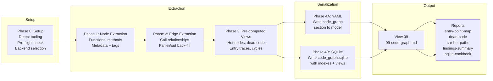

# Code-Graph Workflows

Step-by-step procedures for building and querying the function-level call graph.

---

## Workflow Overview



---

## Phase 0: Setup

**Goal**: Establish extraction scope and user intent, detect available tooling, run pre-flight size estimate, confirm backend with user.

---

### 0.0 Scope Dialogue

**Runs before all other Phase 0 steps.**
**Never assume scope or output targets. Always confirm with the user.**

---

#### 0.0.1 Detect trigger context

Before presenting any choices, determine how this skill was invoked:

```
Triggered by /upgrade?
  → Present as optional step:
      "View 09 (Code Graph) is available as a new view.
       Run extraction now? This is optional — you can run it
       later by asking for the code-graph skill.
       [Y / skip]"
  → If skipped: set meta.code_graph_status = "skipped"
                do NOT proceed to 0.0.2 or any Phase 1+

Triggered by arch-analysis?
  → Pause arch-analysis flow. Present scope dialogue below.
  → After scope is confirmed, continue arch-analysis.

Direct user request?
  → Proceed directly to 0.0.2
```

---

#### 0.0.2 Present extraction type choice

```
─────────────────────────────────────────────────────────────
  Code Graph Analysis — Scope & Setup
─────────────────────────────────────────────────────────────

  What kind of extraction do you want to run?

  A  Targeted   Pick 1–3 repos to analyse. Fast and focused.
                Recommended for: first run, answering a
                specific question, or when time is limited.

  B  Full scan  All cloned TypeScript repos extracted as one
                unified graph. Richer cross-repo edges.
                Requires SQLite. See full complexity breakdown
                before confirming.

  C  AI-only    No static extraction. AI reads source files
                and produces indicative markdown analysis.
                No SQLite file, no reports/ directory.
                Runs immediately, no tooling required.

  Default: A
─────────────────────────────────────────────────────────────
```

Capture choice. If **C** → skip all remaining Phase 0 steps
and proceed directly to AI-extraction output (View 09 markdown
only). If **A** or **B** → continue to 0.0.3.

---

#### 0.0.3 If B (Full scan) — present value, complexity, and incremental update model

Present ALL of the following sections before asking for confirmation.
Do not collapse or abbreviate them.

```
─────────────────────────────────────────────────────────────
  Full scan — what you get, what it costs, how it stays fresh
─────────────────────────────────────────────────────────────

  WHAT WILL BE SCANNED
  ┌────────────────────────────────┬──────────────┬─────────┐
  │ Category (TypeScript)          │ Est. .ts     │ Tool    │
  ├────────────────────────────────┼──────────────┼─────────┤
  │ Backend services (~10–20 repos)│ ~3,500 files │ ts-morph│
  │ Frontend apps                  │ ~4,000 files │ ts-morph│
  │ Shared libs (@org/*)           │ ~2,000 files │ ts-morph│
  ├────────────────────────────────┼──────────────┼─────────┤
  │ iOS (Swift)                    │ ~2,000 .swift│  n/a*  │
  │ Android (Kotlin)               │ ~1,500 .kt   │  n/a*  │
  │ Scripts (Python)               │    ~50 .py   │ pyan3* │
  └────────────────────────────────┴──────────────┴─────────┘
  * ts-morph does not cover Swift, Kotlin, or Python.
    These require a separate pass and produce a separate
    graph file — they cannot be merged into the TypeScript
    graph.

  Estimated TypeScript graph: 15,000–40,000 nodes
  → Backend: SQLite REQUIRED at this scale

  ─────────────────────────────────────────────────────────
  WHY THIS IS VALUABLE

  Having the full graph in SQLite means future queries run
  against exhaustive real data — not AI memory of what was
  last read. Examples of what becomes possible:

  "Which functions are called by more than 10 consumers?"
  → SQL on view_hot_nodes. Instant, exhaustive, exact.

  "If I change CacheService.setEdgeTags(),
   what breaks?"
  → Reverse traversal from that node → full blast radius
    across ALL services simultaneously. Not possible from
    AI source reading alone.

  "Show me every path from an HTTP entry point to a Redis
   write, across all backend services."
  → Entry point traces filtered by data_store = 'redis'.

  "Which code has no callers AND is called from 3+ entry
   points — i.e. which deletions are safe vs risky?"
  → JOIN nodes + edges + fan_in counts.

  "Find all functions over complexity 10 that are not
   covered by any test."
  → JOIN complexity_hotspots + external test coverage data.

  The SQLite file is queryable by you directly —
  not just by the AI agent:
    sqlite3 code_graph.sqlite
    DB Browser for SQLite
    DBeaver

  ─────────────────────────────────────────────────────────
  INCREMENTAL UPDATES — staying fresh after code changes

  The graph does NOT need a full re-extraction after every
  change. Incremental update works as follows:

    1. Detect changed files:
         git diff HEAD~1 --name-only | grep '\.ts$'
    2. Delete existing nodes + edges for those files only
         DELETE FROM nodes WHERE file IN (changed_files)
         DELETE FROM edges WHERE from_file IN (changed_files)
    3. Re-extract nodes and edges for changed files only
    4. Recompute affected pre-computed views
         (hot_nodes, dead_code, cycles — only where
          changed nodes appear)

  How to trigger incremental updates:
    Manual  — "update code graph" when you want it
    On pull — after each git pull / repo re-clone
    CI      — post-merge webhook into metarepo (future)

  Limitation: if a shared lib changes (@org/core,
  @org/connector etc.), ALL repos that import it need
  their edge tables refreshed — not just the lib itself.
  This is handled automatically by step 2 above (deleting
  edges by from_file catches all affected call sites).

  Staleness is tracked in specs/analysis-manifest.json
  (the same mechanism as arch-analysis). The existing
  check-analysis-status.py script can be extended to flag
  stale graph files per repo when commit SHAs diverge.

  ─────────────────────────────────────────────────────────
  DOWNSIDES AND RISKS

  ✖  ts-morph requires all repos present locally AND
     tsconfig.json path aliases (@org/*, @shared/*) must
     be manually resolved — mismatched paths cause silent
     edge gaps

  ✖  Compiled package boundaries: if @org/core is
     only present as a compiled npm package (not source),
     edges into it cannot be resolved — those calls appear
     as external leaf nodes only

  ✖  Extraction time: approximately 10–30 minutes for
     full TypeScript scan across all repos

  ✖  SQLite file size: approximately 50–200 MB

  ✖  iOS and Android cannot be merged into the TypeScript
     graph — they need separate passes with separate tools
     and produce separate .sqlite files

  ✖  Not all repos may have complete shallow clones —
     missing repos create gaps in cross-repo edges

  ─────────────────────────────────────────────────────────

  Do you want to proceed with full TypeScript scan?

    1  Yes — TypeScript only (ts-morph + SQLite)
    2  Yes — TypeScript + Python scripts (ts-morph + pyan3)
    3  No  — go back and choose Targeted (A) instead
─────────────────────────────────────────────────────────────
```

If user chooses 3 → return to 0.0.2 with default A.

---

#### 0.0.4 Repo selection (for A Targeted or after B confirmation)

```
  Which repos should be included?

  Suggested groupings (based on this codebase):

    [1]  Core backend services
           api-service
           worker-service
           core-lib
           connector-service

    [2]  Extended backend services
         (all of [1]) plus:
           content-service
           recommendation-service
           styling-service
           reviews-service

    [3]  Frontend apps
           storefront, catalog, navigation, landing-app, cms-components

    [4]  All TypeScript repos (full scan)

    [5]  Custom — type repo names

  Choose one or more groupings, or type repo names directly:
```

Validate that each named repo exists in `code/`. Collect ALL missing repos first,
then present a single decision point before proceeding to Phase 0.0.5:

```
  ⚠ The following repos are not cloned and will be excluded:
       - content-service    (code/content-service not found)
       - reviews-service    (code/reviews-service not found)

    clone    git clone --depth=1 <url> for each missing repo, then re-validate
    continue Without them — cross-repo edges to these repos appear as
             unresolved leaf nodes; gaps are noted in the extraction plan
    abort    Exit — no extraction started, no files touched
```

If **abort** → exit Phase 0.0 immediately. No extraction, no files written.
If **clone** → run the clone commands, then re-run the validation check.
If **continue** → proceed to Phase 0.0.5 with the reduced repo set. Note the
excluded repos in the Phase 0.0.7 confirmation summary.

---

#### 0.0.5 Output structure for cross-repo calls

```
  How should calls that cross repo boundaries be shown?

  A  Unified graph
     All repos merged into one SQLite file. Cross-repo
     edges are normal edges with a repo_name label.
     Best for: global hot path analysis, blast radius.

  B  Per-repo graphs
     One SQLite/YAML file per repo. Cross-repo calls are
     marked as external edges (node type = external).
     Best for: per-team ownership, targeted deep dives.

  C  Library + consumer split
     Shared libs (@org/*, @shared/*) are extracted once.
     Consumer repos reference them as external nodes with
     their public method signatures resolved.
     Best for: blast radius analysis on shared libs.

  Default: A
```

---

#### 0.0.6 Output files

```
  Which outputs should be generated?

  Always generated:
    ✅  analysis/09-code-graph.md       (View 09)

  Select additional outputs:
    [ ]  reports/entry-point-map.md     All entry points
                                        traced to leaf nodes
    [ ]  reports/dead-code.md           Dead code inventory
                                        with removal risk
    [ ]  reports/sre-hot-paths.md       Critical call chains
                                        annotated with
                                        reliability signals
                                        (requires View 08)
    [ ]  reports/findings-summary.md    Cross-cutting summary
                                        of all active views
    [ ]  code_graph.sqlite              Raw queryable graph
    [ ]  code_graph.yaml                YAML model section
                                        (small codebases only)
    [ ]  reports/sqlite-cookbook.md     Schema reference +
                                        query examples for
                                        direct SQLite access
                                        (SQLite backend only)

  Default: all selected.

  Note: reports/sre-hot-paths.md will be skipped if
  analysis/08-sre-reliability.md does not exist.
  Note: reports/sqlite-cookbook.md will be skipped if
  YAML backend is selected.
```

---

#### 0.0.7 Confirm and proceed

Present a summary of all choices and ask for final confirmation
before touching any files or running any tooling:

```
─────────────────────────────────────────────────────────────
  Code Graph Analysis — extraction plan

  Repos:      {list confirmed repos}
  Tool:       ts-morph (TypeScript static analysis)
  Backend:    {YAML | SQLite}
  Structure:  {Unified | Per-repo | Library+consumer}
  Outputs:    {list selected outputs}

  Est. nodes: ~{node_estimate}
  Est. time:  ~{time_estimate}
─────────────────────────────────────────────────────────────

  Proceed?
    Y        Start extraction (continues to Phase 0.1)
    change   Adjust scope
    cancel   Exit without changes
```

Only after **Y** → continue to Phase 0.1 (detect tooling),
0.2 (preflight size estimate), 0.3 (backend threshold check).

---

### 0.1 Detect Static Analysis Tooling

Check for available tools in the project environment:

```
TypeScript/JS detected?
  → Check: npx ts-morph --version | tsc --version
Python detected?
  → Check: pyan3 --version | pyright --version
Java/Kotlin detected?
  → Check tooling availability via jdtls or build system
Go detected?
  → Check: go version (go/callgraph is stdlib)
C# detected?
  → Check .NET SDK for Roslyn availability
Unknown/multi-lang?
  → Fall back to tree-sitter or AI-only extraction
```

Capture:
```yaml
meta.code_graph_tooling:
  tool: string        # e.g. "ts-morph", "pyan3", "ai-only"
  available: boolean
  fallback: boolean   # true if using AI extraction
```

### 0.2 Pre-flight Size Estimate

Before full extraction, estimate graph size from the codebase:

1. Count source files (exclude tests, generated, vendor)
2. Estimate nodes: `file_count × avg_functions_per_file`
   - TypeScript/JS: ~8–15 functions/file
   - Python: ~6–12 functions/file
   - Java/Kotlin: ~10–20 methods/file
   - Go: ~5–10 functions/file
3. Estimate edges: `node_estimate × avg_fan_out`
   - avg_fan_out ≈ 4–6 for typical application code

If static tool is available, run in count-only mode (faster than full extraction):
```bash
# Example for pyan3
pyan3 src/**/*.py --no-defines --dot 2>/dev/null | grep -c "\->"

# Example for ts-morph (count functions via script)
# Run lightweight AST walk counting FunctionDeclarations + MethodDeclarations
```

### 0.3 Apply Backend Thresholds

```
node_count < 2,000 AND edge_count < 10,000
  → YAML backend. Proceed silently.

node_count 2,000–5,000 OR edge_count 10,000–25,000
  → Prompt:
    "This codebase has ~{node_count} functions and ~{edge_count} call edges.
     YAML will work but may hit context limits during deep traversal.

     Continue with:
       1. YAML (default) — works now, may degrade on large deep-dives
       2. SQLite — full fidelity, AI uses SQL for all traversal

     Default: YAML"

node_count > 5,000 OR edge_count > 25,000
  → Prompt:
    "This codebase has ~{node_count} functions and ~{edge_count} call edges.
     YAML at this scale will exceed context limits during analysis.
     SQLite is strongly recommended for reliable results.

     Continue with:
       1. SQLite (recommended)
       2. YAML — proceed anyway (not recommended for this codebase)

     Default: SQLite"
```

Persist selection:
```yaml
meta.preferences.code_graph_backend: yaml | sqlite
```

---

## Phase 1: Node Extraction

**Goal**: Enumerate all functions, methods, constructors, and significant callables.

### 1.1 Run Static Analysis Tool

Run the detected tool to extract all callable nodes from the codebase.

**Exclude**:
- Test files (`*.test.*`, `*.spec.*`, `*_test.*`, `__tests__/`)
- Generated files (build output, protobuf generated, ORM migrations)
- Vendor/node_modules/deps directories
- Configuration files

### 1.2 Capture Node Metadata

For each node extracted:

```yaml
- id: "src/auth/service.ts:AuthService.validateToken"   # canonical id
  type: method          # function | method | constructor | lambda | handler
  name: "validateToken"
  qualified_name: "AuthService.validateToken"
  signature: "validateToken(token: string): Promise<User>"
  location: "src/auth/service.ts:42"
  fan_in: 0             # populated in Phase 2
  fan_out: 0            # populated in Phase 2
  cyclomatic_complexity: 4
  is_entry_point: false # set in Phase 1.3
  is_dead_code: false   # set after Phase 2
  extraction_method: static   # static | ai
  tags: []              # populated in Phase 1.4
```

### 1.3 Mark Entry Points

Mark `is_entry_point: true` for any node that is:
- Registered as an HTTP route handler
- A CLI command handler
- An event/message consumer
- A scheduled job / cron handler
- A publicly exported function from a library package

Cross-reference with `interfaces` section from codebase-analysis model.

### 1.4 Tag Nodes

Apply semantic tags to nodes based on their location and name patterns:

| Tag | Applied When |
|-----|-------------|
| `db` | Node is in repository/DAO layer, calls ORM, uses DB client |
| `cache` | Node interacts with Redis/Memcached/in-memory cache |
| `external` | Node calls HTTP client, third-party SDK, external API |
| `auth` | Node is in auth layer or handles token/session logic |
| `async` | Node is async/returns Promise/uses goroutine/uses coroutine |
| `handler` | Node is a route/event/CLI handler (entry point type) |

---

## Phase 2: Edge Extraction

**Goal**: Build the directed call graph. Each edge is a function-calls-function relationship.

### 2.1 Extract Call Edges

For each call site in the codebase, extract:

```yaml
- from: "src/api/routes.ts:loginHandler"
  to: "src/auth/service.ts:AuthService.validateToken"
  type: call            # call | import | implements | extends | instantiates
  call_site: "src/api/routes.ts:88"
  is_dynamic: false     # true if via interface dispatch or reflection
  is_conditional: true  # true if inside if/try/catch — not guaranteed to execute
  is_async: true        # true if awaited or Promise-chained
```

### 2.2 Back-fill Fan-in and Fan-out

After all edges are extracted:

```
For each node:
  fan_in  = count of edges where to   = node.id
  fan_out = count of edges where from = node.id
```

### 2.3 Mark Dead Code

```
For each node:
  is_dead_code = (fan_in == 0) AND (is_entry_point == false)
```

---

## Phase 2.5: Incremental Update

**Goal**: Refresh only the changed portions of an existing SQLite graph. Skip full re-extraction. Triggered by `/update` when code graph is stale, or by a direct user request ("update code graph").

> **Precondition**: SQLite file exists (`code_graph.sqlite`) from a previous Phase 4B run.
> YAML-only graphs cannot be incrementally updated — a full re-extraction is required.

### 2.5.1 Detect changed files

```bash
# Identify .ts files changed since the recorded generatedDate commit SHA
git -C code/{repo} diff {generatedDate_commit}..HEAD --name-only | grep -E '\.(ts|js|py|go|kt)$'
```

Collect the set of changed files per repo. If no files changed: skip this repo, no update needed.

### 2.5.2 Delete stale data

For each changed file, remove its existing nodes and all edges touching them:

```sql
-- For each changed file path in the repo:
DELETE FROM edges
  WHERE call_site LIKE '{changed_file}%'
     OR from_node IN (SELECT id FROM nodes WHERE location LIKE '{changed_file}%')
     OR to_node   IN (SELECT id FROM nodes WHERE location LIKE '{changed_file}%');

DELETE FROM nodes WHERE location LIKE '{changed_file}%';
```

> **Shared library caveat**: If a shared lib (`@org/core`, `@org/connector`, etc.) changed,
> its consumer repos also have stale edges. Extend the deletion to also remove edges from
> consumer repos where `to_node` resolves to a node in the changed lib file:
> ```sql
> DELETE FROM edges
>   WHERE to_node IN (SELECT id FROM nodes WHERE repo = '{lib_repo}'
>                     AND location LIKE '{changed_lib_file}%');
> ```

### 2.5.3 Re-extract changed files only

Run the static analysis tool scoped to the changed files only:
```bash
# TypeScript example (ts-morph scoped to changed files)
node scripts/cg-extract.js --files {changed_file_list}
```

Insert the new nodes and edges for these files using the same Phase 1 + 2 logic.
Back-fill fan_in / fan_out for all affected nodes (not just newly inserted — callers of
changed nodes may have their fan-out counts affected):

```sql
-- Recompute fan_in and fan_out for all nodes where edges were deleted or inserted
UPDATE nodes SET fan_in  = (SELECT COUNT(*) FROM edges WHERE to_node   = nodes.id);
UPDATE nodes SET fan_out = (SELECT COUNT(*) FROM edges WHERE from_node = nodes.id);

-- Recompute is_dead_code for affected nodes
UPDATE nodes SET is_dead_code = CASE
  WHEN fan_in = 0 AND is_entry_point = 0 THEN 1 ELSE 0 END;
```

### 2.5.4 Refresh derived columns and materialized views

```sql
-- Re-populate derived columns for changed nodes
UPDATE nodes SET has_db_call       = (CASE WHEN tags LIKE '%"db"%'       THEN 1 ELSE 0 END);
UPDATE nodes SET has_external_call = (CASE WHEN tags LIKE '%"external"%' THEN 1 ELSE 0 END);
UPDATE nodes SET repo_path         = substr(location, 1, instr(location, ':') - 1);

-- Refresh from_repo / to_repo on edges where either end was re-inserted
UPDATE edges SET
  from_repo = (SELECT repo FROM nodes WHERE nodes.id = edges.from_node),
  to_repo   = (SELECT repo FROM nodes WHERE nodes.id = edges.to_node)
WHERE from_node IN (SELECT id FROM nodes WHERE location LIKE '{changed_file}%')
   OR to_node   IN (SELECT id FROM nodes WHERE location LIKE '{changed_file}%');

-- Rebuild materialized view tables (drop and recreate)
DROP TABLE IF EXISTS view_hot_nodes;
DROP TABLE IF EXISTS view_dead_code;
DROP TABLE IF EXISTS view_complexity_hotspots;
DROP TABLE IF EXISTS view_refactor_priority;
DROP TABLE IF EXISTS view_cross_repo_edges;
-- (view_entry_traces, view_cycles, view_db_entry_paths also need recompute — see Phase 3)

-- Recreate from updated data (same DDL as Phase 4B)
CREATE TABLE view_hot_nodes AS
  SELECT id, fan_in, fan_out, location FROM nodes ORDER BY fan_in DESC;

CREATE TABLE view_dead_code AS
  SELECT id, location, extraction_method FROM nodes WHERE is_dead_code = 1;

CREATE TABLE view_complexity_hotspots AS
  SELECT id, cyclomatic_complexity, location FROM nodes
  WHERE cyclomatic_complexity > 10 ORDER BY cyclomatic_complexity DESC;

CREATE TABLE view_refactor_priority AS
  SELECT id, repo, fan_in, cyclomatic_complexity,
         fan_in * cyclomatic_complexity AS refactor_score, location
  FROM nodes WHERE is_dead_code = 0 ORDER BY refactor_score DESC;

CREATE TABLE view_cross_repo_edges AS
  SELECT from_node, to_node, from_repo, to_repo, call_site, is_async, is_conditional
  FROM edges WHERE from_repo != to_repo;
```

For `view_entry_traces` and `view_cycles`: re-run the DFS traversal from Phase 3.3 and 3.4
but **only for entry point nodes that appear in the changed file set or that call into a
changed node**. Rebuild only those rows in the view tables:

```sql
DELETE FROM view_entry_traces
  WHERE entry_node IN (
    SELECT id FROM nodes WHERE location LIKE '{changed_file}%'
  )
  OR entry_node IN (                  -- entry points that call into changed nodes
    SELECT DISTINCT e.from_node
    FROM edges e
    JOIN nodes n ON n.id = e.to_node
    WHERE n.location LIKE '{changed_file}%' AND
          (SELECT is_entry_point FROM nodes WHERE id = e.from_node) = 1
  );

DELETE FROM view_db_entry_paths
  WHERE entry_node IN (SELECT entry_node FROM view_entry_traces WHERE ...);
-- Then re-run DFS and re-insert affected rows.
```

### 2.5.5 Update manifest + complete

After incremental update completes, proceed to Phase 4C (update `artifacts.code-graph`
in manifest with new `generatedDate` and new stats) and Phase 4D (commit).

Note in Phase 4D commit message: `fix(code-graph): incremental update — {N} files refreshed`

---

## Phase 3: Pre-computed Views

**Goal**: Calculate common query results upfront. Stored views eliminate the need for live traversal during documentation generation.

> **SQLite backend**: When SQLite is selected, steps 3.1–3.2 and 3.5 are trivially computable via SQL
> and their results are written to the materialized view tables in Phase 4B (not as YAML arrays).
> Steps 3.3 (entry traces) and 3.4 (cycles) still require DFS traversal in this phase because they
> are path-based; results are stored as JSON rows in `view_entry_traces` and `view_cycles`.
>
> During subsequent **arch-analysis** runs, agents query these tables with SQL rather than repeating
> the traversal in-context. See [arch-analysis Phase 4B.6 SQL Dispatch](../arch-analysis/workflows.md)
> for the routing rules.
>
> **YAML backend**: Proceed with all steps below exactly as described.

### 3.1 Hot Nodes

```
Sort nodes by fan_in descending.
Take top 20 (or all if < 20).
```

```yaml
views:
  hot_nodes:
    - id: "src/db/connection.ts:query"
      fan_in: 34
      fan_out: 2
      location: "src/db/connection.ts:14"
```

### 3.2 Dead Code

```
Filter nodes where is_dead_code = true.
For each: attempt git log to get last_modified date.
```

```yaml
views:
  dead_code:
    - id: "src/utils/legacy.ts:oldParser"
      location: "src/utils/legacy.ts:102"
      last_modified: "2023-11-02"
```

### 3.3 Entry Point Traces

For each entry point node, perform depth-first traversal to build full call path:

```
trace(entry_node):
  path = [entry_node.id]
  visited = {}
  queue = callees_of(entry_node)
  while queue not empty:
    node = queue.pop()
    if node in visited: continue (cycle — record separately)
    visited.add(node)
    path.append(node.id)
    queue.extend(callees_of(node))
  return path
```

Collect during traversal:
- `external_calls`: nodes with tag `external` encountered in path
- `data_stores`: nodes with tag `db` or `cache` encountered in path

```yaml
views:
  entry_point_traces:
    - entry: "src/api/routes.ts:loginHandler"
      entry_type: http
      path:
        - "src/api/routes.ts:loginHandler"
        - "src/auth/service.ts:AuthService.validateToken"
        - "src/db/userRepo.ts:UserRepository.findByToken"
        - "src/db/connection.ts:query"
      external_calls: []
      data_stores:
        - "src/db/connection.ts:query"
```

> **SQLite backend only**: After building all traces, insert one row per entry point into
> `view_db_entry_paths`: collect all node ids in the path where `has_db_call = 1` and
> store as a JSON array in the `db_nodes` column.

### 3.4 Cycles

Detect circular call chains using DFS with back-edge detection:

```
For each entry point, run DFS.
When a back-edge is detected (node already in current path stack):
  Record the cycle: all nodes from the first occurrence to the back-edge.
```

```yaml
views:
  cycles:
    - nodes:
        - "src/a/module.ts:foo"
        - "src/b/module.ts:bar"
        - "src/a/module.ts:foo"
```

### 3.5 Complexity Hotspots

```
Filter nodes where cyclomatic_complexity > 10.
Sort by cyclomatic_complexity descending.
```

```yaml
views:
  complexity_hotspots:
    - id: "src/billing/calculator.ts:computeDiscount"
      cyclomatic_complexity: 18
      location: "src/billing/calculator.ts:67"
```

---

## Phase 4A: YAML Serialization

**Goal**: Write the complete `code_graph` section into the analysis model.

> **Commit rule:** The output YAML (written into the analysis model file) must be committed to the repo
> as part of Phase 4D unless the user explicitly opts out. Do not leave it as an uncommitted local file.

> **SQLite backend — stub mode**: When Phase 4B (SQLite) is selected, the YAML `code_graph` section
> should contain **stats only** — not the full node and edge arrays. The SQLite file is the
> authoritative data source; duplicating arrays into YAML wastes storage and creates a drift risk.
> Write only `meta` + `stats` + a pointer to the SQLite path (see stub template below).

### Full YAML (YAML backend)

```yaml
analysis_model:
  code_graph:
    meta:
      node_count: 847
      edge_count: 3241
      extraction_method: static   # static | ai | mixed
      tool_used: "ts-morph 21.0"
      backend: yaml
      generated: "2026-04-17"
    nodes:
      - id: ...
        # full node objects
    edges:
      - from: ...
        # full edge objects
    views:
      hot_nodes: [...]
      dead_code: [...]
      entry_point_traces: [...]
      cycles: [...]
      complexity_hotspots: [...]
```

### Stats-only stub (SQLite backend)

When Phase 4B (SQLite) is active, write this stub instead of the full arrays:

```yaml
analysis_model:
  code_graph:
    meta:
      node_count: 847
      edge_count: 3241
      extraction_method: static
      tool_used: "ts-morph 21.0"
      backend: sqlite
      generated: "2026-04-17"
      sqlite_path: "code/{repo}/code_graph.sqlite"
    # Full data in sqlite_path — query via sqlite3 or Phase 4B.6 SQL dispatch.
    # Views: view_hot_nodes, view_dead_code, view_complexity_hotspots,
    #        view_entry_traces, view_cycles, view_refactor_priority,
    #        view_cross_repo_edges, view_db_entry_paths
```

---

## Phase 4B: SQLite Serialization

**Goal**: Write `code_graph.sqlite` companion file alongside docs.

### Schema

```sql
CREATE TABLE nodes (
  id TEXT PRIMARY KEY,
  type TEXT,
  name TEXT,
  qualified_name TEXT,
  signature TEXT,
  location TEXT,
  repo TEXT,
  fan_in INTEGER DEFAULT 0,
  fan_out INTEGER DEFAULT 0,
  cyclomatic_complexity INTEGER DEFAULT 0,
  is_entry_point INTEGER DEFAULT 0,
  is_dead_code INTEGER DEFAULT 0,
  extraction_method TEXT DEFAULT 'static',
  tags TEXT DEFAULT '[]',       -- JSON array
  has_db_call INTEGER DEFAULT 0,        -- 1 if tags contains "db"
  has_external_call INTEGER DEFAULT 0,  -- 1 if tags contains "external"
  repo_path TEXT                        -- location substring before ':' (for GROUP BY)
);

CREATE TABLE edges (
  id INTEGER PRIMARY KEY AUTOINCREMENT,
  from_node TEXT NOT NULL REFERENCES nodes(id),
  to_node TEXT NOT NULL REFERENCES nodes(id),
  from_repo TEXT,               -- denormalized for fast cross-repo queries
  to_repo TEXT,
  type TEXT DEFAULT 'call',
  call_site TEXT,
  is_dynamic INTEGER DEFAULT 0,
  is_conditional INTEGER DEFAULT 0,
  is_async INTEGER DEFAULT 0
);

-- Performance indexes
CREATE INDEX idx_edges_from      ON edges(from_node);
CREATE INDEX idx_edges_to        ON edges(to_node);
CREATE INDEX idx_edges_from_repo ON edges(from_repo);
CREATE INDEX idx_edges_to_repo   ON edges(to_repo);
CREATE INDEX idx_nodes_fan_in    ON nodes(fan_in DESC);
CREATE INDEX idx_nodes_dead      ON nodes(is_dead_code);
CREATE INDEX idx_nodes_entry     ON nodes(is_entry_point);
CREATE INDEX idx_nodes_repo      ON nodes(repo);
```

### Materialized View Tables

```sql
-- Hot nodes: pre-sorted for instant lookup
CREATE TABLE view_hot_nodes AS
  SELECT id, fan_in, fan_out, location
  FROM nodes
  ORDER BY fan_in DESC;

-- Dead code: pre-filtered
CREATE TABLE view_dead_code AS
  SELECT id, location, extraction_method
  FROM nodes
  WHERE is_dead_code = 1;

-- Complexity hotspots: pre-filtered and sorted
CREATE TABLE view_complexity_hotspots AS
  SELECT id, cyclomatic_complexity, location
  FROM nodes
  WHERE cyclomatic_complexity > 10
  ORDER BY cyclomatic_complexity DESC;

-- Entry point traces: stored as JSON rows
CREATE TABLE view_entry_traces (
  entry_node TEXT NOT NULL,
  entry_type TEXT,
  path TEXT NOT NULL,           -- JSON array of node ids
  external_calls TEXT DEFAULT '[]',
  data_stores TEXT DEFAULT '[]'
);

-- Cycles: stored as JSON rows
CREATE TABLE view_cycles (
  cycle_id INTEGER PRIMARY KEY AUTOINCREMENT,
  nodes TEXT NOT NULL           -- JSON array of node ids
);
```

After inserting all nodes and edges, populate the derived columns and the three additional views:

```sql
-- Populate derived node columns from tags JSON
UPDATE nodes SET has_db_call       = 1 WHERE tags LIKE '%"db"%';
UPDATE nodes SET has_external_call = 1 WHERE tags LIKE '%"external"%';
UPDATE nodes SET repo_path         = substr(location, 1, instr(location, ':') - 1)
  WHERE location LIKE '%:%';

-- Populate from_repo / to_repo on edges (join from node's repo column)
UPDATE edges SET
  from_repo = (SELECT repo FROM nodes WHERE nodes.id = edges.from_node),
  to_repo   = (SELECT repo FROM nodes WHERE nodes.id = edges.to_node);

-- Refactor candidates: high fan-in × high complexity (excludes dead code)
CREATE TABLE view_refactor_priority AS
  SELECT id, repo,
         fan_in, cyclomatic_complexity,
         fan_in * cyclomatic_complexity AS refactor_score,
         location
  FROM nodes
  WHERE is_dead_code = 0
  ORDER BY refactor_score DESC;

-- All edges that cross a repo boundary
CREATE TABLE view_cross_repo_edges AS
  SELECT e.from_node, e.to_node,
         e.from_repo, e.to_repo,
         e.call_site, e.is_async, e.is_conditional
  FROM edges e
  WHERE e.from_repo != e.to_repo;

-- Entry points that transitively reach a DB call
-- (populated during Phase 3 entry trace computation)
CREATE TABLE view_db_entry_paths (
  entry_node TEXT NOT NULL,
  entry_type TEXT,
  db_nodes   TEXT NOT NULL   -- JSON array of node ids with has_db_call = 1 in path
);
```

---

## Phase 4B.5: SQLite Cookbook (SQLite backend only)

**Goal**: Generate a user-facing query reference alongside the SQLite file.

**Trigger condition:** Run only when the SQLite backend was selected in Phase 0.3 and `reports/sqlite-cookbook.md` was not deselected in Phase 0.0.6. Do not generate when using the YAML backend.

Steps:

1. Load the template from `.quantum-toolbox/skills/optional/code-graph/sqlite-cookbook.template.md`
2. Substitute all template variables with values from extraction stats:

   | Placeholder | Value |
   |-------------|-------|
   | `{sqlite_path}` | Relative path to the `.sqlite` file from repo root |
   | `{node_count}` | Total nodes from Phase 2 |
   | `{edge_count}` | Total edges from Phase 2 |
   | `{repo_count}` | Number of repos scanned |
   | `{entry_count}` | Entry point count from Phase 1.3 |
   | `{dead_count}` | Dead code node count from Phase 2.3 |
   | `{dead_pct}` | Dead code percentage |
   | `{extraction_date}` | ISO date of today's extraction |

3. Write to `{docs-directory}/architecture-docs/reports/sqlite-cookbook.md`

---

## Phase 4C: Update Manifest

**Goal**: Record the extraction in `specs/analysis-manifest.json` so staleness checks and the `/update` command can detect when the code graph becomes outdated.

If `specs/analysis-manifest.json` does not exist, create it using the minimal structure from the `analysis-tracking` skill template, then write the entry below.

If the file already exists, **overwrite `artifacts.code-graph` only** — preserve all other artifact entries.

Write or overwrite `artifacts.code-graph` with:

```json
{
  "generatedDate": "<ISO date — today>",
  "method": "ts-morph vX static AST extraction + node:sqlite",
  "regenerate": "node scripts/cg-extract.js && node scripts/cg-reports.js",
  "sourceRepos": ["<repos confirmed in Phase 0.0.4>"],
  "files": ["libs.sqlite", "consumers.sqlite"],
  "reports": [
    "docs/architecture-docs/analysis/09-code-graph.md",
    "docs/architecture-docs/reports/entry-point-map.md",
    "docs/architecture-docs/reports/dead-code.md",
    "docs/architecture-docs/reports/sre-hot-paths.md",
    "docs/architecture-docs/reports/findings-summary.md",
    "docs/architecture-docs/reports/sqlite-cookbook.md"
  ],
  "stats": {
    "totalNodes": "<N from Phase 2>",
    "resolvedEdges": "<N from Phase 2>",
    "crossRepoCalls": "<N — edges where from_repo ≠ to_repo>",
    "entryPoints": "<N from Phase 1.3>",
    "deadCodeNodes": "<N from Phase 2.3>",
    "deadCodeRate": "<N%>"
  }
}
```

Exclude from `reports` any outputs that were not selected in Phase 0.0.6.

---

## Phase 4D: Commit and Push

**Goal**: Commit all extraction outputs and the updated manifest as a single coherent change.

> **All artefacts must be committed to the repo** — YAML model files, SQLite databases, view markdown,
> and reports — unless the user explicitly says otherwise before this phase begins. Do not skip or
> defer this step. Uncommitted artefacts are invisible to the staleness-check system and to other agents.

Stage **all** output files selected in Phase 0.0.6:

```bash
# YAML backend
git add docs/architecture-docs/analysis/09-code-graph.md  # always
git add code_graph.yaml                                    # if YAML backend selected

# SQLite backend
git add code_graph/*.sqlite                               # if SQLite backend selected

# Reports (stage each report that was generated)
git add docs/architecture-docs/reports/entry-point-map.md
git add docs/architecture-docs/reports/dead-code.md
git add docs/architecture-docs/reports/sre-hot-paths.md
git add docs/architecture-docs/reports/findings-summary.md
git add docs/architecture-docs/reports/sqlite-cookbook.md  # SQLite backend only

# Manifest
git add specs/analysis-manifest.json
```

Commit using the stats collected across prior phases:

```
feat(code-graph): {date} extraction — {totalNodes} nodes, {resolvedEdges} edges, {crossRepoCalls} cross-repo calls
```

Then push to the current branch.

---

## Final Step: Sync context files

**This step is non-skippable — the skill workflow is not complete until it is done.**
Does not apply if option C (AI-only) was chosen in Phase 0.0.2 — no committed artefacts.

→ Run the Post-Work Hook defined in the repo's AGENTS.md.

Specifically update:

1. **CONTEXT.md**
   - Key paths: add `code_graph/*.sqlite`, `docs/architecture-docs/analysis/09-code-graph.md`, `docs/architecture-docs/reports/`
   - Update log: append or overwrite today's row — `| <date> | code-graph extracted — <totalNodes> nodes, <resolvedEdges> edges, <crossRepoCalls> cross-repo calls |`
   - Current state → Implemented: add code graph as a delivered capability

2. **AGENTS.md**
   - Step 2b code graph block: update node/edge/cross-repo stats inline and the snapshot date
   - Staleness line: update analysis date(s) at the bottom of the file

3. **README.md** — only if:
   - Code graph stats in an existing SQLite bullet are outdated (update node/edge counts + snapshot date)
   - A new `docs/architecture-docs/reports/` file was committed that is absent from the README

4. **Commit:**
   ```bash
   git add CONTEXT.md AGENTS.md README.md
   git commit -m "docs: sync context files after code-graph run"
   ```

---

## Traversal Primitives

### YAML Backend

The AI walks the `code_graph.nodes` and `code_graph.edges` arrays directly.

| Operation | How to Execute |
|-----------|---------------|
| `callers_of(node_id)` | Filter `edges` where `to == node_id`, return `from` values, look up in `nodes` |
| `callees_of(node_id)` | Filter `edges` where `from == node_id`, return `to` values, look up in `nodes` |
| `trace_path(from, to)` | Walk edges depth-first from `from`, collect path, stop when `to` is reached |
| `entry_paths(node_id)` | Walk edges in reverse from `node_id`, stop when `is_entry_point = true` |
| `subgraph(node_id, depth)` | BFS outward from `node_id` collecting nodes at each hop, stop at `depth` |
| `find_node(name)` | Filter `nodes` where `name` or `qualified_name` contains `name` |

### SQLite Backend

The AI runs SQL queries directly via terminal:

```sql
-- callers_of('src/auth/service.ts:validateToken')
SELECT n.* FROM edges e JOIN nodes n ON n.id = e.from_node
WHERE e.to_node = 'src/auth/service.ts:validateToken';

-- callees_of('src/auth/service.ts:validateToken')
SELECT n.* FROM edges e JOIN nodes n ON n.id = e.to_node
WHERE e.from_node = 'src/auth/service.ts:validateToken';

-- subgraph(node_id, depth: 3) — recursive CTE
WITH RECURSIVE call_tree AS (
  SELECT from_node, to_node, 1 AS depth
  FROM edges WHERE from_node = ?
  UNION ALL
  SELECT e.from_node, e.to_node, ct.depth + 1
  FROM edges e
  JOIN call_tree ct ON e.from_node = ct.to_node
  WHERE ct.depth < 3
)
SELECT DISTINCT n.* FROM call_tree ct JOIN nodes n ON n.id = ct.to_node;

-- entry_paths(node_id) — walk edges in reverse until entry point
WITH RECURSIVE reverse_tree AS (
  SELECT to_node, from_node FROM edges WHERE to_node = ?
  UNION ALL
  SELECT e.to_node, e.from_node FROM edges e
  JOIN reverse_tree rt ON e.to_node = rt.from_node
)
SELECT n.* FROM reverse_tree rt JOIN nodes n ON n.id = rt.from_node
WHERE n.is_entry_point = 1;

-- dead code
SELECT * FROM view_dead_code;

-- hot nodes top 20
SELECT * FROM view_hot_nodes LIMIT 20;

-- complexity hotspots
SELECT * FROM view_complexity_hotspots;
```
