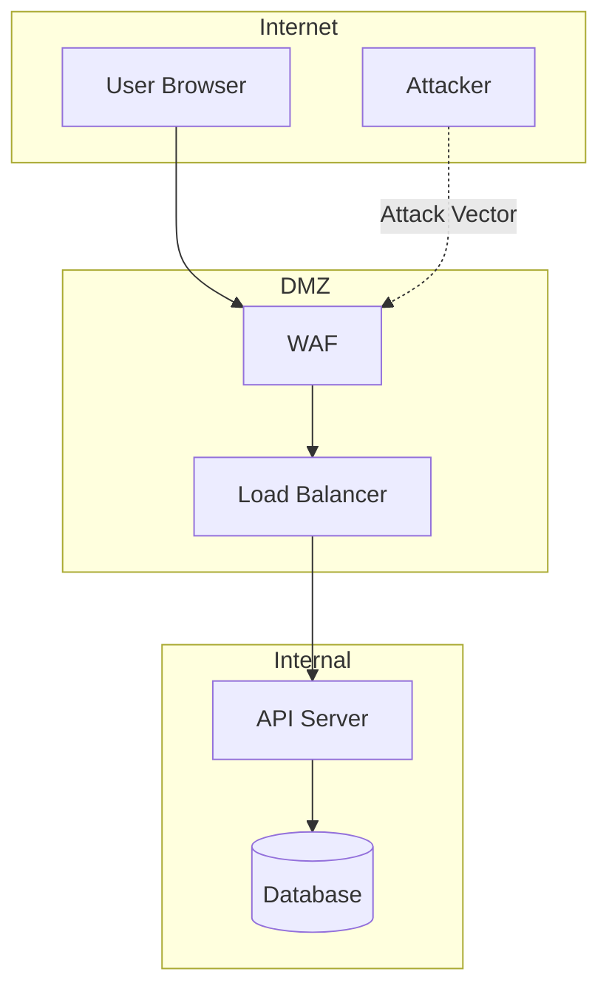
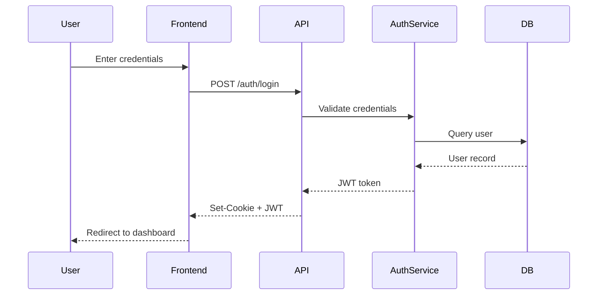
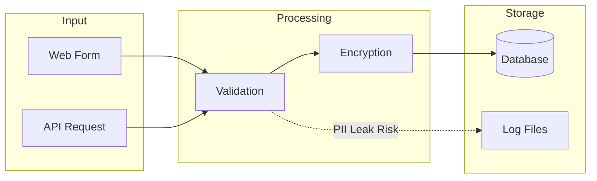
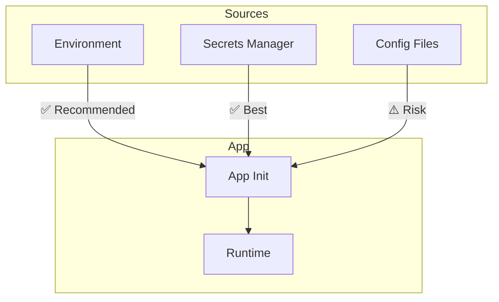
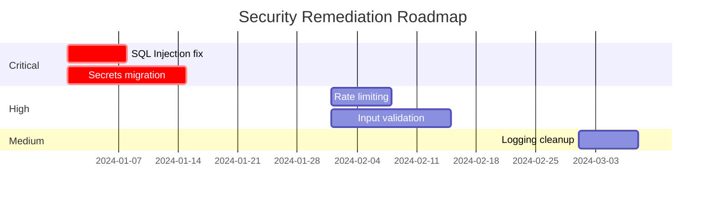

# Security Analysis Skill Spec

Comprehensive security posture assessment with dual output formats.

---

## Overview

| Aspect | Description |
|--------|-------------|
| **Location** | `skills/optional/security-analysis/` |
| **Purpose** | Analyze codebase security posture, identify vulnerabilities, map attack surface |
| **Outputs** | Human-readable report + standards-based compliance report |

---

## Output Structure

```
{docs-directory}/
└── security-docs/
    ├── index.md                              # Main entry point
    ├── analysis/                             # Human-readable reports
    │   ├── 01-security-surface.md            # Attack surface mapping
    │   ├── 02-authentication.md              # Auth mechanisms analysis
    │   ├── 03-authorization.md               # Access control analysis
    │   ├── 04-data-protection.md             # PII and sensitive data handling
    │   ├── 05-input-validation.md            # Input/output sanitization
    │   ├── 06-secrets-management.md          # Credentials and secrets
    │   └── 07-findings-summary.md            # Prioritized findings
    └── compliance/                           # Standards-based reports
        └── {selected-framework}.md           # OWASP/NIST/CIS/ISO report
```

---

## Dual Output Format

### Output 1: Human-Readable Analysis

Detailed, narrative reports with:
- Architecture diagrams (security-focused views)
- Sequence diagrams for auth/data flows
- Threat modeling visuals
- Code snippets showing vulnerabilities
- Remediation guidance with examples

**Not constrained by any spec** - focuses on clarity and actionability.

### Output 2: Standards-Based Compliance Report

Structured report following selected framework:

| Framework | Structure | Best For |
|-----------|-----------|----------|
| **OWASP ASVS** | Verification requirements by level (L1/L2/L3) | Web/API security audits |
| **NIST CSF** | Identify/Protect/Detect/Respond/Recover | Enterprise risk management |
| **CIS Controls** | Prioritized safeguards (IG1/IG2/IG3) | Implementation roadmap |
| **ISO 27001** | Annex A controls mapping | Compliance certification |

---

## Setup Phase (Phase 0)

### 0.1 Ask for Documentation Directory

```
Where should I create the security documentation?

Please provide a path to your documentation directory (e.g., ./docs).
I will create a `security-docs` folder inside it with all analysis results.
```

### 0.2 Select Compliance Framework

```
Which security framework(s) should I use for the compliance report?

Select one or more:
☐ OWASP ASVS - Application Security Verification Standard
☐ NIST CSF - Cybersecurity Framework (Identify/Protect/Detect/Respond/Recover)
☐ CIS Controls - Center for Internet Security prioritized controls
☐ ISO 27001 - Information security management (Annex A controls)

Default: OWASP ASVS (most applicable for application security)
```

**Multi-select allowed** - generates separate compliance report per framework.

### 0.3 Select Diagram Format

Same as arch-analysis: Mermaid (default), ASCII, or PlantUML.

---

## Analysis Phases

### Phase 1: Security Surface Analysis

**Goal**: Map the attack surface.

#### 1.1 Entry Points Inventory

| Entry Point | Type | Auth Required | Validation | Risk |
|-------------|------|---------------|------------|------|
| `POST /api/login` | REST API | No | Partial | Medium |
| `WebSocket /ws` | WebSocket | Yes (JWT) | None | High |

#### 1.2 Network Boundaries



#### 1.3 Exposed Functionality Matrix

| Function | Public | Authenticated | Admin | Notes |
|----------|--------|---------------|-------|-------|
| User registration | ✅ | - | - | Rate limited? |
| View own profile | - | ✅ | - | |
| View all users | - | - | ✅ | IDOR risk if misconfigured |

**Output**: `analysis/01-security-surface.md`

---

### Phase 2: Authentication Analysis

**Goal**: Assess authentication mechanisms.

#### 2.1 Auth Mechanism Inventory

| Mechanism | Where Used | Strength | Issues |
|-----------|------------|----------|--------|
| JWT | API | Good | No refresh rotation |
| Session cookie | Web | Medium | HttpOnly not set |
| API Key | External | Weak | No expiration |

#### 2.2 Authentication Flow Diagram



#### 2.3 Auth Security Checklist

- [ ] Password hashing algorithm (bcrypt/argon2/scrypt)
- [ ] Password complexity requirements
- [ ] Brute force protection
- [ ] Account lockout policy
- [ ] MFA support
- [ ] Session timeout
- [ ] Token expiration
- [ ] Secure token storage

**Output**: `analysis/02-authentication.md`

---

### Phase 3: Authorization Analysis

**Goal**: Assess access control model.

#### 3.1 Authorization Model

| Model | Description | Evidence |
|-------|-------------|----------|
| RBAC | Role-Based Access Control | `user.role` checks |
| ABAC | Attribute-Based | `user.department === resource.department` |
| ACL | Access Control Lists | `resource.permissions.includes(user.id)` |

#### 3.2 Role/Permission Matrix

| Role | Create | Read | Update | Delete | Admin |
|------|--------|------|--------|--------|-------|
| Guest | - | Limited | - | - | - |
| User | Own | Own | Own | Own | - |
| Admin | All | All | All | All | ✅ |

#### 3.3 Privilege Escalation Risks

| Risk | Location | Severity | Description |
|------|----------|----------|-------------|
| IDOR | `/api/users/:id` | High | No ownership check |
| Missing auth | `/admin/debug` | Critical | No role verification |

**Output**: `analysis/03-authorization.md`

---

### Phase 4: Data Protection Analysis

**Goal**: Trace sensitive data handling.

#### 4.1 PII Inventory

| Field | Entity | Classification | Encrypted | Logged | Retention |
|-------|--------|----------------|-----------|--------|-----------|
| email | User | PII | No | Yes ⚠️ | Forever |
| ssn | Profile | Sensitive PII | Yes | No | 7 years |
| password | User | Secret | Hashed | No | N/A |

#### 4.2 Data Flow (PII Focus)



#### 4.3 Encryption Assessment

| Data State | Method | Strength | Notes |
|------------|--------|----------|-------|
| At Rest | AES-256 | Strong | DB-level encryption |
| In Transit | TLS 1.3 | Strong | HSTS enabled |
| In Memory | None | Weak | Consider secure enclaves |

**Output**: `analysis/04-data-protection.md`

---

### Phase 5: Input Validation Analysis

**Goal**: Assess input/output handling.

#### 5.1 Validation Patterns

| Input Type | Validation | Sanitization | Risk |
|------------|------------|--------------|------|
| User input | Schema validation | HTML escape | XSS possible |
| File upload | Extension only | None | Path traversal risk |
| SQL params | Parameterized | N/A | Safe |

#### 5.2 Injection Risks

| Type | Location | Evidence | Severity |
|------|----------|----------|----------|
| SQL Injection | `search.js:42` | String concatenation | Critical |
| XSS | `profile.js:18` | `innerHTML` usage | High |
| Command Injection | `export.js:55` | `exec()` with user input | Critical |

#### 5.3 Output Encoding

| Context | Encoding | Implemented |
|---------|----------|-------------|
| HTML body | HTML entity | ✅ |
| HTML attribute | Attribute encoding | ❌ |
| JavaScript | JS encoding | ❌ |
| URL | URL encoding | ✅ |

**Output**: `analysis/05-input-validation.md`

---

### Phase 6: Secrets Management Analysis

**Goal**: Assess credential handling.

#### 6.1 Secrets Inventory

| Secret Type | Storage | Rotation | Risk |
|-------------|---------|----------|------|
| DB password | Environment var | Never | Medium |
| API keys | Config file | Never | High (in git?) |
| JWT secret | Hardcoded | Never | Critical |

#### 6.2 Hardcoded Secrets Scan

| File | Line | Type | Severity |
|------|------|------|----------|
| `config.js:15` | API key | Third-party | High |
| `auth.js:8` | JWT secret | Auth | Critical |

#### 6.3 Secrets Flow



**Output**: `analysis/06-secrets-management.md`

---

### Phase 7: Findings Summary

**Goal**: Prioritized actionable findings.

#### 7.1 Executive Summary

```markdown
## Security Posture: [Grade: A/B/C/D/F]

### Critical Findings: X
### High Findings: X
### Medium Findings: X
### Low Findings: X

### Top 3 Immediate Actions
1. [Most critical finding with remediation]
2. [Second most critical]
3. [Third most critical]
```

#### 7.2 Findings Table

| ID | Finding | Severity | CVSS | Location | Remediation |
|----|---------|----------|------|----------|-------------|
| SEC-001 | SQL Injection | Critical | 9.8 | `search.js:42` | Use parameterized queries |
| SEC-002 | Hardcoded JWT secret | Critical | 9.1 | `auth.js:8` | Move to env/vault |
| SEC-003 | Missing rate limiting | High | 7.5 | `/api/login` | Add rate limiter |

#### 7.3 Remediation Roadmap



**Output**: `analysis/07-findings-summary.md`

---

## Compliance Report Templates

### OWASP ASVS Report Structure

```markdown
# OWASP ASVS Compliance Report

**Project**: {Name}
**ASVS Version**: 4.0.3
**Target Level**: L1 / L2 / L3
**Assessment Date**: {Date}

---

## Summary

| Category | L1 | L2 | L3 |
|----------|----|----|-----|
| V1: Architecture | X/Y | X/Y | X/Y |
| V2: Authentication | X/Y | X/Y | X/Y |
| V3: Session Management | X/Y | X/Y | X/Y |
| ...

---

## V1: Architecture, Design and Threat Modeling

### V1.1 Secure Software Development Lifecycle

| # | Requirement | L1 | L2 | L3 | Status | Evidence |
|---|-------------|----|----|-----|--------|----------|
| 1.1.1 | Verify use of secure SDLC | | ✓ | ✓ | ❌ | No documented SDLC |
| 1.1.2 | Verify use of threat modeling | | ✓ | ✓ | ❌ | No threat model found |

{Continue for all ASVS sections}
```

### NIST CSF Report Structure

```markdown
# NIST Cybersecurity Framework Assessment

**Project**: {Name}
**CSF Version**: 2.0
**Assessment Date**: {Date}

---

## Summary by Function

| Function | Categories | Implemented | Partial | Not Implemented |
|----------|------------|-------------|---------|-----------------|
| IDENTIFY | 6 | X | X | X |
| PROTECT | 6 | X | X | X |
| DETECT | 3 | X | X | X |
| RESPOND | 4 | X | X | X |
| RECOVER | 3 | X | X | X |

---

## IDENTIFY (ID)

### ID.AM - Asset Management

| Subcategory | Description | Status | Evidence | Gap |
|-------------|-------------|--------|----------|-----|
| ID.AM-1 | Physical devices inventoried | N/A | Application scope | - |
| ID.AM-2 | Software platforms inventoried | ✅ | package.json, requirements.txt | - |

{Continue for all CSF categories}
```

### CIS Controls Report Structure

```markdown
# CIS Controls Assessment

**Project**: {Name}
**CIS Version**: 8.0
**Implementation Group**: IG1 / IG2 / IG3
**Assessment Date**: {Date}

---

## Summary by Control

| Control | Safeguards | IG1 | IG2 | IG3 | Status |
|---------|------------|-----|-----|-----|--------|
| 1: Enterprise Assets | 5 | 2 | 4 | 5 | Partial |
| 2: Software Assets | 7 | 2 | 5 | 7 | Partial |
| 3: Data Protection | 14 | 4 | 10 | 14 | Low |
...

---

## Control 1: Inventory and Control of Enterprise Assets

### Applicable Safeguards (Application Scope)

| # | Safeguard | IG | Status | Evidence |
|---|-----------|-----|--------|----------|
| 1.1 | Establish asset inventory | IG1 | ✅ | Infrastructure as code |
| 1.2 | Address unauthorized assets | IG1 | ⚠️ | No automated detection |

{Continue for all applicable controls}
```

### ISO 27001 Report Structure

```markdown
# ISO 27001 Annex A Controls Assessment

**Project**: {Name}
**ISO Version**: 2022
**Assessment Date**: {Date}

---

## Summary by Domain

| Domain | Controls | Implemented | Partial | Not Applicable | Gap |
|--------|----------|-------------|---------|----------------|-----|
| A.5 Organizational | 37 | X | X | X | X |
| A.6 People | 8 | X | X | X | X |
| A.7 Physical | 14 | X | X | X | X |
| A.8 Technological | 34 | X | X | X | X |

---

## A.8 Technological Controls

### A.8.1 User Endpoint Devices

| Control | Requirement | Status | Evidence | Gap |
|---------|-------------|--------|----------|-----|
| A.8.1 | Security of endpoint devices | N/A | Server-side application | - |

### A.8.2 Privileged Access Rights

| Control | Requirement | Status | Evidence | Gap |
|---------|-------------|--------|----------|-----|
| A.8.2 | Restrict privileged access | ⚠️ | RBAC implemented, no PAM | Review admin access |

{Continue for all applicable controls}
```

---

## Skill Files

### README.md

- Purpose and scope
- Dual output explanation
- Framework descriptions
- Invocation patterns
- Integration with arch-analysis

### workflows.md

- Phase 0: Setup (directory, framework selection, diagram format)
- Phase 1-7: Analysis phases
- Output compilation
- Compliance report generation

### templates.md

- Human-readable report templates (all 7 analysis files)
- OWASP ASVS template
- NIST CSF template
- CIS Controls template
- ISO 27001 template
- Index template

### checklist.md

- Setup checklist
- Per-phase completion checklist
- Finding severity classification guide
- Compliance mapping checklist

### examples.md

- Sample findings for common vulnerabilities
- Example compliance mappings
- Before/after remediation examples

---

## Integration

### With arch-analysis

```
arch-analysis (baseline understanding)
    ↓
security-analysis (security deep-dive)
    ↓
Combined view of architecture + security
```

Security analysis can reference arch-analysis outputs for:
- Technology manifest (known CVEs for versions)
- Interface specification (API security assessment)
- Data flow (PII tracing baseline)

### Invocation Patterns

```
"Analyze security of this codebase"
"Run security assessment"
"Generate OWASP ASVS report"
"Check for security vulnerabilities"
"Map the attack surface"
"Assess authentication security"
```

---

## Implementation Plan

### Phase 1: Core Skill Structure
- [ ] Create skill directory
- [ ] README.md with concepts
- [ ] workflows.md with all phases
- [ ] templates.md with report templates

### Phase 2: Compliance Templates
- [ ] OWASP ASVS template (priority - most applicable)
- [ ] NIST CSF template
- [ ] CIS Controls template
- [ ] ISO 27001 template

### Phase 3: Polish
- [ ] checklist.md
- [ ] examples.md
- [ ] Integration with arch-analysis documented
