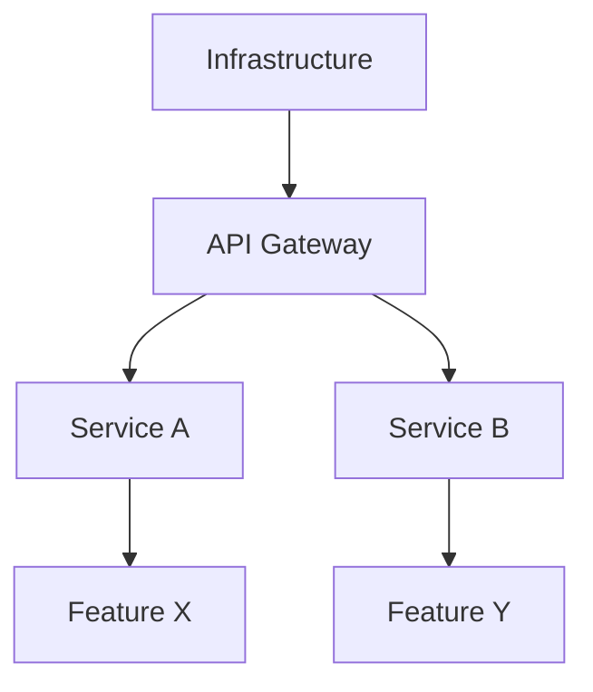

# Roadmap Skills Specification

Comprehensive specification for roadmap building and analysis capabilities.

---

## Overview

Two interconnected skills for architecture roadmap management:

| Skill | Purpose | Location |
|-------|---------|----------|
| **roadmap-building** | Generate implementation roadmaps from architecture | `skills/optional/roadmap-building/` |
| **roadmap-analysis** | Deep-dive analysis and planning for roadmap items | `skills/optional/roadmap-analysis/` |

**Relationship to TOGAF**:
- Phase E (Opportunities & Solutions): Gap consolidation, solution identification
- Phase F (Migration Planning): Implementation roadmap, project charters
- These skills **extend and complement** TOGAF with deeper technical detail

---

## Skill 1: Roadmap Building

### Purpose

Generate comprehensive implementation roadmaps from architectural artifacts with technical depth and decision context.

### Input Sources

#### Option A: Architecture Synthesis + Target Architecture

```
architecture-synthesis/
├── synthesized-model.json      # Parsed from diagrams/specs
├── requirements/
│   ├── functional.md
│   └── non-functional.md
└── constraints.md

+ 

core-architecture/target/
├── business-architecture.md
├── data-architecture.md
├── application-architecture.md
└── technology-architecture.md

+ 

core-architecture/gap-analysis/
└── consolidated-gaps.md
```

#### Option B: TOGAF Phase E/F Outputs

```
togaf/phase-e/
└── opportunities-solutions.md

+ 

core-architecture/gap-analysis/
└── consolidated-gaps.md
```

#### Option C: Standalone Roadmap Request

User provides:
- High-level goals
- Current state description
- Target state vision
- Constraints and preferences

Agent synthesizes architecture first, then builds roadmap.

### Output Structure

```
roadmaps/
├── master-roadmap.md                    # Executive overview
├── detailed-roadmap.md                  # Full technical roadmap
├── roadmap-metadata.json                # Machine-readable metadata
├── phases/
│   ├── phase-1-foundation.md
│   ├── phase-2-migration.md
│   └── phase-3-optimization.md
├── initiatives/
│   ├── initiative-001-api-gateway.md
│   ├── initiative-002-data-platform.md
│   └── initiative-003-monitoring.md
├── dependencies/
│   ├── dependency-graph.mmd             # Mermaid dependency diagram
│   └── critical-path.md
├── risks/
│   ├── risk-register.md
│   └── mitigation-strategies.md
└── decisions/
    ├── adr-001-technology-stack.md      # Architecture Decision Records
    ├── adr-002-deployment-strategy.md
    └── adr-003-data-migration-approach.md
```

### Roadmap Content

Each roadmap includes:

#### 1. Strategic Context
- Business drivers
- Architecture vision alignment
- Success criteria
- Constraints and assumptions

#### 2. Technical Foundation
- **Architecture Decisions**: Technology choices with rationale
- **Software Design Patterns**: Applied patterns and principles
- **Integration Approaches**: API strategies, event-driven, batch
- **Data Strategies**: Migration, synchronization, governance

#### 3. Implementation Phases

```
Phase 1: Foundation (Q1 2026)
├── Initiatives
│   ├── Initiative 1.1: API Gateway Setup
│   │   ├── Technical Approach: Kong Gateway with declarative config
│   │   ├── Architecture Decision: ADR-001 (API Gateway selection)
│   │   ├── Design Pattern: API Gateway, BFF (Backend for Frontend)
│   │   ├── Dependencies: Infrastructure setup, TLS certificates
│   │   ├── Complexity: Medium (6 weeks)
│   │   └── Risks: Team learning curve, legacy integration
│   └── Initiative 1.2: Core Service Refactoring
│       ├── Technical Approach: Strangler Fig pattern
│       ├── Architecture Decision: ADR-002 (Microservices transition)
│       ├── Design Pattern: Strangler Fig, Repository
│       ├── Dependencies: API Gateway (1.1), monitoring
│       ├── Complexity: High (12 weeks)
│       └── Risks: Data consistency, rollback strategy
├── Success Criteria
│   ├── API Gateway operational with 99.9% uptime
│   ├── 3 core services migrated and tested
│   └── Monitoring dashboard operational
└── Phase Exit Criteria
    ├── All dependencies resolved
    ├── Integration tests passing
    └── Stakeholder sign-off
```

#### 4. Initiative Detail

Each initiative includes:
- **Business Value**: ROI, KPIs, user impact
- **Technical Approach**: Detailed implementation strategy
- **Architecture Decisions**: References to ADRs
- **Design Patterns**: Applied patterns with justification
- **Technology Stack**: Specific tools and versions
- **Complexity Analysis**: 
  - Estimated effort (story points or time)
  - Required skills
  - Technical risks
  - Integration points
- **Dependencies**: Prerequisites and blockers
- **Testing Strategy**: Unit, integration, E2E, performance
- **Rollout Plan**: Deployment approach, rollback strategy
- **Monitoring**: Metrics, alerts, dashboards

#### 5. Dependency Management

```
┌──────────────────────────────────────────────────────────┐
│              DEPENDENCY GRAPH                             │
├──────────────────────────────────────────────────────────┤
│                                                          │
│  Infrastructure                                          │
│      │                                                   │
│      ├──> API Gateway (1.1)                             │
│      │        │                                          │
│      │        ├──> Core Service A (1.2)                 │
│      │        │        │                                 │
│      │        │        └──> Feature X (2.1)             │
│      │        │                                          │
│      │        └──> Core Service B (1.3)                 │
│      │                 │                                 │
│      │                 └──> Feature Y (2.2)             │
│      │                                                   │
│      └──> Data Platform (1.4)                           │
│               │                                          │
│               ├──> Analytics (2.3)                      │
│               └──> ML Pipeline (3.1)                    │
│                                                          │
│  CRITICAL PATH: Infrastructure → API Gateway →          │
│                 Core Service A → Feature X              │
│  BOTTLENECKS: Data Platform (affects 3 initiatives)    │
│                                                          │
└──────────────────────────────────────────────────────────┘
```

#### 6. Risk Management

```
┌──────────────────────────────────────────────────────────┐
│                     RISK REGISTER                         │
├──────────────────────────────────────────────────────────┤
│                                                          │
│  Risk ID: R-001                                          │
│  Initiative: API Gateway Setup (1.1)                     │
│  Description: Team lacks Kong Gateway experience         │
│  Impact: High (delays Phase 1)                          │
│  Probability: Medium                                     │
│  Mitigation:                                             │
│    - Immediate: Kong training for 2 senior engineers    │
│    - Ongoing: Weekly knowledge sharing sessions          │
│    - Backup: Engage Kong consulting for 2 weeks         │
│  Contingency: Fallback to NGINX if >4 week delay        │
│  Owner: Technical Lead                                   │
│  Status: Active                                          │
│                                                          │
└──────────────────────────────────────────────────────────┘
```

#### 7. Architecture Decision Records

Each significant decision documented:

```markdown
# ADR-001: API Gateway Selection

## Status
Accepted

## Context
Need centralized API management for microservices architecture.
Requirements: rate limiting, authentication, observability, config-as-code.

## Options Considered
1. Kong Gateway (Open Source)
2. AWS API Gateway
3. NGINX Plus
4. Apigee

## Decision
Kong Gateway (Open Source) with declarative configuration.

## Rationale
- **Flexibility**: Supports hybrid cloud deployment
- **Cost**: No per-request pricing
- **Extensibility**: Plugin ecosystem
- **Operability**: Declarative config via YAML
- **Performance**: Benchmarks show 20K+ req/s
- **Community**: Active development, good documentation

## Consequences
**Positive**:
- Full control over infrastructure
- No vendor lock-in
- Cost-effective at scale

**Negative**:
- Team learning curve (2-3 weeks)
- Requires operational expertise
- Plugin compatibility management

## Implementation Notes
- Use Kong 3.x with DB-less mode
- Declarative config in Git
- Prometheus + Grafana for monitoring
- Blue-green deployment strategy

## Related Decisions
- ADR-002: Microservices transition approach
- ADR-004: Deployment platform selection
```

### Workflow Overview

```
┌─────────────────────────────────────────────────────────────┐
│                  ROADMAP BUILDING WORKFLOW                   │
├─────────────────────────────────────────────────────────────┤
│                                                             │
│  Phase 1: Input Analysis (5-10 min)                        │
│  ├─ Read architecture artifacts                             │
│  ├─ Identify gaps and opportunities                         │
│  ├─ Extract technical requirements                          │
│  └─ Validate constraints                                    │
│                                                             │
│  Phase 2: Initiative Identification (10-15 min)            │
│  ├─ Group gaps into logical initiatives                     │
│  ├─ Define initiative scope and objectives                  │
│  ├─ Estimate complexity and effort                          │
│  └─ Identify dependencies between initiatives               │
│                                                             │
│  Phase 3: Technical Planning (15-25 min)                   │
│  ├─ Research technology options                             │
│  ├─ Create Architecture Decision Records                    │
│  ├─ Apply software design patterns                          │
│  ├─ Define technical approaches                             │
│  └─ Document integration strategies                         │
│                                                             │
│  Phase 4: Sequencing & Dependencies (10-15 min)           │
│  ├─ Build dependency graph                                  │
│  ├─ Identify critical path                                  │
│  ├─ Define phase boundaries                                 │
│  ├─ Balance parallelization vs dependencies                 │
│  └─ Optimize for business value delivery                    │
│                                                             │
│  Phase 5: Risk Assessment (10-15 min)                      │
│  ├─ Identify technical risks                                │
│  ├─ Assess organizational risks                             │
│  ├─ Define mitigation strategies                            │
│  ├─ Create contingency plans                                │
│  └─ Assign risk owners                                      │
│                                                             │
│  Phase 6: Documentation (15-20 min)                        │
│  ├─ Generate master roadmap                                 │
│  ├─ Create detailed initiative documents                    │
│  ├─ Build dependency diagrams                               │
│  ├─ Compile ADRs                                            │
│  └─ Generate metadata                                       │
│                                                             │
│  Total: ~1-2 hours for comprehensive roadmap               │
│                                                             │
└─────────────────────────────────────────────────────────────┘
```

### Integration Points

**Reads From**:
- `skills/optional/architecture-synthesis/` - Synthesized architecture
- `skills/optional/analysis-outputs/core-architecture/` - Target and gap analysis
- `skills/optional/togaf/opportunities-solutions/` - Phase E outputs
- `skills/optional/togaf/migration-planning/` - Phase F templates
- `skills/optional/software-design/` - Design patterns library
- `skills/optional/tech-stack-decisions/` - Technology evaluation frameworks

**Writes To**:
- `roadmaps/` - Primary output directory
- Can export to: core-architecture/evolution-plan/
- Can export to: togaf/phase-f/implementation-plan/

**Invocation Patterns**:
```
"Build implementation roadmap"
"Generate roadmap from target architecture"
"Create technical roadmap from gaps"
"Build roadmap with ADRs"
"Generate migration roadmap"
```

**TOGAF Phase Integration**:

TOGAF phases can invoke roadmap-building skill as part of their workflow:

```
Phase E (Opportunities & Solutions):
  ├─ Consolidate gaps from B/C/D
  ├─ Identify solution alternatives
  └─> INVOKE: "Build preliminary roadmap from consolidated gaps"
      Output: High-level roadmap with solution building blocks

Phase F (Migration Planning):
  ├─ Define transition architectures
  ├─ Assess implementation dependencies
  └─> INVOKE: "Build detailed migration roadmap with ADRs"
      Output: Complete roadmap with technical depth
      └─> OPTIONAL: "Export roadmap to PDF for stakeholders"

Phase G (Implementation Governance):
  ├─ Monitor implementation progress
  ├─ Assess architecture compliance
  └─> INVOKE: "Analyze roadmap complexity and progress"
      Use: roadmap-analysis skill for tracking
```

**Workflow: TOGAF Phase F with Roadmap Building**

```
User: "Apply TOGAF Phase F: Migration Planning"

Agent:
  1. Read Phase E outputs (opportunities-solutions.md)
  2. Read gap analysis (consolidated-gaps.md)
  3. Execute Phase F workflow:
     ├─ Define transition architectures
     ├─ Assess dependencies
     └─ Create Implementation Plan
         └─> INVOKE roadmap-building skill:
             "Build migration roadmap from Phase E outputs"
  4. Generate Phase F deliverables:
     ├─ togaf/phase-f/implementation-plan.md (standard)
     └─> ENHANCED: roadmaps/master-roadmap.md (detailed)
  5. OFFER: "Would you like to:
              - Export roadmap to PDF?
              - Expand specific initiatives?
              - Analyze complexity?"
```

---

## Skill 2: Roadmap Analysis

### Purpose

Deep-dive analysis and expansion of roadmap items, research insertion, and complexity assessment.

### Input Sources

#### Option A: Generated Roadmap

```
roadmaps/
├── master-roadmap.md
└── initiatives/
    ├── initiative-001.md
    └── initiative-002.md
```

#### Option B: External Roadmap

User provides roadmap in any format:
- Markdown files
- JIRA/Linear export
- Gantt charts (Project, Smartsheet)
- Spreadsheets
- Text descriptions

Agent parses and structures.

### Output Structure

```
roadmaps/
├── analysis/
│   ├── expanded-roadmap.md              # Detailed expansion
│   ├── complexity-analysis.md           # Overall assessment
│   ├── research/
│   │   ├── research-001-api-gateway.md
│   │   ├── research-002-data-sync.md
│   │   └── research-003-monitoring.md
│   ├── plans/
│   │   ├── plan-001-api-gateway-setup.md
│   │   ├── plan-002-service-migration.md
│   │   └── plan-003-testing-strategy.md
│   ├── spikes/
│   │   ├── spike-001-kong-performance.md
│   │   └── spike-002-data-migration-poc.md
│   └── metrics/
│       ├── complexity-metrics.json
│       └── effort-estimation.md
├── pdf/                                 # PDF exports
│   ├── master-roadmap.pdf               # Executive-friendly
│   ├── detailed-roadmap.pdf             # Complete technical
│   ├── complexity-analysis.pdf          # Analysis report
│   └── initiatives/
│       ├── initiative-001.pdf
│       └── initiative-002.pdf
└── team-planning/                       # Staffing and hiring plan
    ├── team-composition.md              # Required roles and team sizes
    ├── expertise-requirements.md        # Skills and experience levels
    ├── hiring-plan.md                   # Recruitment timeline
    └── ai-augmentation-strategy.md      # AI coding agent recommendations
```

### Capabilities

#### 1. Initiative Expansion

Take high-level initiative and expand into detailed plan:

**Input**:
```markdown
## Initiative 1.1: API Gateway Setup
- Deploy Kong Gateway
- Configure authentication
- Set up monitoring
```

**Output**:
```markdown
## Initiative 1.1: API Gateway Setup (EXPANDED)

### Overview
Deploy Kong Gateway as centralized API management platform for microservices.

### Prerequisites
- [ ] Kubernetes cluster operational (minimum 3 nodes, 16GB RAM each)
- [ ] TLS certificates provisioned (Let's Encrypt or internal CA)
- [ ] PostgreSQL database for Kong (if using DB mode)
- [ ] Prometheus and Grafana installed for monitoring

### Detailed Steps

#### Step 1: Environment Setup (Week 1)
1. **Create Kubernetes namespace**:
   ```bash
   kubectl create namespace kong-system
   ```

2. **Install Kong via Helm**:
   ```bash
   helm repo add kong https://charts.konghq.com
   helm install kong kong/kong \
     --namespace kong-system \
     --set ingressController.installCRDs=false \
     --set env.database=off
   ```

3. **Verify installation**:
   ```bash
   kubectl get pods -n kong-system
   kubectl get service -n kong-system kong-proxy
   ```

#### Step 2: Authentication Configuration (Week 1-2)
1. **Install Auth plugins**:
   - Key Authentication for service-to-service
   - JWT for user authentication
   - OAuth2 for third-party integrations

2. **Configure consumers**:
   ```yaml
   apiVersion: configuration.konghq.com/v1
   kind: KongConsumer
   metadata:
     name: service-a
   username: service-a
   credentials:
   - key-auth-credential
   ```

3. **Test authentication**:
   - Unit tests for credential validation
   - Integration tests for auth flows
   - Load tests for auth performance

#### Step 3: Monitoring Integration (Week 2)
1. **Enable Prometheus plugin**:
   ```yaml
   apiVersion: configuration.konghq.com/v1
   kind: KongPlugin
   metadata:
     name: prometheus
   plugin: prometheus
   ```

2. **Create Grafana dashboards**:
   - Request rate per service
   - Error rate and status codes
   - Latency percentiles (p50, p95, p99)
   - Plugin execution times

3. **Configure alerts**:
   - High error rate (>1% for 5 minutes)
   - High latency (p95 > 500ms)
   - Gateway unavailability

### Technical Research Required
- [ ] **Research 001**: Kong performance benchmarks (see research-001-api-gateway.md)
- [ ] **Research 002**: Plugin compatibility matrix
- [ ] **Research 003**: Blue-green deployment strategy

### Complexity Analysis
- **Technical Complexity**: Medium
  - Kubernetes operational knowledge required
  - Plugin system learning curve
  - Declarative config management
- **Estimated Effort**: 6 weeks (2 senior engineers, 25% time)
- **Risk Level**: Medium
  - Team learning curve
  - Legacy system integration unknowns

### Success Criteria
- [ ] API Gateway operational with 99.9% uptime
- [ ] Authentication working for all services
- [ ] Monitoring dashboards populated
- [ ] Load tests passed (>10K req/s, p95 <200ms)
- [ ] Documentation complete

### Dependencies
- **Blockers**: Kubernetes cluster must be operational
- **Prerequisites**: TLS certificates, monitoring infrastructure
- **Downstream**: All microservices depend on this

### Risks and Mitigations
See risk register: R-001 (team expertise), R-002 (integration complexity)
```

#### 2. Research Insertion

For each initiative, identify and document research needs:

```markdown
# Research 001: Kong API Gateway Performance Benchmarks

## Research Question
Can Kong Gateway handle our projected load of 50K req/s with <200ms p95 latency?

## Scope
- Benchmark Kong in our infrastructure setup
- Test with realistic payload sizes (1KB-10KB)
- Evaluate plugin performance impact
- Compare DB vs DB-less mode

## Methodology
1. **Environment Setup**:
   - 3-node Kubernetes cluster (same as production)
   - Kong 3.x with declarative config
   - Apache Bench and k6 for load testing

2. **Test Scenarios**:
   - Baseline: No plugins, simple proxy
   - Auth: Key authentication enabled
   - Full: Auth + rate limiting + prometheus
   - Peak: 150% of projected load

3. **Metrics**:
   - Throughput (req/s)
   - Latency distribution (p50, p95, p99)
   - Error rate
   - Resource utilization (CPU, memory)

## Timeline
- Setup: 2 days
- Testing: 3 days
- Analysis: 1 day
- Documentation: 1 day
- **Total**: 1 week

## Resources Required
- 1 senior engineer
- Kubernetes cluster (non-production)
- Load testing tools

## Expected Outcome
Benchmark report with recommendations:
- Can we meet performance requirements?
- Optimal configuration settings
- Identified bottlenecks
- Resource sizing recommendations

## Decision Impact
- If successful: Proceed with Kong
- If performance insufficient: Evaluate alternatives (ADR-001 updated)
- If marginal: Consider architecture changes (caching, batching)

## Risks
- Non-production environment may not reflect production accurately
- Synthetic load tests may miss real-world patterns

## Related Initiatives
- Initiative 1.1: API Gateway Setup
- Initiative 2.1: Service migration (depends on gateway performance)
```

#### 3. Technical Spike Planning

Identify and plan technical spikes for unknowns:

```markdown
# Spike 001: Kong Gateway Performance Validation

## Spike Goal
Prove that Kong Gateway can handle our performance requirements in our infrastructure.

## Time Box
1 week (5 business days)

## Success Criteria
- [ ] Baseline benchmark: >20K req/s, p95 <200ms
- [ ] With auth: >15K req/s, p95 <300ms
- [ ] Resource usage documented
- [ ] Recommendation: Go/No-Go decision

## Tasks
1. Set up Kong in staging environment
2. Configure load testing tools
3. Run benchmark scenarios
4. Analyze results
5. Document findings

## Output
- Benchmark report (PDF/Markdown)
- Load test scripts (Git repository)
- Recommendation with confidence level

## Team
- 1 senior engineer (full-time)
- 1 DevOps engineer (25% time for infrastructure)

## Exit Criteria
- All benchmarks completed
- Decision documented
- Findings shared with team
```

#### 4. Complexity Analysis

Assess overall roadmap complexity:

```markdown
# Roadmap Complexity Analysis

## Executive Summary
Overall complexity: **High** (8/10)
Estimated timeline: 18-24 months
Risk level: Medium-High

## Initiative Complexity Breakdown

| Initiative | Complexity | Effort | Risk | Confidence |
|------------|-----------|--------|------|------------|
| 1.1 API Gateway | Medium | 6 weeks | Medium | 70% |
| 1.2 Service A Migration | High | 12 weeks | High | 60% |
| 1.3 Service B Migration | High | 10 weeks | High | 65% |
| 1.4 Data Platform | Very High | 16 weeks | High | 50% |
| 2.1 Feature X | Medium | 8 weeks | Low | 80% |

## Complexity Factors

### Technical Complexity
- **Architecture Changes**: Major (microservices transition)
- **Integration Points**: 15+ systems
- **Data Migration**: Complex (10TB, zero-downtime required)
- **New Technologies**: 4 new platforms (Kong, Kafka, Airflow, Kubernetes)

### Organizational Complexity
- **Team Skills Gap**: Moderate (training required)
- **Stakeholder Coordination**: High (5 departments involved)
- **Change Management**: High (affects 200+ users)

### Risk Complexity
- **Technical Risks**: 8 identified (4 high-impact)
- **Business Risks**: 5 identified (2 high-impact)
- **Dependency Risks**: Critical path has 3 bottlenecks

## Critical Path Analysis

```
Longest path: 42 weeks
  Infrastructure (2w) →
  API Gateway (6w) →
  Core Service A (12w) →
  Data Platform (16w) →
  Analytics (6w)
```

## Bottleneck Analysis

### Bottleneck 1: Data Platform (Initiative 1.4)
- **Impact**: Blocks 3 downstream initiatives
- **Risk**: High complexity, low confidence
- **Mitigation**: Start early, allocate senior resources, plan for spikes

### Bottleneck 2: Team Capacity
- **Impact**: Only 2 senior engineers available
- **Risk**: Overallocation, burnout
- **Mitigation**: Hire contractor, reduce scope, extend timeline

## Confidence Assessment

| Phase | Confidence | Rationale |
|-------|-----------|-----------|
| Phase 1 | 70% | Some unknowns, manageable scope |
| Phase 2 | 60% | Depends on Phase 1 learnings |
| Phase 3 | 50% | Long-term, many dependencies |

## Recommendations

1. **Increase Research Budget**: Allocate 15% of timeline to spikes and research
2. **Phase 1 Focus**: Validate assumptions early with POCs
3. **Hire Expertise**: Bring in Kong/Kafka contractors for knowledge transfer
4. **Risk Mitigation**: Dedicate resources to top 3 risks
5. **Scope Management**: Prepare fallback plans for non-critical features

## Metrics for Success

- **On-Time Delivery**: Track against plan monthly
- **Quality**: <5% production incidents post-launch
- **Team Health**: Maintain <50 hour work weeks
- **Scope Stability**: <10% scope creep
```

#### 5. Effort Estimation

Provide detailed effort breakdowns:

```markdown
# Effort Estimation: API Gateway Setup (Initiative 1.1)

## Summary
- **Total Effort**: 240 hours (6 weeks @ 40 hours/week)
- **Team Size**: 2 engineers
- **Duration**: 6 calendar weeks (with buffer)

## Breakdown by Activity

### Environment Setup (40 hours)
| Task | Hours | Assignee |
|------|-------|----------|
| Kubernetes namespace and RBAC | 8 | DevOps |
| Helm chart configuration | 16 | Senior Eng |
| Testing infrastructure | 8 | Senior Eng |
| Documentation | 8 | Both |

### Authentication Configuration (80 hours)
| Task | Hours | Assignee |
|------|-------|----------|
| Research auth plugins | 16 | Senior Eng |
| Configure key auth | 24 | Senior Eng |
| Configure JWT | 24 | Senior Eng |
| Testing and validation | 16 | Both |

### Monitoring Integration (60 hours)
| Task | Hours | Assignee |
|------|-------|----------|
| Prometheus integration | 16 | DevOps |
| Grafana dashboards | 24 | DevOps |
| Alert configuration | 12 | DevOps |
| Testing and tuning | 8 | Both |

### Documentation & Training (40 hours)
| Task | Hours | Assignee |
|------|-------|----------|
| Architecture documentation | 12 | Senior Eng |
| Operational runbooks | 12 | DevOps |
| Team training sessions | 12 | Both |
| Knowledge transfer | 4 | Both |

### Testing & Quality (20 hours)
| Task | Hours | Assignee |
|------|-------|----------|
| Integration tests | 8 | Senior Eng |
| Load testing | 8 | Both |
| Security review | 4 | Security Team |

## Assumptions
- Kubernetes cluster already operational
- Team has basic Kubernetes knowledge
- No major infrastructure blockers
- Security review is non-blocking

## Risk Buffer
- **Base Estimate**: 240 hours
- **Risk Buffer (20%)**: 48 hours
- **Total with Buffer**: 288 hours (7.2 weeks)

## Confidence Level
**70%** - Medium-high confidence
- Team has Kubernetes experience ✓
- Kong is new technology ⚠️
- Integration complexity unknown ⚠️
```

#### 6. PDF Export

Convert roadmap documents to professional PDFs for stakeholder communication:

```markdown
# PDF Export: Roadmap Package

## Export Options

### Option A: Executive Package
**Content**:
- Master roadmap (high-level overview)
- Complexity analysis (summary)
- Risk register (critical items only)

**Format**: Single PDF, 10-15 pages
**Audience**: Executives, sponsors, steering committee

### Option B: Technical Package
**Content**:
- Detailed roadmap (all phases and initiatives)
- Architecture Decision Records
- Dependency graphs (Mermaid → PNG)
- Risk register (complete)
- Research and spike plans

**Format**: Single PDF, 50-100 pages
**Audience**: Technical leads, architects, senior engineers

### Option C: Initiative-Specific
**Content**:
- Individual initiative details
- Related ADRs
- Dependencies and risks
- Effort estimates

**Format**: Multiple PDFs (one per initiative)
**Audience**: Development teams, project managers

## Export Workflow

```
User: "Export roadmap to PDF"

Agent:
  1. Prompt for export type:
     "Which package would you like?
      A) Executive (10-15 pages)
      B) Technical (50-100 pages)  
      C) Initiative-specific
      D) Custom selection"

  2. Prepare documents:
     ├─ Collect markdown files
     ├─ Export Mermaid diagrams to PNG
     │  └─> Use: mmdc -i diagram.mmd -o diagram.png
     ├─ Update image references
     └─ Add cover page with metadata

  3. Generate PDF:
     └─> INVOKE: pdf-report skill
         "Convert roadmap package to PDF"

  4. Output location:
     roadmaps/pdf/roadmap-package-YYYY-MM-DD.pdf

  5. Confirm:
     "✓ PDF generated: roadmaps/pdf/roadmap-package-2026-02-06.pdf
      Size: 5.2 MB, 78 pages
      
      Would you like to:
      - Generate additional formats?
      - Share via email?
      - Upload to document repository?"
```

## Mermaid Diagram Handling

**Dependency Graphs**:


**Export Process**:
1. Extract Mermaid blocks from markdown
2. Save to temporary .mmd files
3. Convert using mermaid-cli:
   ```bash
   mmdc -i dependency-graph.mmd \
        -o roadmaps/diagrams/dependency-graph.png \
        -w 1920 -H 1080 -b transparent
   ```
4. Update markdown references:
   ```markdown
   <!-- Before -->
   ```mermaid
   graph TB...
   ```
   
   <!-- After -->
   
   ```
5. Generate PDF with embedded images

## PDF Configuration

**Pandoc Settings** (roadmap-pdf-config.yml):
```yaml
from: markdown+smart
to: pdf
pdf-engine: pdflatex

variables:
  documentclass: report
  geometry:
    - top=2.5cm
    - bottom=2.5cm
    - left=3cm
    - right=3cm
  fontsize: 11pt
  
toc: true
toc-depth: 2
number-sections: true

header-includes: |
  \usepackage{fancyhdr}
  \pagestyle{fancy}
  \fancyhead[L]{Implementation Roadmap}
  \fancyhead[R]{\thepage}
  \fancyfoot[C]{\today}
```

## Cover Page Template

```markdown
---
title: |
  Implementation Roadmap
  
  [Project Name]
subtitle: Technical Migration Plan
author: Architecture Team
date: February 6, 2026
---

\newpage

# Executive Summary

This roadmap defines the technical implementation plan for [Project Name],
including architecture decisions, dependencies, risks, and timeline.

## Key Highlights

- **Timeline**: 18 months (Q1 2026 - Q2 2027)
- **Phases**: 3 major phases
- **Initiatives**: 12 core initiatives
- **Estimated Effort**: 4,800 hours
- **Team Size**: 6-8 engineers

## Critical Success Factors

1. Early validation of Kong Gateway performance
2. Incremental migration approach (Strangler Fig)
3. Comprehensive testing at each phase
4. Stakeholder engagement throughout

\newpage
```
```

#### 7. Team Planning

Analyze roadmap complexity to determine required team composition, expertise, and AI augmentation opportunities:

```markdown
# Team Planning & Staffing: Implementation Roadmap

## Executive Summary

Based on roadmap complexity analysis, we require a cross-functional team of
**6-8 engineers** over **18 months** with specific expertise in cloud-native
architecture, microservices, and data engineering.

**AI Augmentation Opportunity**: AI coding agents can reduce effort by 25-30%
in routine coding tasks, testing, and documentation.

---

## Team Composition

### Phase 1: Foundation (Q1 2026) - 6 engineers

| Role | Count | Seniority | Allocation | Duration |
|------|-------|-----------|------------|----------|
| **Technical Lead** | 1 | Senior/Staff | 100% | 6 months |
| **Backend Engineers** | 2 | Senior | 100% | 6 months |
| **DevOps Engineer** | 1 | Mid-Senior | 75% | 6 months |
| **QA Engineer** | 1 | Mid | 50% | 6 months |
| **Frontend Engineer** | 1 | Mid-Senior | 50% | 3 months |

**Total Effort**: ~1,800 hours

### Phase 2: Migration (Q2-Q3 2026) - 8 engineers

| Role | Count | Seniority | Allocation | Duration |
|------|-------|-----------|------------|----------|
| **Technical Lead** | 1 | Senior/Staff | 100% | 6 months |
| **Backend Engineers** | 3 | 1 Senior, 2 Mid | 100% | 6 months |
| **DevOps Engineer** | 1 | Mid-Senior | 100% | 6 months |
| **Data Engineer** | 1 | Senior | 100% | 6 months |
| **QA Engineers** | 2 | 1 Senior, 1 Mid | 75% | 6 months |
| **Frontend Engineer** | 1 | Mid-Senior | 50% | 4 months |

**Total Effort**: ~3,600 hours

### Phase 3: Optimization (Q4 2026 - Q1 2027) - 4 engineers

| Role | Count | Seniority | Allocation | Duration |
|------|-------|-----------|------------|----------|
| **Technical Lead** | 1 | Senior/Staff | 50% | 6 months |
| **Backend Engineers** | 2 | 1 Senior, 1 Mid | 75% | 6 months |
| **DevOps Engineer** | 1 | Mid-Senior | 50% | 6 months |

**Total Effort**: ~1,400 hours

---

## Expertise Requirements

### Critical Expertise (Must Have)

#### 1. Cloud-Native Architecture
**Required For**: Infrastructure setup, API Gateway, Service migration
**Seniority**: Senior (5+ years)
**Skills**:
- Kubernetes architecture and operations
- Container orchestration (Docker, K8s)
- Service mesh concepts (Istio, Linkerd)
- Cloud platforms (AWS/GCP/Azure)

**Why Critical**: Foundation work requires experienced architect to make
correct decisions early. Mistakes here are expensive to fix later.

**Quantity**: 1 Technical Lead (full-time)

#### 2. API Gateway & Microservices
**Required For**: Initiative 1.1 (API Gateway), Service decomposition
**Seniority**: Senior (4+ years)
**Skills**:
- Kong Gateway or similar (NGINX, Apigee)
- API design and versioning
- Authentication/authorization patterns
- Rate limiting and circuit breakers

**Why Critical**: API Gateway is a critical dependency. Poor implementation
blocks all downstream services.

**Quantity**: 1 Senior Backend Engineer (full-time, 6 months)

#### 3. Data Engineering
**Required For**: Data platform, migration, synchronization
**Seniority**: Senior (4+ years)
**Skills**:
- ETL pipeline design
- Data migration strategies (zero-downtime)
- Database optimization (PostgreSQL, MongoDB)
- Streaming platforms (Kafka, Kinesis)

**Why Critical**: Data migration is high-risk with potential for data loss.
Requires experienced engineer.

**Quantity**: 1 Senior Data Engineer (full-time, 6 months)

### Important Expertise (Should Have)

#### 4. DevOps & Infrastructure
**Required For**: All infrastructure, CI/CD, monitoring
**Seniority**: Mid-Senior (3-5 years)
**Skills**:
- Infrastructure as Code (Terraform, CloudFormation)
- CI/CD pipelines (GitHub Actions, GitLab CI)
- Monitoring (Prometheus, Grafana)
- Log aggregation (ELK, Loki)

**Quantity**: 1 DevOps Engineer (75-100% allocation)

#### 5. Backend Development
**Required For**: Service implementation, refactoring
**Seniority**: Mid-Senior (2-5 years)
**Skills**:
- Node.js/Python/Java (based on tech stack)
- RESTful API development
- Testing (unit, integration, E2E)
- Design patterns (Repository, Factory, etc.)

**Quantity**: 2-3 Backend Engineers (mix of Mid and Senior)

#### 6. Quality Assurance
**Required For**: Testing strategy, automation
**Seniority**: Mid-Senior (2-4 years)
**Skills**:
- Test automation (Playwright, Cypress, Selenium)
- Performance testing (k6, JMeter)
- API testing (Postman, REST Assured)
- Test strategy and planning

**Quantity**: 1-2 QA Engineers (50-75% allocation)

### Nice to Have Expertise

#### 7. Frontend Development
**Required For**: UI updates, integration testing
**Seniority**: Mid (2-4 years)
**Skills**:
- React/Vue/Angular
- API integration
- E2E testing

**Quantity**: 1 Frontend Engineer (50% allocation, 3-4 months)

---

## Hiring & Onboarding Plan

### Immediate Hiring Needs (Before Q1 2026)
**Priority**: P0 (Critical)

| Role | Reason | Timeline |
|------|--------|----------|
| Technical Lead | Must architect foundation | Hire by 2026-01-15 |
| Senior Backend Eng | API Gateway expertise | Hire by 2026-01-15 |
| DevOps Engineer | Infrastructure setup | Hire by 2026-02-01 |

**Onboarding**: 2-3 weeks (codebase familiarization, architecture review)

### Q1 2026 Hires
**Priority**: P1 (High)

| Role | Reason | Timeline |
|------|--------|----------|
| Backend Engineer (Mid) | Service development | Hire by 2026-02-15 |
| QA Engineer | Testing strategy | Hire by 2026-03-01 |

### Q2 2026 Hires
**Priority**: P2 (Medium)

| Role | Reason | Timeline |
|------|--------|----------|
| Senior Data Engineer | Data platform build | Hire by 2026-04-01 |
| Backend Engineer (Mid) | Increased capacity | Hire by 2026-04-15 |
| QA Engineer | Test automation | Hire by 2026-05-01 |

### Contractor Options

**When to Use Contractors**:
- Short-term expertise gaps (Kong Gateway specialist for 2-3 months)
- Spike validation work (performance testing)
- Peak capacity needs (Phase 2 migration)

**Recommended Contractors**:
- Kong Gateway consultant (2-3 months, Phase 1)
- Data migration specialist (3-4 months, Phase 2)
- Performance testing expert (1 month, Phase 1-2 transition)

---

## Appendix: AI Coding Agent Augmentation Strategy

### Overview

AI coding agents (GitHub Copilot, Cursor, Windsurf, etc.) can significantly
augment team productivity, especially for routine tasks, boilerplate code,
and documentation.

**Estimated Impact**: 25-30% effort reduction in applicable tasks
**Investment**: $20-40/engineer/month
**ROI**: 5-10x (saves 10-12 hours/week per engineer)

### Recommended AI Tool Stack

| Tool | Purpose | Cost | Applicability |
|------|---------|------|---------------|
| **GitHub Copilot** | Code completion, suggestions | $20/user/month | All engineers |
| **Cursor AI** | AI-powered IDE | $20/user/month | Backend, Frontend |
| **ChatGPT/Claude** | Code review, architecture questions | $20/user/month | Tech Lead, Senior |
| **Windsurf** | Agentic coding workflows | $30/user/month | Backend, DevOps |

**Total Cost**: ~$50-90/engineer/month
**Total Budget**: $4,000-$6,500/month (8 engineers)

### High-Impact Use Cases

#### 1. Boilerplate & Scaffolding (30-40% time saved)
**Tasks**:
- Generate CRUD operations
- Create API endpoint boilerplate
- Scaffold test files
- Generate data models and DTOs

**Applicable Initiatives**:
- Service migration (Initiative 1.2, 1.3)
- API endpoint creation
- Database schema migrations

**Example**:
```
# Human: "Create CRUD endpoints for User resource"
# AI generates: routes, controllers, services, tests
# Time saved: 2-3 hours → 30 minutes
```

**Effort Reduction**: 240 hours across roadmap

#### 2. Test Generation (40-50% time saved)
**Tasks**:
- Generate unit tests
- Create integration test scaffolds
- Write test data fixtures
- Generate E2E test scenarios

**Applicable Initiatives**:
- All service development
- API Gateway testing
- Data migration validation

**Example**:
```
# Human: "Generate unit tests for UserService"
# AI generates: test suites with edge cases
# Time saved: 4-5 hours → 1-2 hours
```

**Effort Reduction**: 320 hours across roadmap

#### 3. Documentation (50-60% time saved)
**Tasks**:
- Generate API documentation
- Write README files
- Create inline code comments
- Document architecture decisions

**Applicable Initiatives**:
- All initiatives require documentation
- ADR generation
- Runbook creation

**Example**:
```
# Human: "Document this API endpoint with OpenAPI spec"
# AI generates: Complete OpenAPI YAML with examples
# Time saved: 1-2 hours → 15-30 minutes
```

**Effort Reduction**: 160 hours across roadmap

#### 4. Code Refactoring (20-30% time saved)
**Tasks**:
- Apply design patterns
- Extract functions/methods
- Simplify complex logic
- Update deprecated APIs

**Applicable Initiatives**:
- Service refactoring (Initiative 1.2)
- Legacy code updates
- Pattern application

**Effort Reduction**: 180 hours across roadmap

#### 5. Configuration Management (30-40% time saved)
**Tasks**:
- Generate Kubernetes manifests
- Create Terraform configurations
- Write CI/CD pipelines
- Generate environment configs

**Applicable Initiatives**:
- Infrastructure setup
- DevOps automation
- Deployment pipelines

**Example**:
```
# Human: "Create Kubernetes deployment for UserService"
# AI generates: Deployment, Service, ConfigMap, Secrets
# Time saved: 1-2 hours → 20-30 minutes
```

**Effort Reduction**: 120 hours across roadmap

### Total Effort Savings

| Task Category | Base Effort | AI-Augmented | Saved | % Reduction |
|---------------|-------------|--------------|-------|-------------|
| Boilerplate | 800 hours | 560 hours | 240 hours | 30% |
| Testing | 640 hours | 320 hours | 320 hours | 50% |
| Documentation | 320 hours | 160 hours | 160 hours | 50% |
| Refactoring | 600 hours | 420 hours | 180 hours | 30% |
| Configuration | 300 hours | 180 hours | 120 hours | 40% |
| **Total** | **2,660 hours** | **1,640 hours** | **1,020 hours** | **38%** |

**Financial Impact**:
- Hours saved: 1,020 hours
- Average rate: $100/hour (blended)
- **Cost savings**: $102,000
- AI tools cost: $6,000 (18 months)
- **Net savings**: $96,000
- **ROI**: 16x

### Implementation Recommendations

#### Phase 1: Pilot (Month 1-2)
1. **Select pilot team**: 2-3 engineers (Tech Lead + 2 Senior)
2. **Tools**: GitHub Copilot + ChatGPT/Claude
3. **Training**: 2-hour workshop on AI pair programming
4. **Metrics**: Track time saved per task type
5. **Review**: Assess quality and productivity impact

#### Phase 2: Rollout (Month 3-4)
1. **Expand**: All engineers get AI tools
2. **Best practices**: Share successful patterns
3. **Guidelines**: When to use AI vs when not to
4. **Quality gates**: Code review still required

#### Phase 3: Optimization (Month 5+)
1. **Advanced patterns**: Custom prompts, workflows
2. **Team sharing**: Weekly AI wins sharing session
3. **Measurement**: Track productivity improvements
4. **Refinement**: Adjust tool stack based on feedback

### Guidelines for AI Usage

**✓ Good Uses**:
- Boilerplate and scaffolding
- Test generation
- Documentation writing
- Code completion and suggestions
- Refactoring suggestions
- Configuration file generation

**⚠️ Review Carefully**:
- Complex business logic
- Security-critical code
- Performance-sensitive algorithms
- Database migrations

**✗ Avoid**:
- Blindly accepting all suggestions
- Architecture decisions
- Security design
- Final code review (human required)

### Success Metrics

| Metric | Baseline | Target | Measurement |
|--------|----------|--------|-------------|
| **Development velocity** | 1x | 1.3-1.4x | Story points/sprint |
| **Test coverage** | 60% | 80% | Code coverage tools |
| **Documentation quality** | Manual survey | >4/5 rating | Team surveys |
| **Time to PR** | 3-5 days | 2-3 days | GitHub metrics |
| **Code review cycles** | 2-3 rounds | 1-2 rounds | PR analytics |

### Risk Mitigation

**Risk**: Over-reliance on AI, reduced code quality
**Mitigation**: 
- Mandatory code review by senior engineer
- Quality gates in CI/CD
- Regular architecture reviews

**Risk**: Team skill atrophy
**Mitigation**:
- Rotate AI usage (80% time with AI, 20% without)
- Senior engineers mentor juniors
- Focus on architecture/design skills

**Risk**: Security vulnerabilities from AI suggestions
**Mitigation**:
- Security scanning in CI/CD
- Security-focused code reviews
- AI prompt engineering training

---

## Summary

**Team Size**: 6-8 engineers (varies by phase)
**Timeline**: 18 months
**Total Effort**: ~6,800 hours (base) → ~5,780 hours (with AI)
**Critical Hires**: Technical Lead, Senior Backend, DevOps (by Q1 2026)
**AI Investment**: $6,000 over 18 months
**AI Savings**: $96,000 (1,020 hours @ $100/hour)
**Net Benefit**: $90,000 + improved velocity

**Recommendation**: Implement AI augmentation from Day 1 for maximum impact.
```

### Workflow Overview

```
┌─────────────────────────────────────────────────────────────┐
│                 ROADMAP ANALYSIS WORKFLOW                    │
├─────────────────────────────────────────────────────────────┤
│                                                             │
│  User Selection: Choose analysis mode                       │
│  ├─ "Expand initiative X"                                   │
│  ├─ "Insert research for initiative Y"                      │
│  ├─ "Analyze overall complexity"                            │
│  ├─ "Create technical spikes"                               │
│  └─ "Estimate effort for phase Z"                           │
│                                                             │
│  ┌─────────────────────────────────────────────────┐       │
│  │     MODE 1: Initiative Expansion                 │       │
│  ├─────────────────────────────────────────────────┤       │
│  │  1. Parse initiative description                 │       │
│  │  2. Break down into detailed steps               │       │
│  │  3. Add technical specifications                 │       │
│  │  4. Define success criteria                      │       │
│  │  5. Identify dependencies                        │       │
│  │  6. Document risks                               │       │
│  │  Duration: 15-30 min per initiative             │       │
│  └─────────────────────────────────────────────────┘       │
│                                                             │
│  ┌─────────────────────────────────────────────────┐       │
│  │     MODE 2: Research Insertion                   │       │
│  ├─────────────────────────────────────────────────┤       │
│  │  1. Identify unknowns in roadmap                 │       │
│  │  2. Formulate research questions                 │       │
│  │  3. Define research methodology                  │       │
│  │  4. Estimate research effort                     │       │
│  │  5. Link to affected initiatives                 │       │
│  │  6. Document expected outcomes                   │       │
│  │  Duration: 10-20 min per research item          │       │
│  └─────────────────────────────────────────────────┘       │
│                                                             │
│  ┌─────────────────────────────────────────────────┐       │
│  │     MODE 3: Complexity Analysis                  │       │
│  ├─────────────────────────────────────────────────┤       │
│  │  1. Assess each initiative complexity            │       │
│  │  2. Identify critical path                       │       │
│  │  3. Find bottlenecks                             │       │
│  │  4. Calculate confidence levels                  │       │
│  │  5. Provide recommendations                      │       │
│  │  6. Generate complexity report                   │       │
│  │  Duration: 30-45 min for full roadmap           │       │
│  └─────────────────────────────────────────────────┘       │
│                                                             │
│  ┌─────────────────────────────────────────────────┐       │
│  │     MODE 4: Spike Planning                       │       │
│  ├─────────────────────────────────────────────────┤       │
│  │  1. Identify technical unknowns                  │       │
│  │  2. Define spike goals                           │       │
│  │  3. Set time boxes                               │       │
│  │  4. Specify success criteria                     │       │
│  │  5. Assign resources                             │       │
│  │  6. Link to decision points                      │       │
│  │  Duration: 10-15 min per spike                  │       │
│  └─────────────────────────────────────────────────┘       │
│                                                             │
│  ┌─────────────────────────────────────────────────┐       │
│  │     MODE 5: Effort Estimation                    │       │
│  ├─────────────────────────────────────────────────┤       │
│  │  1. Break down into tasks                        │       │
│  │  2. Estimate each task                           │       │
│  │  3. Apply risk buffers                           │       │
│  │  4. Consider team velocity                       │       │
│  │  5. Generate effort report                       │       │
│  │  6. Provide confidence assessment                │       │
│  │  Duration: 20-30 min per initiative             │       │
│  └─────────────────────────────────────────────────┘       │
│                                                             │
│  ┌─────────────────────────────────────────────────┐       │
│  │     MODE 6: PDF Export                           │       │
│  ├─────────────────────────────────────────────────┤       │
│  │  1. Select export package type                   │       │
│  │  2. Export Mermaid diagrams to PNG               │       │
│  │  3. Prepare markdown files                       │       │
│  │  4. Add cover page and metadata                  │       │
│  │  5. Generate PDF via pdf-report skill            │       │
│  │  6. Validate output quality                      │       │
│  │  Duration: 10-15 min per package                │       │
│  └─────────────────────────────────────────────────┘       │
│                                                             │
│  ┌─────────────────────────────────────────────────┐       │
│  │     MODE 7: Team Planning                        │       │
│  ├─────────────────────────────────────────────────┤       │
│  │  1. Analyze roadmap complexity                   │       │
│  │  2. Determine required expertise                 │       │
│  │  3. Calculate team composition                   │       │
│  │  4. Assess seniority levels needed               │       │
│  │  5. Create hiring timeline                       │       │
│  │  6. Generate AI augmentation strategy            │       │
│  │  Duration: 30-45 min for full roadmap           │       │
│  └─────────────────────────────────────────────────┘       │
│                                                             │
└─────────────────────────────────────────────────────────────┘
```

### Integration Points

**Reads From**:
- `roadmaps/` - Generated or external roadmaps
- `skills/optional/roadmap-building/` - Roadmap structure
- `skills/optional/software-design/` - Design patterns for technical guidance
- `skills/optional/tech-stack-decisions/` - Technology research frameworks

**Writes To**:
- `roadmaps/analysis/` - Analysis outputs
- `roadmaps/research/` - Research documents
- `roadmaps/spikes/` - Technical spike plans
- `roadmaps/plans/` - Detailed plans
- `roadmaps/pdf/` - PDF exports

**Uses**:
- `skills/optional/analysis-outputs/pdf-report/` - PDF generation with diagram support

**Invocation Patterns**:
```
"Expand initiative API Gateway Setup"
"Insert research for data migration"
"Analyze roadmap complexity"
"Create technical spikes for unknowns"
"Estimate effort for Phase 1"
"Go deeper on initiative X"
"What research is needed for Y?"
"Analyze bottlenecks"
"Export roadmap to PDF"
"Generate executive roadmap PDF"
"Create technical roadmap package"
"Plan team staffing for roadmap"
"What expertise do we need?"
"Generate hiring plan"
"How can AI agents augment the team?"
"Calculate team composition"
```

---

## Integration Between Skills

### Workflow: Complete Roadmap Generation & Analysis

```
1. User: "Build implementation roadmap from target architecture"
   └─> roadmap-building skill generates master roadmap

2. User: "Expand initiative 1.2 (Service Migration)"
   └─> roadmap-analysis skill creates detailed plan

3. User: "What research is needed for Phase 1?"
   └─> roadmap-analysis skill identifies and documents research

4. User: "Analyze overall complexity"
   └─> roadmap-analysis skill generates complexity report

5. User: "Create technical spikes for high-risk items"
   └─> roadmap-analysis skill plans spikes with time boxes

6. User: "Plan team staffing for this roadmap"
   └─> roadmap-analysis skill:
       ├─ Analyzes complexity by initiative
       ├─ Determines required expertise and seniority
       ├─ Calculates team composition by phase
       ├─ Creates hiring timeline
       └─ Generates AI augmentation strategy
       Output: roadmaps/analysis/team-planning/

7. User: "Export roadmap to PDF for stakeholders"
   └─> roadmap-analysis skill:
       ├─ Exports Mermaid diagrams to PNG
       ├─ Invokes pdf-report skill
       └─ Generates: roadmaps/pdf/roadmap-package.pdf
```

### Interoperability

Both skills share common data structures:

```json
{
  "roadmap": {
    "id": "roadmap-2026-q1",
    "version": "1.0",
    "created": "2026-02-06T10:00:00Z",
    "phases": [...],
    "initiatives": [...],
    "dependencies": [...],
    "risks": [...]
  },
  "analysis": {
    "complexity": {...},
    "research": [...],
    "spikes": [...],
    "estimates": [...]
  }
}
```

---

## Implementation Plan

### Phase 1: Roadmap Building (High Priority)

**Timeline**: 2-3 weeks

**Tasks**:
1. Create skill structure (`skills/optional/roadmap-building/`)
2. Implement 5 standard files (README, workflows, templates, checklist, examples)
3. Build workflow for:
   - Input parsing (architecture synthesis, TOGAF, gaps)
   - Initiative identification
   - Technical planning (ADRs, patterns)
   - Dependency analysis
   - Risk assessment
   - Output generation
4. Integration tests with existing skills
5. Documentation updates

**Deliverables**:
- [ ] `skills/optional/roadmap-building/README.md`
- [ ] `skills/optional/roadmap-building/workflows.md`
- [ ] `skills/optional/roadmap-building/templates.md`
- [ ] `skills/optional/roadmap-building/checklist.md`
- [ ] `skills/optional/roadmap-building/examples.md`
- [ ] Integration with architecture-synthesis
- [ ] Integration with core-architecture outputs
- [ ] Integration with TOGAF Phase E/F (invoke from Phase workflows)
- [ ] TOGAF workflow updates (Phase E, F, G call roadmap skills)

### Phase 2: Roadmap Analysis (Medium Priority)

**Timeline**: 2-3 weeks (can start after Phase 1)

**Tasks**:
1. Create skill structure (`skills/optional/roadmap-analysis/`)
2. Implement 5 standard files
3. Build analysis modes:
   - Initiative expansion
   - Research insertion
   - Complexity analysis
   - Spike planning
   - Effort estimation
4. Integration with roadmap-building outputs
5. Documentation updates

**Deliverables**:
- [ ] `skills/optional/roadmap-analysis/README.md`
- [ ] `skills/optional/roadmap-analysis/workflows.md`
- [ ] `skills/optional/roadmap-analysis/templates.md`
- [ ] `skills/optional/roadmap-analysis/checklist.md`
- [ ] `skills/optional/roadmap-analysis/examples.md`
- [ ] Parser for external roadmaps (JIRA, Linear, etc.)
- [ ] Complexity calculation algorithms
- [ ] Effort estimation models
- [ ] Team planning algorithms (team composition, expertise mapping)
- [ ] AI augmentation impact calculator
- [ ] PDF export workflow (integration with pdf-report skill)
- [ ] Mermaid diagram export automation

### Phase 3: Documentation & Testing (Low Priority)

**Timeline**: 1 week

**Tasks**:
1. Update toolkit documentation
2. Add to skills index
3. Update AI_TOOLKIT_CONTEXT.md
4. Create end-to-end examples
5. Test with real-world scenarios

**Deliverables**:
- [ ] Updated `docs/skills/README.md`
- [ ] Updated `skills/_index.md`
- [ ] Updated `AI_TOOLKIT_CONTEXT.md`
- [ ] Updated `README.md`
- [ ] Example roadmaps for common scenarios

---

## Use Cases

### Use Case 1: Greenfield Project

**Scenario**: Starting new microservices platform

**Workflow**:
1. Create architecture vision and target state
2. `"Build implementation roadmap from target architecture"`
3. `"Analyze roadmap complexity"`
4. `"Insert research for Phases 1-2"`
5. `"Expand initiative API Gateway Setup"`

**Output**: Complete roadmap with technical depth

### Use Case 2: Legacy Modernization

**Scenario**: Migrating monolith to microservices

**Workflow**:
1. Run arch-analysis on existing system
2. Create target architecture
3. Run TOGAF Phase B-D (or use architecture-synthesis)
4. `"Build migration roadmap from gap analysis"`
5. `"Create technical spikes for unknowns"`
6. `"Analyze migration complexity"`

**Output**: Migration roadmap with risks and spikes

### Use Case 3: External Roadmap Analysis

**Scenario**: Received roadmap from vendor/partner

**Workflow**:
1. Provide roadmap document
2. `"Analyze this roadmap complexity"`
3. `"What research is needed?"`
4. `"Expand initiative X with technical details"`

**Output**: Technical assessment and recommendations

### Use Case 4: Roadmap Refinement

**Scenario**: Quarterly roadmap review

**Workflow**:
1. Load existing roadmap
2. `"Update complexity analysis"`
3. `"Expand new initiatives added in Q2"`
4. `"Re-estimate effort based on Q1 velocity"`

**Output**: Updated roadmap with learnings applied

---

## Success Criteria

### Roadmap Building
- [ ] Generates comprehensive roadmaps from architecture inputs
- [ ] Includes technical depth (ADRs, patterns, decisions)
- [ ] Produces dependency graphs and critical paths
- [ ] Identifies and documents risks
- [ ] Integrates with TOGAF and architecture-synthesis

### Roadmap Analysis
- [ ] Expands initiatives into actionable plans
- [ ] Identifies research needs automatically
- [ ] Calculates complexity metrics
- [ ] Plans technical spikes effectively
- [ ] Provides effort estimates with confidence levels
- [ ] Generates staffing plans with team composition and expertise requirements
- [ ] Includes AI augmentation recommendations in all team plans
- [ ] Exports professional PDFs with embedded diagrams
- [ ] Supports multiple export formats (executive, technical, per-initiative)

### Integration
- [ ] Works seamlessly with existing skills
- [ ] Follows output directory conventions
- [ ] Uses standard 5-file structure
- [ ] Documented in toolkit indexes
- [ ] Examples cover common scenarios
- [ ] TOGAF phases can invoke roadmap skills
- [ ] PDF export integrates with pdf-report skill
- [ ] Mermaid diagrams automatically converted for PDF

---

## Open Questions

1. **Effort Estimation Models**:
   - Use story points, hours, or both?
   - How to calibrate estimates to team velocity?

2. **Complexity Algorithms**:
   - What factors contribute to complexity score?
   - How to weight technical vs organizational complexity?

3. **External Roadmap Parsing**:
   - Which formats to support?
   - How to handle incomplete information?

4. **AI Research Integration**:
   - Should the agent perform research automatically?
   - Or just document research needs for humans?

5. **Version Control**:
   - How to track roadmap changes over time?
   - Should we use Git for roadmap versioning?

---

## Related Skills

| Skill | Relationship |
|-------|-------------|
| `architecture-synthesis` | Provides synthesized architecture input |
| `core-architecture` | Provides target/gap analysis input |
| `togaf/opportunities-solutions` | Provides Phase E outputs, invokes roadmap-building |
| `togaf/migration-planning` | Extends Phase F with technical depth, invokes roadmap-building |
| `togaf/implementation-governance` | Uses roadmap-analysis for progress tracking (Phase G) |
| `software-design` | Referenced for design patterns |
| `tech-stack-decisions` | Referenced for technology choices |
| `fitness-functions` | Can be integrated into roadmap phases |
| `pdf-report` | Used for PDF export with diagram rendering |

---

## Notes

- **Differentiator**: These skills add **technical depth** beyond TOGAF
- **Focus**: Practical implementation details, not just high-level planning
- **Audience**: Technical leads, architects, senior engineers
- **Output**: Actionable, detailed roadmaps with research and contingencies
